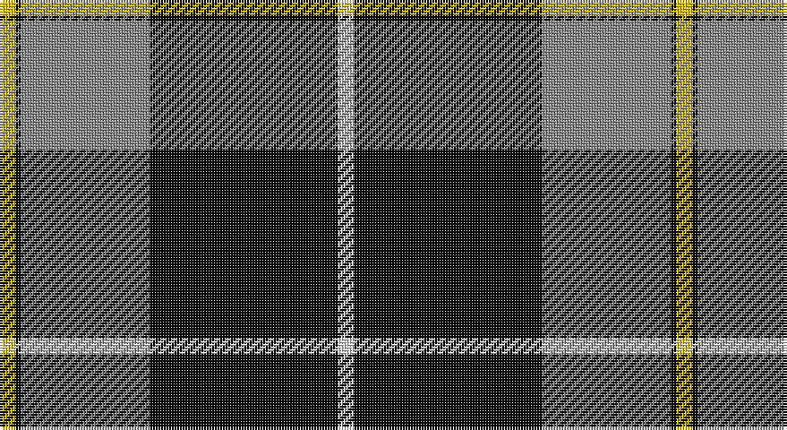

This page is one **sett** — a single exact thread-count. It belongs to the [tartan](/setts/w3k35o24k1ly3/)
(the same proportion at any scale), whose colour order is pattern [WKRKY](/stripes/wkrky/).

Part of the [George Heriot's](/tartans/george-heriot-s/) tartan — the named design grouping this sett with its other cloths.

Sourced from register-of-tartans.  It is a [5 stripe tartan](/stripes/stripes5/).

Original link https://www.tartanregister.gov.uk/tartanDetails.aspx?ref=1331

## Also known as

This cloth is also recorded under:

- George Heriot's School
- George Heriots

## Register references

External register numbers recorded for this tartan.

- Scottish Register of Tartans: [1331](https://www.tartanregister.gov.uk/tartanDetails.aspx?ref=1331)
- Scottish Tartans Authority (ITI): 3995
- Scottish Tartans World Register: 2707

## Thread count
Y/6 K2 N48 K70 LN/6

One full sett is **252 threads**.

## Palette

Palette: <strong>Tartan Register</strong>
<table><thead><tr><th>Colour</th><th>Threads</th><th>Shade</th><th>Base</th><th>OKLCh</th></tr></thead><tbody><tr><td>Y/</td><td style="text-align:right;font-variant-numeric:tabular-nums">6</td><td><code style="background-color:#E8C000;">#E8C000</code> <small style="color:#888">#E8C000</small></td><td>Y <code style="background-color:#F2BF00;">#F2BF00</code></td><td><small style="color:#888">oklch(81.9% 0.168 93.7)</small></td></tr><tr><td>K</td><td style="text-align:right;font-variant-numeric:tabular-nums">2</td><td><code style="background-color:#101010;">#101010</code> <small style="color:#888">#101010</small></td><td>K <code style="background-color:#000000;">#000000</code></td><td><small style="color:#888">oklch(17.3% 0.000 89.9)</small></td></tr><tr><td>N</td><td style="text-align:right;font-variant-numeric:tabular-nums">48</td><td><code style="background-color:#888888;">#888888</code> <small style="color:#888">#888888</small></td><td>R <code style="background-color:#CC0000;">#CC0000</code></td><td><small style="color:#888">oklch(62.7% 0.000 89.9)</small></td></tr><tr><td>K</td><td style="text-align:right;font-variant-numeric:tabular-nums">70</td><td><code style="background-color:#101010;">#101010</code> <small style="color:#888">#101010</small></td><td>K <code style="background-color:#000000;">#000000</code></td><td><small style="color:#888">oklch(17.3% 0.000 89.9)</small></td></tr><tr><td>LN/</td><td style="text-align:right;font-variant-numeric:tabular-nums">6</td><td><code style="background-color:#E0E0E0;">#E0E0E0</code> <small style="color:#888">#E0E0E0</small></td><td>W <code style="background-color:#F7F7F7;">#F7F7F7</code></td><td><small style="color:#888">oklch(90.7% 0.000 89.9)</small></td></tr></tbody></table>

# Sample pattern

## Compared to the master

This cloth is one sett of its design; the master sett (the exemplar the design is anchored on) is below for comparison.

<figure style="margin:0"><figcaption style="color:#888;font-size:smaller">this sett</figcaption></figure>
<figure style="margin:0"><figcaption style="color:#888;font-size:smaller"><a href="/setts/w3k1db24dbi10o24k1ly3/">master sett →</a></figcaption></figure>

## Nearest tartans

The nearest existing variants by ΔTartan distance, with this tartan at the top so the swatches line up against it.

ΔTartan

Tartan

Sett

—

<a href="/ttd/edit/#slug=w3k35o24k1ly3~x2">George Heriots</a> <a class="nn-out" href="/variants/s5/w3k35o24k1ly3~x2/" title="open its dictionary page">↗</a>

1.05

<a href="/ttd/edit/#slug=lr3r1lr30k20lr3k9ly1~x2&amp;base=w3k35o24k1ly3~x2">MacPherson Dress</a> <a class="nn-out" href="/variants/s7/lr3r1lr30k20lr3k9ly1~x2/" title="open its dictionary page">↗</a>

1.05

<a href="/ttd/edit/#slug=lr3r1lr30k20lr3k9ly1&amp;base=w3k35o24k1ly3~x2">MacPherson Dress</a> <a class="nn-out" href="/variants/s7/lr3r1lr30k20lr3k9ly1/" title="open its dictionary page">↗</a>

1.32

<a href="/ttd/edit/#slug=lb3r1lb30k20lb3k9ly1&amp;base=w3k35o24k1ly3~x2">MacPherson Dress</a> <a class="nn-out" href="/variants/s7/lb3r1lb30k20lb3k9ly1/" title="open its dictionary page">↗</a>

1.32

<a href="/ttd/edit/#slug=k4lg3k30lg33r1lg4~x2&amp;base=w3k35o24k1ly3~x2">Intergen (Corporate)</a> <a class="nn-out" href="/variants/s6/k4lg3k30lg33r1lg4~x2/" title="open its dictionary page">↗</a>

1.36

<a href="/ttd/edit/#slug=w4k30r1k1r3w12ly3~x2&amp;base=w3k35o24k1ly3~x2">Richecourt, Baron of (Personal)</a> <a class="nn-out" href="/variants/s7/w4k30r1k1r3w12ly3~x2/" title="open its dictionary page">↗</a>

1.45

<a href="/variants/s7/w3o10k38wi11o6k2w3~x2/">Phantom</a>

1.49

<a href="/ttd/edit/#slug=k76dt11k3ly6k3dt13k11o76&amp;base=w3k35o24k1ly3~x2">Kunbi</a> <a class="nn-out" href="/variants/s8/k76dt11k3ly6k3dt13k11o76/" title="open its dictionary page">↗</a>

1.49

<a href="/ttd/edit/#slug=r4g40k21lo2k21g2~x2&amp;base=w3k35o24k1ly3~x2">Unidentified Furnishing #2</a> <a class="nn-out" href="/variants/s6/r4g40k21lo2k21g2~x2/" title="open its dictionary page">↗</a>

1.49

<a href="/ttd/edit/#slug=k4y4w35y1k36y4k2~x2&amp;base=w3k35o24k1ly3~x2">Gleneagles, Hotel</a> <a class="nn-out" href="/variants/s7/k4y4w35y1k36y4k2~x2/" title="open its dictionary page">↗</a>

1.51

<a href="/ttd/edit/#slug=k4lo4lb32lo1k32lo4k2~x4&amp;base=w3k35o24k1ly3~x2">Gleneagles Gold (Dalgleish)</a> <a class="nn-out" href="/variants/s7/k4lo4lb32lo1k32lo4k2~x4/" title="open its dictionary page">↗</a>

## Neighbour map

Every grey dot is one of 14360 variants placed by the first two principal components of the ΔTartan feature space (44% of its variance). Red is this tartan; blue dots are its nearest — click one to open its page.

<svg viewBox="0 0 640 380" role="img" style="max-width:100%;height:auto;border:1px solid #e0e0e0;border-radius:4px;display:block" xmlns="http://www.w3.org/2000/svg"><image href="/nn/cloud.v1.png" width="640" height="380"/><a href="/variants/s7/lr3r1lr30k20lr3k9ly1~x2/"><circle cx="328.4" cy="132.1" r="4" fill="#3465a4"><title>MacPherson Dress</title></circle></a><a href="/variants/s7/lr3r1lr30k20lr3k9ly1/"><circle cx="328.4" cy="132.1" r="4" fill="#3465a4"><title>MacPherson Dress</title></circle></a><a href="/variants/s7/lb3r1lb30k20lb3k9ly1/"><circle cx="321.6" cy="125.9" r="4" fill="#3465a4"><title>MacPherson Dress</title></circle></a><a href="/variants/s6/k4lg3k30lg33r1lg4~x2/"><circle cx="322.7" cy="147.7" r="4" fill="#3465a4"><title>Intergen (Corporate)</title></circle></a><a href="/variants/s7/w4k30r1k1r3w12ly3~x2/"><circle cx="328.7" cy="113.1" r="4" fill="#3465a4"><title>Richecourt, Baron of (Personal)</title></circle></a><a href="/variants/s7/w3o10k38wi11o6k2w3~x2/"><circle cx="285.9" cy="140.9" r="4" fill="#3465a4"><title>Phantom</title></circle></a><a href="/variants/s8/k76dt11k3ly6k3dt13k11o76/"><circle cx="298.1" cy="140.0" r="4" fill="#3465a4"><title>Kunbi</title></circle></a><a href="/variants/s6/r4g40k21lo2k21g2~x2/"><circle cx="298.3" cy="185.9" r="4" fill="#3465a4"><title>Unidentified Furnishing #2</title></circle></a><a href="/variants/s7/k4y4w35y1k36y4k2~x2/"><circle cx="314.2" cy="128.9" r="4" fill="#3465a4"><title>Gleneagles, Hotel</title></circle></a><a href="/variants/s7/k4lo4lb32lo1k32lo4k2~x4/"><circle cx="312.9" cy="135.9" r="4" fill="#3465a4"><title>Gleneagles Gold (Dalgleish)</title></circle></a><circle cx="342.3" cy="151.2" r="5" fill="#c00000"/></svg>

ID: /variants/s5/w3k35o24k1ly3~x2/
