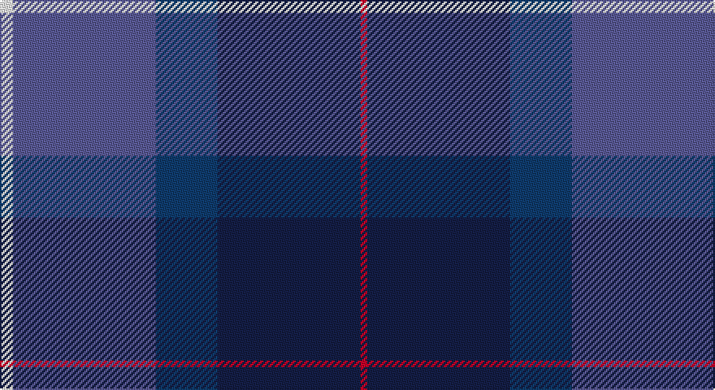

This page is one **sett** — a single exact thread-count. It belongs to the [tartan](/setts/w4b44db19dbi44r2/)
(the same proportion at any scale), whose colour order is pattern [RBBBW](/stripes/rbbbw/).

Sourced from register-of-tartans.  It is a [5 stripe tartan](/stripes/stripes5/).

Original link https://www.tartanregister.gov.uk/tartanDetails.aspx?ref=4782

## Register references

External register numbers recorded for this tartan.

- Scottish Register of Tartans: [4782](https://www.tartanregister.gov.uk/tartanDetails.aspx?ref=4782)
- Scottish Tartans Authority (ITI): 2699
- Scottish Tartans World Register: 2699

## Thread count
W/8 B88 DBa38 DB88 R/4

One full sett is **440 threads**.

## Palette

Palette: <strong>Tartan Register</strong> <small style="color:#888">(2 of 5 colours)</small>
<table><thead><tr><th>Colour</th><th>Threads</th><th>Shade</th><th>Base</th><th>OKLCh</th></tr></thead><tbody><tr><td>W/</td><td style="text-align:right;font-variant-numeric:tabular-nums">8</td><td><code style="background-color:#FFFFFF;">#FFFFFF</code> <small style="color:#888">#FFFFFF</small></td><td>W <code style="background-color:#F7F7F7;">#F7F7F7</code></td><td><small style="color:#888">oklch(100.0% 0.000 89.9)</small></td></tr><tr><td>B</td><td style="text-align:right;font-variant-numeric:tabular-nums">88</td><td><code style="background-color:#5A5A96;">#5A5A96</code> <small style="color:#888">#5A5A96</small></td><td>B <code style="background-color:#2A418A;">#2A418A</code></td><td><small style="color:#888">oklch(49.5% 0.095 282.4)</small></td></tr><tr><td>DBa</td><td style="text-align:right;font-variant-numeric:tabular-nums">38</td><td><code style="background-color:#0F3C6E;">#0F3C6E</code> <small style="color:#888">#0F3C6E</small></td><td>B <code style="background-color:#2A418A;">#2A418A</code></td><td><small style="color:#888">oklch(35.6% 0.099 254.3)</small></td></tr><tr><td>DB</td><td style="text-align:right;font-variant-numeric:tabular-nums">88</td><td><code style="background-color:#141E46;">#141E46</code> <small style="color:#888">#141E46</small></td><td>B <code style="background-color:#2A418A;">#2A418A</code></td><td><small style="color:#888">oklch(25.2% 0.076 269.7)</small></td></tr><tr><td>R/</td><td style="text-align:right;font-variant-numeric:tabular-nums">4</td><td><code style="background-color:#C80028;">#C80028</code> <small style="color:#888">#C80028</small></td><td>R <code style="background-color:#CC0000;">#CC0000</code></td><td><small style="color:#888">oklch(52.5% 0.212 23.0)</small></td></tr></tbody></table>

# Sample pattern

## Nearest tartans

The nearest existing variants by ΔTartan distance, with this tartan at the top so the swatches line up against it.

ΔTartan

Tartan

Sett

—

<a href="/ttd/edit/#slug=w4b44db19dbi44r2~x2">World Federation of Building Contractors</a> <a class="nn-out" href="/variants/s5/w4b44db19dbi44r2~x2/" title="open its dictionary page">↗</a>

1.14

<a href="/ttd/edit/#slug=db20k4g5dp14w1db2~x2&amp;base=w4b44db19dbi44r2~x2">Riley's Theme (Fashion)</a> <a class="nn-out" href="/variants/s6/db20k4g5dp14w1db2~x2/" title="open its dictionary page">↗</a>

1.40

<a href="/ttd/edit/#slug=dbi49g3k22r2b33db3b7~x2&amp;base=w4b44db19dbi44r2~x2">U.S. 2001 Air Force (Military?)</a> <a class="nn-out" href="/variants/s7/dbi49g3k22r2b33db3b7~x2/" title="open its dictionary page">↗</a>

1.49

<a href="/ttd/edit/#slug=r3dbi15db8g5k2w1~x2&amp;base=w4b44db19dbi44r2~x2">Nicolson of Harris (Clan?)</a> <a class="nn-out" href="/variants/s6/r3dbi15db8g5k2w1~x2/" title="open its dictionary page">↗</a>

1.49

<a href="/ttd/edit/#slug=db48w2k20dg22r3dg4~x2&amp;base=w4b44db19dbi44r2~x2">MacFadzean</a> <a class="nn-out" href="/variants/s6/db48w2k20dg22r3dg4~x2/" title="open its dictionary page">↗</a>

1.50

<a href="/ttd/edit/#slug=lb3db28k12r22dg1~x2&amp;base=w4b44db19dbi44r2~x2">Diaspora (Fashion)</a> <a class="nn-out" href="/variants/s5/lb3db28k12r22dg1~x2/" title="open its dictionary page">↗</a>

1.50

<a href="/ttd/edit/#slug=db19k8lb1g10m3~x2&amp;base=w4b44db19dbi44r2~x2">Unidentified #50</a> <a class="nn-out" href="/variants/s5/db19k8lb1g10m3~x2/" title="open its dictionary page">↗</a>

1.53

<a href="/ttd/edit/#slug=db3dg1r22k12db28lb3~x2&amp;base=w4b44db19dbi44r2~x2">Diaspora</a> <a class="nn-out" href="/variants/s6/db3dg1r22k12db28lb3~x2/" title="open its dictionary page">↗</a>

1.54

<a href="/ttd/edit/#slug=dg6r2db1r3db16n20w2~x2&amp;base=w4b44db19dbi44r2~x2">MacCord (Personal)</a> <a class="nn-out" href="/variants/s7/dg6r2db1r3db16n20w2~x2/" title="open its dictionary page">↗</a>

1.56

<a href="/ttd/edit/#slug=t8o4db30dt30r3dt4~x2&amp;base=w4b44db19dbi44r2~x2">Hutchesons' Grammar (Corporate)</a> <a class="nn-out" href="/variants/s6/t8o4db30dt30r3dt4~x2/" title="open its dictionary page">↗</a>

1.58

<a href="/ttd/edit/#slug=db23dp2g11dp24lb3~x2&amp;base=w4b44db19dbi44r2~x2">Scottish Open Squash (Corporate)</a> <a class="nn-out" href="/variants/s5/db23dp2g11dp24lb3~x2/" title="open its dictionary page">↗</a>

## Neighbour map

Every grey dot is one of 14360 variants placed by the first two principal components of the ΔTartan feature space (44% of its variance). Red is this tartan; blue dots are its nearest — click one to open its page.

<svg viewBox="0 0 640 380" role="img" style="max-width:100%;height:auto;border:1px solid #e0e0e0;border-radius:4px;display:block" xmlns="http://www.w3.org/2000/svg"><image href="/nn/cloud.v1.png" width="640" height="380"/><a href="/variants/s6/db20k4g5dp14w1db2~x2/"><circle cx="311.3" cy="197.8" r="4" fill="#3465a4"><title>Riley's Theme (Fashion)</title></circle></a><a href="/variants/s7/dbi49g3k22r2b33db3b7~x2/"><circle cx="262.6" cy="159.2" r="4" fill="#3465a4"><title>U.S. 2001 Air Force (Military?)</title></circle></a><a href="/variants/s6/r3dbi15db8g5k2w1~x2/"><circle cx="222.2" cy="185.6" r="4" fill="#3465a4"><title>Nicolson of Harris (Clan?)</title></circle></a><a href="/variants/s6/db48w2k20dg22r3dg4~x2/"><circle cx="314.5" cy="183.4" r="4" fill="#3465a4"><title>MacFadzean</title></circle></a><a href="/variants/s5/lb3db28k12r22dg1~x2/"><circle cx="264.2" cy="180.7" r="4" fill="#3465a4"><title>Diaspora (Fashion)</title></circle></a><a href="/variants/s5/db19k8lb1g10m3~x2/"><circle cx="248.3" cy="202.2" r="4" fill="#3465a4"><title>Unidentified #50</title></circle></a><a href="/variants/s6/db3dg1r22k12db28lb3~x2/"><circle cx="281.6" cy="166.3" r="4" fill="#3465a4"><title>Diaspora</title></circle></a><a href="/variants/s7/dg6r2db1r3db16n20w2~x2/"><circle cx="248.0" cy="165.7" r="4" fill="#3465a4"><title>MacCord (Personal)</title></circle></a><a href="/variants/s6/t8o4db30dt30r3dt4~x2/"><circle cx="279.9" cy="228.8" r="4" fill="#3465a4"><title>Hutchesons' Grammar (Corporate)</title></circle></a><a href="/variants/s5/db23dp2g11dp24lb3~x2/"><circle cx="258.6" cy="240.6" r="4" fill="#3465a4"><title>Scottish Open Squash (Corporate)</title></circle></a><circle cx="264.9" cy="202.8" r="5" fill="#c00000"/></svg>

ID: /variants/s5/w4b44db19dbi44r2~x2/
