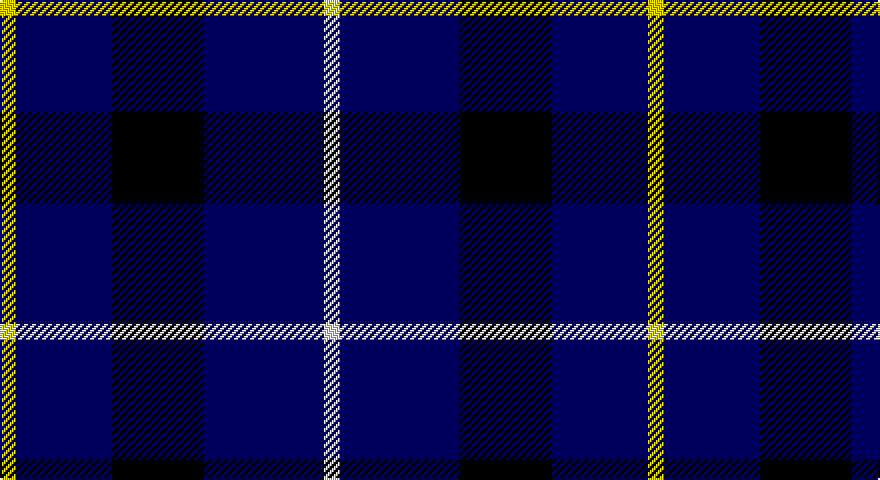

This page is one **sett** — a single exact thread-count. It belongs to the [tartan](/setts/w4db30k23db24ly4/)
(the same proportion at any scale), whose colour order is pattern [WBKBY](/stripes/wbkby/).

Part of the [Bank of Scotland](/tartans/bank-of-scotland/) tartan — the named design grouping this sett with its other cloths.

Sourced from weddslist.  It is a [5 stripe tartan](/stripes/stripes5/).

Original link http://www.weddslist.com/cgi-bin/tartans/pg.pl?source=sts

## Provenance

Earliest known date: 1994 Commemorating the founding of the bank in 1695

## Also known as

This cloth is also recorded under:

- Bank of Scotland 2000

2 attestations — the source records this cloth was collapsed from (oldest owns this page)

<ul>
<li>undated — Bank of Scotland (weddslist, <a href="http://www.weddslist.com/cgi-bin/tartans/pg.pl?source=sts">record</a>)</li>
<li>undated — Bank of Scotland Corporate Tartan (house-of-tartan, <a href="http://www.house-of-tartan.scotland.net/house/TartanViewjs.asp?colr=Def&tnam=2462">record</a>)</li>
</ul>

## Thread count
Y/8 DB48 K46 DB60 LN/8

One full sett is **324 threads**.

## Palette

Palette: <strong>Tartan Register</strong> <small style="color:#888">(2 of 4 colours)</small>
<table><thead><tr><th>Colour</th><th>Threads</th><th>Shade</th><th>Base</th><th>OKLCh</th></tr></thead><tbody><tr><td>Y/</td><td style="text-align:right;font-variant-numeric:tabular-nums">8</td><td><code style="background-color:#F0C000;">#F0C000</code> <small style="color:#888">#F0C000</small></td><td>Y <code style="background-color:#F2BF00;">#F2BF00</code></td><td><small style="color:#888">oklch(82.7% 0.169 90.5)</small></td></tr><tr><td>DB</td><td style="text-align:right;font-variant-numeric:tabular-nums">48</td><td><code style="background-color:#000050;">#000050</code> <small style="color:#888">#000050</small></td><td>B <code style="background-color:#2A418A;">#2A418A</code></td><td><small style="color:#888">oklch(19.5% 0.135 264.1)</small></td></tr><tr><td>K</td><td style="text-align:right;font-variant-numeric:tabular-nums">46</td><td><code style="background-color:#000000;">#000000</code> <small style="color:#888">#000000</small></td><td>K <code style="background-color:#000000;">#000000</code></td><td><small style="color:#888">oklch(0.0% 0.000 0.0)</small></td></tr><tr><td>DB</td><td style="text-align:right;font-variant-numeric:tabular-nums">60</td><td><code style="background-color:#000050;">#000050</code> <small style="color:#888">#000050</small></td><td>B <code style="background-color:#2A418A;">#2A418A</code></td><td><small style="color:#888">oklch(19.5% 0.135 264.1)</small></td></tr><tr><td>LN/</td><td style="text-align:right;font-variant-numeric:tabular-nums">8</td><td><code style="background-color:#E0E0E0;">#E0E0E0</code> <small style="color:#888">#E0E0E0</small></td><td>W <code style="background-color:#F7F7F7;">#F7F7F7</code></td><td><small style="color:#888">oklch(90.7% 0.000 89.9)</small></td></tr></tbody></table>

# Sample pattern

## Compared to the master

This cloth is one sett of its design; the master sett (the exemplar the design is anchored on) is below for comparison.

<figure style="margin:0"><figcaption style="color:#888;font-size:smaller">this sett</figcaption></figure>
<figure style="margin:0"><figcaption style="color:#888;font-size:smaller"><a href="/setts/b64db3dt4r5dt8dti12b3dti4b2lo1/">master sett →</a></figcaption></figure>

## Nearest tartans

The nearest existing variants by ΔTartan distance, with this tartan at the top so the swatches line up against it.

ΔTartan

Tartan

Sett

—

<a href="/ttd/edit/#slug=w4db30k23db24ly4~x2">Bank of Scotland</a> <a class="nn-out" href="/variants/s5/w4db30k23db24ly4~x2/" title="open its dictionary page">↗</a>

1.01

<a href="/ttd/edit/#slug=lo1db6k5db6lb1~x6&amp;base=w4db30k23db24ly4~x2">Bank of Scotland (1995)</a> <a class="nn-out" href="/variants/s5/lo1db6k5db6lb1~x6/" title="open its dictionary page">↗</a>

1.41

<a href="/ttd/edit/#slug=k15lo2k10db18lb3~x2&amp;base=w4db30k23db24ly4~x2">College of Radiographers</a> <a class="nn-out" href="/variants/s5/k15lo2k10db18lb3~x2/" title="open its dictionary page">↗</a>

1.47

<a href="/ttd/edit/#slug=k15y2k10db18w3~x2&amp;base=w4db30k23db24ly4~x2">College of Radiographers</a> <a class="nn-out" href="/variants/s5/k15y2k10db18w3~x2/" title="open its dictionary page">↗</a>

1.57

<a href="/ttd/edit/#slug=r8k24db10k5db10k5~x2&amp;base=w4db30k23db24ly4~x2">Allen, Nicholas (Personal)</a> <a class="nn-out" href="/variants/s6/r8k24db10k5db10k5~x2/" title="open its dictionary page">↗</a>

1.65

<a href="/ttd/edit/#slug=k15ly2k10db18w3~x2&amp;base=w4db30k23db24ly4~x2">College of Radiographers Corporate Tartan</a> <a class="nn-out" href="/variants/s5/k15ly2k10db18w3~x2/" title="open its dictionary page">↗</a>

1.66

<a href="/ttd/edit/#slug=k6lo2k16t6k3db18k2~x2&amp;base=w4db30k23db24ly4~x2">Carrick High School</a> <a class="nn-out" href="/variants/s7/k6lo2k16t6k3db18k2~x2/" title="open its dictionary page">↗</a>

1.68

<a href="/variants/s6/r3lo2k10w1~x6/">St. Eloi</a>

1.68

<a href="/ttd/edit/#slug=k1db12k12g1k12db12w1~x4&amp;base=w4db30k23db24ly4~x2">Marchmont</a> <a class="nn-out" href="/variants/s7/k1db12k12g1k12db12w1~x4/" title="open its dictionary page">↗</a>

1.71

<a href="/ttd/edit/#slug=r6db35k36db36w6&amp;base=w4db30k23db24ly4~x2">Davidson of Tulloch Clan Tartan</a> <a class="nn-out" href="/variants/s5/r6db35k36db36w6/" title="open its dictionary page">↗</a>

1.72

<a href="/ttd/edit/#slug=o3k15r2k15n15p3~x2&amp;base=w4db30k23db24ly4~x2">H.M.S. DUNCAN</a> <a class="nn-out" href="/variants/s6/o3k15r2k15n15p3~x2/" title="open its dictionary page">↗</a>

## Neighbour map

Every grey dot is one of 14360 variants placed by the first two principal components of the ΔTartan feature space (44% of its variance). Red is this tartan; blue dots are its nearest — click one to open its page.

<svg viewBox="0 0 640 380" role="img" style="max-width:100%;height:auto;border:1px solid #e0e0e0;border-radius:4px;display:block" xmlns="http://www.w3.org/2000/svg"><image href="/nn/cloud.v1.png" width="640" height="380"/><a href="/variants/s5/lo1db6k5db6lb1~x6/"><circle cx="295.8" cy="264.2" r="4" fill="#3465a4"><title>Bank of Scotland (1995)</title></circle></a><a href="/variants/s5/k15lo2k10db18lb3~x2/"><circle cx="273.6" cy="254.0" r="4" fill="#3465a4"><title>College of Radiographers</title></circle></a><a href="/variants/s5/k15y2k10db18w3~x2/"><circle cx="250.4" cy="241.6" r="4" fill="#3465a4"><title>College of Radiographers</title></circle></a><a href="/variants/s6/r8k24db10k5db10k5~x2/"><circle cx="252.4" cy="278.1" r="4" fill="#3465a4"><title>Allen, Nicholas (Personal)</title></circle></a><a href="/variants/s5/k15ly2k10db18w3~x2/"><circle cx="267.1" cy="245.9" r="4" fill="#3465a4"><title>College of Radiographers Corporate Tartan</title></circle></a><a href="/variants/s7/k6lo2k16t6k3db18k2~x2/"><circle cx="249.8" cy="219.1" r="4" fill="#3465a4"><title>Carrick High School</title></circle></a><a href="/variants/s6/r3lo2k10w1~x6/"><circle cx="376.0" cy="216.7" r="4" fill="#3465a4"><title>St. Eloi</title></circle></a><a href="/variants/s7/k1db12k12g1k12db12w1~x4/"><circle cx="284.5" cy="219.2" r="4" fill="#3465a4"><title>Marchmont</title></circle></a><a href="/variants/s5/r6db35k36db36w6/"><circle cx="305.4" cy="275.2" r="4" fill="#3465a4"><title>Davidson of Tulloch Clan Tartan</title></circle></a><a href="/variants/s6/o3k15r2k15n15p3~x2/"><circle cx="251.7" cy="222.3" r="4" fill="#3465a4"><title>H.M.S. DUNCAN</title></circle></a><circle cx="311.1" cy="261.7" r="5" fill="#c00000"/></svg>

ID: /variants/s5/w4db30k23db24ly4~x2/
