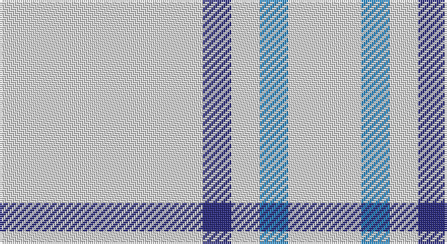

This page is one **sett** — a single exact thread-count. It belongs to the [tartan](/setts/w50db7w7t7w18/)
(the same proportion at any scale), whose colour order is pattern [WBWBW](/stripes/wbwbw/).

Sourced from tartans-authority.  It is a [5 stripe tartan](/stripes/stripes5/).

Original link http://www.tartansauthority.com/tartan-ferret/display/8135/

## Register references

External register numbers recorded for this tartan.

- Scottish Register of Tartans: [8135](https://www.tartanregister.gov.uk/tartanDetails?ref=8135)
- Scottish Tartans Authority (ITI): 8135

## Thread count
LN/100 DB14 LN14 B14 LN/36

One full sett is **220 threads**.

## Palette

Palette: <strong>Tartan Register</strong>
<table><thead><tr><th>Colour</th><th>Threads</th><th>Shade</th><th>Base</th><th>OKLCh</th></tr></thead><tbody><tr><td>LN/</td><td style="text-align:right;font-variant-numeric:tabular-nums">100</td><td><code style="background-color:#E0E0E0;">#E0E0E0</code> <small style="color:#888">#E0E0E0</small></td><td>W <code style="background-color:#F7F7F7;">#F7F7F7</code></td><td><small style="color:#888">oklch(90.7% 0.000 89.9)</small></td></tr><tr><td>DB</td><td style="text-align:right;font-variant-numeric:tabular-nums">14</td><td><code style="background-color:#2C2C80;">#2C2C80</code> <small style="color:#888">#2C2C80</small></td><td>B <code style="background-color:#2A418A;">#2A418A</code></td><td><small style="color:#888">oklch(35.0% 0.138 276.6)</small></td></tr><tr><td>LN</td><td style="text-align:right;font-variant-numeric:tabular-nums">14</td><td><code style="background-color:#E0E0E0;">#E0E0E0</code> <small style="color:#888">#E0E0E0</small></td><td>W <code style="background-color:#F7F7F7;">#F7F7F7</code></td><td><small style="color:#888">oklch(90.7% 0.000 89.9)</small></td></tr><tr><td>B</td><td style="text-align:right;font-variant-numeric:tabular-nums">14</td><td><code style="background-color:#2888C4;">#2888C4</code> <small style="color:#888">#2888C4</small></td><td>B <code style="background-color:#2A418A;">#2A418A</code></td><td><small style="color:#888">oklch(60.1% 0.125 241.5)</small></td></tr><tr><td>LN/</td><td style="text-align:right;font-variant-numeric:tabular-nums">36</td><td><code style="background-color:#E0E0E0;">#E0E0E0</code> <small style="color:#888">#E0E0E0</small></td><td>W <code style="background-color:#F7F7F7;">#F7F7F7</code></td><td><small style="color:#888">oklch(90.7% 0.000 89.9)</small></td></tr></tbody></table>

# Sample pattern

## Nearest tartans

The nearest existing variants by ΔTartan distance, with this tartan at the top so the swatches line up against it.

ΔTartan

Tartan

Sett

—

<a href="/ttd/edit/#slug=w50db7w7t7w18~x2">Sephardim (Corporate)</a> <a class="nn-out" href="/variants/s5/w50db7w7t7w18~x2/" title="open its dictionary page">↗</a>

2.09

<a href="/ttd/edit/#slug=w81dg6lo8dg8~x2&amp;base=w50db7w7t7w18~x2">Young in Australia</a> <a class="nn-out" href="/variants/s4/w81dg6lo8dg8~x2/" title="open its dictionary page">↗</a>

2.22

<a href="/ttd/edit/#slug=w45b2w4b15w7~x2&amp;base=w50db7w7t7w18~x2">Asahi (Estimated threadcount)</a> <a class="nn-out" href="/variants/s5/w45b2w4b15w7~x2/" title="open its dictionary page">↗</a>

2.29

<a href="/ttd/edit/#slug=ly6b38k3b38ly6~x2&amp;base=w50db7w7t7w18~x2">The Poulain League</a> <a class="nn-out" href="/variants/s5/ly6b38k3b38ly6~x2/" title="open its dictionary page">↗</a>

2.29

<a href="/ttd/edit/#slug=lr20db1lr4db3~x4&amp;base=w50db7w7t7w18~x2">Loevenstein Castle #2</a> <a class="nn-out" href="/variants/s4/lr20db1lr4db3~x4/" title="open its dictionary page">↗</a>

2.46

<a href="/ttd/edit/#slug=w1y1y4y7p1w1~x4&amp;base=w50db7w7t7w18~x2">Lochnagar</a> <a class="nn-out" href="/variants/s6/w1y1y4y7p1w1~x4/" title="open its dictionary page">↗</a>

2.46

<a href="/ttd/edit/#slug=w93lr6w13b35w12lr6&amp;base=w50db7w7t7w18~x2">Butties</a> <a class="nn-out" href="/variants/s6/w93lr6w13b35w12lr6/" title="open its dictionary page">↗</a>

2.47

<a href="/ttd/edit/#slug=w20k2w20lo5k3w3lo4k2&amp;base=w50db7w7t7w18~x2">Guzzo Dress (Personal)</a> <a class="nn-out" href="/variants/s8/w20k2w20lo5k3w3lo4k2/" title="open its dictionary page">↗</a>

2.61

<a href="/ttd/edit/#slug=lr10k2w5k4lr50b2~x2&amp;base=w50db7w7t7w18~x2">London Fog Safari (Fashion)</a> <a class="nn-out" href="/variants/s6/lr10k2w5k4lr50b2~x2/" title="open its dictionary page">↗</a>

2.65

<a href="/ttd/edit/#slug=lr3lb2lr18t9lr18lb2lr18k9lr18lb2&amp;base=w50db7w7t7w18~x2">London Fog Camel 2 (Fashion)</a> <a class="nn-out" href="/variants/s10/lr3lb2lr18t9lr18lb2lr18k9lr18lb2/" title="open its dictionary page">↗</a>

2.68

<a href="/ttd/edit/#slug=w20k2w20ly5k3w3ly4k2&amp;base=w50db7w7t7w18~x2">Guzzo Dress (Montreal, Canada) (Personal)</a> <a class="nn-out" href="/variants/s8/w20k2w20ly5k3w3ly4k2/" title="open its dictionary page">↗</a>

## Neighbour map

Every grey dot is one of 14360 variants placed by the first two principal components of the ΔTartan feature space (44% of its variance). Red is this tartan; blue dots are its nearest — click one to open its page.

<svg viewBox="0 0 640 380" role="img" style="max-width:100%;height:auto;border:1px solid #e0e0e0;border-radius:4px;display:block" xmlns="http://www.w3.org/2000/svg"><image href="/nn/cloud.v1.png" width="640" height="380"/><a href="/variants/s4/w81dg6lo8dg8~x2/"><circle cx="495.6" cy="184.1" r="4" fill="#3465a4"><title>Young in Australia</title></circle></a><a href="/variants/s5/w45b2w4b15w7~x2/"><circle cx="532.9" cy="196.5" r="4" fill="#3465a4"><title>Asahi (Estimated threadcount)</title></circle></a><a href="/variants/s5/ly6b38k3b38ly6~x2/"><circle cx="539.5" cy="226.2" r="4" fill="#3465a4"><title>The Poulain League</title></circle></a><a href="/variants/s4/lr20db1lr4db3~x4/"><circle cx="599.3" cy="215.3" r="4" fill="#3465a4"><title>Loevenstein Castle #2</title></circle></a><a href="/variants/s6/w1y1y4y7p1w1~x4/"><circle cx="523.9" cy="254.0" r="4" fill="#3465a4"><title>Lochnagar</title></circle></a><a href="/variants/s6/w93lr6w13b35w12lr6/"><circle cx="421.8" cy="162.7" r="4" fill="#3465a4"><title>Butties</title></circle></a><a href="/variants/s8/w20k2w20lo5k3w3lo4k2/"><circle cx="399.2" cy="174.6" r="4" fill="#3465a4"><title>Guzzo Dress (Personal)</title></circle></a><a href="/variants/s6/lr10k2w5k4lr50b2~x2/"><circle cx="550.4" cy="138.7" r="4" fill="#3465a4"><title>London Fog Safari (Fashion)</title></circle></a><a href="/variants/s10/lr3lb2lr18t9lr18lb2lr18k9lr18lb2/"><circle cx="392.7" cy="193.9" r="4" fill="#3465a4"><title>London Fog Camel 2 (Fashion)</title></circle></a><a href="/variants/s8/w20k2w20ly5k3w3ly4k2/"><circle cx="384.3" cy="165.3" r="4" fill="#3465a4"><title>Guzzo Dress (Montreal, Canada) (Personal)</title></circle></a><circle cx="511.8" cy="228.8" r="5" fill="#c00000"/></svg>

ID: /variants/s5/w50db7w7t7w18~x2/
