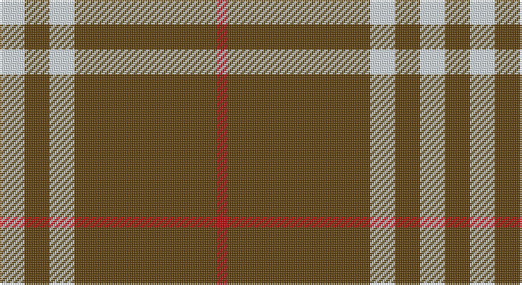

This page is one **sett** — a single exact thread-count. It belongs to the [tartan](/setts/w7dy7w7dy40r3/)
(the same proportion at any scale), whose colour order is pattern [RGWGW](/stripes/rgwgw/).

Part of the [Coca Cola](/tartans/coca-cola/) tartan — the named design grouping this sett with its other cloths.

Sourced from register-of-tartans.  It is a [5 stripe tartan](/stripes/stripes5/).

Original link https://www.tartanregister.gov.uk/tartanDetails.aspx?ref=5562

## Provenance

Earliest known date: 2008 Produced originally by the Janet Helm Company, Vancouver (specialist in corporate gifts) for Coca Cola.

## Also known as

This cloth is also recorded under:

- Coca Cola US

2 attestations — the source records this cloth was collapsed from (oldest owns this page)

<ul>
<li>undated — Coca Cola (register-of-tartans, <a href="https://www.tartanregister.gov.uk/tartanDetails.aspx?ref=5562">record</a>)</li>
<li>undated — Coca Cola US Corporate Tartan (house-of-tartan, <a href="http://www.house-of-tartan.scotland.net/house/TartanViewjs.asp?colr=Def&tnam=7525">record</a>)</li>
</ul>

## Register references

External register numbers recorded for this tartan.

- Scottish Register of Tartans: [5562](https://www.tartanregister.gov.uk/tartanDetails.aspx?ref=5562)
- Scottish Tartans Authority (ITI): 7525

## Thread count
LN/14 T14 LN14 T80 R/6

One full sett is **236 threads**.

## Palette

Palette: <strong>Tartan Register</strong> <small style="color:#888">(3 of 4 colours)</small>
<table><thead><tr><th>Colour</th><th>Threads</th><th>Shade</th><th>Base</th><th>OKLCh</th></tr></thead><tbody><tr><td>LN/</td><td style="text-align:right;font-variant-numeric:tabular-nums">14</td><td><code style="background-color:#D4E8F4;">#D4E8F4</code> <small style="color:#888">#D4E8F4</small></td><td>W <code style="background-color:#F7F7F7;">#F7F7F7</code></td><td><small style="color:#888">oklch(92.0% 0.027 234.0)</small></td></tr><tr><td>T</td><td style="text-align:right;font-variant-numeric:tabular-nums">14</td><td><code style="background-color:#604000;">#604000</code> <small style="color:#888">#604000</small></td><td>G <code style="background-color:#006100;">#006100</code></td><td><small style="color:#888">oklch(39.8% 0.083 76.8)</small></td></tr><tr><td>LN</td><td style="text-align:right;font-variant-numeric:tabular-nums">14</td><td><code style="background-color:#D4E8F4;">#D4E8F4</code> <small style="color:#888">#D4E8F4</small></td><td>W <code style="background-color:#F7F7F7;">#F7F7F7</code></td><td><small style="color:#888">oklch(92.0% 0.027 234.0)</small></td></tr><tr><td>T</td><td style="text-align:right;font-variant-numeric:tabular-nums">80</td><td><code style="background-color:#604000;">#604000</code> <small style="color:#888">#604000</small></td><td>G <code style="background-color:#006100;">#006100</code></td><td><small style="color:#888">oklch(39.8% 0.083 76.8)</small></td></tr><tr><td>R/</td><td style="text-align:right;font-variant-numeric:tabular-nums">6</td><td><code style="background-color:#C80000;">#C80000</code> <small style="color:#888">#C80000</small></td><td>R <code style="background-color:#CC0000;">#CC0000</code></td><td><small style="color:#888">oklch(52.3% 0.215 29.2)</small></td></tr></tbody></table>

# Sample pattern

## Nearest tartans

The nearest existing variants by ΔTartan distance, with this tartan at the top so the swatches line up against it.

ΔTartan

Tartan

Sett

—

<a href="/ttd/edit/#slug=w7dy7w7dy40r3~x2">Coca Cola</a> <a class="nn-out" href="/variants/s5/w7dy7w7dy40r3~x2/" title="open its dictionary page">↗</a>

0.16

<a href="/ttd/edit/#slug=w15dy15w15dy80r6&amp;base=w7dy7w7dy40r3~x2">Coca Cola (Corporate)</a> <a class="nn-out" href="/variants/s5/w15dy15w15dy80r6/" title="open its dictionary page">↗</a>

1.09

<a href="/ttd/edit/#slug=o12lb1k2o1r1~x8&amp;base=w7dy7w7dy40r3~x2">Lochcarron Camel</a> <a class="nn-out" href="/variants/s5/o12lb1k2o1r1~x8/" title="open its dictionary page">↗</a>

1.24

<a href="/ttd/edit/#slug=dy38w9dy3k9w3~x2&amp;base=w7dy7w7dy40r3~x2">Loch Tummel</a> <a class="nn-out" href="/variants/s5/dy38w9dy3k9w3~x2/" title="open its dictionary page">↗</a>

1.27

<a href="/ttd/edit/#slug=o38w9o3dr9w3~x2&amp;base=w7dy7w7dy40r3~x2">Loch Tummel</a> <a class="nn-out" href="/variants/s5/o38w9o3dr9w3~x2/" title="open its dictionary page">↗</a>

1.38

<a href="/variants/s5/o12k1o2o1ki1~x8/">Lochcarron, Camel (Fashion)</a>

1.42

<a href="/ttd/edit/#slug=lo4k6lo1k1lo16k2~x2&amp;base=w7dy7w7dy40r3~x2">Monoch Airline</a> <a class="nn-out" href="/variants/s6/lo4k6lo1k1lo16k2~x2/" title="open its dictionary page">↗</a>

1.45

<a href="/ttd/edit/#slug=g3lo3k10lo26k3lo3~x2&amp;base=w7dy7w7dy40r3~x2">Volkswagen Orange Trim</a> <a class="nn-out" href="/variants/s6/g3lo3k10lo26k3lo3~x2/" title="open its dictionary page">↗</a>

1.45

<a href="/ttd/edit/#slug=lo26k10lo3g3lo3k3~x6&amp;base=w7dy7w7dy40r3~x2">Volkswagen Orange Trim (Fashion)</a> <a class="nn-out" href="/variants/s6/lo26k10lo3g3lo3k3~x6/" title="open its dictionary page">↗</a>

1.57

<a href="/ttd/edit/#slug=dy6r2dy42db2dy5w16dy5db2~x2&amp;base=w7dy7w7dy40r3~x2">Glenlivet Dress Reproduction (Corp)</a> <a class="nn-out" href="/variants/s8/dy6r2dy42db2dy5w16dy5db2~x2/" title="open its dictionary page">↗</a>

1.64

<a href="/ttd/edit/#slug=lo38w9lo3do9w3~x2&amp;base=w7dy7w7dy40r3~x2">Loch Tummel Trade Tartan</a> <a class="nn-out" href="/variants/s5/lo38w9lo3do9w3~x2/" title="open its dictionary page">↗</a>

## Neighbour map

Every grey dot is one of 14360 variants placed by the first two principal components of the ΔTartan feature space (44% of its variance). Red is this tartan; blue dots are its nearest — click one to open its page.

<svg viewBox="0 0 640 380" role="img" style="max-width:100%;height:auto;border:1px solid #e0e0e0;border-radius:4px;display:block" xmlns="http://www.w3.org/2000/svg"><image href="/nn/cloud.v1.png" width="640" height="380"/><a href="/variants/s5/w15dy15w15dy80r6/"><circle cx="444.0" cy="198.1" r="4" fill="#3465a4"><title>Coca Cola (Corporate)</title></circle></a><a href="/variants/s5/o12lb1k2o1r1~x8/"><circle cx="466.1" cy="174.0" r="4" fill="#3465a4"><title>Lochcarron Camel</title></circle></a><a href="/variants/s5/dy38w9dy3k9w3~x2/"><circle cx="381.5" cy="193.6" r="4" fill="#3465a4"><title>Loch Tummel</title></circle></a><a href="/variants/s5/o38w9o3dr9w3~x2/"><circle cx="406.8" cy="198.6" r="4" fill="#3465a4"><title>Loch Tummel</title></circle></a><a href="/variants/s5/o12k1o2o1ki1~x8/"><circle cx="481.5" cy="184.2" r="4" fill="#3465a4"><title>Lochcarron, Camel (Fashion)</title></circle></a><a href="/variants/s6/lo4k6lo1k1lo16k2~x2/"><circle cx="445.2" cy="190.9" r="4" fill="#3465a4"><title>Monoch Airline</title></circle></a><a href="/variants/s6/g3lo3k10lo26k3lo3~x2/"><circle cx="385.2" cy="196.1" r="4" fill="#3465a4"><title>Volkswagen Orange Trim</title></circle></a><a href="/variants/s6/lo26k10lo3g3lo3k3~x6/"><circle cx="385.2" cy="196.1" r="4" fill="#3465a4"><title>Volkswagen Orange Trim (Fashion)</title></circle></a><a href="/variants/s8/dy6r2dy42db2dy5w16dy5db2~x2/"><circle cx="451.4" cy="136.5" r="4" fill="#3465a4"><title>Glenlivet Dress Reproduction (Corp)</title></circle></a><a href="/variants/s5/lo38w9lo3do9w3~x2/"><circle cx="407.9" cy="200.5" r="4" fill="#3465a4"><title>Loch Tummel Trade Tartan</title></circle></a><circle cx="454.2" cy="197.0" r="5" fill="#c00000"/></svg>

ID: /variants/s5/w7dy7w7dy40r3~x2/
