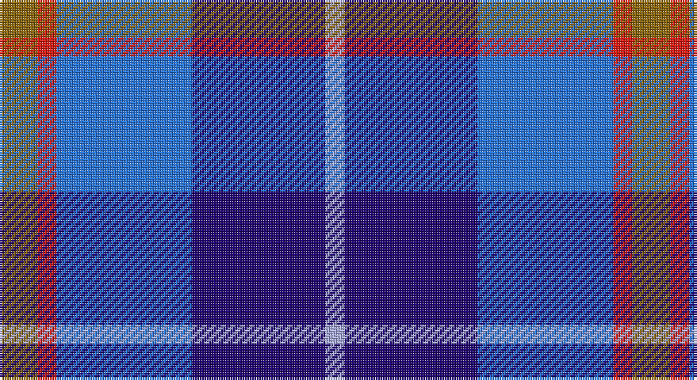

This page is one **sett** — a single exact thread-count. It belongs to the [tartan](/setts/y16r8b57db56lb8/)
(the same proportion at any scale), whose colour order is pattern [GRBBW](/stripes/grbbw/).

Part of the [Bryson](/tartans/bryson/) tartan — the named design grouping this sett with its other cloths.

Sourced from register-of-tartans.  It is a [5 stripe tartan](/stripes/stripes5/).

Original link https://www.tartanregister.gov.uk/tartanDetails.aspx?ref=5007

## Also known as

This cloth is also recorded under:

- Bryson Check

## Register references

External register numbers recorded for this tartan.

- Scottish Register of Tartans: [5007](https://www.tartanregister.gov.uk/tartanDetails.aspx?ref=5007)
- Scottish Tartans Authority (ITI): 3746

## Thread count
T/16 R8 B57 DB56 LP/8

One full sett is **266 threads**.

## Palette

Palette: <strong>Tartan Register</strong> <small style="color:#888">(3 of 5 colours)</small>
<table><thead><tr><th>Colour</th><th>Threads</th><th>Shade</th><th>Base</th><th>OKLCh</th></tr></thead><tbody><tr><td>T/</td><td style="text-align:right;font-variant-numeric:tabular-nums">16</td><td><code style="background-color:#8B6508;">#8B6508</code> <small style="color:#888">#8B6508</small></td><td>G <code style="background-color:#006100;">#006100</code></td><td><small style="color:#888">oklch(53.2% 0.107 82.0)</small></td></tr><tr><td>R</td><td style="text-align:right;font-variant-numeric:tabular-nums">8</td><td><code style="background-color:#E3170D;">#E3170D</code> <small style="color:#888">#E3170D</small></td><td>R <code style="background-color:#CC0000;">#CC0000</code></td><td><small style="color:#888">oklch(58.1% 0.230 29.4)</small></td></tr><tr><td>B</td><td style="text-align:right;font-variant-numeric:tabular-nums">57</td><td><code style="background-color:#2474E8;">#2474E8</code> <small style="color:#888">#2474E8</small></td><td>B <code style="background-color:#2A418A;">#2A418A</code></td><td><small style="color:#888">oklch(57.8% 0.192 258.7)</small></td></tr><tr><td>DB</td><td style="text-align:right;font-variant-numeric:tabular-nums">56</td><td><code style="background-color:#1C0070;">#1C0070</code> <small style="color:#888">#1C0070</small></td><td>B <code style="background-color:#2A418A;">#2A418A</code></td><td><small style="color:#888">oklch(26.3% 0.162 277.1)</small></td></tr><tr><td>LP/</td><td style="text-align:right;font-variant-numeric:tabular-nums">8</td><td><code style="background-color:#A8ACE8;">#A8ACE8</code> <small style="color:#888">#A8ACE8</small></td><td>W <code style="background-color:#F7F7F7;">#F7F7F7</code></td><td><small style="color:#888">oklch(76.3% 0.086 281.2)</small></td></tr></tbody></table>

# Sample pattern

## Compared to the master

This cloth is one sett of its design; the master sett (the exemplar the design is anchored on) is below for comparison.

<figure style="margin:0"><figcaption style="color:#888;font-size:smaller">this sett</figcaption></figure>
<figure style="margin:0"><figcaption style="color:#888;font-size:smaller"><a href="/setts/g5dp2db5dp10ly2/">master sett →</a></figcaption></figure>

## Nearest tartans

The nearest existing variants by ΔTartan distance, with this tartan at the top so the swatches line up against it.

ΔTartan

Tartan

Sett

—

<a href="/ttd/edit/#slug=y16r8b57db56lb8">Bryson (1988)</a> <a class="nn-out" href="/variants/s5/y16r8b57db56lb8/" title="open its dictionary page">↗</a>

0.88

<a href="/ttd/edit/#slug=w3dt2db15t15r2~x4&amp;base=y16r8b57db56lb8">SABA</a> <a class="nn-out" href="/variants/s5/w3dt2db15t15r2~x4/" title="open its dictionary page">↗</a>

0.95

<a href="/ttd/edit/#slug=r2db12k5t16w2~x4&amp;base=y16r8b57db56lb8">RSCDS Australia? (Corporate)</a> <a class="nn-out" href="/variants/s5/r2db12k5t16w2~x4/" title="open its dictionary page">↗</a>

1.18

<a href="/ttd/edit/#slug=lr2r1t7db7lb1~x8&amp;base=y16r8b57db56lb8">Bryson (1988) (Name)</a> <a class="nn-out" href="/variants/s5/lr2r1t7db7lb1~x8/" title="open its dictionary page">↗</a>

1.40

<a href="/ttd/edit/#slug=db2b9r1db5g5lb2~x4&amp;base=y16r8b57db56lb8">American Express</a> <a class="nn-out" href="/variants/s6/db2b9r1db5g5lb2~x4/" title="open its dictionary page">↗</a>

1.52

<a href="/ttd/edit/#slug=db3t24k11db20w2db5lo3~x2&amp;base=y16r8b57db56lb8">Icelandair</a> <a class="nn-out" href="/variants/s7/db3t24k11db20w2db5lo3~x2/" title="open its dictionary page">↗</a>

1.53

<a href="/ttd/edit/#slug=ly2b9r2db6ly1r1~x4&amp;base=y16r8b57db56lb8">Lauder Primary School</a> <a class="nn-out" href="/variants/s6/ly2b9r2db6ly1r1~x4/" title="open its dictionary page">↗</a>

1.53

<a href="/ttd/edit/#slug=r2db11r3db11t12dbi10w2~x2&amp;base=y16r8b57db56lb8">Blue</a> <a class="nn-out" href="/variants/s7/r2db11r3db11t12dbi10w2~x2/" title="open its dictionary page">↗</a>

1.55

<a href="/variants/s7/k1db6b1ki6b6k1w1~x6/">Mary Washington</a>

1.56

<a href="/ttd/edit/#slug=r10w5db30b20r3~x4&amp;base=y16r8b57db56lb8">Lands of Liberty</a> <a class="nn-out" href="/variants/s5/r10w5db30b20r3~x4/" title="open its dictionary page">↗</a>

1.56

<a href="/ttd/edit/#slug=db3t1db6r2b6k1r1k1b6r3~x4&amp;base=y16r8b57db56lb8">Ballater</a> <a class="nn-out" href="/variants/s10/db3t1db6r2b6k1r1k1b6r3~x4/" title="open its dictionary page">↗</a>

## Neighbour map

Every grey dot is one of 14360 variants placed by the first two principal components of the ΔTartan feature space (44% of its variance). Red is this tartan; blue dots are its nearest — click one to open its page.

<svg viewBox="0 0 640 380" role="img" style="max-width:100%;height:auto;border:1px solid #e0e0e0;border-radius:4px;display:block" xmlns="http://www.w3.org/2000/svg"><image href="/nn/cloud.v1.png" width="640" height="380"/><a href="/variants/s5/w3dt2db15t15r2~x4/"><circle cx="202.9" cy="219.6" r="4" fill="#3465a4"><title>SABA</title></circle></a><a href="/variants/s5/r2db12k5t16w2~x4/"><circle cx="182.0" cy="215.7" r="4" fill="#3465a4"><title>RSCDS Australia? (Corporate)</title></circle></a><a href="/variants/s5/lr2r1t7db7lb1~x8/"><circle cx="160.8" cy="213.0" r="4" fill="#3465a4"><title>Bryson (1988) (Name)</title></circle></a><a href="/variants/s6/db2b9r1db5g5lb2~x4/"><circle cx="129.1" cy="209.7" r="4" fill="#3465a4"><title>American Express</title></circle></a><a href="/variants/s7/db3t24k11db20w2db5lo3~x2/"><circle cx="206.7" cy="188.5" r="4" fill="#3465a4"><title>Icelandair</title></circle></a><a href="/variants/s6/ly2b9r2db6ly1r1~x4/"><circle cx="177.9" cy="195.9" r="4" fill="#3465a4"><title>Lauder Primary School</title></circle></a><a href="/variants/s7/r2db11r3db11t12dbi10w2~x2/"><circle cx="163.0" cy="239.1" r="4" fill="#3465a4"><title>Blue</title></circle></a><a href="/variants/s7/k1db6b1ki6b6k1w1~x6/"><circle cx="101.4" cy="204.9" r="4" fill="#3465a4"><title>Mary Washington</title></circle></a><a href="/variants/s5/r10w5db30b20r3~x4/"><circle cx="210.1" cy="216.9" r="4" fill="#3465a4"><title>Lands of Liberty</title></circle></a><a href="/variants/s10/db3t1db6r2b6k1r1k1b6r3~x4/"><circle cx="133.4" cy="202.2" r="4" fill="#3465a4"><title>Ballater</title></circle></a><circle cx="177.0" cy="221.4" r="5" fill="#c00000"/></svg>

ID: /variants/s5/y16r8b57db56lb8/
