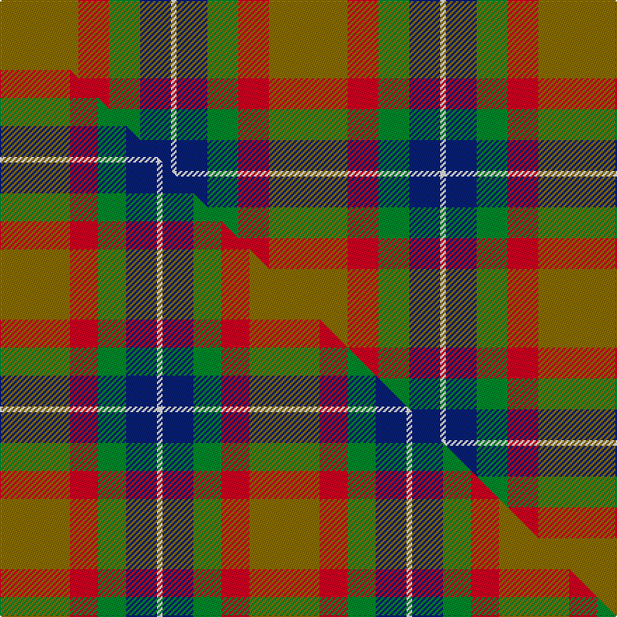

This page is one **sett** — a single exact thread-count. It belongs to the [tartan](/setts/y28r11g11db11w2/)
(the same proportion at any scale), whose colour order is pattern [GRGBW](/stripes/grgbw/).

Part of the [Samye](/tartans/samye/) tartan — the named design grouping this sett with its other cloths.

Sourced from register-of-tartans.  It is a [5 stripe tartan](/stripes/stripes5/).

Original link https://www.tartanregister.gov.uk/tartanDetails.aspx?ref=5888

Dataset <small>— provenance for this record, inherited from the source manifest</small>

<dl class="dataset-prov">
<dt>source</dt><dd><a href="/sources/register-of-tartans/">Scottish Register of Tartans</a></dd>
<dt>data captured from</dt><dd><a href="https://github.com/thetartan/tartan-database/blob/master/data/register-of-tartans/data.csv">https://github.com/thetartan/tartan-database/blob/master/data/register-of-tartans/data.csv</a></dd>
<dt>data date</dt><dd>01/07/2006 <small>(this record)</small></dd>
<dt>licence</dt><dd><a href="https://www.tartanregister.gov.uk/copyright">Crown copyright</a></dd>
</dl>

Capture chain <small>— the hands this data passed through, oldest first; each capture carries its own licence</small>

<ol class="capture-chain">
<li><a href="https://www.tartanregister.gov.uk/">Scottish Register of Tartans</a> · <a href="https://www.tartanregister.gov.uk/copyright">Crown copyright</a> <small>the living register — still published by National Records of Scotland</small></li>
<li><a href="https://github.com/thetartan/tartan-database">thetartan/tartan-database</a> <small>2016-2017</small> · <a href="https://creativecommons.org/licenses/by-nc-nd/4.0/">CC BY-NC-ND 4.0</a> <small>Levko Kravets's frozen compilation — the capture we vendored, and where its CC licence text came from</small></li>
<li>this dictionary <small>captured 2026-06-10 · commit 5bf86c7566</small> <small>each re-capture is a git commit to data/sources</small></li>
</ol>

## Register references

External register numbers recorded for this tartan.

- Scottish Register of Tartans: [5888](https://www.tartanregister.gov.uk/tartanDetails.aspx?ref=5888)
- Scottish Tartans World Register: 3169

## Thread count
Y/56 R22 G22 DB22 W/4

One full sett is **192 threads**.

## Palette
<table><thead><tr><th>Colour</th><th>Shade</th><th>OKLCh</th></tr></thead><tbody><tr><td>DB</td><td><code style="background-color:#082077;">#082077</code> <small style="color:#888">#082077</small></td><td><small style="color:#888">oklch(30.0% 0.149 265.1)</small></td></tr><tr><td>G</td><td><code style="background-color:#008B2A;">#008B2A</code> <small style="color:#888">#008B2A</small></td><td><small style="color:#888">oklch(55.4% 0.170 145.9)</small></td></tr><tr><td>W</td><td><code style="background-color:#F7F7F7;">#F7F7F7</code> <small style="color:#888">#F7F7F7</small></td><td><small style="color:#888">oklch(97.6% 0.000 89.9)</small></td></tr><tr><td>R</td><td><code style="background-color:#D60020;">#D60020</code> <small style="color:#888">#D60020</small></td><td><small style="color:#888">oklch(55.2% 0.224 25.5)</small></td></tr><tr><td>Y</td><td><code style="background-color:#8B6E00;">#8B6E00</code> <small style="color:#888">#8B6E00</small></td><td><small style="color:#888">oklch(55.1% 0.113 90.4)</small></td></tr></tbody></table>

# Sample pattern

## Compared to the master

This cloth is one sett of its design; the master sett (the exemplar the design is anchored on) is below for comparison.

Its **ΔTartan distance** from the master is **0.14** — the same measure the nearest-tartans table ranks by (0 is identical; a re-scale of the same cloth is near 0, a recolour or a different proportion further).

<figure class="master-compare" style="margin:0">

this sett
master sett ★

<figcaption style="color:#888;font-size:smaller">One weave of this sett against the <a href="/setts/y25r10g10db11w2/">master sett ★</a>, split on the diagonal: a shared proportion runs seamlessly across it with only the shades shifting; a different proportion breaks on it.</figcaption>
</figure>

## Nearest tartan variants

The nearest existing variants by ΔTartan distance, with this cloth at the top so the swatches line up against it.

ΔTartan

Threads

Variant

Sett

—

192

<a href="/variants/s5/y28r11g11db11w2~x2/">Samye #2</a>

<a href="/ttd/edit/#slug=y25r10g10db11w2~x2&amp;base=y28r11g11db11w2~x2" title="compare in the TTD">0.14</a>

178

<a href="/variants/s5/y25r10g10db11w2~x2/">Samye</a>

<a href="/ttd/edit/#slug=r5t3g24db24r4y2~x2~t2405244-db1406275&amp;base=y28r11g11db11w2~x2" title="compare in the TTD">1.36</a>

234

<a href="/variants/s6/r5t3g24db24r4y2~x2~t2405244-db1406275/">Canine All Dogs</a>

<a href="/ttd/edit/#slug=r10dbi6g24db24r6y3~dbi1406275-db1004274&amp;base=y28r11g11db11w2~x2" title="compare in the TTD">2.01</a>

133

<a href="/variants/s6/r10dbi6g24db24r6y3~dbi1406275-db1004274/">Canine All Dogs (Fashion)</a>

<a href="/ttd/edit/#slug=r15w1db4y1g15~x4&amp;base=y28r11g11db11w2~x2" title="compare in the TTD">2.02</a>

168

<a href="/variants/s5/r15w1db4y1g15~x4/">Eglinton, Duke of (Artefact)</a>

<a href="/ttd/edit/#slug=g3db12w1dg12r12dg2~x2&amp;base=y28r11g11db11w2~x2" title="compare in the TTD">2.06</a>

158

<a href="/variants/s6/g3db12w1dg12r12dg2~x2/">Patterson, John (Personal)</a>

<a href="/ttd/edit/#slug=r2g17r8db8y2~x4&amp;base=y28r11g11db11w2~x2" title="compare in the TTD">2.19</a>

280

<a href="/variants/s5/r2g17r8db8y2~x4/">British Hills</a>

<a href="/ttd/edit/#slug=g25r9lb3y7w3dp11~x3&amp;base=y28r11g11db11w2~x2" title="compare in the TTD">2.26</a>

240

<a href="/variants/s6/g25r9lb3y7w3dp11~x3/">Montessori School of Denver (School)</a>

<a href="/ttd/edit/#slug=g25r9lb3y7w3dp11&amp;base=y28r11g11db11w2~x2" title="compare in the TTD">2.26</a>

80

<a href="/variants/s6/g25r9lb3y7w3dp11/">Montessori School of Denver</a>

<a href="/ttd/edit/#slug=ly2db8r8g17r1~x4&amp;base=y28r11g11db11w2~x2" title="compare in the TTD">2.27</a>

276

<a href="/variants/s5/ly2db8r8g17r1~x4/">British Hills</a>

<a href="/ttd/edit/#slug=db30y3dy11y3g33r6~x2&amp;base=y28r11g11db11w2~x2" title="compare in the TTD">2.31</a>

272

<a href="/variants/s6/db30y3dy11y3g33r6~x2/">Balfour Hunting</a>

## Neighbour map

Every grey dot is one of 13620 variants placed by the first two principal components of the ΔTartan feature space (42% of its variance). Red is this tartan; blue dots are its nearest — click one to open its page.

<svg viewBox="0 0 640 380" role="img" style="max-width:100%;height:auto;border:1px solid #e0e0e0;border-radius:4px;display:block" xmlns="http://www.w3.org/2000/svg"><image href="/nn/cloud.v1.png" width="640" height="380"/><a href="/variants/s5/y25r10g10db11w2~x2/"><circle cx="226.2" cy="228.0" r="4" fill="#3465a4"><title>Samye</title></circle></a><a href="/variants/s6/r5t3g24db24r4y2~x2~t2405244-db1406275/"><circle cx="236.3" cy="196.4" r="4" fill="#3465a4"><title>Canine All Dogs</title></circle></a><a href="/variants/s6/r10dbi6g24db24r6y3~dbi1406275-db1004274/"><circle cx="163.1" cy="226.3" r="4" fill="#3465a4"><title>Canine All Dogs (Fashion)</title></circle></a><a href="/variants/s5/r15w1db4y1g15~x4/"><circle cx="257.2" cy="189.5" r="4" fill="#3465a4"><title>Eglinton, Duke of (Artefact)</title></circle></a><a href="/variants/s6/g3db12w1dg12r12dg2~x2/"><circle cx="178.9" cy="207.5" r="4" fill="#3465a4"><title>Patterson, John (Personal)</title></circle></a><a href="/variants/s5/r2g17r8db8y2~x4/"><circle cx="248.5" cy="240.1" r="4" fill="#3465a4"><title>British Hills</title></circle></a><a href="/variants/s6/g25r9lb3y7w3dp11~x3/"><circle cx="176.9" cy="204.5" r="4" fill="#3465a4"><title>Montessori School of Denver (School)</title></circle></a><a href="/variants/s6/g25r9lb3y7w3dp11/"><circle cx="176.9" cy="204.5" r="4" fill="#3465a4"><title>Montessori School of Denver</title></circle></a><a href="/variants/s5/ly2db8r8g17r1~x4/"><circle cx="268.7" cy="207.5" r="4" fill="#3465a4"><title>British Hills</title></circle></a><a href="/variants/s6/db30y3dy11y3g33r6~x2/"><circle cx="216.8" cy="207.3" r="4" fill="#3465a4"><title>Balfour Hunting</title></circle></a><circle cx="243.0" cy="221.9" r="5" fill="#c00000"/><text x="320" y="376" text-anchor="middle" font-size="11" fill="#999">ground</text><text x="11" y="190" text-anchor="middle" font-size="11" fill="#999" transform="rotate(-90 11 190)">complexity</text></svg>

ID: /variants/s5/y28r11g11db11w2~x2/
