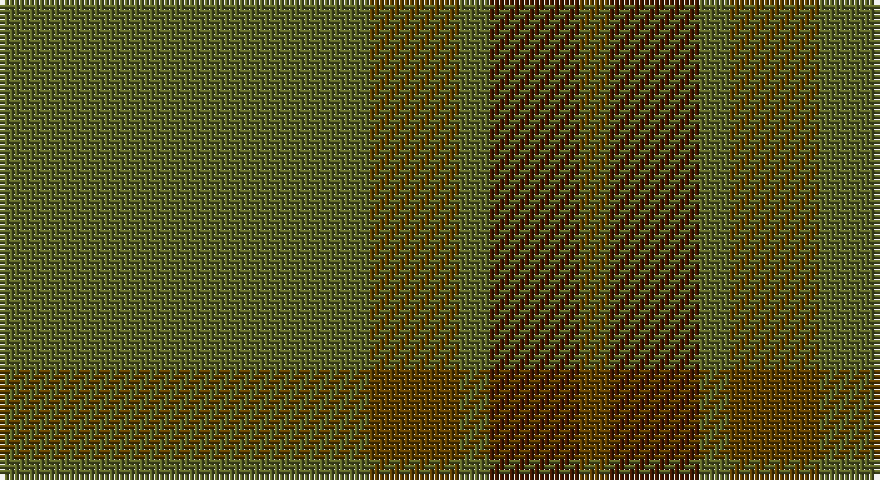

This page is one **sett** — a single exact thread-count. It belongs to the [tartan](/setts/y37dy9y3do9dy3/)
(the same proportion at any scale), whose colour order is pattern [GBGGG](/stripes/gbggg/).

Sourced from house-of-tartan.  It is a [5 stripe tartan](/stripes/stripes5/).

Original link http://www.house-of-tartan.scotland.net/house/TartanViewjs.asp?colr=Def&tnam=915

## Provenance

Earliest known date: Modern Many new designs have been given district names to promote their Scottish connections. However, these names should not be confused with the District tartans which have earned their title through 'use and wont' and not a little history.

## Thread count
G/74 T18 G6 DR18 T/6

One full sett is **164 threads**.

## Palette

Palette: <strong>Tartan Register</strong>
<table><thead><tr><th>Colour</th><th>Threads</th><th>Shade</th><th>Base</th><th>OKLCh</th></tr></thead><tbody><tr><td>G/</td><td style="text-align:right;font-variant-numeric:tabular-nums">74</td><td><code style="background-color:#5C6428;">#5C6428</code> <small style="color:#888">#5C6428</small></td><td>G <code style="background-color:#006100;">#006100</code></td><td><small style="color:#888">oklch(48.3% 0.084 116.0)</small></td></tr><tr><td>T</td><td style="text-align:right;font-variant-numeric:tabular-nums">18</td><td><code style="background-color:#604000;">#604000</code> <small style="color:#888">#604000</small></td><td>G <code style="background-color:#006100;">#006100</code></td><td><small style="color:#888">oklch(39.8% 0.083 76.8)</small></td></tr><tr><td>G</td><td style="text-align:right;font-variant-numeric:tabular-nums">6</td><td><code style="background-color:#5C6428;">#5C6428</code> <small style="color:#888">#5C6428</small></td><td>G <code style="background-color:#006100;">#006100</code></td><td><small style="color:#888">oklch(48.3% 0.084 116.0)</small></td></tr><tr><td>DR</td><td style="text-align:right;font-variant-numeric:tabular-nums">18</td><td><code style="background-color:#441800;">#441800</code> <small style="color:#888">#441800</small></td><td>B <code style="background-color:#2A418A;">#2A418A</code></td><td><small style="color:#888">oklch(27.3% 0.076 46.3)</small></td></tr><tr><td>T/</td><td style="text-align:right;font-variant-numeric:tabular-nums">6</td><td><code style="background-color:#604000;">#604000</code> <small style="color:#888">#604000</small></td><td>G <code style="background-color:#006100;">#006100</code></td><td><small style="color:#888">oklch(39.8% 0.083 76.8)</small></td></tr></tbody></table>

# Sample pattern

## Nearest tartans

The nearest existing variants by ΔTartan distance, with this tartan at the top so the swatches line up against it.

ΔTartan

Tartan

Sett

—

<a href="/ttd/edit/#slug=y37dy9y3do9dy3~x2">Glen Boig Trade Tartan</a> <a class="nn-out" href="/variants/s5/y37dy9y3do9dy3~x2/" title="open its dictionary page">↗</a>

1.30

<a href="/ttd/edit/#slug=g13dy3g1do3dy1~x6&amp;base=y37dy9y3do9dy3~x2">Glen Boig</a> <a class="nn-out" href="/variants/s5/g13dy3g1do3dy1~x6/" title="open its dictionary page">↗</a>

1.33

<a href="/ttd/edit/#slug=y9yi52dy15ly4~x2&amp;base=y37dy9y3do9dy3~x2">McGuigan, Julia (St Monans, Fife) (Personal)</a> <a class="nn-out" href="/variants/s4/y9yi52dy15ly4~x2/" title="open its dictionary page">↗</a>

1.56

<a href="/ttd/edit/#slug=dg3dy30dg40r3~x2&amp;base=y37dy9y3do9dy3~x2">Sanix Muted</a> <a class="nn-out" href="/variants/s4/dg3dy30dg40r3~x2/" title="open its dictionary page">↗</a>

1.78

<a href="/ttd/edit/#slug=y50dy25ly2dp6~x2&amp;base=y37dy9y3do9dy3~x2">Highland Greenford (Personal)</a> <a class="nn-out" href="/variants/s4/y50dy25ly2dp6~x2/" title="open its dictionary page">↗</a>

1.79

<a href="/ttd/edit/#slug=dg18r6dg75db6dg13dy35dg12db6&amp;base=y37dy9y3do9dy3~x2">Gayre Bodyguard</a> <a class="nn-out" href="/variants/s8/dg18r6dg75db6dg13dy35dg12db6/" title="open its dictionary page">↗</a>

1.96

<a href="/ttd/edit/#slug=n11o1n4o8r1~x8&amp;base=y37dy9y3do9dy3~x2">Cairns, David (Personal)</a> <a class="nn-out" href="/variants/s5/n11o1n4o8r1~x8/" title="open its dictionary page">↗</a>

2.06

<a href="/ttd/edit/#slug=gi40dg15g4dg4g4~x2&amp;base=y37dy9y3do9dy3~x2">Celtic 2009 (Sports)</a> <a class="nn-out" href="/variants/s5/gi40dg15g4dg4g4~x2/" title="open its dictionary page">↗</a>

2.07

<a href="/ttd/edit/#slug=do11n1do4n8r1~x8&amp;base=y37dy9y3do9dy3~x2">Cairns, David (Personal)</a> <a class="nn-out" href="/variants/s5/do11n1do4n8r1~x8/" title="open its dictionary page">↗</a>

2.22

<a href="/ttd/edit/#slug=y28k2y28k2y2k2dy29k2r2k2~x2&amp;base=y37dy9y3do9dy3~x2">Ulster (Peat) (District</a> <a class="nn-out" href="/variants/s10/y28k2y28k2y2k2dy29k2r2k2~x2/" title="open its dictionary page">↗</a>

2.26

<a href="/ttd/edit/#slug=y23o4dy6g6y4lb1y4~x4&amp;base=y37dy9y3do9dy3~x2">Tricor (Corporate)</a> <a class="nn-out" href="/variants/s7/y23o4dy6g6y4lb1y4~x4/" title="open its dictionary page">↗</a>

## Neighbour map

Every grey dot is one of 14360 variants placed by the first two principal components of the ΔTartan feature space (44% of its variance). Red is this tartan; blue dots are its nearest — click one to open its page.

<svg viewBox="0 0 640 380" role="img" style="max-width:100%;height:auto;border:1px solid #e0e0e0;border-radius:4px;display:block" xmlns="http://www.w3.org/2000/svg"><image href="/nn/cloud.v1.png" width="640" height="380"/><a href="/variants/s5/g13dy3g1do3dy1~x6/"><circle cx="568.6" cy="306.9" r="4" fill="#3465a4"><title>Glen Boig</title></circle></a><a href="/variants/s4/y9yi52dy15ly4~x2/"><circle cx="537.9" cy="304.1" r="4" fill="#3465a4"><title>McGuigan, Julia (St Monans, Fife) (Personal)</title></circle></a><a href="/variants/s4/dg3dy30dg40r3~x2/"><circle cx="537.0" cy="335.5" r="4" fill="#3465a4"><title>Sanix Muted</title></circle></a><a href="/variants/s4/y50dy25ly2dp6~x2/"><circle cx="505.5" cy="261.9" r="4" fill="#3465a4"><title>Highland Greenford (Personal)</title></circle></a><a href="/variants/s8/dg18r6dg75db6dg13dy35dg12db6/"><circle cx="541.3" cy="270.0" r="4" fill="#3465a4"><title>Gayre Bodyguard</title></circle></a><a href="/variants/s5/n11o1n4o8r1~x8/"><circle cx="504.6" cy="311.7" r="4" fill="#3465a4"><title>Cairns, David (Personal)</title></circle></a><a href="/variants/s5/gi40dg15g4dg4g4~x2/"><circle cx="488.1" cy="307.3" r="4" fill="#3465a4"><title>Celtic 2009 (Sports)</title></circle></a><a href="/variants/s5/do11n1do4n8r1~x8/"><circle cx="545.4" cy="340.3" r="4" fill="#3465a4"><title>Cairns, David (Personal)</title></circle></a><a href="/variants/s10/y28k2y28k2y2k2dy29k2r2k2~x2/"><circle cx="480.7" cy="219.8" r="4" fill="#3465a4"><title>Ulster (Peat) (District</title></circle></a><a href="/variants/s7/y23o4dy6g6y4lb1y4~x4/"><circle cx="506.1" cy="221.2" r="4" fill="#3465a4"><title>Tricor (Corporate)</title></circle></a><circle cx="554.6" cy="298.1" r="5" fill="#c00000"/></svg>

ID: /variants/s5/y37dy9y3do9dy3~x2/
