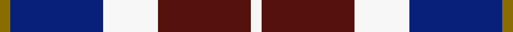

This is one **variant** — a specific cloth: this exact thread count and colourway, with its own
provenance below. It is one weaving of the [sett](/tartans/c/co/common-ground/) (the scale-free proportion — the
same cloth at any scale or shade), whose colour order is pattern [GBWBW](/stripes/gbwbw/).

Part of the [Common Ground](/tartans/c/co/common-ground/) tartan — the named design grouping this sett with its other cloths.

Sourced from register-of-tartans.  It is a [5 stripe tartan](/stripes/stripes5/).

Original link [https://www.tartanregister.gov.uk/tartanDetails.aspx?ref=10579](https://www.tartanregister.gov.uk/tartanDetails.aspx?ref=10579)

Dataset <small>— provenance for this record, inherited from the source manifest</small>

<dl class="dataset-prov">
<dt>source</dt><dd><a href="/sources/register-of-tartans/">Scottish Register of Tartans</a></dd>
<dt>data captured from</dt><dd><a href="https://github.com/thetartan/tartan-database/blob/master/data/register-of-tartans/data.csv">https://github.com/thetartan/tartan-database/blob/master/data/register-of-tartans/data.csv</a></dd>
<dt>data date</dt><dd>03/03/2012 <small>(this record)</small></dd>
<dt>licence</dt><dd><a href="https://www.tartanregister.gov.uk/copyright">Crown copyright</a></dd>
</dl>

Capture chain <small>— the hands this data passed through, oldest first; each capture carries its own licence</small>

<ol class="capture-chain">
<li><a href="https://www.tartanregister.gov.uk/">Scottish Register of Tartans</a> · <a href="https://www.tartanregister.gov.uk/copyright">Crown copyright</a> <small>the living register — still published by National Records of Scotland</small></li>
<li><a href="https://github.com/thetartan/tartan-database">thetartan/tartan-database</a> <small>2016-2017</small> · <a href="https://creativecommons.org/licenses/by-nc-nd/4.0/">CC BY-NC-ND 4.0</a> <small>Levko Kravets's frozen compilation — the capture we vendored, and where its CC licence text came from</small></li>
<li>this dictionary <small>captured 2026-06-10 · commit 5bf86c7566</small> <small>each re-capture is a git commit to data/sources</small></li>
</ol>

## Register references

External register numbers recorded for this tartan.

- Scottish Register of Tartans: [10579](https://www.tartanregister.gov.uk/tartanDetails.aspx?ref=10579)

## Thread count
Y/6 DB54 W32 DR54 W/6

One full sett is **292 threads**.

## Palette
<table><thead><tr><th>Colour</th><th>Shade</th><th>OKLCh</th></tr></thead><tbody><tr><td>DB</td><td><code style="background-color:#082077;">#082077</code> <small style="color:#888">#082077</small></td><td><small style="color:#888">oklch(30.0% 0.149 265.1)</small></td></tr><tr><td>DR</td><td><code style="background-color:#55120C;">#55120C</code> <small style="color:#888">#55120C</small></td><td><small style="color:#888">oklch(30.0% 0.099 29.3)</small></td></tr><tr><td>W</td><td><code style="background-color:#F7F7F7;">#F7F7F7</code> <small style="color:#888">#F7F7F7</small></td><td><small style="color:#888">oklch(97.6% 0.000 89.9)</small></td></tr><tr><td>Y</td><td><code style="background-color:#8B6E00;">#8B6E00</code> <small style="color:#888">#8B6E00</small></td><td><small style="color:#888">oklch(55.1% 0.113 90.4)</small></td></tr></tbody></table>

# Sample pattern

## Nearest tartan variants

The nearest existing variants by ΔTartan distance, with this cloth at the top so the swatches line up against it.

ΔTartan

Threads

Variant

Sett

—

292

<a href="/variants/s5/y3db27w16dr27w3~x2/">Common Ground (Dress)</a>

<a href="/ttd/edit/#slug=w3dr27w16db27ly3~x2&amp;base=y3db27w16dr27w3~x2" title="compare in the TTD">0.02</a>

292

<a href="/variants/s5/w3dr27w16db27ly3~x2/">Common Ground Dress (Fashion)</a>

<a href="/ttd/edit/#slug=r7w36db36y7~x2&amp;base=y3db27w16dr27w3~x2" title="compare in the TTD">1.76</a>

316

<a href="/variants/s4/r7w36db36y7~x2/">MacRae of Conchra #3</a>

<a href="/ttd/edit/#slug=w4db30g10dr25w2~x2&amp;base=y3db27w16dr27w3~x2" title="compare in the TTD">1.77</a>

272

<a href="/variants/s5/w4db30g10dr25w2~x2/">Highland Spring Dress (2004) (Corp)</a>

<a href="/ttd/edit/#slug=r21db61y8w21~x2&amp;base=y3db27w16dr27w3~x2" title="compare in the TTD">1.86</a>

360

<a href="/variants/s4/r21db61y8w21~x2/">Kellogg College University of Oxford</a>

<a href="/ttd/edit/#slug=r21db61dy8w21~x2&amp;base=y3db27w16dr27w3~x2" title="compare in the TTD">1.86</a>

360

<a href="/variants/s4/r21db61dy8w21~x2/">Kellogg College University of Oxford</a>

<a href="/ttd/edit/#slug=db2w2dr8db8w1~x2&amp;base=y3db27w16dr27w3~x2" title="compare in the TTD">1.88</a>

78

<a href="/variants/s5/db2w2dr8db8w1~x2/">Laval (Tartan de..) District Tartan</a>

<a href="/ttd/edit/#slug=db10g10r5w1~x2&amp;base=y3db27w16dr27w3~x2" title="compare in the TTD">1.98</a>

82

<a href="/variants/s4/db10g10r5w1~x2/">Thorntons Law Corporate Tartan</a>

<a href="/ttd/edit/#slug=r15dr98db72lb25db8w15&amp;base=y3db27w16dr27w3~x2" title="compare in the TTD">2.27</a>

436

<a href="/variants/s6/r15dr98db72lb25db8w15/">Afternoon Tea / Assam</a>

<a href="/ttd/edit/#slug=r30db20w15lb3ly3&amp;base=y3db27w16dr27w3~x2" title="compare in the TTD">2.45</a>

109

<a href="/variants/s5/r30db20w15lb3ly3/">Siddle, New (Corporate)</a>

<a href="/ttd/edit/#slug=r31db33g12w2~x2&amp;base=y3db27w16dr27w3~x2" title="compare in the TTD">2.76</a>

246

<a href="/variants/s4/r31db33g12w2~x2/">Manor of Wrentnall (Personal)</a>

## Neighbour map

Every grey dot is one of 13656 variants placed by the first two principal components of the ΔTartan feature space (42% of its variance). Red is this tartan; blue dots are its nearest — click one to open its page. The map is a flat projection of a many-dimensional space — [how to read it](/posts/neighbourhood-maps/).

<svg viewBox="0 0 640 380" role="img" style="max-width:100%;height:auto;border:1px solid #e0e0e0;border-radius:4px;display:block" xmlns="http://www.w3.org/2000/svg"><image href="/nn/cloud.v1.png" width="640" height="380"/><a href="/variants/s5/w3dr27w16db27ly3~x2/"><circle cx="215.8" cy="257.9" r="4" fill="#3465a4"><title>Common Ground Dress (Fashion)</title></circle></a><a href="/variants/s4/r7w36db36y7~x2/"><circle cx="182.2" cy="258.0" r="4" fill="#3465a4"><title>MacRae of Conchra #3</title></circle></a><a href="/variants/s5/w4db30g10dr25w2~x2/"><circle cx="268.1" cy="225.0" r="4" fill="#3465a4"><title>Highland Spring Dress (2004) (Corp)</title></circle></a><a href="/variants/s4/r21db61y8w21~x2/"><circle cx="255.5" cy="237.5" r="4" fill="#3465a4"><title>Kellogg College University of Oxford</title></circle></a><a href="/variants/s4/r21db61dy8w21~x2/"><circle cx="255.5" cy="237.3" r="4" fill="#3465a4"><title>Kellogg College University of Oxford</title></circle></a><a href="/variants/s5/db2w2dr8db8w1~x2/"><circle cx="308.9" cy="272.1" r="4" fill="#3465a4"><title>Laval (Tartan de..) District Tartan</title></circle></a><a href="/variants/s4/db10g10r5w1~x2/"><circle cx="204.2" cy="256.4" r="4" fill="#3465a4"><title>Thorntons Law Corporate Tartan</title></circle></a><a href="/variants/s6/r15dr98db72lb25db8w15/"><circle cx="217.5" cy="185.7" r="4" fill="#3465a4"><title>Afternoon Tea / Assam</title></circle></a><a href="/variants/s5/r30db20w15lb3ly3/"><circle cx="188.2" cy="205.3" r="4" fill="#3465a4"><title>Siddle, New (Corporate)</title></circle></a><a href="/variants/s4/r31db33g12w2~x2/"><circle cx="257.6" cy="222.5" r="4" fill="#3465a4"><title>Manor of Wrentnall (Personal)</title></circle></a><circle cx="193.9" cy="242.7" r="5" fill="#c00000"/><text x="320" y="376" text-anchor="middle" font-size="11" fill="#999">ground</text><text x="11" y="190" text-anchor="middle" font-size="11" fill="#999" transform="rotate(-90 11 190)">complexity</text></svg>

ID: /variants/s5/y3db27w16dr27w3~x2/
