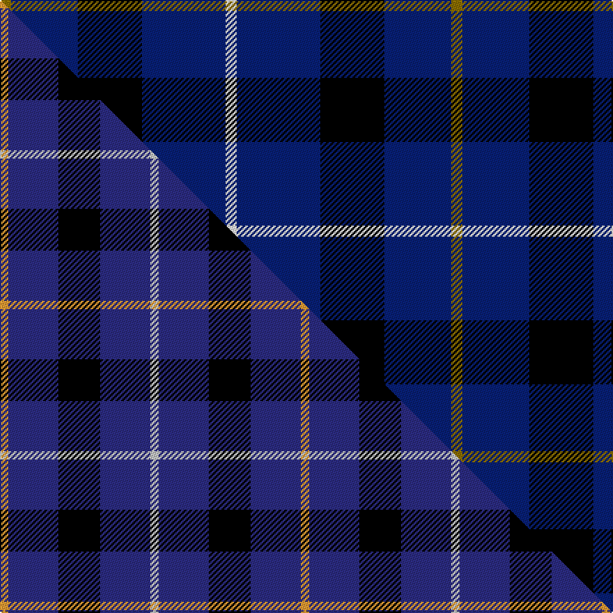

This page is one **sett** — a single exact thread-count. It belongs to the [tartan](/setts/y4db24k23db30w4/)
(the same proportion at any scale), whose colour order is pattern [GBKBW](/stripes/gbkbw/).

Part of the [Bank of Scotland](/tartans/bank-of-scotland/) tartan — the named design grouping this sett with its other cloths.

Sourced from weddslist.  It is a [5 stripe tartan](/stripes/stripes5/).

Original link http://www.weddslist.com/cgi-bin/tartans/pg.pl?source=sts

## Provenance

Earliest known date: 1994 Commemorating the founding of the bank in 1695

2 attestations — the source records this cloth was collapsed from (oldest owns this page)

<ul>
<li>undated — Bank of Scotland (weddslist, <a href="http://www.weddslist.com/cgi-bin/tartans/pg.pl?source=sts">record</a>) </li>
<li>undated — Bank of Scotland Corporate Tartan (house-of-tartan, <a href="http://www.house-of-tartan.scotland.net/house/TartanViewjs.asp?colr=Def&tnam=2462">record</a>) </li>
</ul>

Dataset <small>— provenance for this record, inherited from the source manifest</small>

<dl class="dataset-prov">
<dt>source</dt><dd><a href="/sources/weddslist/">Weddslist</a></dd>
<dt>data captured from</dt><dd><a href="https://github.com/thetartan/tartan-database/blob/master/data/weddslist/data.csv">https://github.com/thetartan/tartan-database/blob/master/data/weddslist/data.csv</a></dd>
<dt>data date</dt><dd>2016-11-17 <small>(dataset default)</small></dd>
<dt>licence</dt><dd><a href="https://creativecommons.org/licenses/by-nc-nd/4.0/">CC BY-NC-ND 4.0</a></dd>
</dl>

Capture chain <small>— the hands this data passed through, oldest first; each capture carries its own licence</small>

<ol class="capture-chain">
<li><a href="https://www.weddslist.com/tartans/">Weddslist</a> <small>the living privately compiled reference</small></li>
<li><a href="https://github.com/thetartan/tartan-database">thetartan/tartan-database</a> <small>2016-2017</small> · <a href="https://creativecommons.org/licenses/by-nc-nd/4.0/">CC BY-NC-ND 4.0</a> <small>Levko Kravets's frozen compilation — the capture we vendored, and where its CC licence text came from</small></li>
<li>this dictionary <small>captured 2026-06-10 · commit 5bf86c7566</small> <small>each re-capture is a git commit to data/sources</small></li>
</ol>

## Thread count
Y/8 DB48 K46 DB60 W/8

One full sett is **324 threads**.

## Palette
<table><thead><tr><th>Colour</th><th>Shade</th><th>OKLCh</th></tr></thead><tbody><tr><td>DB</td><td><code style="background-color:#082077;">#082077</code> <small style="color:#888">#082077</small></td><td><small style="color:#888">oklch(30.0% 0.149 265.1)</small></td></tr><tr><td>K</td><td><code style="background-color:#000000;">#000000</code> <small style="color:#888">#000000</small></td><td><small style="color:#888">oklch(0.0% 0.000 0.0)</small></td></tr><tr><td>W</td><td><code style="background-color:#F7F7F7;">#F7F7F7</code> <small style="color:#888">#F7F7F7</small></td><td><small style="color:#888">oklch(97.6% 0.000 89.9)</small></td></tr><tr><td>Y</td><td><code style="background-color:#8B6E00;">#8B6E00</code> <small style="color:#888">#8B6E00</small></td><td><small style="color:#888">oklch(55.1% 0.113 90.4)</small></td></tr></tbody></table>

# Sample pattern

## Compared to the master

This cloth is one sett of its design; the master sett (the exemplar the design is anchored on) is below for comparison.

Its **ΔTartan distance** from the master is **0.51** — the same measure the nearest-tartans table ranks by (0 is identical; a re-scale of the same cloth is near 0, a recolour or a different proportion further).

<figure class="master-compare" style="margin:0">

this sett
master sett ★

<figcaption style="color:#888;font-size:smaller">One weave of this sett against the <a href="/setts/lo1db6k5db6lb1/">master sett ★</a>, split on the diagonal: a shared proportion runs seamlessly across it with only the shades shifting; a different proportion breaks on it.</figcaption>
</figure>

## Nearest tartan variants

The nearest existing variants by ΔTartan distance, with this cloth at the top so the swatches line up against it.

ΔTartan

Threads

Variant

Sett

—

324

<a href="/variants/s5/y4db24k23db30w4~x2/">Bank of Scotland</a>

<a href="/ttd/edit/#slug=lo1db6k5db6lb1~x6~db1406275-lb3300000&amp;base=y4db24k23db30w4~x2" title="compare in the TTD">0.51</a>

216

<a href="/variants/s5/lo1db6k5db6lb1~x6~db1406275-lb3300000/">Bank of Scotland (1995)</a>

<a href="/ttd/edit/#slug=r6db35k36db36w6&amp;base=y4db24k23db30w4~x2" title="compare in the TTD">0.52</a>

226

<a href="/variants/s5/r6db35k36db36w6/">Davidson of Tulloch Clan Tartan</a>

<a href="/ttd/edit/#slug=lo1db6k5db6lb1~x6&amp;base=y4db24k23db30w4~x2" title="compare in the TTD">0.77</a>

216

<a href="/variants/s5/lo1db6k5db6lb1~x6/">Bank of Scotland (1995) (Corporate)</a>

<a href="/ttd/edit/#slug=r5db35k25db8ly10r5~x2&amp;base=y4db24k23db30w4~x2" title="compare in the TTD">1.13</a>

332

<a href="/variants/s6/r5db35k25db8ly10r5~x2/">University of Notre Dame</a>

<a href="/ttd/edit/#slug=db20k5db18y26k6~x2&amp;base=y4db24k23db30w4~x2" title="compare in the TTD">1.15</a>

248

<a href="/variants/s5/db20k5db18y26k6~x2/">Jahore</a>

<a href="/ttd/edit/#slug=r1db12k5o3db5w1~x4&amp;base=y4db24k23db30w4~x2" title="compare in the TTD">1.18</a>

208

<a href="/variants/s6/r1db12k5o3db5w1~x4/">Massachusetts</a>

<a href="/ttd/edit/#slug=r1db12k5ly3db5lb1~x4&amp;base=y4db24k23db30w4~x2" title="compare in the TTD">1.41</a>

208

<a href="/variants/s6/r1db12k5ly3db5lb1~x4/">Massachusetts (Unofficial)</a>

<a href="/ttd/edit/#slug=db24w4db24y4dr5k4~x2&amp;base=y4db24k23db30w4~x2" title="compare in the TTD">1.46</a>

204

<a href="/variants/s6/db24w4db24y4dr5k4~x2/">De Grussa</a>

<a href="/ttd/edit/#slug=db24w4db24ly4dr5k4~x2&amp;base=y4db24k23db30w4~x2" title="compare in the TTD">1.46</a>

204

<a href="/variants/s6/db24w4db24ly4dr5k4~x2/">de Grussa (Personal)</a>

<a href="/ttd/edit/#slug=lb5db30k25lb5db30dp3lb5~x2&amp;base=y4db24k23db30w4~x2" title="compare in the TTD">1.58</a>

392

<a href="/variants/s7/lb5db30k25lb5db30dp3lb5~x2/">Van Loo Tartan</a>

## Neighbour map

Every grey dot is one of 13620 variants placed by the first two principal components of the ΔTartan feature space (42% of its variance). Red is this tartan; blue dots are its nearest — click one to open its page.

<svg viewBox="0 0 640 380" role="img" style="max-width:100%;height:auto;border:1px solid #e0e0e0;border-radius:4px;display:block" xmlns="http://www.w3.org/2000/svg"><image href="/nn/cloud.v1.png" width="640" height="380"/><a href="/variants/s5/lo1db6k5db6lb1~x6~db1406275-lb3300000/"><circle cx="287.2" cy="239.9" r="4" fill="#3465a4"><title>Bank of Scotland (1995)</title></circle></a><a href="/variants/s5/r6db35k36db36w6/"><circle cx="267.3" cy="240.3" r="4" fill="#3465a4"><title>Davidson of Tulloch Clan Tartan</title></circle></a><a href="/variants/s5/lo1db6k5db6lb1~x6/"><circle cx="289.6" cy="242.6" r="4" fill="#3465a4"><title>Bank of Scotland (1995) (Corporate)</title></circle></a><a href="/variants/s6/r5db35k25db8ly10r5~x2/"><circle cx="199.7" cy="208.3" r="4" fill="#3465a4"><title>University of Notre Dame</title></circle></a><a href="/variants/s5/db20k5db18y26k6~x2/"><circle cx="238.5" cy="272.8" r="4" fill="#3465a4"><title>Jahore</title></circle></a><a href="/variants/s6/r1db12k5o3db5w1~x4/"><circle cx="292.5" cy="170.3" r="4" fill="#3465a4"><title>Massachusetts</title></circle></a><a href="/variants/s6/r1db12k5ly3db5lb1~x4/"><circle cx="284.5" cy="170.8" r="4" fill="#3465a4"><title>Massachusetts (Unofficial)</title></circle></a><a href="/variants/s6/db24w4db24y4dr5k4~x2/"><circle cx="363.1" cy="199.5" r="4" fill="#3465a4"><title>De Grussa</title></circle></a><a href="/variants/s6/db24w4db24ly4dr5k4~x2/"><circle cx="349.6" cy="195.8" r="4" fill="#3465a4"><title>de Grussa (Personal)</title></circle></a><a href="/variants/s7/lb5db30k25lb5db30dp3lb5~x2/"><circle cx="275.2" cy="191.1" r="4" fill="#3465a4"><title>Van Loo Tartan</title></circle></a><circle cx="303.5" cy="231.3" r="5" fill="#c00000"/><text x="320" y="376" text-anchor="middle" font-size="11" fill="#999">ground</text><text x="11" y="190" text-anchor="middle" font-size="11" fill="#999" transform="rotate(-90 11 190)">complexity</text></svg>

ID: /variants/s5/y4db24k23db30w4~x2/
