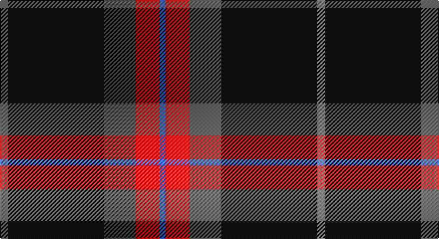

This page is one **sett** — a single exact thread-count. It belongs to the [tartan](/setts/y4k48y16r12b3/)
(the same proportion at any scale), whose colour order is pattern [BRGKG](/stripes/brgkg/).

Sourced from register-of-tartans.  It is a [5 stripe tartan](/stripes/stripes5/).

Original link https://www.tartanregister.gov.uk/tartanDetails.aspx?ref=10484

## Register references

External register numbers recorded for this tartan.

- Scottish Register of Tartans: [10484](https://www.tartanregister.gov.uk/tartanDetails.aspx?ref=10484)

## Thread count
N/8 K96 N32 R24 B/6

One full sett is **318 threads**.

## Palette

Palette: <strong>Logan (The Scottish Gael, 1831)</strong> <small style="color:#888">(1 of 4 colours)</small>
<table><thead><tr><th>Colour</th><th>Threads</th><th>Shade</th><th>Base</th><th>OKLCh</th></tr></thead><tbody><tr><td>N/</td><td style="text-align:right;font-variant-numeric:tabular-nums">8</td><td><code style="background-color:#696969;">#696969</code> <small style="color:#888">#696969</small></td><td>G <code style="background-color:#006100;">#006100</code></td><td><small style="color:#888">oklch(52.1% 0.000 89.9)</small></td></tr><tr><td>K</td><td style="text-align:right;font-variant-numeric:tabular-nums">96</td><td><code style="background-color:#101010;">#101010</code> <small style="color:#888">#101010</small></td><td>K <code style="background-color:#000000;">#000000</code></td><td><small style="color:#888">oklch(17.3% 0.000 89.9)</small></td></tr><tr><td>N</td><td style="text-align:right;font-variant-numeric:tabular-nums">32</td><td><code style="background-color:#696969;">#696969</code> <small style="color:#888">#696969</small></td><td>G <code style="background-color:#006100;">#006100</code></td><td><small style="color:#888">oklch(52.1% 0.000 89.9)</small></td></tr><tr><td>R</td><td style="text-align:right;font-variant-numeric:tabular-nums">24</td><td><code style="background-color:#DB2929;">#DB2929</code> <small style="color:#888">#DB2929</small></td><td>R <code style="background-color:#CC0000;">#CC0000</code></td><td><small style="color:#888">oklch(57.7% 0.212 27.1)</small></td></tr><tr><td>B/</td><td style="text-align:right;font-variant-numeric:tabular-nums">6</td><td><code style="background-color:#4876FF;">#4876FF</code> <small style="color:#888">#4876FF</small></td><td>B <code style="background-color:#2A418A;">#2A418A</code></td><td><small style="color:#888">oklch(61.0% 0.210 266.2)</small></td></tr></tbody></table>

# Sample pattern

## Nearest tartans

The nearest existing variants by ΔTartan distance, with this tartan at the top so the swatches line up against it.

ΔTartan

Tartan

Sett

—

<a href="/ttd/edit/#slug=y4k48y16r12b3~x2">Calgary Firefighters</a> <a class="nn-out" href="/variants/s5/y4k48y16r12b3~x2/" title="open its dictionary page">↗</a>

0.24

<a href="/ttd/edit/#slug=o4k48o16r12db3~x2&amp;base=y4k48y16r12b3~x2">Calgary Firefighters (Corporate)</a> <a class="nn-out" href="/variants/s5/o4k48o16r12db3~x2/" title="open its dictionary page">↗</a>

0.76

<a href="/ttd/edit/#slug=k3w2n27k31lr3~x2&amp;base=y4k48y16r12b3~x2">Kelley Oliphint (Commemorative)</a> <a class="nn-out" href="/variants/s5/k3w2n27k31lr3~x2/" title="open its dictionary page">↗</a>

0.89

<a href="/ttd/edit/#slug=k3w2n27k31p3~x2&amp;base=y4k48y16r12b3~x2">Kelley Oliphint</a> <a class="nn-out" href="/variants/s5/k3w2n27k31p3~x2/" title="open its dictionary page">↗</a>

1.01

<a href="/ttd/edit/#slug=w3dr10k38o11dr6k2w3~x2&amp;base=y4k48y16r12b3~x2">Phantom (Corporate)</a> <a class="nn-out" href="/variants/s7/w3dr10k38o11dr6k2w3~x2/" title="open its dictionary page">↗</a>

1.05

<a href="/ttd/edit/#slug=k31r12ly2n5k2~x4&amp;base=y4k48y16r12b3~x2">Perry (2014)</a> <a class="nn-out" href="/variants/s5/k31r12ly2n5k2~x4/" title="open its dictionary page">↗</a>

1.10

<a href="/ttd/edit/#slug=r11ri5g5k40ly3~x2&amp;base=y4k48y16r12b3~x2">MacShimsi</a> <a class="nn-out" href="/variants/s5/r11ri5g5k40ly3~x2/" title="open its dictionary page">↗</a>

1.16

<a href="/ttd/edit/#slug=dr2dg14lb3dr13ly1dr2~x4&amp;base=y4k48y16r12b3~x2">Swedish Para Whisky Club (Corporate</a> <a class="nn-out" href="/variants/s6/dr2dg14lb3dr13ly1dr2~x4/" title="open its dictionary page">↗</a>

1.16

<a href="/ttd/edit/#slug=k10y4k1t2r1~x10&amp;base=y4k48y16r12b3~x2">Brotherhood of the Kilt</a> <a class="nn-out" href="/variants/s5/k10y4k1t2r1~x10/" title="open its dictionary page">↗</a>

1.20

<a href="/ttd/edit/#slug=k62n24lo5w8~x2&amp;base=y4k48y16r12b3~x2">Perry, Alex (Personal)</a> <a class="nn-out" href="/variants/s4/k62n24lo5w8~x2/" title="open its dictionary page">↗</a>

1.27

<a href="/ttd/edit/#slug=dg7w1dg18db6r18dg2~x2&amp;base=y4k48y16r12b3~x2">Finlaggan</a> <a class="nn-out" href="/variants/s6/dg7w1dg18db6r18dg2~x2/" title="open its dictionary page">↗</a>

## Neighbour map

Every grey dot is one of 14360 variants placed by the first two principal components of the ΔTartan feature space (44% of its variance). Red is this tartan; blue dots are its nearest — click one to open its page.

<svg viewBox="0 0 640 380" role="img" style="max-width:100%;height:auto;border:1px solid #e0e0e0;border-radius:4px;display:block" xmlns="http://www.w3.org/2000/svg"><image href="/nn/cloud.v1.png" width="640" height="380"/><a href="/variants/s5/o4k48o16r12db3~x2/"><circle cx="335.4" cy="189.7" r="4" fill="#3465a4"><title>Calgary Firefighters (Corporate)</title></circle></a><a href="/variants/s5/k3w2n27k31lr3~x2/"><circle cx="328.3" cy="200.5" r="4" fill="#3465a4"><title>Kelley Oliphint (Commemorative)</title></circle></a><a href="/variants/s5/k3w2n27k31p3~x2/"><circle cx="340.6" cy="207.6" r="4" fill="#3465a4"><title>Kelley Oliphint</title></circle></a><a href="/variants/s7/w3dr10k38o11dr6k2w3~x2/"><circle cx="314.2" cy="157.6" r="4" fill="#3465a4"><title>Phantom (Corporate)</title></circle></a><a href="/variants/s5/k31r12ly2n5k2~x4/"><circle cx="400.5" cy="202.6" r="4" fill="#3465a4"><title>Perry (2014)</title></circle></a><a href="/variants/s5/r11ri5g5k40ly3~x2/"><circle cx="349.0" cy="180.2" r="4" fill="#3465a4"><title>MacShimsi</title></circle></a><a href="/variants/s6/dr2dg14lb3dr13ly1dr2~x4/"><circle cx="312.2" cy="199.8" r="4" fill="#3465a4"><title>Swedish Para Whisky Club (Corporate</title></circle></a><a href="/variants/s5/k10y4k1t2r1~x10/"><circle cx="356.6" cy="228.2" r="4" fill="#3465a4"><title>Brotherhood of the Kilt</title></circle></a><a href="/variants/s4/k62n24lo5w8~x2/"><circle cx="342.0" cy="212.9" r="4" fill="#3465a4"><title>Perry, Alex (Personal)</title></circle></a><a href="/variants/s6/dg7w1dg18db6r18dg2~x2/"><circle cx="316.9" cy="197.8" r="4" fill="#3465a4"><title>Finlaggan</title></circle></a><circle cx="341.8" cy="193.6" r="5" fill="#c00000"/></svg>

ID: /variants/s5/y4k48y16r12b3~x2/
