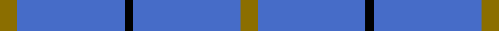

This page is one **sett** — a single exact thread-count. It belongs to the [tartan](/setts/y6b38k3b38y6/)
(the same proportion at any scale), whose colour order is pattern [GBKBG](/stripes/gbkbg/).

Sourced from weddslist.  It is a [5 stripe tartan](/stripes/stripes5/).

Original link http://www.weddslist.com/cgi-bin/tartans/pg.pl?source=sts

## Thread count
Y/12 B76 K6 B76 Y/12

One full sett is **340 threads**.

## Palette
<table><thead><tr><th>Colour</th><th>Shade</th><th>OKLCh</th></tr></thead><tbody><tr><td>B</td><td><code style="background-color:#466CC8;">#466CC8</code> <small style="color:#888">#466CC8</small></td><td><small style="color:#888">oklch(55.1% 0.149 265.0)</small></td></tr><tr><td>K</td><td><code style="background-color:#000000;">#000000</code> <small style="color:#888">#000000</small></td><td><small style="color:#888">oklch(0.0% 0.000 0.0)</small></td></tr><tr><td>Y</td><td><code style="background-color:#8B6E00;">#8B6E00</code> <small style="color:#888">#8B6E00</small></td><td><small style="color:#888">oklch(55.1% 0.113 90.4)</small></td></tr></tbody></table>

# Sample pattern

## Nearest tartan variants

The nearest existing variants by ΔTartan distance, with this cloth at the top so the swatches line up against it.

ΔTartan

Threads

Variant

Sett

—

340

<a href="/variants/s5/y6b38k3b38y6~x2/">The Poulain League</a>

<a href="/ttd/edit/#slug=dy1db9dy2db9r1~x4&amp;base=y6b38k3b38y6~x2" title="compare in the TTD">0.96</a>

168

<a href="/variants/s5/dy1db9dy2db9r1~x4/">Brooks Brothers Tattersall Blue</a>

<a href="/ttd/edit/#slug=db50k12db21w5~x2&amp;base=y6b38k3b38y6~x2" title="compare in the TTD">1.09</a>

242

<a href="/variants/s4/db50k12db21w5~x2/">Coinean Dubh</a>

<a href="/ttd/edit/#slug=db68lb7db16k16ly4~x2&amp;base=y6b38k3b38y6~x2" title="compare in the TTD">1.10</a>

300

<a href="/variants/s5/db68lb7db16k16ly4~x2/">Burnetts &amp; Struth</a>

<a href="/ttd/edit/#slug=db32r3db4k1y3&amp;base=y6b38k3b38y6~x2" title="compare in the TTD">1.15</a>

51

<a href="/variants/s5/db32r3db4k1y3/">MacLaine of Lochbuie Hunting</a>

<a href="/ttd/edit/#slug=db32r3db4k1y3~x2&amp;base=y6b38k3b38y6~x2" title="compare in the TTD">1.15</a>

102

<a href="/variants/s5/db32r3db4k1y3~x2/">MacLaine of Lochbuie, hunting</a>

<a href="/ttd/edit/#slug=db140r11db14y11&amp;base=y6b38k3b38y6~x2" title="compare in the TTD">1.16</a>

201

<a href="/variants/s4/db140r11db14y11/">Gem</a>

<a href="/ttd/edit/#slug=db32r3db4y3~x2&amp;base=y6b38k3b38y6~x2" title="compare in the TTD">1.17</a>

98

<a href="/variants/s4/db32r3db4y3~x2/">MacLaine of Lochbuie</a>

<a href="/ttd/edit/#slug=db102r11db14w11&amp;base=y6b38k3b38y6~x2" title="compare in the TTD">1.17</a>

163

<a href="/variants/s4/db102r11db14w11/">Westfield (Corporate?)</a>

<a href="/ttd/edit/#slug=db35w4db10r3ri3r3~x4~r1706009-ri2109032&amp;base=y6b38k3b38y6~x2" title="compare in the TTD">1.39</a>

312

<a href="/variants/s6/db35w4db10r3ri3r3~x4~r1706009-ri2109032/">Steffen, Morris (Personal)</a>

<a href="/ttd/edit/#slug=db35w4db10dr3r3dr3~x4&amp;base=y6b38k3b38y6~x2" title="compare in the TTD">1.39</a>

312

<a href="/variants/s6/db35w4db10dr3r3dr3~x4/">Steffen, Markus (Personal)</a>

## Neighbour map

Every grey dot is one of 13620 variants placed by the first two principal components of the ΔTartan feature space (42% of its variance). Red is this tartan; blue dots are its nearest — click one to open its page.

<svg viewBox="0 0 640 380" role="img" style="max-width:100%;height:auto;border:1px solid #e0e0e0;border-radius:4px;display:block" xmlns="http://www.w3.org/2000/svg"><image href="/nn/cloud.v1.png" width="640" height="380"/><a href="/variants/s5/dy1db9dy2db9r1~x4/"><circle cx="620.6" cy="268.2" r="4" fill="#3465a4"><title>Brooks Brothers Tattersall Blue</title></circle></a><a href="/variants/s4/db50k12db21w5~x2/"><circle cx="475.3" cy="230.0" r="4" fill="#3465a4"><title>Coinean Dubh</title></circle></a><a href="/variants/s5/db68lb7db16k16ly4~x2/"><circle cx="445.5" cy="167.6" r="4" fill="#3465a4"><title>Burnetts &amp; Struth</title></circle></a><a href="/variants/s5/db32r3db4k1y3/"><circle cx="589.6" cy="135.4" r="4" fill="#3465a4"><title>MacLaine of Lochbuie Hunting</title></circle></a><a href="/variants/s5/db32r3db4k1y3~x2/"><circle cx="589.6" cy="135.4" r="4" fill="#3465a4"><title>MacLaine of Lochbuie, hunting</title></circle></a><a href="/variants/s4/db140r11db14y11/"><circle cx="626.0" cy="216.4" r="4" fill="#3465a4"><title>Gem</title></circle></a><a href="/variants/s4/db32r3db4y3~x2/"><circle cx="619.0" cy="225.3" r="4" fill="#3465a4"><title>MacLaine of Lochbuie</title></circle></a><a href="/variants/s4/db102r11db14w11/"><circle cx="535.6" cy="215.7" r="4" fill="#3465a4"><title>Westfield (Corporate?)</title></circle></a><a href="/variants/s6/db35w4db10r3ri3r3~x4~r1706009-ri2109032/"><circle cx="467.1" cy="171.5" r="4" fill="#3465a4"><title>Steffen, Morris (Personal)</title></circle></a><a href="/variants/s6/db35w4db10dr3r3dr3~x4/"><circle cx="475.8" cy="177.7" r="4" fill="#3465a4"><title>Steffen, Markus (Personal)</title></circle></a><circle cx="573.8" cy="225.3" r="5" fill="#c00000"/><text x="320" y="376" text-anchor="middle" font-size="11" fill="#999">ground</text><text x="11" y="190" text-anchor="middle" font-size="11" fill="#999" transform="rotate(-90 11 190)">complexity</text></svg>

ID: /variants/s5/y6b38k3b38y6~x2/
