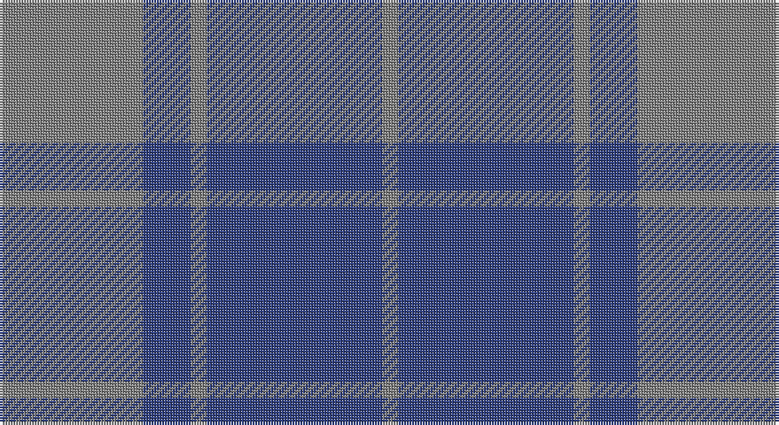

This page is one **sett** — a single exact thread-count. It belongs to the [tartan](/setts/y9db3y1db11y1/)
(the same proportion at any scale), whose colour order is pattern [GBGBG](/stripes/gbgbg/).

Sourced from weddslist.  It is a [5 stripe tartan](/stripes/stripes5/).

Original link http://www.weddslist.com/cgi-bin/tartans/pg.pl?source=sts

## Thread count
N/54 B18 N6 B66 N/6

One full sett is **240 threads**.

## Palette

Palette: <strong>Tartan Register</strong> <small style="color:#888">(1 of 2 colours)</small>
<table><thead><tr><th>Colour</th><th>Threads</th><th>Shade</th><th>Base</th><th>OKLCh</th></tr></thead><tbody><tr><td>N/</td><td style="text-align:right;font-variant-numeric:tabular-nums">54</td><td><code style="background-color:#808080;">#808080</code> <small style="color:#888">#808080</small></td><td>G <code style="background-color:#006100;">#006100</code></td><td><small style="color:#888">oklch(60.0% 0.000 89.9)</small></td></tr><tr><td>B</td><td style="text-align:right;font-variant-numeric:tabular-nums">18</td><td><code style="background-color:#304080;">#304080</code> <small style="color:#888">#304080</small></td><td>B <code style="background-color:#2A418A;">#2A418A</code></td><td><small style="color:#888">oklch(39.4% 0.109 270.2)</small></td></tr><tr><td>N</td><td style="text-align:right;font-variant-numeric:tabular-nums">6</td><td><code style="background-color:#808080;">#808080</code> <small style="color:#888">#808080</small></td><td>G <code style="background-color:#006100;">#006100</code></td><td><small style="color:#888">oklch(60.0% 0.000 89.9)</small></td></tr><tr><td>B</td><td style="text-align:right;font-variant-numeric:tabular-nums">66</td><td><code style="background-color:#304080;">#304080</code> <small style="color:#888">#304080</small></td><td>B <code style="background-color:#2A418A;">#2A418A</code></td><td><small style="color:#888">oklch(39.4% 0.109 270.2)</small></td></tr><tr><td>N/</td><td style="text-align:right;font-variant-numeric:tabular-nums">6</td><td><code style="background-color:#808080;">#808080</code> <small style="color:#888">#808080</small></td><td>G <code style="background-color:#006100;">#006100</code></td><td><small style="color:#888">oklch(60.0% 0.000 89.9)</small></td></tr></tbody></table>

# Sample pattern

## Nearest tartans

The nearest existing variants by ΔTartan distance, with this tartan at the top so the swatches line up against it.

ΔTartan

Tartan

Sett

—

<a href="/ttd/edit/#slug=y9db3y1db11y1~x6">MacCallum, High School</a> <a class="nn-out" href="/variants/s5/y9db3y1db11y1~x6/" title="open its dictionary page">↗</a>

1.06

<a href="/ttd/edit/#slug=o9b3o1b11o1~x6&amp;base=y9db3y1db11y1~x6">MacCallum High School</a> <a class="nn-out" href="/variants/s5/o9b3o1b11o1~x6/" title="open its dictionary page">↗</a>

1.62

<a href="/ttd/edit/#slug=t9dt3t1dt12ly1~x4&amp;base=y9db3y1db11y1~x6">North Sea Commission</a> <a class="nn-out" href="/variants/s5/t9dt3t1dt12ly1~x4/" title="open its dictionary page">↗</a>

1.69

<a href="/ttd/edit/#slug=db16o2db16o19r4~x3&amp;base=y9db3y1db11y1~x6">Unidentified 17</a> <a class="nn-out" href="/variants/s5/db16o2db16o19r4~x3/" title="open its dictionary page">↗</a>

1.71

<a href="/ttd/edit/#slug=db16dy2db16dy19r4~x3&amp;base=y9db3y1db11y1~x6">Unidentified #24</a> <a class="nn-out" href="/variants/s5/db16dy2db16dy19r4~x3/" title="open its dictionary page">↗</a>

1.72

<a href="/ttd/edit/#slug=o9db3o1db11o1~x6&amp;base=y9db3y1db11y1~x6">MacCallum High School Corporate Tartan</a> <a class="nn-out" href="/variants/s5/o9db3o1db11o1~x6/" title="open its dictionary page">↗</a>

1.75

<a href="/ttd/edit/#slug=db20dp2db3dp2db14g18db4~x2&amp;base=y9db3y1db11y1~x6">Pringle, James (Fashion)</a> <a class="nn-out" href="/variants/s7/db20dp2db3dp2db14g18db4~x2/" title="open its dictionary page">↗</a>

1.79

<a href="/ttd/edit/#slug=dg4db1dg12db12w1db4~x2&amp;base=y9db3y1db11y1~x6">Unidentified Tweed</a> <a class="nn-out" href="/variants/s6/dg4db1dg12db12w1db4~x2/" title="open its dictionary page">↗</a>

1.82

<a href="/ttd/edit/#slug=db11dg2db15dg18w2~x2&amp;base=y9db3y1db11y1~x6">Hamilton Hunting</a> <a class="nn-out" href="/variants/s5/db11dg2db15dg18w2~x2/" title="open its dictionary page">↗</a>

1.87

<a href="/ttd/edit/#slug=dy6dp2dy29dp29dy2dp6~x2&amp;base=y9db3y1db11y1~x6">Harmony 11</a> <a class="nn-out" href="/variants/s6/dy6dp2dy29dp29dy2dp6~x2/" title="open its dictionary page">↗</a>

1.94

<a href="/ttd/edit/#slug=db50do4db12do23ly4do4~x2&amp;base=y9db3y1db11y1~x6">Sligo, County</a> <a class="nn-out" href="/variants/s6/db50do4db12do23ly4do4~x2/" title="open its dictionary page">↗</a>

## Neighbour map

Every grey dot is one of 14360 variants placed by the first two principal components of the ΔTartan feature space (44% of its variance). Red is this tartan; blue dots are its nearest — click one to open its page.

<svg viewBox="0 0 640 380" role="img" style="max-width:100%;height:auto;border:1px solid #e0e0e0;border-radius:4px;display:block" xmlns="http://www.w3.org/2000/svg"><image href="/nn/cloud.v1.png" width="640" height="380"/><a href="/variants/s5/o9b3o1b11o1~x6/"><circle cx="445.1" cy="287.5" r="4" fill="#3465a4"><title>MacCallum High School</title></circle></a><a href="/variants/s5/t9dt3t1dt12ly1~x4/"><circle cx="397.6" cy="252.6" r="4" fill="#3465a4"><title>North Sea Commission</title></circle></a><a href="/variants/s5/db16o2db16o19r4~x3/"><circle cx="408.0" cy="307.9" r="4" fill="#3465a4"><title>Unidentified 17</title></circle></a><a href="/variants/s5/db16dy2db16dy19r4~x3/"><circle cx="399.2" cy="307.0" r="4" fill="#3465a4"><title>Unidentified #24</title></circle></a><a href="/variants/s5/o9db3o1db11o1~x6/"><circle cx="403.8" cy="265.5" r="4" fill="#3465a4"><title>MacCallum High School Corporate Tartan</title></circle></a><a href="/variants/s7/db20dp2db3dp2db14g18db4~x2/"><circle cx="434.7" cy="264.7" r="4" fill="#3465a4"><title>Pringle, James (Fashion)</title></circle></a><a href="/variants/s6/dg4db1dg12db12w1db4~x2/"><circle cx="385.7" cy="270.2" r="4" fill="#3465a4"><title>Unidentified Tweed</title></circle></a><a href="/variants/s5/db11dg2db15dg18w2~x2/"><circle cx="365.8" cy="292.4" r="4" fill="#3465a4"><title>Hamilton Hunting</title></circle></a><a href="/variants/s6/dy6dp2dy29dp29dy2dp6~x2/"><circle cx="452.0" cy="259.4" r="4" fill="#3465a4"><title>Harmony 11</title></circle></a><a href="/variants/s6/db50do4db12do23ly4do4~x2/"><circle cx="472.0" cy="248.4" r="4" fill="#3465a4"><title>Sligo, County</title></circle></a><circle cx="449.5" cy="290.1" r="5" fill="#c00000"/></svg>

ID: /variants/s5/y9db3y1db11y1~x6/
