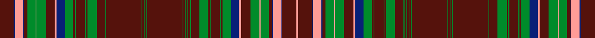

This is one **variant** — a specific cloth: this exact thread count and colourway, with its own
provenance below. It is one weaving of the [sett](/tartans/m/ma/macdonald-of-staffa-2/) (the scale-free proportion — the
same cloth at any scale or shade), whose colour order is pattern [BBYBBGYGBYBGBGBGBGBGBGBGBGBGBGBGBGBGBGBGBGBYBGYGBBYBBY](/stripes/bbybbgygbybgbgbgbgbgbgbgbgbgbgbgbgbgbgbgbgbybgygbbybby/).

Part of the [MacDonald of Staffa](/tartans/m/ma/macdonald-of-staffa-2/) tartan — the named design grouping this sett with its other cloths.

Sourced from register-of-tartans.  It is a [54 stripe tartan](/stripes/stripes54/).

Original link [https://www.tartanregister.gov.uk/tartanDetails.aspx?ref=5020](https://www.tartanregister.gov.uk/tartanDetails.aspx?ref=5020)

Dataset <small>— provenance for this record, inherited from the source manifest</small>

<dl class="dataset-prov">
<dt>source</dt><dd><a href="/sources/register-of-tartans/">Scottish Register of Tartans</a></dd>
<dt>data captured from</dt><dd><a href="https://github.com/thetartan/tartan-database/blob/master/data/register-of-tartans/data.csv">https://github.com/thetartan/tartan-database/blob/master/data/register-of-tartans/data.csv</a></dd>
<dt>data date</dt><dd>2017-01-06 <small>(dataset default)</small></dd>
<dt>licence</dt><dd><a href="https://www.tartanregister.gov.uk/copyright">Crown copyright</a></dd>
</dl>

Capture chain <small>— the hands this data passed through, oldest first; each capture carries its own licence</small>

<ol class="capture-chain">
<li><a href="https://www.tartanregister.gov.uk/">Scottish Register of Tartans</a> · <a href="https://www.tartanregister.gov.uk/copyright">Crown copyright</a> <small>the living register — still published by National Records of Scotland</small></li>
<li><a href="https://github.com/thetartan/tartan-database">thetartan/tartan-database</a> <small>2016-2017</small> · <a href="https://creativecommons.org/licenses/by-nc-nd/4.0/">CC BY-NC-ND 4.0</a> <small>Levko Kravets's frozen compilation — the capture we vendored, and where its CC licence text came from</small></li>
<li>this dictionary <small>captured 2026-06-10 · commit 5bf86c7566</small> <small>each re-capture is a git commit to data/sources</small></li>
</ol>

## Register references

External register numbers recorded for this tartan.

- Scottish Register of Tartans: [5020](https://www.tartanregister.gov.uk/tartanDetails.aspx?ref=5020)
- Scottish Tartans Authority (ITI): 3295

## Thread count
DR/34 DB2 LR20 DB2 DR8 G20 LR2 G22 DR22 LR4 DB20 G20 DR4 G2 DR22 G2 DR4 G22 DR20 G2 DR84 G2 DR4 G2 DR4 G2 DR84 G2 DR4 G2 DR4 G2 DR4 G2 DR20 G22 DR4 G2 DR22 G2 DR4 G20 DB20 LR4 DR22 G22 LR2 G20 DR8 DB2 LR20 DB2 DR34 LR/4

One full sett is **1386 threads**.

## Palette
<table><thead><tr><th>Colour</th><th>Shade</th><th>OKLCh</th></tr></thead><tbody><tr><td>DB</td><td><code style="background-color:#082077;">#082077</code> <small style="color:#888">#082077</small></td><td><small style="color:#888">oklch(30.0% 0.149 265.1)</small></td></tr><tr><td>DR</td><td><code style="background-color:#55120C;">#55120C</code> <small style="color:#888">#55120C</small></td><td><small style="color:#888">oklch(30.0% 0.099 29.3)</small></td></tr><tr><td>G</td><td><code style="background-color:#008B2A;">#008B2A</code> <small style="color:#888">#008B2A</small></td><td><small style="color:#888">oklch(55.4% 0.170 145.9)</small></td></tr><tr><td>LR</td><td><code style="background-color:#FF9C97;">#FF9C97</code> <small style="color:#888">#FF9C97</small></td><td><small style="color:#888">oklch(79.3% 0.119 23.2)</small></td></tr></tbody></table>

# Sample pattern

[Sample sheet (PDF)](swatch.pdf) — the woven sample, thread count and palette on one printable A4, rendered on demand (the same sheet the TTD print page downloads).

ID: /variants/s54/dr17db1lr10db1dr4g10lr1g11dr11lr2db10g10dr2g1dr11g1dr2g11dr10g1dr42g1dr2g1dr2g1dr42g1dr2g1dr2g1dr2g1dr10g11dr2g1dr11g1dr2g10db10lr2dr11g11lr1g10dr4db1lr10db1dr17lr2~x2/
