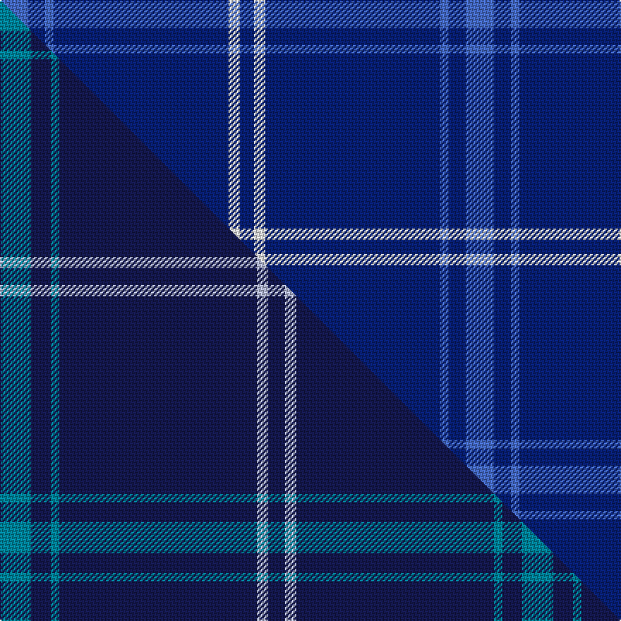

This is one **variant** — a specific cloth: this exact thread count and colourway, with its own
provenance below. It is one weaving of the [sett](/tartans/a/au/auchairne-2/) (the scale-free proportion — the
same cloth at any scale or shade), whose colour order is pattern [BBBBWB](/stripes/bbbbwb/).

Part of the [Auchairne](/tartans/a/au/auchairne-2/) tartan — the named design grouping this sett with its other cloths.

Sourced from weddslist.  It is a [6 stripe tartan](/stripes/stripes6/).

Original link [http://www.weddslist.com/cgi-bin/tartans/pg.pl?source=sts](http://www.weddslist.com/cgi-bin/tartans/pg.pl?source=sts)

Dataset <small>— provenance for this record, inherited from the source manifest</small>

<dl class="dataset-prov">
<dt>source</dt><dd><a href="/sources/weddslist/">Weddslist</a></dd>
<dt>data captured from</dt><dd><a href="https://github.com/thetartan/tartan-database/blob/master/data/weddslist/data.csv">https://github.com/thetartan/tartan-database/blob/master/data/weddslist/data.csv</a></dd>
<dt>data date</dt><dd>2016-11-17 <small>(dataset default)</small></dd>
<dt>licence</dt><dd><a href="https://creativecommons.org/licenses/by-nc-nd/4.0/">CC BY-NC-ND 4.0</a></dd>
</dl>

Capture chain <small>— the hands this data passed through, oldest first; each capture carries its own licence</small>

<ol class="capture-chain">
<li><a href="https://www.weddslist.com/tartans/">Weddslist</a> <small>the living privately compiled reference</small></li>
<li><a href="https://github.com/thetartan/tartan-database">thetartan/tartan-database</a> <small>2016-2017</small> · <a href="https://creativecommons.org/licenses/by-nc-nd/4.0/">CC BY-NC-ND 4.0</a> <small>Levko Kravets's frozen compilation — the capture we vendored, and where its CC licence text came from</small></li>
<li>this dictionary <small>captured 2026-06-10 · commit 5bf86c7566</small> <small>each re-capture is a git commit to data/sources</small></li>
</ol>

## Thread count
B/20 DB12 B6 DB124 W8 DB/10

One full sett is **330 threads**.

## Palette
<table><thead><tr><th>Colour</th><th>Shade</th><th>OKLCh</th></tr></thead><tbody><tr><td>B</td><td><code style="background-color:#466CC8;">#466CC8</code> <small style="color:#888">#466CC8</small></td><td><small style="color:#888">oklch(55.1% 0.149 265.0)</small></td></tr><tr><td>DB</td><td><code style="background-color:#082077;">#082077</code> <small style="color:#888">#082077</small></td><td><small style="color:#888">oklch(30.0% 0.149 265.1)</small></td></tr><tr><td>W</td><td><code style="background-color:#F7F7F7;">#F7F7F7</code> <small style="color:#888">#F7F7F7</small></td><td><small style="color:#888">oklch(97.6% 0.000 89.9)</small></td></tr></tbody></table>

# Sample pattern

[Sample sheet (PDF)](swatch.pdf) — the woven sample, thread count and palette on one printable A4, rendered on demand (the same sheet the TTD print page downloads).

## Compared to the master

This cloth is one sett of its design; the master sett (the exemplar the design is anchored on) is below for comparison.

Its **ΔTartan distance** from the master is **0.48** — the same measure the nearest-tartans table ranks by (0 is identical; a re-scale of the same cloth is near 0, a recolour or a different proportion further).

<figure class="master-compare" style="margin:0">

this sett
master sett ★

<figcaption style="color:#888;font-size:smaller">One weave of this sett against the <a href="/setts/t11db7t3db70lb4db6/">master sett ★</a>, split on the diagonal: a shared proportion runs seamlessly across it with only the shades shifting; a different proportion breaks on it.</figcaption>
</figure>

## Nearest tartan variants

The nearest existing variants by ΔTartan distance, with this cloth at the top so the swatches line up against it.

ΔTartan

Threads

Variant

Sett

—

330

<a href="/variants/s6/b10db6b3db62w4db5~x2/">Auchairne</a>

<a href="/ttd/edit/#slug=t11db7t3db70lb4db6~x2&amp;base=b10db6b3db62w4db5~x2" title="compare in the TTD">0.48</a>

370

<a href="/variants/s6/t11db7t3db70lb4db6~x2/">Auchairne (Corporate)</a>

<a href="/ttd/edit/#slug=t11db7t3db70lb4db6~x2~db2609279&amp;base=b10db6b3db62w4db5~x2" title="compare in the TTD">0.53</a>

370

<a href="/variants/s6/t11db7t3db70lb4db6~x2~db2609279/">Auchairne</a>

<a href="/ttd/edit/#slug=db16lb4db1lb2db24w1y4~x2&amp;base=b10db6b3db62w4db5~x2" title="compare in the TTD">0.76</a>

168

<a href="/variants/s7/db16lb4db1lb2db24w1y4~x2/">Talisker</a>

<a href="/ttd/edit/#slug=db9lb3db6lb3db20dy2~x2&amp;base=b10db6b3db62w4db5~x2" title="compare in the TTD">0.82</a>

150

<a href="/variants/s6/db9lb3db6lb3db20dy2~x2/">Oman RAF, Sultanate of (Military)</a>

<a href="/ttd/edit/#slug=db24lb6db10lb6db32dy3~x2&amp;base=b10db6b3db62w4db5~x2" title="compare in the TTD">0.83</a>

270

<a href="/variants/s6/db24lb6db10lb6db32dy3~x2/">Sultan of Qaboo's Air Force</a>

<a href="/ttd/edit/#slug=r3db2r1db18g1db2~x4&amp;base=b10db6b3db62w4db5~x2" title="compare in the TTD">1.07</a>

196

<a href="/variants/s6/r3db2r1db18g1db2~x4/">Lynch</a>

<a href="/ttd/edit/#slug=db19w6db105y4db5&amp;base=b10db6b3db62w4db5~x2" title="compare in the TTD">1.19</a>

254

<a href="/variants/s5/db19w6db105y4db5/">Greenock Morton F. C. (Corporate)</a>

<a href="/ttd/edit/#slug=dbi8w4db6dbi2db6n10db63w3~dbi3514276-db3409246&amp;base=b10db6b3db62w4db5~x2" title="compare in the TTD">1.19</a>

193

<a href="/variants/s8/dbi8w4db6dbi2db6n10db63w3~dbi3514276-db3409246/">Pride of the Clyde</a>

<a href="/ttd/edit/#slug=db4w3t6db40t8db12g3~x2&amp;base=b10db6b3db62w4db5~x2" title="compare in the TTD">1.27</a>

290

<a href="/variants/s7/db4w3t6db40t8db12g3~x2/">JetBlue (Corporate)</a>

<a href="/ttd/edit/#slug=db144dr9lb44db4lb4db4&amp;base=b10db6b3db62w4db5~x2" title="compare in the TTD">1.34</a>

270

<a href="/variants/s6/db144dr9lb44db4lb4db4/">United French Freemasons (Corporate</a>

## Neighbour map

Every grey dot is one of 13662 variants placed by the first two principal components of the ΔTartan feature space (42% of its variance). Red is this tartan; blue dots are its nearest — click one to open its page. The map is a flat projection of a many-dimensional space — [how to read it](/posts/neighbourhood-maps/).

<svg viewBox="0 0 640 380" role="img" style="max-width:100%;height:auto;border:1px solid #e0e0e0;border-radius:4px;display:block" xmlns="http://www.w3.org/2000/svg"><image href="/nn/cloud.v1.png" width="640" height="380"/><a href="/variants/s6/t11db7t3db70lb4db6~x2/"><circle cx="626.0" cy="201.1" r="4" fill="#3465a4"><title>Auchairne (Corporate)</title></circle></a><a href="/variants/s6/t11db7t3db70lb4db6~x2~db2609279/"><circle cx="626.0" cy="193.1" r="4" fill="#3465a4"><title>Auchairne</title></circle></a><a href="/variants/s7/db16lb4db1lb2db24w1y4~x2/"><circle cx="519.6" cy="165.5" r="4" fill="#3465a4"><title>Talisker</title></circle></a><a href="/variants/s6/db9lb3db6lb3db20dy2~x2/"><circle cx="534.2" cy="238.8" r="4" fill="#3465a4"><title>Oman RAF, Sultanate of (Military)</title></circle></a><a href="/variants/s6/db24lb6db10lb6db32dy3~x2/"><circle cx="529.3" cy="241.7" r="4" fill="#3465a4"><title>Sultan of Qaboo's Air Force</title></circle></a><a href="/variants/s6/r3db2r1db18g1db2~x4/"><circle cx="576.8" cy="173.3" r="4" fill="#3465a4"><title>Lynch</title></circle></a><a href="/variants/s5/db19w6db105y4db5/"><circle cx="626.0" cy="177.6" r="4" fill="#3465a4"><title>Greenock Morton F. C. (Corporate)</title></circle></a><a href="/variants/s8/dbi8w4db6dbi2db6n10db63w3~dbi3514276-db3409246/"><circle cx="564.7" cy="163.1" r="4" fill="#3465a4"><title>Pride of the Clyde</title></circle></a><a href="/variants/s7/db4w3t6db40t8db12g3~x2/"><circle cx="483.9" cy="196.1" r="4" fill="#3465a4"><title>JetBlue (Corporate)</title></circle></a><a href="/variants/s6/db144dr9lb44db4lb4db4/"><circle cx="539.1" cy="162.2" r="4" fill="#3465a4"><title>United French Freemasons (Corporate</title></circle></a><circle cx="623.2" cy="198.0" r="5" fill="#c00000"/><text x="320" y="376" text-anchor="middle" font-size="11" fill="#999">ground</text><text x="11" y="190" text-anchor="middle" font-size="11" fill="#999" transform="rotate(-90 11 190)">complexity</text></svg>

ID: /variants/s6/b10db6b3db62w4db5~x2/
