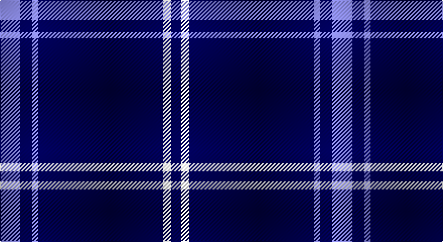

This page is one **sett** — a single exact thread-count. It belongs to the [tartan](/setts/b10db6b3db62w4db5/)
(the same proportion at any scale), whose colour order is pattern [BBBBWB](/stripes/bbbbwb/).

Part of the [Auchairne](/tartans/auchairne/) tartan — the named design grouping this sett with its other cloths.

Sourced from weddslist.  It is a [6 stripe tartan](/stripes/stripes6/).

Original link http://www.weddslist.com/cgi-bin/tartans/pg.pl?source=sts

## Also known as

This cloth is also recorded under:

- Auchairne Grey
- Auchairne grey
- Auchairne, Grey

## Thread count
B/20 DB12 B6 DB124 LN8 DB/10

One full sett is **330 threads**.

## Palette

Palette: <strong>Tartan Dictionary</strong> <small style="color:#888">(1 of 3 colours)</small>
<table><thead><tr><th>Colour</th><th>Threads</th><th>Shade</th><th>Base</th><th>OKLCh</th></tr></thead><tbody><tr><td>B/</td><td style="text-align:right;font-variant-numeric:tabular-nums">20</td><td><code style="background-color:#8080D0;">#8080D0</code> <small style="color:#888">#8080D0</small></td><td>B <code style="background-color:#2A418A;">#2A418A</code></td><td><small style="color:#888">oklch(63.4% 0.119 282.5)</small></td></tr><tr><td>DB</td><td style="text-align:right;font-variant-numeric:tabular-nums">12</td><td><code style="background-color:#000050;">#000050</code> <small style="color:#888">#000050</small></td><td>B <code style="background-color:#2A418A;">#2A418A</code></td><td><small style="color:#888">oklch(19.5% 0.135 264.1)</small></td></tr><tr><td>B</td><td style="text-align:right;font-variant-numeric:tabular-nums">6</td><td><code style="background-color:#8080D0;">#8080D0</code> <small style="color:#888">#8080D0</small></td><td>B <code style="background-color:#2A418A;">#2A418A</code></td><td><small style="color:#888">oklch(63.4% 0.119 282.5)</small></td></tr><tr><td>DB</td><td style="text-align:right;font-variant-numeric:tabular-nums">124</td><td><code style="background-color:#000050;">#000050</code> <small style="color:#888">#000050</small></td><td>B <code style="background-color:#2A418A;">#2A418A</code></td><td><small style="color:#888">oklch(19.5% 0.135 264.1)</small></td></tr><tr><td>LN</td><td style="text-align:right;font-variant-numeric:tabular-nums">8</td><td><code style="background-color:#E0E0E0;">#E0E0E0</code> <small style="color:#888">#E0E0E0</small></td><td>W <code style="background-color:#F7F7F7;">#F7F7F7</code></td><td><small style="color:#888">oklch(90.7% 0.000 89.9)</small></td></tr><tr><td>DB/</td><td style="text-align:right;font-variant-numeric:tabular-nums">10</td><td><code style="background-color:#000050;">#000050</code> <small style="color:#888">#000050</small></td><td>B <code style="background-color:#2A418A;">#2A418A</code></td><td><small style="color:#888">oklch(19.5% 0.135 264.1)</small></td></tr></tbody></table>

# Sample pattern

## Compared to the master

This cloth is one sett of its design; the master sett (the exemplar the design is anchored on) is below for comparison.

<figure style="margin:0"><figcaption style="color:#888;font-size:smaller">this sett</figcaption></figure>
<figure style="margin:0"><figcaption style="color:#888;font-size:smaller"><a href="/setts/r13o3r4o56n4o4/">master sett →</a></figcaption></figure>

## Nearest tartans

The nearest existing variants by ΔTartan distance, with this tartan at the top so the swatches line up against it.

ΔTartan

Tartan

Sett

—

<a href="/ttd/edit/#slug=b10db6b3db62w4db5~x2">Auchairne</a> <a class="nn-out" href="/variants/s6/b10db6b3db62w4db5~x2/" title="open its dictionary page">↗</a>

1.20

<a href="/ttd/edit/#slug=db32r3db4k1ly3&amp;base=b10db6b3db62w4db5~x2">MacLaine of Lochbuie Hunting</a> <a class="nn-out" href="/variants/s5/db32r3db4k1ly3/" title="open its dictionary page">↗</a>

1.44

<a href="/ttd/edit/#slug=db61r6w2r8lo2db3lo2db15~x2&amp;base=b10db6b3db62w4db5~x2">Duke of York (Royal)</a> <a class="nn-out" href="/variants/s8/db61r6w2r8lo2db3lo2db15~x2/" title="open its dictionary page">↗</a>

1.53

<a href="/ttd/edit/#slug=db100y10k5y10r8&amp;base=b10db6b3db62w4db5~x2">Waugh</a> <a class="nn-out" href="/variants/s5/db100y10k5y10r8/" title="open its dictionary page">↗</a>

1.56

<a href="/ttd/edit/#slug=db12lb1k2db1r1~x8&amp;base=b10db6b3db62w4db5~x2">Lochcarron (1985)</a> <a class="nn-out" href="/variants/s5/db12lb1k2db1r1~x8/" title="open its dictionary page">↗</a>

1.72

<a href="/ttd/edit/#slug=db100t10k5t10r8&amp;base=b10db6b3db62w4db5~x2">Waugh (Name)</a> <a class="nn-out" href="/variants/s5/db100t10k5t10r8/" title="open its dictionary page">↗</a>

1.74

<a href="/ttd/edit/#slug=b11db7b3db70lb4db6~x2&amp;base=b10db6b3db62w4db5~x2">Auchairne (Corporate)</a> <a class="nn-out" href="/variants/s6/b11db7b3db70lb4db6~x2/" title="open its dictionary page">↗</a>

1.77

<a href="/ttd/edit/#slug=db6w4db3w6db8ly3db52ly3db8r4&amp;base=b10db6b3db62w4db5~x2">Dundee F.C.</a> <a class="nn-out" href="/variants/s10/db6w4db3w6db8ly3db52ly3db8r4/" title="open its dictionary page">↗</a>

1.84

<a href="/ttd/edit/#slug=db66w2db10w2db10w2db12r3t24~x2&amp;base=b10db6b3db62w4db5~x2">RAAF</a> <a class="nn-out" href="/variants/s9/db66w2db10w2db10w2db12r3t24~x2/" title="open its dictionary page">↗</a>

1.87

<a href="/ttd/edit/#slug=db35w4db10m3r3m3~x4&amp;base=b10db6b3db62w4db5~x2">Steffen, Markus (Personal)</a> <a class="nn-out" href="/variants/s6/db35w4db10m3r3m3~x4/" title="open its dictionary page">↗</a>

1.90

<a href="/ttd/edit/#slug=r5w4k4db80w4~x2&amp;base=b10db6b3db62w4db5~x2">Volunteer Lifesaving Corps (Corp.)</a> <a class="nn-out" href="/variants/s5/r5w4k4db80w4~x2/" title="open its dictionary page">↗</a>

## Neighbour map

Every grey dot is one of 14360 variants placed by the first two principal components of the ΔTartan feature space (44% of its variance). Red is this tartan; blue dots are its nearest — click one to open its page.

<svg viewBox="0 0 640 380" role="img" style="max-width:100%;height:auto;border:1px solid #e0e0e0;border-radius:4px;display:block" xmlns="http://www.w3.org/2000/svg"><image href="/nn/cloud.v1.png" width="640" height="380"/><a href="/variants/s5/db32r3db4k1ly3/"><circle cx="574.8" cy="166.1" r="4" fill="#3465a4"><title>MacLaine of Lochbuie Hunting</title></circle></a><a href="/variants/s8/db61r6w2r8lo2db3lo2db15~x2/"><circle cx="550.3" cy="141.9" r="4" fill="#3465a4"><title>Duke of York (Royal)</title></circle></a><a href="/variants/s5/db100y10k5y10r8/"><circle cx="500.7" cy="185.1" r="4" fill="#3465a4"><title>Waugh</title></circle></a><a href="/variants/s5/db12lb1k2db1r1~x8/"><circle cx="475.1" cy="204.9" r="4" fill="#3465a4"><title>Lochcarron (1985)</title></circle></a><a href="/variants/s5/db100t10k5t10r8/"><circle cx="511.7" cy="184.0" r="4" fill="#3465a4"><title>Waugh (Name)</title></circle></a><a href="/variants/s6/b11db7b3db70lb4db6~x2/"><circle cx="612.6" cy="198.8" r="4" fill="#3465a4"><title>Auchairne (Corporate)</title></circle></a><a href="/variants/s10/db6w4db3w6db8ly3db52ly3db8r4/"><circle cx="480.9" cy="138.0" r="4" fill="#3465a4"><title>Dundee F.C.</title></circle></a><a href="/variants/s9/db66w2db10w2db10w2db12r3t24~x2/"><circle cx="494.1" cy="134.1" r="4" fill="#3465a4"><title>RAAF</title></circle></a><a href="/variants/s6/db35w4db10m3r3m3~x4/"><circle cx="466.0" cy="193.7" r="4" fill="#3465a4"><title>Steffen, Markus (Personal)</title></circle></a><a href="/variants/s5/r5w4k4db80w4~x2/"><circle cx="560.8" cy="163.3" r="4" fill="#3465a4"><title>Volunteer Lifesaving Corps (Corp.)</title></circle></a><circle cx="552.3" cy="185.8" r="5" fill="#c00000"/></svg>

ID: /variants/s6/b10db6b3db62w4db5~x2/
