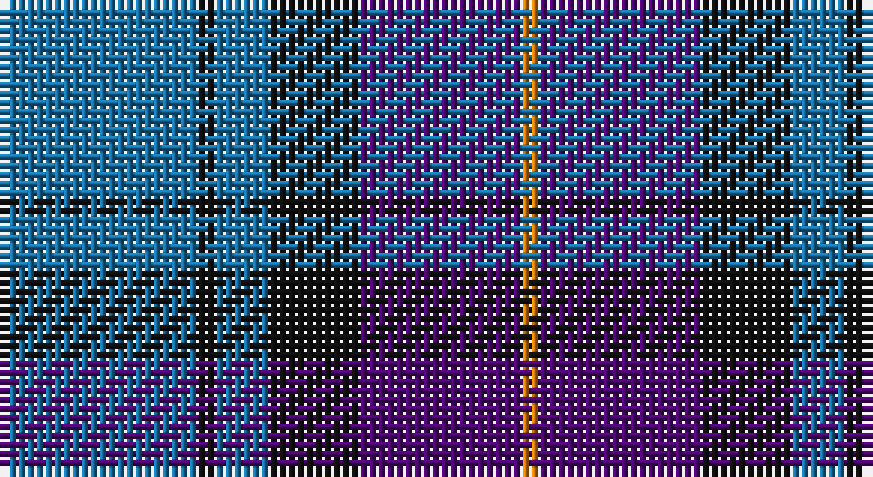

This page is one **sett** — a single exact thread-count. It belongs to the [tartan](/setts/b11k1b3k5dp9lo1/)
(the same proportion at any scale), whose colour order is pattern [BKBKBY](/stripes/bkbkby/).

Sourced from house-of-tartan.  It is a [6 stripe tartan](/stripes/stripes6/).

Original link http://www.house-of-tartan.scotland.net/house/TartanViewjs.asp?colr=Def&tnam=6769

## Provenance

Earliest known date: 2005 I have a photo of a fabric swatch that I am trying to match as close as possible. I have been commissioned to make a life size mannequin of Jack Nicholson as the Joker and he wore plaid/tartan pants. I could send you some photos through email and possibly you could help me. Thanks, Andy Garringer USA, January 2008. (96 threads @ 40 epi heavyweight = 2.5 inch repeat)

## Thread count
B/22 K2 B6 K10 P18 O/2

One full sett is **96 threads**.

## Palette

Palette: <strong>Tartan Register</strong> <small style="color:#888">(3 of 4 colours)</small>
<table><thead><tr><th>Colour</th><th>Threads</th><th>Shade</th><th>Base</th><th>OKLCh</th></tr></thead><tbody><tr><td>B/</td><td style="text-align:right;font-variant-numeric:tabular-nums">22</td><td><code style="background-color:#1870A4;">#1870A4</code> <small style="color:#888">#1870A4</small></td><td>B <code style="background-color:#2A418A;">#2A418A</code></td><td><small style="color:#888">oklch(52.2% 0.113 241.2)</small></td></tr><tr><td>K</td><td style="text-align:right;font-variant-numeric:tabular-nums">2</td><td><code style="background-color:#101010;">#101010</code> <small style="color:#888">#101010</small></td><td>K <code style="background-color:#000000;">#000000</code></td><td><small style="color:#888">oklch(17.3% 0.000 89.9)</small></td></tr><tr><td>B</td><td style="text-align:right;font-variant-numeric:tabular-nums">6</td><td><code style="background-color:#1870A4;">#1870A4</code> <small style="color:#888">#1870A4</small></td><td>B <code style="background-color:#2A418A;">#2A418A</code></td><td><small style="color:#888">oklch(52.2% 0.113 241.2)</small></td></tr><tr><td>K</td><td style="text-align:right;font-variant-numeric:tabular-nums">10</td><td><code style="background-color:#101010;">#101010</code> <small style="color:#888">#101010</small></td><td>K <code style="background-color:#000000;">#000000</code></td><td><small style="color:#888">oklch(17.3% 0.000 89.9)</small></td></tr><tr><td>P</td><td style="text-align:right;font-variant-numeric:tabular-nums">18</td><td><code style="background-color:#4C0470;">#4C0470</code> <small style="color:#888">#4C0470</small></td><td>B <code style="background-color:#2A418A;">#2A418A</code></td><td><small style="color:#888">oklch(32.5% 0.161 309.1)</small></td></tr><tr><td>O/</td><td style="text-align:right;font-variant-numeric:tabular-nums">2</td><td><code style="background-color:#D87C00;">#D87C00</code> <small style="color:#888">#D87C00</small></td><td>Y <code style="background-color:#F2BF00;">#F2BF00</code></td><td><small style="color:#888">oklch(67.3% 0.155 61.8)</small></td></tr></tbody></table>

# Sample pattern

## Nearest tartans

The nearest existing variants by ΔTartan distance, with this tartan at the top so the swatches line up against it.

ΔTartan

Tartan

Sett

—

<a href="/ttd/edit/#slug=b11k1b3k5dp9lo1~x2">Joker Fancy Tartan</a> <a class="nn-out" href="/variants/s6/b11k1b3k5dp9lo1~x2/" title="open its dictionary page">↗</a>

0.98

<a href="/ttd/edit/#slug=r8b32k24db24k3b3~x2&amp;base=b11k1b3k5dp9lo1~x2">MacCorquodale #2</a> <a class="nn-out" href="/variants/s6/r8b32k24db24k3b3~x2/" title="open its dictionary page">↗</a>

1.00

<a href="/ttd/edit/#slug=b18k2b4k6dp12lo1~x2&amp;base=b11k1b3k5dp9lo1~x2">Joker, The</a> <a class="nn-out" href="/variants/s6/b18k2b4k6dp12lo1~x2/" title="open its dictionary page">↗</a>

1.02

<a href="/ttd/edit/#slug=n6k6n21k16db36ly4&amp;base=b11k1b3k5dp9lo1~x2">Bareback (Corporate)</a> <a class="nn-out" href="/variants/s6/n6k6n21k16db36ly4/" title="open its dictionary page">↗</a>

1.05

<a href="/ttd/edit/#slug=db40k4db12k21g27w4~x2&amp;base=b11k1b3k5dp9lo1~x2">Granger (Personal)</a> <a class="nn-out" href="/variants/s6/db40k4db12k21g27w4~x2/" title="open its dictionary page">↗</a>

1.08

<a href="/ttd/edit/#slug=db23dp2g11dp24lb3~x2&amp;base=b11k1b3k5dp9lo1~x2">Scottish Open Squash (Corporate)</a> <a class="nn-out" href="/variants/s5/db23dp2g11dp24lb3~x2/" title="open its dictionary page">↗</a>

1.16

<a href="/ttd/edit/#slug=r21db43dt86lb10&amp;base=b11k1b3k5dp9lo1~x2">Fong (Personal)</a> <a class="nn-out" href="/variants/s4/r21db43dt86lb10/" title="open its dictionary page">↗</a>

1.22

<a href="/ttd/edit/#slug=k15r8ly2db25k5db13k5~x2&amp;base=b11k1b3k5dp9lo1~x2">Gifford (Personal)</a> <a class="nn-out" href="/variants/s7/k15r8ly2db25k5db13k5~x2/" title="open its dictionary page">↗</a>

1.23

<a href="/ttd/edit/#slug=db6w3db21k16dp6k3dp6~x2&amp;base=b11k1b3k5dp9lo1~x2">Heritage of Scotland</a> <a class="nn-out" href="/variants/s7/db6w3db21k16dp6k3dp6~x2/" title="open its dictionary page">↗</a>

1.24

<a href="/ttd/edit/#slug=db3g21db3o21db35w3~x2&amp;base=b11k1b3k5dp9lo1~x2">Donnolly</a> <a class="nn-out" href="/variants/s6/db3g21db3o21db35w3~x2/" title="open its dictionary page">↗</a>

1.26

<a href="/ttd/edit/#slug=b30k12dt12k2w3~x2&amp;base=b11k1b3k5dp9lo1~x2">MacNeil - 1994 (Personal)</a> <a class="nn-out" href="/variants/s5/b30k12dt12k2w3~x2/" title="open its dictionary page">↗</a>

## Neighbour map

Every grey dot is one of 14360 variants placed by the first two principal components of the ΔTartan feature space (44% of its variance). Red is this tartan; blue dots are its nearest — click one to open its page.

<svg viewBox="0 0 640 380" role="img" style="max-width:100%;height:auto;border:1px solid #e0e0e0;border-radius:4px;display:block" xmlns="http://www.w3.org/2000/svg"><image href="/nn/cloud.v1.png" width="640" height="380"/><a href="/variants/s6/r8b32k24db24k3b3~x2/"><circle cx="200.8" cy="229.8" r="4" fill="#3465a4"><title>MacCorquodale #2</title></circle></a><a href="/variants/s6/b18k2b4k6dp12lo1~x2/"><circle cx="306.2" cy="200.1" r="4" fill="#3465a4"><title>Joker, The</title></circle></a><a href="/variants/s6/n6k6n21k16db36ly4/"><circle cx="233.0" cy="241.5" r="4" fill="#3465a4"><title>Bareback (Corporate)</title></circle></a><a href="/variants/s6/db40k4db12k21g27w4~x2/"><circle cx="253.8" cy="239.6" r="4" fill="#3465a4"><title>Granger (Personal)</title></circle></a><a href="/variants/s5/db23dp2g11dp24lb3~x2/"><circle cx="258.6" cy="240.6" r="4" fill="#3465a4"><title>Scottish Open Squash (Corporate)</title></circle></a><a href="/variants/s4/r21db43dt86lb10/"><circle cx="291.7" cy="258.7" r="4" fill="#3465a4"><title>Fong (Personal)</title></circle></a><a href="/variants/s7/k15r8ly2db25k5db13k5~x2/"><circle cx="299.5" cy="226.1" r="4" fill="#3465a4"><title>Gifford (Personal)</title></circle></a><a href="/variants/s7/db6w3db21k16dp6k3dp6~x2/"><circle cx="226.1" cy="237.7" r="4" fill="#3465a4"><title>Heritage of Scotland</title></circle></a><a href="/variants/s6/db3g21db3o21db35w3~x2/"><circle cx="264.6" cy="208.1" r="4" fill="#3465a4"><title>Donnolly</title></circle></a><a href="/variants/s5/b30k12dt12k2w3~x2/"><circle cx="280.1" cy="212.0" r="4" fill="#3465a4"><title>MacNeil - 1994 (Personal)</title></circle></a><circle cx="263.6" cy="229.4" r="5" fill="#c00000"/></svg>

ID: /variants/s6/b11k1b3k5dp9lo1~x2/
