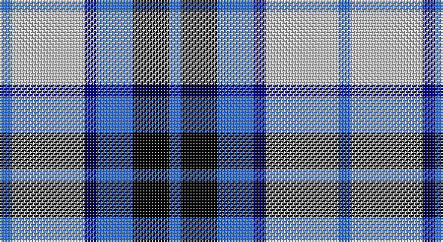

This page is one **sett** — a single exact thread-count. It belongs to the [tartan](/setts/b1lb6db1b3k3b1/)
(the same proportion at any scale), whose colour order is pattern [BKBBWB](/stripes/bkbbwb/).

Part of the [Thompson](/tartans/thompson/) tartan — the named design grouping this sett with its other cloths.

Sourced from tartans-authority.  It is a [6 stripe tartan](/stripes/stripes6/).

Original link http://www.tartansauthority.com/tartan-ferret/display/5132/

## Also known as

This cloth is also recorded under:

- Thompson Grey
- Thompson Grey Small
- Thompson, D.C.

## Register references

External register numbers recorded for this tartan.

- Scottish Tartans Authority (ITI): 5132

## Thread count
B/8 N48 DB8 B24 K24 B/8

One full sett is **224 threads**.

## Palette

Palette: <strong>Tartan Register</strong> <small style="color:#888">(3 of 4 colours)</small>
<table><thead><tr><th>Colour</th><th>Threads</th><th>Shade</th><th>Base</th><th>OKLCh</th></tr></thead><tbody><tr><td>B/</td><td style="text-align:right;font-variant-numeric:tabular-nums">8</td><td><code style="background-color:#3474FC;">#3474FC</code> <small style="color:#888">#3474FC</small></td><td>B <code style="background-color:#2A418A;">#2A418A</code></td><td><small style="color:#888">oklch(59.7% 0.214 262.7)</small></td></tr><tr><td>N</td><td style="text-align:right;font-variant-numeric:tabular-nums">48</td><td><code style="background-color:#C8C8C8;">#C8C8C8</code> <small style="color:#888">#C8C8C8</small></td><td>W <code style="background-color:#F7F7F7;">#F7F7F7</code></td><td><small style="color:#888">oklch(83.3% 0.000 89.9)</small></td></tr><tr><td>DB</td><td style="text-align:right;font-variant-numeric:tabular-nums">8</td><td><code style="background-color:#00008C;">#00008C</code> <small style="color:#888">#00008C</small></td><td>B <code style="background-color:#2A418A;">#2A418A</code></td><td><small style="color:#888">oklch(28.9% 0.200 264.1)</small></td></tr><tr><td>B</td><td style="text-align:right;font-variant-numeric:tabular-nums">24</td><td><code style="background-color:#3474FC;">#3474FC</code> <small style="color:#888">#3474FC</small></td><td>B <code style="background-color:#2A418A;">#2A418A</code></td><td><small style="color:#888">oklch(59.7% 0.214 262.7)</small></td></tr><tr><td>K</td><td style="text-align:right;font-variant-numeric:tabular-nums">24</td><td><code style="background-color:#000000;">#000000</code> <small style="color:#888">#000000</small></td><td>K <code style="background-color:#000000;">#000000</code></td><td><small style="color:#888">oklch(0.0% 0.000 0.0)</small></td></tr><tr><td>B/</td><td style="text-align:right;font-variant-numeric:tabular-nums">8</td><td><code style="background-color:#3474FC;">#3474FC</code> <small style="color:#888">#3474FC</small></td><td>B <code style="background-color:#2A418A;">#2A418A</code></td><td><small style="color:#888">oklch(59.7% 0.214 262.7)</small></td></tr></tbody></table>

# Sample pattern

## Compared to the master

This cloth is one sett of its design; the master sett (the exemplar the design is anchored on) is below for comparison.

<figure style="margin:0"><figcaption style="color:#888;font-size:smaller">this sett</figcaption></figure>
<figure style="margin:0"><figcaption style="color:#888;font-size:smaller"><a href="/setts/b15w13dy6b2dy2r2dy2b2dy6w13b15r3/">master sett →</a></figcaption></figure>

## Nearest tartans

The nearest existing variants by ΔTartan distance, with this tartan at the top so the swatches line up against it.

ΔTartan

Tartan

Sett

—

<a href="/ttd/edit/#slug=b1lb6db1b3k3b1~x8">Thompson (Dance)</a> <a class="nn-out" href="/variants/s6/b1lb6db1b3k3b1~x8/" title="open its dictionary page">↗</a>

0.91

<a href="/ttd/edit/#slug=k4db2k15w10b15db2b4~x2&amp;base=b1lb6db1b3k3b1~x8">Strathclyde</a> <a class="nn-out" href="/variants/s7/k4db2k15w10b15db2b4~x2/" title="open its dictionary page">↗</a>

1.04

<a href="/variants/s7/k2b16w2ki16w15k2w2~x2/">Strathclyde</a>

1.25

<a href="/ttd/edit/#slug=db2lb4k2lb1db4k1db1g1~x4&amp;base=b1lb6db1b3k3b1~x8">Culloden - 1977 (Fashion)</a> <a class="nn-out" href="/variants/s8/db2lb4k2lb1db4k1db1g1~x4/" title="open its dictionary page">↗</a>

1.28

<a href="/ttd/edit/#slug=dbi1g7dbi7db2w6dbi1w1~x4&amp;base=b1lb6db1b3k3b1~x8">Blue Boy, The (Fashion)</a> <a class="nn-out" href="/variants/s7/dbi1g7dbi7db2w6dbi1w1~x4/" title="open its dictionary page">↗</a>

1.29

<a href="/ttd/edit/#slug=ly2b9r2db6ly1r1~x4&amp;base=b1lb6db1b3k3b1~x8">Lauder Primary School</a> <a class="nn-out" href="/variants/s6/ly2b9r2db6ly1r1~x4/" title="open its dictionary page">↗</a>

1.31

<a href="/ttd/edit/#slug=k2lb16w2db16w15k2w2~x2&amp;base=b1lb6db1b3k3b1~x8">Strathclyde 1975 (District)</a> <a class="nn-out" href="/variants/s7/k2lb16w2db16w15k2w2~x2/" title="open its dictionary page">↗</a>

1.35

<a href="/ttd/edit/#slug=r3db15w13o6db2o2r2~x2&amp;base=b1lb6db1b3k3b1~x8">Thom(p)son, Navy</a> <a class="nn-out" href="/variants/s7/r3db15w13o6db2o2r2~x2/" title="open its dictionary page">↗</a>

1.40

<a href="/ttd/edit/#slug=w20db14dt14w4dbi2b2dt7~x2&amp;base=b1lb6db1b3k3b1~x8">Earl of St. Andrews Dress</a> <a class="nn-out" href="/variants/s7/w20db14dt14w4dbi2b2dt7~x2/" title="open its dictionary page">↗</a>

1.42

<a href="/ttd/edit/#slug=lb7k2w2k2w2k2lb7t4k10w2~x4&amp;base=b1lb6db1b3k3b1~x8">Investors Group</a> <a class="nn-out" href="/variants/s10/lb7k2w2k2w2k2lb7t4k10w2~x4/" title="open its dictionary page">↗</a>

1.42

<a href="/ttd/edit/#slug=r15w10db48t32r6~x2&amp;base=b1lb6db1b3k3b1~x8">Lands of Liberty (Fashion)</a> <a class="nn-out" href="/variants/s5/r15w10db48t32r6~x2/" title="open its dictionary page">↗</a>

## Neighbour map

Every grey dot is one of 14360 variants placed by the first two principal components of the ΔTartan feature space (44% of its variance). Red is this tartan; blue dots are its nearest — click one to open its page.

<svg viewBox="0 0 640 380" role="img" style="max-width:100%;height:auto;border:1px solid #e0e0e0;border-radius:4px;display:block" xmlns="http://www.w3.org/2000/svg"><image href="/nn/cloud.v1.png" width="640" height="380"/><a href="/variants/s7/k4db2k15w10b15db2b4~x2/"><circle cx="129.3" cy="208.9" r="4" fill="#3465a4"><title>Strathclyde</title></circle></a><a href="/variants/s7/k2b16w2ki16w15k2w2~x2/"><circle cx="128.7" cy="189.2" r="4" fill="#3465a4"><title>Strathclyde</title></circle></a><a href="/variants/s8/db2lb4k2lb1db4k1db1g1~x4/"><circle cx="124.0" cy="237.0" r="4" fill="#3465a4"><title>Culloden - 1977 (Fashion)</title></circle></a><a href="/variants/s7/dbi1g7dbi7db2w6dbi1w1~x4/"><circle cx="115.9" cy="203.8" r="4" fill="#3465a4"><title>Blue Boy, The (Fashion)</title></circle></a><a href="/variants/s6/ly2b9r2db6ly1r1~x4/"><circle cx="177.9" cy="195.9" r="4" fill="#3465a4"><title>Lauder Primary School</title></circle></a><a href="/variants/s7/k2lb16w2db16w15k2w2~x2/"><circle cx="127.8" cy="177.2" r="4" fill="#3465a4"><title>Strathclyde 1975 (District)</title></circle></a><a href="/variants/s7/r3db15w13o6db2o2r2~x2/"><circle cx="151.2" cy="190.0" r="4" fill="#3465a4"><title>Thom(p)son, Navy</title></circle></a><a href="/variants/s7/w20db14dt14w4dbi2b2dt7~x2/"><circle cx="128.5" cy="172.8" r="4" fill="#3465a4"><title>Earl of St. Andrews Dress</title></circle></a><a href="/variants/s10/lb7k2w2k2w2k2lb7t4k10w2~x4/"><circle cx="118.9" cy="201.5" r="4" fill="#3465a4"><title>Investors Group</title></circle></a><a href="/variants/s5/r15w10db48t32r6~x2/"><circle cx="185.6" cy="224.2" r="4" fill="#3465a4"><title>Lands of Liberty (Fashion)</title></circle></a><circle cx="134.2" cy="216.0" r="5" fill="#c00000"/></svg>

ID: /variants/s6/b1lb6db1b3k3b1~x8/
