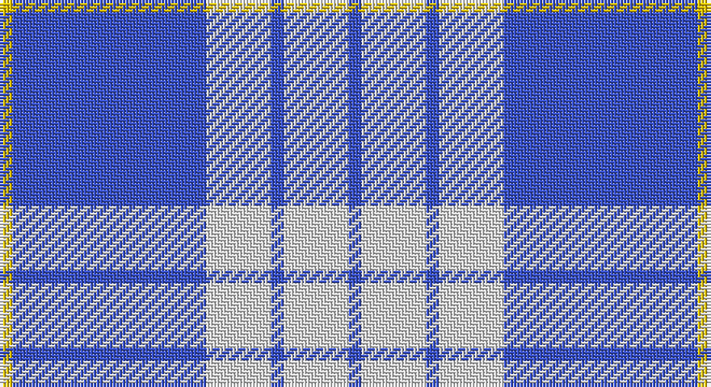

This page is one **sett** — a single exact thread-count. It belongs to the [tartan](/setts/b1w5b1w5b15ly1/)
(the same proportion at any scale), whose colour order is pattern [BWBWBY](/stripes/bwbwby/).

Sourced from register-of-tartans.  It is a [6 stripe tartan](/stripes/stripes6/).

Original link https://www.tartanregister.gov.uk/tartanDetails.aspx?ref=4616

2 attestations — the source records this cloth was collapsed from (oldest owns this page)

<ul>
<li>01/01/2007 — Whitley (Personal) (register-of-tartans, <a href="https://www.tartanregister.gov.uk/tartanDetails.aspx?ref=4616">record</a>)</li>
<li>pre 2007 — Whitley (Personal) (tartans-authority, <a href="http://www.tartansauthority.com/tartan-ferret/display/7233/">record</a>)</li>
</ul>

## Register references

External register numbers recorded for this tartan.

- Scottish Register of Tartans: [4616](https://www.tartanregister.gov.uk/tartanDetails.aspx?ref=4616)
- Scottish Tartans Authority (ITI): 7233

## Thread count
Y/4 B60 LN20 B4 LN20 B/4

One full sett is **216 threads**.

## Palette

Palette: <strong>Tartan Register</strong>
<table><thead><tr><th>Colour</th><th>Threads</th><th>Shade</th><th>Base</th><th>OKLCh</th></tr></thead><tbody><tr><td>Y/</td><td style="text-align:right;font-variant-numeric:tabular-nums">4</td><td><code style="background-color:#E8C000;">#E8C000</code> <small style="color:#888">#E8C000</small></td><td>Y <code style="background-color:#F2BF00;">#F2BF00</code></td><td><small style="color:#888">oklch(81.9% 0.168 93.7)</small></td></tr><tr><td>B</td><td style="text-align:right;font-variant-numeric:tabular-nums">60</td><td><code style="background-color:#3850C8;">#3850C8</code> <small style="color:#888">#3850C8</small></td><td>B <code style="background-color:#2A418A;">#2A418A</code></td><td><small style="color:#888">oklch(48.8% 0.188 269.4)</small></td></tr><tr><td>LN</td><td style="text-align:right;font-variant-numeric:tabular-nums">20</td><td><code style="background-color:#E0E0E0;">#E0E0E0</code> <small style="color:#888">#E0E0E0</small></td><td>W <code style="background-color:#F7F7F7;">#F7F7F7</code></td><td><small style="color:#888">oklch(90.7% 0.000 89.9)</small></td></tr><tr><td>B</td><td style="text-align:right;font-variant-numeric:tabular-nums">4</td><td><code style="background-color:#3850C8;">#3850C8</code> <small style="color:#888">#3850C8</small></td><td>B <code style="background-color:#2A418A;">#2A418A</code></td><td><small style="color:#888">oklch(48.8% 0.188 269.4)</small></td></tr><tr><td>LN</td><td style="text-align:right;font-variant-numeric:tabular-nums">20</td><td><code style="background-color:#E0E0E0;">#E0E0E0</code> <small style="color:#888">#E0E0E0</small></td><td>W <code style="background-color:#F7F7F7;">#F7F7F7</code></td><td><small style="color:#888">oklch(90.7% 0.000 89.9)</small></td></tr><tr><td>B/</td><td style="text-align:right;font-variant-numeric:tabular-nums">4</td><td><code style="background-color:#3850C8;">#3850C8</code> <small style="color:#888">#3850C8</small></td><td>B <code style="background-color:#2A418A;">#2A418A</code></td><td><small style="color:#888">oklch(48.8% 0.188 269.4)</small></td></tr></tbody></table>

# Sample pattern

## Nearest tartans

The nearest existing variants by ΔTartan distance, with this tartan at the top so the swatches line up against it.

ΔTartan

Tartan

Sett

—

<a href="/ttd/edit/#slug=b1w5b1w5b15ly1~x4">Whitley (Personal)</a> <a class="nn-out" href="/variants/s6/b1w5b1w5b15ly1~x4/" title="open its dictionary page">↗</a>

1.03

<a href="/ttd/edit/#slug=b13w3b1k3w1~x6&amp;base=b1w5b1w5b15ly1~x4">Loch Lomond #2</a> <a class="nn-out" href="/variants/s5/b13w3b1k3w1~x6/" title="open its dictionary page">↗</a>

1.14

<a href="/ttd/edit/#slug=t37w9t3db9w3~x2&amp;base=b1w5b1w5b15ly1~x4">Loch Lomond</a> <a class="nn-out" href="/variants/s5/t37w9t3db9w3~x2/" title="open its dictionary page">↗</a>

1.30

<a href="/ttd/edit/#slug=b11lo2r1lo2r1~x4&amp;base=b1w5b1w5b15ly1~x4">Carlisle Ancient</a> <a class="nn-out" href="/variants/s5/b11lo2r1lo2r1~x4/" title="open its dictionary page">↗</a>

1.35

<a href="/ttd/edit/#slug=ly2lb2db3lb30db4lb3db4lb3db18lb2~x2&amp;base=b1w5b1w5b15ly1~x4">Traynor</a> <a class="nn-out" href="/variants/s10/ly2lb2db3lb30db4lb3db4lb3db18lb2~x2/" title="open its dictionary page">↗</a>

1.36

<a href="/ttd/edit/#slug=db26lp11db3lp4k2~x4&amp;base=b1w5b1w5b15ly1~x4">Debbie Munro Memorial (Corporate)</a> <a class="nn-out" href="/variants/s5/db26lp11db3lp4k2~x4/" title="open its dictionary page">↗</a>

1.39

<a href="/ttd/edit/#slug=b33lo6r3lo6k3lo15b32~x4&amp;base=b1w5b1w5b15ly1~x4">Carlisle Family (Name)</a> <a class="nn-out" href="/variants/s7/b33lo6r3lo6k3lo15b32~x4/" title="open its dictionary page">↗</a>

1.47

<a href="/ttd/edit/#slug=db9lb27db2k4db2lb10db2w3~x2&amp;base=b1w5b1w5b15ly1~x4">Alaska Highlanders Pipes &amp; Drums Corporate Tartan</a> <a class="nn-out" href="/variants/s8/db9lb27db2k4db2lb10db2w3~x2/" title="open its dictionary page">↗</a>

1.61

<a href="/ttd/edit/#slug=ly5db15lb5db5lb40ly3~x2&amp;base=b1w5b1w5b15ly1~x4">Legary</a> <a class="nn-out" href="/variants/s6/ly5db15lb5db5lb40ly3~x2/" title="open its dictionary page">↗</a>

1.61

<a href="/ttd/edit/#slug=db9lb27db2ly4db2lb10db2w3~x2&amp;base=b1w5b1w5b15ly1~x4">Alaska Highlanders P &amp; D (Corporate)</a> <a class="nn-out" href="/variants/s8/db9lb27db2ly4db2lb10db2w3~x2/" title="open its dictionary page">↗</a>

1.62

<a href="/ttd/edit/#slug=b26w28b14ly3k1ly2k1~x2&amp;base=b1w5b1w5b15ly1~x4">Gothenburg</a> <a class="nn-out" href="/variants/s7/b26w28b14ly3k1ly2k1~x2/" title="open its dictionary page">↗</a>

## Neighbour map

Every grey dot is one of 14360 variants placed by the first two principal components of the ΔTartan feature space (44% of its variance). Red is this tartan; blue dots are its nearest — click one to open its page.

<svg viewBox="0 0 640 380" role="img" style="max-width:100%;height:auto;border:1px solid #e0e0e0;border-radius:4px;display:block" xmlns="http://www.w3.org/2000/svg"><image href="/nn/cloud.v1.png" width="640" height="380"/><a href="/variants/s5/b13w3b1k3w1~x6/"><circle cx="374.5" cy="197.5" r="4" fill="#3465a4"><title>Loch Lomond #2</title></circle></a><a href="/variants/s5/t37w9t3db9w3~x2/"><circle cx="381.7" cy="206.8" r="4" fill="#3465a4"><title>Loch Lomond</title></circle></a><a href="/variants/s5/b11lo2r1lo2r1~x4/"><circle cx="395.7" cy="210.1" r="4" fill="#3465a4"><title>Carlisle Ancient</title></circle></a><a href="/variants/s10/ly2lb2db3lb30db4lb3db4lb3db18lb2~x2/"><circle cx="345.2" cy="150.2" r="4" fill="#3465a4"><title>Traynor</title></circle></a><a href="/variants/s5/db26lp11db3lp4k2~x4/"><circle cx="377.4" cy="207.0" r="4" fill="#3465a4"><title>Debbie Munro Memorial (Corporate)</title></circle></a><a href="/variants/s7/b33lo6r3lo6k3lo15b32~x4/"><circle cx="359.9" cy="195.2" r="4" fill="#3465a4"><title>Carlisle Family (Name)</title></circle></a><a href="/variants/s8/db9lb27db2k4db2lb10db2w3~x2/"><circle cx="319.0" cy="150.7" r="4" fill="#3465a4"><title>Alaska Highlanders Pipes &amp; Drums Corporate Tartan</title></circle></a><a href="/variants/s6/ly5db15lb5db5lb40ly3~x2/"><circle cx="332.9" cy="176.2" r="4" fill="#3465a4"><title>Legary</title></circle></a><a href="/variants/s8/db9lb27db2ly4db2lb10db2w3~x2/"><circle cx="332.5" cy="153.9" r="4" fill="#3465a4"><title>Alaska Highlanders P &amp; D (Corporate)</title></circle></a><a href="/variants/s7/b26w28b14ly3k1ly2k1~x2/"><circle cx="312.4" cy="134.6" r="4" fill="#3465a4"><title>Gothenburg</title></circle></a><circle cx="365.6" cy="182.6" r="5" fill="#c00000"/></svg>

ID: /variants/s6/b1w5b1w5b15ly1~x4/
