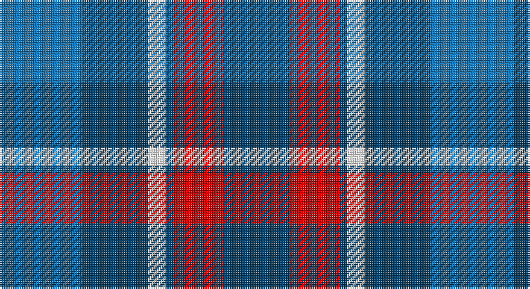

This page is one **sett** — a single exact thread-count. It belongs to the [tartan](/setts/b23dt18w5dt2r14dt18/)
(the same proportion at any scale), whose colour order is pattern [BBWBRB](/stripes/bbwbrb/).

Sourced from tartans-authority.  It is a [6 stripe tartan](/stripes/stripes6/).

Original link http://www.tartansauthority.com/tartan-ferret/display/10376/

## Register references

External register numbers recorded for this tartan.

- Scottish Register of Tartans: [10376](https://www.tartanregister.gov.uk/tartanDetails?ref=10376)
- Scottish Tartans Authority (ITI): 10376

## Thread count
B/46 DB36 W10 DB4 R28 DB/36

One full sett is **238 threads**.

## Palette

Palette: <strong>Tartan Register</strong>
<table><thead><tr><th>Colour</th><th>Threads</th><th>Shade</th><th>Base</th><th>OKLCh</th></tr></thead><tbody><tr><td>B/</td><td style="text-align:right;font-variant-numeric:tabular-nums">46</td><td><code style="background-color:#1474B4;">#1474B4</code> <small style="color:#888">#1474B4</small></td><td>B <code style="background-color:#2A418A;">#2A418A</code></td><td><small style="color:#888">oklch(54.0% 0.129 245.1)</small></td></tr><tr><td>DB</td><td style="text-align:right;font-variant-numeric:tabular-nums">36</td><td><code style="background-color:#003C64;">#003C64</code> <small style="color:#888">#003C64</small></td><td>B <code style="background-color:#2A418A;">#2A418A</code></td><td><small style="color:#888">oklch(34.5% 0.089 246.0)</small></td></tr><tr><td>W</td><td style="text-align:right;font-variant-numeric:tabular-nums">10</td><td><code style="background-color:#FCFCFC;">#FCFCFC</code> <small style="color:#888">#FCFCFC</small></td><td>W <code style="background-color:#F7F7F7;">#F7F7F7</code></td><td><small style="color:#888">oklch(99.1% 0.000 89.9)</small></td></tr><tr><td>DB</td><td style="text-align:right;font-variant-numeric:tabular-nums">4</td><td><code style="background-color:#003C64;">#003C64</code> <small style="color:#888">#003C64</small></td><td>B <code style="background-color:#2A418A;">#2A418A</code></td><td><small style="color:#888">oklch(34.5% 0.089 246.0)</small></td></tr><tr><td>R</td><td style="text-align:right;font-variant-numeric:tabular-nums">28</td><td><code style="background-color:#C80000;">#C80000</code> <small style="color:#888">#C80000</small></td><td>R <code style="background-color:#CC0000;">#CC0000</code></td><td><small style="color:#888">oklch(52.3% 0.215 29.2)</small></td></tr><tr><td>DB/</td><td style="text-align:right;font-variant-numeric:tabular-nums">36</td><td><code style="background-color:#003C64;">#003C64</code> <small style="color:#888">#003C64</small></td><td>B <code style="background-color:#2A418A;">#2A418A</code></td><td><small style="color:#888">oklch(34.5% 0.089 246.0)</small></td></tr></tbody></table>

# Sample pattern

## Nearest tartans

The nearest existing variants by ΔTartan distance, with this tartan at the top so the swatches line up against it.

ΔTartan

Tartan

Sett

—

<a href="/ttd/edit/#slug=b23dt18w5dt2r14dt18~x2">Pitt (Name)</a> <a class="nn-out" href="/variants/s6/b23dt18w5dt2r14dt18~x2/" title="open its dictionary page">↗</a>

0.75

<a href="/ttd/edit/#slug=n23dt18w5dt2r14dt18~x2&amp;base=b23dt18w5dt2r14dt18~x2">Pitt (Glasgow)</a> <a class="nn-out" href="/variants/s6/n23dt18w5dt2r14dt18~x2/" title="open its dictionary page">↗</a>

0.98

<a href="/ttd/edit/#slug=db9ly9db9t23r3~x2&amp;base=b23dt18w5dt2r14dt18~x2">Tilburg (District)</a> <a class="nn-out" href="/variants/s5/db9ly9db9t23r3~x2/" title="open its dictionary page">↗</a>

1.09

<a href="/ttd/edit/#slug=db7ly1db7t11r2~x6&amp;base=b23dt18w5dt2r14dt18~x2">Brazell (Personal)</a> <a class="nn-out" href="/variants/s5/db7ly1db7t11r2~x6/" title="open its dictionary page">↗</a>

1.19

<a href="/ttd/edit/#slug=t30dp15w4dg12w9t8w3~x2&amp;base=b23dt18w5dt2r14dt18~x2">Newall (Dumbarton) (Personal)</a> <a class="nn-out" href="/variants/s7/t30dp15w4dg12w9t8w3~x2/" title="open its dictionary page">↗</a>

1.25

<a href="/ttd/edit/#slug=db9k7o5r1o5k1o2~x4&amp;base=b23dt18w5dt2r14dt18~x2">Greyhound Grenadiers (Corporate)</a> <a class="nn-out" href="/variants/s7/db9k7o5r1o5k1o2~x4/" title="open its dictionary page">↗</a>

1.32

<a href="/ttd/edit/#slug=db10g10r5w1~x2&amp;base=b23dt18w5dt2r14dt18~x2">Thorntons Law (Corporate)</a> <a class="nn-out" href="/variants/s4/db10g10r5w1~x2/" title="open its dictionary page">↗</a>

1.33

<a href="/ttd/edit/#slug=r10w5db30b20r3~x4&amp;base=b23dt18w5dt2r14dt18~x2">Lands of Liberty</a> <a class="nn-out" href="/variants/s5/r10w5db30b20r3~x4/" title="open its dictionary page">↗</a>

1.34

<a href="/ttd/edit/#slug=k3lb10db2g6db18g2~x2&amp;base=b23dt18w5dt2r14dt18~x2">Crombie House Check</a> <a class="nn-out" href="/variants/s6/k3lb10db2g6db18g2~x2/" title="open its dictionary page">↗</a>

1.34

<a href="/ttd/edit/#slug=b11k1b3k5dp9lo1~x2&amp;base=b23dt18w5dt2r14dt18~x2">Joker Fancy Tartan</a> <a class="nn-out" href="/variants/s6/b11k1b3k5dp9lo1~x2/" title="open its dictionary page">↗</a>

1.35

<a href="/ttd/edit/#slug=db3g21db3o21db35w3~x2&amp;base=b23dt18w5dt2r14dt18~x2">Donnolly</a> <a class="nn-out" href="/variants/s6/db3g21db3o21db35w3~x2/" title="open its dictionary page">↗</a>

## Neighbour map

Every grey dot is one of 14360 variants placed by the first two principal components of the ΔTartan feature space (44% of its variance). Red is this tartan; blue dots are its nearest — click one to open its page.

<svg viewBox="0 0 640 380" role="img" style="max-width:100%;height:auto;border:1px solid #e0e0e0;border-radius:4px;display:block" xmlns="http://www.w3.org/2000/svg"><image href="/nn/cloud.v1.png" width="640" height="380"/><a href="/variants/s6/n23dt18w5dt2r14dt18~x2/"><circle cx="243.4" cy="244.2" r="4" fill="#3465a4"><title>Pitt (Glasgow)</title></circle></a><a href="/variants/s5/db9ly9db9t23r3~x2/"><circle cx="194.3" cy="246.6" r="4" fill="#3465a4"><title>Tilburg (District)</title></circle></a><a href="/variants/s5/db7ly1db7t11r2~x6/"><circle cx="265.1" cy="236.9" r="4" fill="#3465a4"><title>Brazell (Personal)</title></circle></a><a href="/variants/s7/t30dp15w4dg12w9t8w3~x2/"><circle cx="213.7" cy="207.4" r="4" fill="#3465a4"><title>Newall (Dumbarton) (Personal)</title></circle></a><a href="/variants/s7/db9k7o5r1o5k1o2~x4/"><circle cx="185.3" cy="222.0" r="4" fill="#3465a4"><title>Greyhound Grenadiers (Corporate)</title></circle></a><a href="/variants/s4/db10g10r5w1~x2/"><circle cx="177.9" cy="242.9" r="4" fill="#3465a4"><title>Thorntons Law (Corporate)</title></circle></a><a href="/variants/s5/r10w5db30b20r3~x4/"><circle cx="210.1" cy="216.9" r="4" fill="#3465a4"><title>Lands of Liberty</title></circle></a><a href="/variants/s6/k3lb10db2g6db18g2~x2/"><circle cx="226.8" cy="209.5" r="4" fill="#3465a4"><title>Crombie House Check</title></circle></a><a href="/variants/s6/b11k1b3k5dp9lo1~x2/"><circle cx="263.6" cy="229.4" r="4" fill="#3465a4"><title>Joker Fancy Tartan</title></circle></a><a href="/variants/s6/db3g21db3o21db35w3~x2/"><circle cx="264.6" cy="208.1" r="4" fill="#3465a4"><title>Donnolly</title></circle></a><circle cx="223.4" cy="234.9" r="5" fill="#c00000"/></svg>

ID: /variants/s6/b23dt18w5dt2r14dt18~x2/
