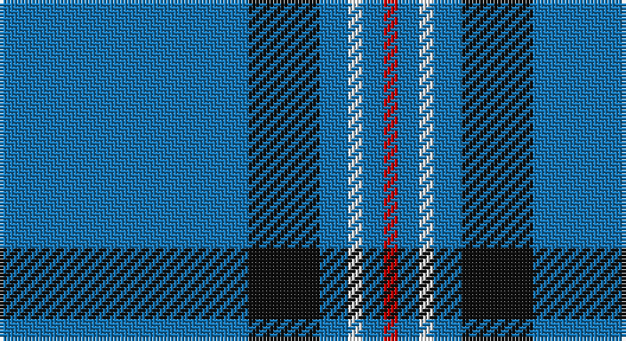

This page is one **sett** — a single exact thread-count. It belongs to the [tartan](/setts/b35k10b4w2b3r2/)
(the same proportion at any scale), whose colour order is pattern [BKBWBR](/stripes/bkbwbr/).

Part of the [Laidlaw's Highland Drovers](/tartans/laidlaw-s-highland-drovers/) tartan — the named design grouping this sett with its other cloths.

Sourced from register-of-tartans.  It is a [6 stripe tartan](/stripes/stripes6/).

Original link https://www.tartanregister.gov.uk/tartanDetails.aspx?ref=2026

## Register references

External register numbers recorded for this tartan.

- Scottish Register of Tartans: [2026](https://www.tartanregister.gov.uk/tartanDetails.aspx?ref=2026)
- Scottish Tartans Authority (ITI): 6729
- Scottish Tartans World Register: 2127

## Thread count
B/70 K20 B8 W4 B6 R/4

One full sett is **150 threads**.

## Palette

Palette: <strong>Tartan Register</strong>
<table><thead><tr><th>Colour</th><th>Threads</th><th>Shade</th><th>Base</th><th>OKLCh</th></tr></thead><tbody><tr><td>B/</td><td style="text-align:right;font-variant-numeric:tabular-nums">70</td><td><code style="background-color:#1474B4;">#1474B4</code> <small style="color:#888">#1474B4</small></td><td>B <code style="background-color:#2A418A;">#2A418A</code></td><td><small style="color:#888">oklch(54.0% 0.129 245.1)</small></td></tr><tr><td>K</td><td style="text-align:right;font-variant-numeric:tabular-nums">20</td><td><code style="background-color:#101010;">#101010</code> <small style="color:#888">#101010</small></td><td>K <code style="background-color:#000000;">#000000</code></td><td><small style="color:#888">oklch(17.3% 0.000 89.9)</small></td></tr><tr><td>B</td><td style="text-align:right;font-variant-numeric:tabular-nums">8</td><td><code style="background-color:#1474B4;">#1474B4</code> <small style="color:#888">#1474B4</small></td><td>B <code style="background-color:#2A418A;">#2A418A</code></td><td><small style="color:#888">oklch(54.0% 0.129 245.1)</small></td></tr><tr><td>W</td><td style="text-align:right;font-variant-numeric:tabular-nums">4</td><td><code style="background-color:#F8F8F8;">#F8F8F8</code> <small style="color:#888">#F8F8F8</small></td><td>W <code style="background-color:#F7F7F7;">#F7F7F7</code></td><td><small style="color:#888">oklch(97.9% 0.000 89.9)</small></td></tr><tr><td>B</td><td style="text-align:right;font-variant-numeric:tabular-nums">6</td><td><code style="background-color:#1474B4;">#1474B4</code> <small style="color:#888">#1474B4</small></td><td>B <code style="background-color:#2A418A;">#2A418A</code></td><td><small style="color:#888">oklch(54.0% 0.129 245.1)</small></td></tr><tr><td>R/</td><td style="text-align:right;font-variant-numeric:tabular-nums">4</td><td><code style="background-color:#C80000;">#C80000</code> <small style="color:#888">#C80000</small></td><td>R <code style="background-color:#CC0000;">#CC0000</code></td><td><small style="color:#888">oklch(52.3% 0.215 29.2)</small></td></tr></tbody></table>

# Sample pattern

## Nearest tartans

The nearest existing variants by ΔTartan distance, with this tartan at the top so the swatches line up against it.

ΔTartan

Tartan

Sett

—

<a href="/ttd/edit/#slug=b35k10b4w2b3r2~x2">Laidlaw's Highland Drovers</a> <a class="nn-out" href="/variants/s6/b35k10b4w2b3r2~x2/" title="open its dictionary page">↗</a>

0.69

<a href="/ttd/edit/#slug=b18r1b1r1b1k7b13w2~x4&amp;base=b35k10b4w2b3r2~x2">Tokyo Bluebells (Corporate)</a> <a class="nn-out" href="/variants/s8/b18r1b1r1b1k7b13w2~x4/" title="open its dictionary page">↗</a>

1.25

<a href="/ttd/edit/#slug=db40g7ly3g7db15r5~x2&amp;base=b35k10b4w2b3r2~x2">Wheadon (Name)</a> <a class="nn-out" href="/variants/s6/db40g7ly3g7db15r5~x2/" title="open its dictionary page">↗</a>

1.53

<a href="/ttd/edit/#slug=t66w2t10w2t10w2t12r3db24~x2&amp;base=b35k10b4w2b3r2~x2">RAAF #5</a> <a class="nn-out" href="/variants/s9/t66w2t10w2t10w2t12r3db24~x2/" title="open its dictionary page">↗</a>

1.56

<a href="/ttd/edit/#slug=db4w3b6db40b8db12g3~x2&amp;base=b35k10b4w2b3r2~x2">JetBlue (Corporate)</a> <a class="nn-out" href="/variants/s7/db4w3b6db40b8db12g3~x2/" title="open its dictionary page">↗</a>

1.60

<a href="/ttd/edit/#slug=dt3lb2dt2lb3dt6ly2dt26ly2dt6r2~x2&amp;base=b35k10b4w2b3r2~x2">Dundee Football Club</a> <a class="nn-out" href="/variants/s10/dt3lb2dt2lb3dt6ly2dt26ly2dt6r2~x2/" title="open its dictionary page">↗</a>

1.62

<a href="/ttd/edit/#slug=db18r1db1r1db1k7db13w2~x4&amp;base=b35k10b4w2b3r2~x2">Tokyo Bluebells</a> <a class="nn-out" href="/variants/s8/db18r1db1r1db1k7db13w2~x4/" title="open its dictionary page">↗</a>

1.62

<a href="/ttd/edit/#slug=db60g16w8ly3~x2&amp;base=b35k10b4w2b3r2~x2">Hsu (Personal)</a> <a class="nn-out" href="/variants/s4/db60g16w8ly3~x2/" title="open its dictionary page">↗</a>

1.68

<a href="/ttd/edit/#slug=db8w4dt6db2dt6o10dt63w3&amp;base=b35k10b4w2b3r2~x2">Pride of the Clyde</a> <a class="nn-out" href="/variants/s8/db8w4dt6db2dt6o10dt63w3/" title="open its dictionary page">↗</a>

1.71

<a href="/variants/s8/b70db5b3wi5b3w5b3k5~x2/">Wyckoff, Ann Grainger Phillips Commemorative Tartan</a>

1.71

<a href="/ttd/edit/#slug=b64k3g14k4b4k12lo4~x2&amp;base=b35k10b4w2b3r2~x2">Murray of Elibank</a> <a class="nn-out" href="/variants/s7/b64k3g14k4b4k12lo4~x2/" title="open its dictionary page">↗</a>

## Neighbour map

Every grey dot is one of 14360 variants placed by the first two principal components of the ΔTartan feature space (44% of its variance). Red is this tartan; blue dots are its nearest — click one to open its page.

<svg viewBox="0 0 640 380" role="img" style="max-width:100%;height:auto;border:1px solid #e0e0e0;border-radius:4px;display:block" xmlns="http://www.w3.org/2000/svg"><image href="/nn/cloud.v1.png" width="640" height="380"/><a href="/variants/s8/b18r1b1r1b1k7b13w2~x4/"><circle cx="460.5" cy="171.2" r="4" fill="#3465a4"><title>Tokyo Bluebells (Corporate)</title></circle></a><a href="/variants/s6/db40g7ly3g7db15r5~x2/"><circle cx="427.3" cy="202.5" r="4" fill="#3465a4"><title>Wheadon (Name)</title></circle></a><a href="/variants/s9/t66w2t10w2t10w2t12r3db24~x2/"><circle cx="499.9" cy="131.3" r="4" fill="#3465a4"><title>RAAF #5</title></circle></a><a href="/variants/s7/db4w3b6db40b8db12g3~x2/"><circle cx="470.9" cy="201.2" r="4" fill="#3465a4"><title>JetBlue (Corporate)</title></circle></a><a href="/variants/s10/dt3lb2dt2lb3dt6ly2dt26ly2dt6r2~x2/"><circle cx="484.7" cy="161.8" r="4" fill="#3465a4"><title>Dundee Football Club</title></circle></a><a href="/variants/s8/db18r1db1r1db1k7db13w2~x4/"><circle cx="459.7" cy="169.1" r="4" fill="#3465a4"><title>Tokyo Bluebells</title></circle></a><a href="/variants/s4/db60g16w8ly3~x2/"><circle cx="410.3" cy="190.7" r="4" fill="#3465a4"><title>Hsu (Personal)</title></circle></a><a href="/variants/s8/db8w4dt6db2dt6o10dt63w3/"><circle cx="509.8" cy="146.4" r="4" fill="#3465a4"><title>Pride of the Clyde</title></circle></a><a href="/variants/s8/b70db5b3wi5b3w5b3k5~x2/"><circle cx="512.9" cy="109.3" r="4" fill="#3465a4"><title>Wyckoff, Ann Grainger Phillips Commemorative Tartan</title></circle></a><a href="/variants/s7/b64k3g14k4b4k12lo4~x2/"><circle cx="413.1" cy="162.1" r="4" fill="#3465a4"><title>Murray of Elibank</title></circle></a><circle cx="471.7" cy="175.5" r="5" fill="#c00000"/></svg>

ID: /variants/s6/b35k10b4w2b3r2~x2/
