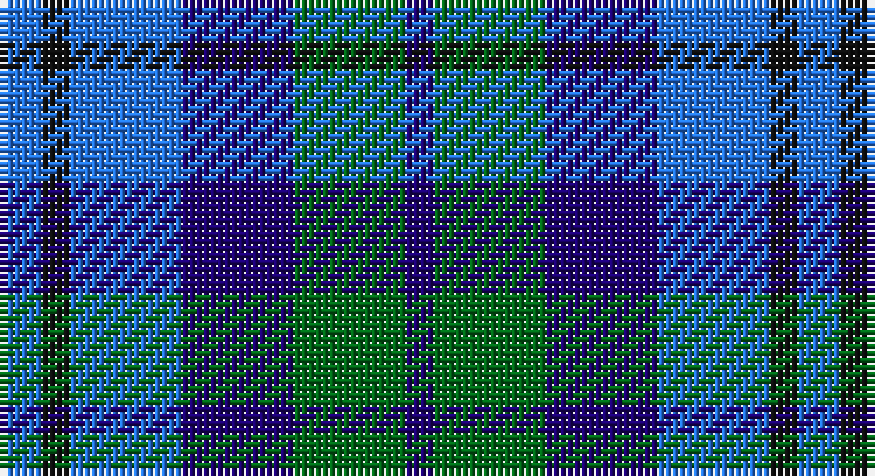

This page is one **sett** — a single exact thread-count. It belongs to the [tartan](/setts/b3k2b8db8g8db2/)
(the same proportion at any scale), whose colour order is pattern [BGBBKB](/stripes/bgbbkb/).

Part of the [Black Watch](/tartans/black-watch/) tartan — the named design grouping this sett with its other cloths.

Sourced from register-of-tartans.  It is a [6 stripe tartan](/stripes/stripes6/).

Original link https://www.tartanregister.gov.uk/tartanDetails.aspx?ref=5048

## Also known as

This cloth is also recorded under:

- Black Watch, Plaid for Band

## Register references

External register numbers recorded for this tartan.

- Scottish Register of Tartans: [5048](https://www.tartanregister.gov.uk/tartanDetails.aspx?ref=5048)
- Scottish Tartans Authority (ITI): 3696

## Thread count
B/6 K4 B16 DB16 G16 DB/4

One full sett is **114 threads**.

## Palette

Palette: <strong>Tartan Register</strong>
<table><thead><tr><th>Colour</th><th>Threads</th><th>Shade</th><th>Base</th><th>OKLCh</th></tr></thead><tbody><tr><td>B/</td><td style="text-align:right;font-variant-numeric:tabular-nums">6</td><td><code style="background-color:#2474E8;">#2474E8</code> <small style="color:#888">#2474E8</small></td><td>B <code style="background-color:#2A418A;">#2A418A</code></td><td><small style="color:#888">oklch(57.8% 0.192 258.7)</small></td></tr><tr><td>K</td><td style="text-align:right;font-variant-numeric:tabular-nums">4</td><td><code style="background-color:#101010;">#101010</code> <small style="color:#888">#101010</small></td><td>K <code style="background-color:#000000;">#000000</code></td><td><small style="color:#888">oklch(17.3% 0.000 89.9)</small></td></tr><tr><td>B</td><td style="text-align:right;font-variant-numeric:tabular-nums">16</td><td><code style="background-color:#2474E8;">#2474E8</code> <small style="color:#888">#2474E8</small></td><td>B <code style="background-color:#2A418A;">#2A418A</code></td><td><small style="color:#888">oklch(57.8% 0.192 258.7)</small></td></tr><tr><td>DB</td><td style="text-align:right;font-variant-numeric:tabular-nums">16</td><td><code style="background-color:#1C0070;">#1C0070</code> <small style="color:#888">#1C0070</small></td><td>B <code style="background-color:#2A418A;">#2A418A</code></td><td><small style="color:#888">oklch(26.3% 0.162 277.1)</small></td></tr><tr><td>G</td><td style="text-align:right;font-variant-numeric:tabular-nums">16</td><td><code style="background-color:#006818;">#006818</code> <small style="color:#888">#006818</small></td><td>G <code style="background-color:#006100;">#006100</code></td><td><small style="color:#888">oklch(45.0% 0.142 145.0)</small></td></tr><tr><td>DB/</td><td style="text-align:right;font-variant-numeric:tabular-nums">4</td><td><code style="background-color:#1C0070;">#1C0070</code> <small style="color:#888">#1C0070</small></td><td>B <code style="background-color:#2A418A;">#2A418A</code></td><td><small style="color:#888">oklch(26.3% 0.162 277.1)</small></td></tr></tbody></table>

# Sample pattern

## Nearest tartans

The nearest existing variants by ΔTartan distance, with this tartan at the top so the swatches line up against it.

ΔTartan

Tartan

Sett

—

<a href="/ttd/edit/#slug=b3k2b8db8g8db2~x2">Black Watch (Pendleton)</a> <a class="nn-out" href="/variants/s6/b3k2b8db8g8db2~x2/" title="open its dictionary page">↗</a>

1.40

<a href="/ttd/edit/#slug=b10k10b10dg26ly5~x2&amp;base=b3k2b8db8g8db2~x2">Marshall of Keith (Personal)</a> <a class="nn-out" href="/variants/s5/b10k10b10dg26ly5~x2/" title="open its dictionary page">↗</a>

1.47

<a href="/ttd/edit/#slug=db11dg10y6db7lt2db3dp10lt2~x2&amp;base=b3k2b8db8g8db2~x2">Hummelt, Katherine (Personal)</a> <a class="nn-out" href="/variants/s8/db11dg10y6db7lt2db3dp10lt2~x2/" title="open its dictionary page">↗</a>

1.51

<a href="/ttd/edit/#slug=b6db6dg6r1~x2&amp;base=b3k2b8db8g8db2~x2">Unidentified No 40</a> <a class="nn-out" href="/variants/s4/b6db6dg6r1~x2/" title="open its dictionary page">↗</a>

1.56

<a href="/ttd/edit/#slug=b3k4b4g9k2~x4&amp;base=b3k2b8db8g8db2~x2">Falconer</a> <a class="nn-out" href="/variants/s5/b3k4b4g9k2~x4/" title="open its dictionary page">↗</a>

1.66

<a href="/ttd/edit/#slug=n14r4n14t15db13w3~x2&amp;base=b3k2b8db8g8db2~x2">Blue</a> <a class="nn-out" href="/variants/s6/n14r4n14t15db13w3~x2/" title="open its dictionary page">↗</a>

1.67

<a href="/ttd/edit/#slug=r2db11r3db11t12dbi10w2~x2&amp;base=b3k2b8db8g8db2~x2">Blue</a> <a class="nn-out" href="/variants/s7/r2db11r3db11t12dbi10w2~x2/" title="open its dictionary page">↗</a>

1.76

<a href="/ttd/edit/#slug=k1db6t1dt6t6k1w1~x6&amp;base=b3k2b8db8g8db2~x2">Mary Washington</a> <a class="nn-out" href="/variants/s7/k1db6t1dt6t6k1w1~x6/" title="open its dictionary page">↗</a>

1.82

<a href="/variants/s7/ki3db24t3k25t22ki3t3~x2/">Strathclyde blue</a>

1.83

<a href="/ttd/edit/#slug=r7k4t28k24ti24k4t4~x2&amp;base=b3k2b8db8g8db2~x2">MacCorquodale</a> <a class="nn-out" href="/variants/s7/r7k4t28k24ti24k4t4~x2/" title="open its dictionary page">↗</a>

1.84

<a href="/ttd/edit/#slug=db2b9r1db5g5lb2~x4&amp;base=b3k2b8db8g8db2~x2">American Express</a> <a class="nn-out" href="/variants/s6/db2b9r1db5g5lb2~x4/" title="open its dictionary page">↗</a>

## Neighbour map

Every grey dot is one of 14360 variants placed by the first two principal components of the ΔTartan feature space (44% of its variance). Red is this tartan; blue dots are its nearest — click one to open its page.

<svg viewBox="0 0 640 380" role="img" style="max-width:100%;height:auto;border:1px solid #e0e0e0;border-radius:4px;display:block" xmlns="http://www.w3.org/2000/svg"><image href="/nn/cloud.v1.png" width="640" height="380"/><a href="/variants/s5/b10k10b10dg26ly5~x2/"><circle cx="157.6" cy="265.5" r="4" fill="#3465a4"><title>Marshall of Keith (Personal)</title></circle></a><a href="/variants/s8/db11dg10y6db7lt2db3dp10lt2~x2/"><circle cx="108.5" cy="232.0" r="4" fill="#3465a4"><title>Hummelt, Katherine (Personal)</title></circle></a><a href="/variants/s4/b6db6dg6r1~x2/"><circle cx="139.6" cy="299.6" r="4" fill="#3465a4"><title>Unidentified No 40</title></circle></a><a href="/variants/s5/b3k4b4g9k2~x4/"><circle cx="180.5" cy="297.0" r="4" fill="#3465a4"><title>Falconer</title></circle></a><a href="/variants/s6/n14r4n14t15db13w3~x2/"><circle cx="148.0" cy="263.3" r="4" fill="#3465a4"><title>Blue</title></circle></a><a href="/variants/s7/r2db11r3db11t12dbi10w2~x2/"><circle cx="163.0" cy="239.1" r="4" fill="#3465a4"><title>Blue</title></circle></a><a href="/variants/s7/k1db6t1dt6t6k1w1~x6/"><circle cx="138.6" cy="228.9" r="4" fill="#3465a4"><title>Mary Washington</title></circle></a><a href="/variants/s7/ki3db24t3k25t22ki3t3~x2/"><circle cx="182.1" cy="222.7" r="4" fill="#3465a4"><title>Strathclyde blue</title></circle></a><a href="/variants/s7/r7k4t28k24ti24k4t4~x2/"><circle cx="149.9" cy="221.9" r="4" fill="#3465a4"><title>MacCorquodale</title></circle></a><a href="/variants/s6/db2b9r1db5g5lb2~x4/"><circle cx="129.1" cy="209.7" r="4" fill="#3465a4"><title>American Express</title></circle></a><circle cx="129.9" cy="282.9" r="5" fill="#c00000"/></svg>

ID: /variants/s6/b3k2b8db8g8db2~x2/
