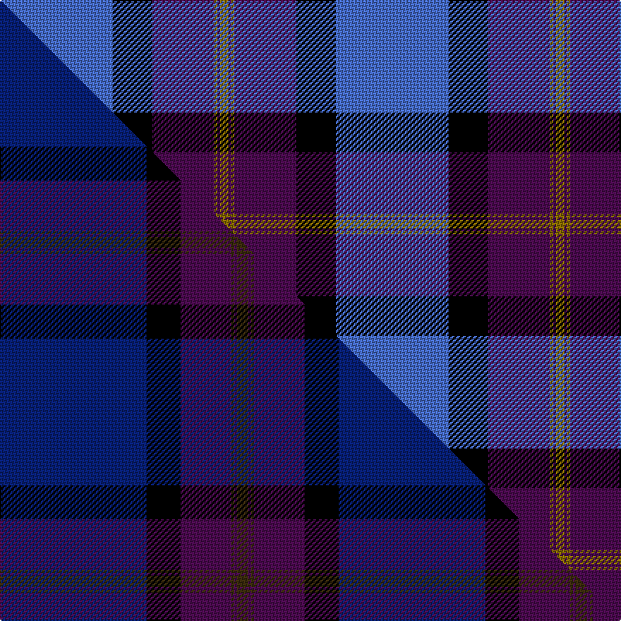

This page is one **sett** — a single exact thread-count. It belongs to the [tartan](/setts/b40k14dp22y1dp1y3/)
(the same proportion at any scale), whose colour order is pattern [BKBGBG](/stripes/bkbgbg/).

Part of the [British Energy](/tartans/british-energy/) tartan — the named design grouping this sett with its other cloths.

Sourced from weddslist.  It is a [6 stripe tartan](/stripes/stripes6/).

Original link http://www.weddslist.com/cgi-bin/tartans/pg.pl?source=sts

## Thread count
B/80 K28 DP44 Y2 DP2 Y/6

One full sett is **238 threads**.

## Palette
<table><thead><tr><th>Colour</th><th>Shade</th><th>OKLCh</th></tr></thead><tbody><tr><td>B</td><td><code style="background-color:#466CC8;">#466CC8</code> <small style="color:#888">#466CC8</small></td><td><small style="color:#888">oklch(55.1% 0.149 265.0)</small></td></tr><tr><td>K</td><td><code style="background-color:#000000;">#000000</code> <small style="color:#888">#000000</small></td><td><small style="color:#888">oklch(0.0% 0.000 0.0)</small></td></tr><tr><td>DP</td><td><code style="background-color:#4B0B4F;">#4B0B4F</code> <small style="color:#888">#4B0B4F</small></td><td><small style="color:#888">oklch(30.1% 0.125 325.4)</small></td></tr><tr><td>Y</td><td><code style="background-color:#8B6E00;">#8B6E00</code> <small style="color:#888">#8B6E00</small></td><td><small style="color:#888">oklch(55.1% 0.113 90.4)</small></td></tr></tbody></table>

# Sample pattern

## Compared to the master

This cloth is one sett of its design; the master sett (the exemplar the design is anchored on) is below for comparison.

Its **ΔTartan distance** from the master is **0.58** — the same measure the nearest-tartans table ranks by (0 is identical; a re-scale of the same cloth is near 0, a recolour or a different proportion further).

<figure class="master-compare" style="margin:0">

this sett
master sett ★

<figcaption style="color:#888;font-size:smaller">One weave of this sett against the <a href="/setts/db52k12dp18dy1dp1dy4/">master sett ★</a>, split on the diagonal: a shared proportion runs seamlessly across it with only the shades shifting; a different proportion breaks on it.</figcaption>
</figure>

## Nearest tartan variants

The nearest existing variants by ΔTartan distance, with this cloth at the top so the swatches line up against it.

ΔTartan

Threads

Variant

Sett

—

238

<a href="/variants/s6/b40k14dp22y1dp1y3~x2/">British Energy</a>

<a href="/ttd/edit/#slug=lb40k14dp22y1dp1y3~x2&amp;base=b40k14dp22y1dp1y3~x2" title="compare in the TTD">0.18</a>

238

<a href="/variants/s6/lb40k14dp22y1dp1y3~x2/">British Energy Corporate Tartan</a>

<a href="/ttd/edit/#slug=k8ly2dp6ly2k36db84w7&amp;base=b40k14dp22y1dp1y3~x2" title="compare in the TTD">2.34</a>

275

<a href="/variants/s7/k8ly2dp6ly2k36db84w7/">Grahame Laurie Band (Corporate)</a>

<a href="/ttd/edit/#slug=db20k4g5dp14w1db2~x2&amp;base=b40k14dp22y1dp1y3~x2" title="compare in the TTD">2.64</a>

140

<a href="/variants/s6/db20k4g5dp14w1db2~x2/">Riley's Theme</a>

<a href="/ttd/edit/#slug=db4w1db1w3db24n9k1n9k3~x2&amp;base=b40k14dp22y1dp1y3~x2" title="compare in the TTD">2.97</a>

206

<a href="/variants/s9/db4w1db1w3db24n9k1n9k3~x2/">Historic Scotland</a>

<a href="/ttd/edit/#slug=k4w1dp5w1k20db37w4db4~x2&amp;base=b40k14dp22y1dp1y3~x2" title="compare in the TTD">3.21</a>

288

<a href="/variants/s8/k4w1dp5w1k20db37w4db4~x2/">Finnie (Personal)</a>

<a href="/ttd/edit/#slug=t18k2t4k6dp12lo1~x2&amp;base=b40k14dp22y1dp1y3~x2" title="compare in the TTD">3.28</a>

134

<a href="/variants/s6/t18k2t4k6dp12lo1~x2/">Joker, The</a>

<a href="/ttd/edit/#slug=k4w1lb2w1k16db36lb4~x2&amp;base=b40k14dp22y1dp1y3~x2" title="compare in the TTD">3.41</a>

240

<a href="/variants/s7/k4w1lb2w1k16db36lb4~x2/">NHS Grampian</a>

<a href="/ttd/edit/#slug=r2w6k12db36n12y1~x2&amp;base=b40k14dp22y1dp1y3~x2" title="compare in the TTD">3.47</a>

270

<a href="/variants/s6/r2w6k12db36n12y1~x2/">Alan Stone Family (Personal)</a>

<a href="/ttd/edit/#slug=b8r11b28r4k17o1k7r2~x2&amp;base=b40k14dp22y1dp1y3~x2" title="compare in the TTD">3.50</a>

292

<a href="/variants/s8/b8r11b28r4k17o1k7r2~x2/">Kilbranan Sound (Personal)</a>

<a href="/ttd/edit/#slug=db36k10g3r3g6k1y2~x2&amp;base=b40k14dp22y1dp1y3~x2" title="compare in the TTD">3.50</a>

168

<a href="/variants/s7/db36k10g3r3g6k1y2~x2/">MacLaurin of Brioch</a>

## Neighbour map

Every grey dot is one of 13620 variants placed by the first two principal components of the ΔTartan feature space (42% of its variance). Red is this tartan; blue dots are its nearest — click one to open its page.

<svg viewBox="0 0 640 380" role="img" style="max-width:100%;height:auto;border:1px solid #e0e0e0;border-radius:4px;display:block" xmlns="http://www.w3.org/2000/svg"><image href="/nn/cloud.v1.png" width="640" height="380"/><a href="/variants/s6/lb40k14dp22y1dp1y3~x2/"><circle cx="266.9" cy="120.2" r="4" fill="#3465a4"><title>British Energy Corporate Tartan</title></circle></a><a href="/variants/s7/k8ly2dp6ly2k36db84w7/"><circle cx="337.3" cy="88.3" r="4" fill="#3465a4"><title>Grahame Laurie Band (Corporate)</title></circle></a><a href="/variants/s6/db20k4g5dp14w1db2~x2/"><circle cx="277.0" cy="165.9" r="4" fill="#3465a4"><title>Riley's Theme</title></circle></a><a href="/variants/s9/db4w1db1w3db24n9k1n9k3~x2/"><circle cx="304.0" cy="130.7" r="4" fill="#3465a4"><title>Historic Scotland</title></circle></a><a href="/variants/s8/k4w1dp5w1k20db37w4db4~x2/"><circle cx="314.8" cy="106.3" r="4" fill="#3465a4"><title>Finnie (Personal)</title></circle></a><a href="/variants/s6/t18k2t4k6dp12lo1~x2/"><circle cx="261.1" cy="175.1" r="4" fill="#3465a4"><title>Joker, The</title></circle></a><a href="/variants/s7/k4w1lb2w1k16db36lb4~x2/"><circle cx="331.0" cy="107.9" r="4" fill="#3465a4"><title>NHS Grampian</title></circle></a><a href="/variants/s6/r2w6k12db36n12y1~x2/"><circle cx="247.8" cy="105.8" r="4" fill="#3465a4"><title>Alan Stone Family (Personal)</title></circle></a><a href="/variants/s8/b8r11b28r4k17o1k7r2~x2/"><circle cx="229.0" cy="132.2" r="4" fill="#3465a4"><title>Kilbranan Sound (Personal)</title></circle></a><a href="/variants/s7/db36k10g3r3g6k1y2~x2/"><circle cx="333.2" cy="98.2" r="4" fill="#3465a4"><title>MacLaurin of Brioch</title></circle></a><circle cx="302.9" cy="132.0" r="5" fill="#c00000"/><text x="320" y="376" text-anchor="middle" font-size="11" fill="#999">ground</text><text x="11" y="190" text-anchor="middle" font-size="11" fill="#999" transform="rotate(-90 11 190)">complexity</text></svg>

ID: /variants/s6/b40k14dp22y1dp1y3~x2/
