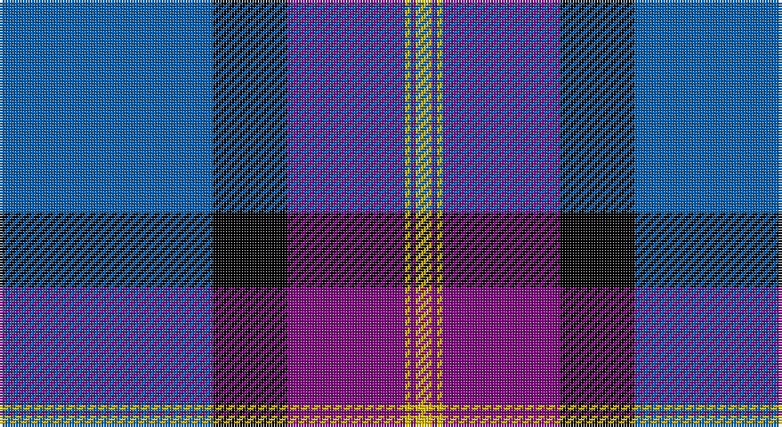

This page is one **sett** — a single exact thread-count. It belongs to the [tartan](/setts/b40k14p22ly1p1ly3/)
(the same proportion at any scale), whose colour order is pattern [BKBYBY](/stripes/bkbyby/).

Part of the [British Energy](/tartans/british-energy/) tartan — the named design grouping this sett with its other cloths.

Sourced from weddslist.  It is a [6 stripe tartan](/stripes/stripes6/).

Original link http://www.weddslist.com/cgi-bin/tartans/pg.pl?source=sts

## Thread count
B/80 K28 P44 Y2 P2 Y/6

One full sett is **238 threads**.

## Palette

Palette: <strong>Ingles Buchan</strong> <small style="color:#888">(1 of 4 colours)</small>
<table><thead><tr><th>Colour</th><th>Threads</th><th>Shade</th><th>Base</th><th>OKLCh</th></tr></thead><tbody><tr><td>B/</td><td style="text-align:right;font-variant-numeric:tabular-nums">80</td><td><code style="background-color:#0060B0;">#0060B0</code> <small style="color:#888">#0060B0</small></td><td>B <code style="background-color:#2A418A;">#2A418A</code></td><td><small style="color:#888">oklch(48.8% 0.148 252.5)</small></td></tr><tr><td>K</td><td style="text-align:right;font-variant-numeric:tabular-nums">28</td><td><code style="background-color:#000000;">#000000</code> <small style="color:#888">#000000</small></td><td>K <code style="background-color:#000000;">#000000</code></td><td><small style="color:#888">oklch(0.0% 0.000 0.0)</small></td></tr><tr><td>P</td><td style="text-align:right;font-variant-numeric:tabular-nums">44</td><td><code style="background-color:#800080;">#800080</code> <small style="color:#888">#800080</small></td><td>B <code style="background-color:#2A418A;">#2A418A</code></td><td><small style="color:#888">oklch(42.1% 0.193 328.4)</small></td></tr><tr><td>Y</td><td style="text-align:right;font-variant-numeric:tabular-nums">2</td><td><code style="background-color:#F0C000;">#F0C000</code> <small style="color:#888">#F0C000</small></td><td>Y <code style="background-color:#F2BF00;">#F2BF00</code></td><td><small style="color:#888">oklch(82.7% 0.169 90.5)</small></td></tr><tr><td>P</td><td style="text-align:right;font-variant-numeric:tabular-nums">2</td><td><code style="background-color:#800080;">#800080</code> <small style="color:#888">#800080</small></td><td>B <code style="background-color:#2A418A;">#2A418A</code></td><td><small style="color:#888">oklch(42.1% 0.193 328.4)</small></td></tr><tr><td>Y/</td><td style="text-align:right;font-variant-numeric:tabular-nums">6</td><td><code style="background-color:#F0C000;">#F0C000</code> <small style="color:#888">#F0C000</small></td><td>Y <code style="background-color:#F2BF00;">#F2BF00</code></td><td><small style="color:#888">oklch(82.7% 0.169 90.5)</small></td></tr></tbody></table>

# Sample pattern

## Compared to the master

This cloth is one sett of its design; the master sett (the exemplar the design is anchored on) is below for comparison.

<figure style="margin:0"><figcaption style="color:#888;font-size:smaller">this sett</figcaption></figure>
<figure style="margin:0"><figcaption style="color:#888;font-size:smaller"><a href="/setts/db52k12dp18ly1dp1ly4/">master sett →</a></figcaption></figure>

## Nearest tartans

The nearest existing variants by ΔTartan distance, with this tartan at the top so the swatches line up against it.

ΔTartan

Tartan

Sett

—

<a href="/ttd/edit/#slug=b40k14p22ly1p1ly3~x2">British Energy</a> <a class="nn-out" href="/variants/s6/b40k14p22ly1p1ly3~x2/" title="open its dictionary page">↗</a>

1.28

<a href="/ttd/edit/#slug=k4w1dp5w1k20db37w4db4~x2&amp;base=b40k14p22ly1p1ly3~x2">Finnie (Personal)</a> <a class="nn-out" href="/variants/s8/k4w1dp5w1k20db37w4db4~x2/" title="open its dictionary page">↗</a>

1.51

<a href="/variants/s6/g6ni16db49n14db2w6~x2/">Gorman Family (Canada) (Personal)</a>

1.52

<a href="/ttd/edit/#slug=r3db20k6lb5k4lb3k2r1db2~x2&amp;base=b40k14p22ly1p1ly3~x2">Scottish Knights Templar Int. (Corp)</a> <a class="nn-out" href="/variants/s9/r3db20k6lb5k4lb3k2r1db2~x2/" title="open its dictionary page">↗</a>

1.55

<a href="/ttd/edit/#slug=db4w1db1w3db24y9k1y9k3~x2&amp;base=b40k14p22ly1p1ly3~x2">Historic Scotland</a> <a class="nn-out" href="/variants/s9/db4w1db1w3db24y9k1y9k3~x2/" title="open its dictionary page">↗</a>

1.56

<a href="/ttd/edit/#slug=db42lbi2lb2lbi2db5dt12lb32db4~x2&amp;base=b40k14p22ly1p1ly3~x2">Longniddry Eildon Blue Dress Fancy Tartan</a> <a class="nn-out" href="/variants/s8/db42lbi2lb2lbi2db5dt12lb32db4~x2/" title="open its dictionary page">↗</a>

1.56

<a href="/ttd/edit/#slug=dbi6w2g2w3dbi24r1db35r2~x2&amp;base=b40k14p22ly1p1ly3~x2">Raith Rovers F.C.</a> <a class="nn-out" href="/variants/s8/dbi6w2g2w3dbi24r1db35r2~x2/" title="open its dictionary page">↗</a>

1.57

<a href="/ttd/edit/#slug=r3k1b27k27w3~x2&amp;base=b40k14p22ly1p1ly3~x2">Bro-Spirit of Northmen (Corporate)</a> <a class="nn-out" href="/variants/s5/r3k1b27k27w3~x2/" title="open its dictionary page">↗</a>

1.62

<a href="/ttd/edit/#slug=dbi42lbi2lb2lbi2dbi5db12lb32dbi4~x2&amp;base=b40k14p22ly1p1ly3~x2">Eildon (1980)</a> <a class="nn-out" href="/variants/s8/dbi42lbi2lb2lbi2dbi5db12lb32dbi4~x2/" title="open its dictionary page">↗</a>

1.62

<a href="/ttd/edit/#slug=lb40k14dp22ly1dp1ly3~x2&amp;base=b40k14p22ly1p1ly3~x2">British Energy Corporate Tartan</a> <a class="nn-out" href="/variants/s6/lb40k14dp22ly1dp1ly3~x2/" title="open its dictionary page">↗</a>

1.65

<a href="/ttd/edit/#slug=lb12dg16k12dg24dp75lo4&amp;base=b40k14p22ly1p1ly3~x2">Widows Sons Scotland Dress</a> <a class="nn-out" href="/variants/s6/lb12dg16k12dg24dp75lo4/" title="open its dictionary page">↗</a>

## Neighbour map

Every grey dot is one of 14360 variants placed by the first two principal components of the ΔTartan feature space (44% of its variance). Red is this tartan; blue dots are its nearest — click one to open its page.

<svg viewBox="0 0 640 380" role="img" style="max-width:100%;height:auto;border:1px solid #e0e0e0;border-radius:4px;display:block" xmlns="http://www.w3.org/2000/svg"><image href="/nn/cloud.v1.png" width="640" height="380"/><a href="/variants/s8/k4w1dp5w1k20db37w4db4~x2/"><circle cx="364.9" cy="136.1" r="4" fill="#3465a4"><title>Finnie (Personal)</title></circle></a><a href="/variants/s6/g6ni16db49n14db2w6~x2/"><circle cx="305.6" cy="159.9" r="4" fill="#3465a4"><title>Gorman Family (Canada) (Personal)</title></circle></a><a href="/variants/s9/r3db20k6lb5k4lb3k2r1db2~x2/"><circle cx="265.8" cy="146.5" r="4" fill="#3465a4"><title>Scottish Knights Templar Int. (Corp)</title></circle></a><a href="/variants/s9/db4w1db1w3db24y9k1y9k3~x2/"><circle cx="301.2" cy="138.3" r="4" fill="#3465a4"><title>Historic Scotland</title></circle></a><a href="/variants/s8/db42lbi2lb2lbi2db5dt12lb32db4~x2/"><circle cx="288.7" cy="139.6" r="4" fill="#3465a4"><title>Longniddry Eildon Blue Dress Fancy Tartan</title></circle></a><a href="/variants/s8/dbi6w2g2w3dbi24r1db35r2~x2/"><circle cx="314.7" cy="122.5" r="4" fill="#3465a4"><title>Raith Rovers F.C.</title></circle></a><a href="/variants/s5/r3k1b27k27w3~x2/"><circle cx="303.4" cy="174.7" r="4" fill="#3465a4"><title>Bro-Spirit of Northmen (Corporate)</title></circle></a><a href="/variants/s8/dbi42lbi2lb2lbi2dbi5db12lb32dbi4~x2/"><circle cx="274.6" cy="137.8" r="4" fill="#3465a4"><title>Eildon (1980)</title></circle></a><a href="/variants/s6/lb40k14dp22ly1dp1ly3~x2/"><circle cx="298.6" cy="122.8" r="4" fill="#3465a4"><title>British Energy Corporate Tartan</title></circle></a><a href="/variants/s6/lb12dg16k12dg24dp75lo4/"><circle cx="291.7" cy="162.4" r="4" fill="#3465a4"><title>Widows Sons Scotland Dress</title></circle></a><circle cx="309.8" cy="142.1" r="5" fill="#c00000"/></svg>

ID: /variants/s6/b40k14p22ly1p1ly3~x2/
