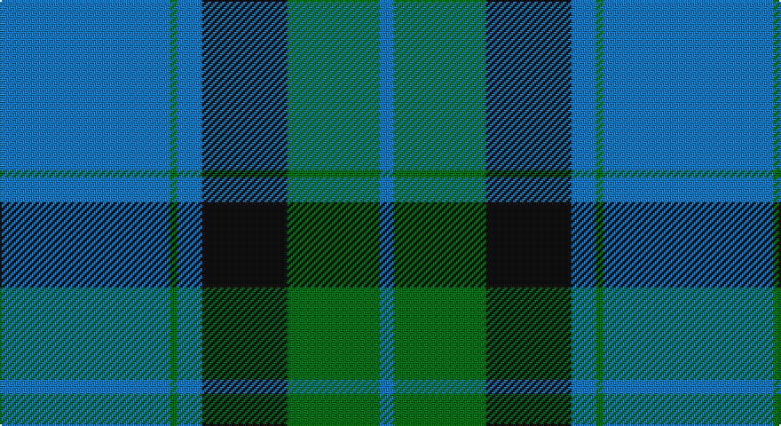

This page is one **sett** — a single exact thread-count. It belongs to the [tartan](/setts/b48g2b7k24g26b4/)
(the same proportion at any scale), whose colour order is pattern [BGBKGB](/stripes/bgbkgb/).

Part of the [Unidentified](/tartans/unidentified/) tartan — the named design grouping this sett with its other cloths.

Sourced from tartans-authority.  It is a [6 stripe tartan](/stripes/stripes6/).

Original link http://www.tartansauthority.com/tartan-ferret/display/8941/

## Also known as

This cloth is also recorded under:

- Unidentified #10
- Unidentified #12
- Unidentified #14
- Unidentified #15
- Unidentified #16
- Unidentified #18
- Unidentified #2
- Unidentified #21
- Unidentified #22
- Unidentified #24
- Unidentified #25
- Unidentified #28
- Unidentified #29
- Unidentified #30
- Unidentified #31
- Unidentified #32
- Unidentified #36
- Unidentified #37
- Unidentified #38
- Unidentified #40
- Unidentified #43
- Unidentified #44
- Unidentified #45
- Unidentified #46
- Unidentified #47
- Unidentified #48
- Unidentified #49
- Unidentified #5
- Unidentified #50
- Unidentified #51
- Unidentified #52
- Unidentified #53
- Unidentified #54
- Unidentified #55
- Unidentified #56
- Unidentified #57
- Unidentified #58
- Unidentified #59
- Unidentified #60
- Unidentified #61
- Unidentified #62
- Unidentified #63
- Unidentified #64
- Unidentified #65
- Unidentified #66
- Unidentified #7
- Unidentified #8
- Unidentified #9
- Unidentified 16
- Unidentified Artifact
- Unidentified Plaid
- Unidentified Plaid #11
- Unidentified Plaid #13
- Unidentified Plaid #2
- Unidentified Plaid #3
- Unidentified Plaid #7
- Unidentified Plaid #8
- Unidentified Plaid #9
- Unidentified Portrait

## Register references

External register numbers recorded for this tartan.

- Scottish Register of Tartans: [8941](https://www.tartanregister.gov.uk/tartanDetails?ref=8941)
- Scottish Tartans Authority (ITI): 8941

## Thread count
B/96 G4 B14 K48 G52 B/8

One full sett is **340 threads**.

## Palette

Palette: <strong>Tartan Register</strong>
<table><thead><tr><th>Colour</th><th>Threads</th><th>Shade</th><th>Base</th><th>OKLCh</th></tr></thead><tbody><tr><td>B/</td><td style="text-align:right;font-variant-numeric:tabular-nums">96</td><td><code style="background-color:#1474B4;">#1474B4</code> <small style="color:#888">#1474B4</small></td><td>B <code style="background-color:#2A418A;">#2A418A</code></td><td><small style="color:#888">oklch(54.0% 0.129 245.1)</small></td></tr><tr><td>G</td><td style="text-align:right;font-variant-numeric:tabular-nums">4</td><td><code style="background-color:#006818;">#006818</code> <small style="color:#888">#006818</small></td><td>G <code style="background-color:#006100;">#006100</code></td><td><small style="color:#888">oklch(45.0% 0.142 145.0)</small></td></tr><tr><td>B</td><td style="text-align:right;font-variant-numeric:tabular-nums">14</td><td><code style="background-color:#1474B4;">#1474B4</code> <small style="color:#888">#1474B4</small></td><td>B <code style="background-color:#2A418A;">#2A418A</code></td><td><small style="color:#888">oklch(54.0% 0.129 245.1)</small></td></tr><tr><td>K</td><td style="text-align:right;font-variant-numeric:tabular-nums">48</td><td><code style="background-color:#101010;">#101010</code> <small style="color:#888">#101010</small></td><td>K <code style="background-color:#000000;">#000000</code></td><td><small style="color:#888">oklch(17.3% 0.000 89.9)</small></td></tr><tr><td>G</td><td style="text-align:right;font-variant-numeric:tabular-nums">52</td><td><code style="background-color:#006818;">#006818</code> <small style="color:#888">#006818</small></td><td>G <code style="background-color:#006100;">#006100</code></td><td><small style="color:#888">oklch(45.0% 0.142 145.0)</small></td></tr><tr><td>B/</td><td style="text-align:right;font-variant-numeric:tabular-nums">8</td><td><code style="background-color:#1474B4;">#1474B4</code> <small style="color:#888">#1474B4</small></td><td>B <code style="background-color:#2A418A;">#2A418A</code></td><td><small style="color:#888">oklch(54.0% 0.129 245.1)</small></td></tr></tbody></table>

# Sample pattern

## Compared to the master

This cloth is one sett of its design; the master sett (the exemplar the design is anchored on) is below for comparison.

<figure style="margin:0"><figcaption style="color:#888;font-size:smaller">this sett</figcaption></figure>
<figure style="margin:0"><figcaption style="color:#888;font-size:smaller"><a href="/setts/dp4r3dp26r26dg26r4/">master sett →</a></figcaption></figure>

## Nearest tartans

The nearest existing variants by ΔTartan distance, with this tartan at the top so the swatches line up against it.

ΔTartan

Tartan

Sett

—

<a href="/ttd/edit/#slug=b48g2b7k24g26b4~x2">Unidentified (Kallmeyer 'B')</a> <a class="nn-out" href="/variants/s6/b48g2b7k24g26b4~x2/" title="open its dictionary page">↗</a>

1.33

<a href="/ttd/edit/#slug=b32k10g15k2ly4~x2&amp;base=b48g2b7k24g26b4~x2">Rothesay &amp; Caithness Fencibles (Mil)</a> <a class="nn-out" href="/variants/s5/b32k10g15k2ly4~x2/" title="open its dictionary page">↗</a>

1.41

<a href="/ttd/edit/#slug=db4k4db24g32w1g2~x4&amp;base=b48g2b7k24g26b4~x2">Oliphant (Clan)</a> <a class="nn-out" href="/variants/s6/db4k4db24g32w1g2~x4/" title="open its dictionary page">↗</a>

1.47

<a href="/ttd/edit/#slug=db72k21g16t3g17t3~x2&amp;base=b48g2b7k24g26b4~x2">MacRobart</a> <a class="nn-out" href="/variants/s6/db72k21g16t3g17t3~x2/" title="open its dictionary page">↗</a>

1.47

<a href="/ttd/edit/#slug=r2db32g14db5g16w2~x2&amp;base=b48g2b7k24g26b4~x2">Connacht Irish District Tartan</a> <a class="nn-out" href="/variants/s6/r2db32g14db5g16w2~x2/" title="open its dictionary page">↗</a>

1.54

<a href="/ttd/edit/#slug=db22ly2db1ly2db10y2g11y6~x2&amp;base=b48g2b7k24g26b4~x2">Katsushika (Corporate)</a> <a class="nn-out" href="/variants/s8/db22ly2db1ly2db10y2g11y6~x2/" title="open its dictionary page">↗</a>

1.57

<a href="/ttd/edit/#slug=g26db10k3db2dy2db10~x4&amp;base=b48g2b7k24g26b4~x2">St. Andrews Old Course Hotel (Corp)</a> <a class="nn-out" href="/variants/s6/g26db10k3db2dy2db10~x4/" title="open its dictionary page">↗</a>

1.58

<a href="/ttd/edit/#slug=db4w1db12g12db1g4~x2&amp;base=b48g2b7k24g26b4~x2">Unidentified, Tweed</a> <a class="nn-out" href="/variants/s6/db4w1db12g12db1g4~x2/" title="open its dictionary page">↗</a>

1.59

<a href="/ttd/edit/#slug=t28dt15r2dt2w1dt6~x2&amp;base=b48g2b7k24g26b4~x2">Corries</a> <a class="nn-out" href="/variants/s6/t28dt15r2dt2w1dt6~x2/" title="open its dictionary page">↗</a>

1.60

<a href="/ttd/edit/#slug=dg4w1dg26b26k2b4~x4&amp;base=b48g2b7k24g26b4~x2">Melville (Two black lines)</a> <a class="nn-out" href="/variants/s6/dg4w1dg26b26k2b4~x4/" title="open its dictionary page">↗</a>

1.61

<a href="/ttd/edit/#slug=r1g16db16g1~x2&amp;base=b48g2b7k24g26b4~x2">Barclay</a> <a class="nn-out" href="/variants/s4/r1g16db16g1~x2/" title="open its dictionary page">↗</a>

## Neighbour map

Every grey dot is one of 14360 variants placed by the first two principal components of the ΔTartan feature space (44% of its variance). Red is this tartan; blue dots are its nearest — click one to open its page.

<svg viewBox="0 0 640 380" role="img" style="max-width:100%;height:auto;border:1px solid #e0e0e0;border-radius:4px;display:block" xmlns="http://www.w3.org/2000/svg"><image href="/nn/cloud.v1.png" width="640" height="380"/><a href="/variants/s5/b32k10g15k2ly4~x2/"><circle cx="276.6" cy="209.3" r="4" fill="#3465a4"><title>Rothesay &amp; Caithness Fencibles (Mil)</title></circle></a><a href="/variants/s6/db4k4db24g32w1g2~x4/"><circle cx="374.3" cy="178.6" r="4" fill="#3465a4"><title>Oliphant (Clan)</title></circle></a><a href="/variants/s6/db72k21g16t3g17t3~x2/"><circle cx="327.4" cy="173.5" r="4" fill="#3465a4"><title>MacRobart</title></circle></a><a href="/variants/s6/r2db32g14db5g16w2~x2/"><circle cx="323.1" cy="202.9" r="4" fill="#3465a4"><title>Connacht Irish District Tartan</title></circle></a><a href="/variants/s8/db22ly2db1ly2db10y2g11y6~x2/"><circle cx="348.8" cy="173.7" r="4" fill="#3465a4"><title>Katsushika (Corporate)</title></circle></a><a href="/variants/s6/g26db10k3db2dy2db10~x4/"><circle cx="315.5" cy="218.3" r="4" fill="#3465a4"><title>St. Andrews Old Course Hotel (Corp)</title></circle></a><a href="/variants/s6/db4w1db12g12db1g4~x2/"><circle cx="339.4" cy="244.4" r="4" fill="#3465a4"><title>Unidentified, Tweed</title></circle></a><a href="/variants/s6/t28dt15r2dt2w1dt6~x2/"><circle cx="381.3" cy="178.9" r="4" fill="#3465a4"><title>Corries</title></circle></a><a href="/variants/s6/dg4w1dg26b26k2b4~x4/"><circle cx="370.1" cy="193.7" r="4" fill="#3465a4"><title>Melville (Two black lines)</title></circle></a><a href="/variants/s4/r1g16db16g1~x2/"><circle cx="385.3" cy="256.9" r="4" fill="#3465a4"><title>Barclay</title></circle></a><circle cx="344.5" cy="212.4" r="5" fill="#c00000"/></svg>

ID: /variants/s6/b48g2b7k24g26b4~x2/
