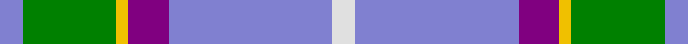
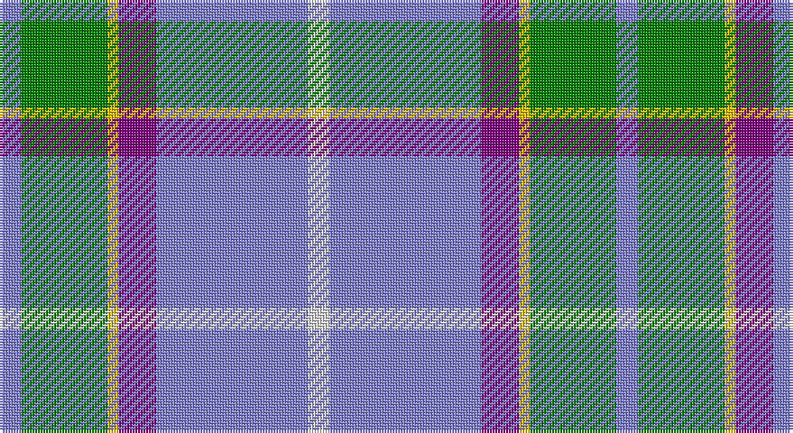

This page is one **sett** — a single exact thread-count. It belongs to the [tartan](/setts/b4g16ly2p7b28w4/)
(the same proportion at any scale), whose colour order is pattern [BGYBBW](/stripes/bgybbw/).

Part of the [Manx Laxey](/tartans/manx-laxey/) tartan — the named design grouping this sett with its other cloths.

Sourced from weddslist.  It is a [6 stripe tartan](/stripes/stripes6/).

Original link http://www.weddslist.com/cgi-bin/tartans/pg.pl?source=sts

## Also known as

This cloth is also recorded under:

- Manx Laxey Red
- Manx Laxey, Red

## Thread count
B/8 G32 Y4 P14 B56 LN/8

One full sett is **228 threads**.

## Palette

Palette: <strong>Tartan Dictionary</strong> <small style="color:#888">(1 of 5 colours)</small>
<table><thead><tr><th>Colour</th><th>Threads</th><th>Shade</th><th>Base</th><th>OKLCh</th></tr></thead><tbody><tr><td>B/</td><td style="text-align:right;font-variant-numeric:tabular-nums">8</td><td><code style="background-color:#8080D0;">#8080D0</code> <small style="color:#888">#8080D0</small></td><td>B <code style="background-color:#2A418A;">#2A418A</code></td><td><small style="color:#888">oklch(63.4% 0.119 282.5)</small></td></tr><tr><td>G</td><td style="text-align:right;font-variant-numeric:tabular-nums">32</td><td><code style="background-color:#008000;">#008000</code> <small style="color:#888">#008000</small></td><td>G <code style="background-color:#006100;">#006100</code></td><td><small style="color:#888">oklch(52.0% 0.177 142.5)</small></td></tr><tr><td>Y</td><td style="text-align:right;font-variant-numeric:tabular-nums">4</td><td><code style="background-color:#F0C000;">#F0C000</code> <small style="color:#888">#F0C000</small></td><td>Y <code style="background-color:#F2BF00;">#F2BF00</code></td><td><small style="color:#888">oklch(82.7% 0.169 90.5)</small></td></tr><tr><td>P</td><td style="text-align:right;font-variant-numeric:tabular-nums">14</td><td><code style="background-color:#800080;">#800080</code> <small style="color:#888">#800080</small></td><td>B <code style="background-color:#2A418A;">#2A418A</code></td><td><small style="color:#888">oklch(42.1% 0.193 328.4)</small></td></tr><tr><td>B</td><td style="text-align:right;font-variant-numeric:tabular-nums">56</td><td><code style="background-color:#8080D0;">#8080D0</code> <small style="color:#888">#8080D0</small></td><td>B <code style="background-color:#2A418A;">#2A418A</code></td><td><small style="color:#888">oklch(63.4% 0.119 282.5)</small></td></tr><tr><td>LN/</td><td style="text-align:right;font-variant-numeric:tabular-nums">8</td><td><code style="background-color:#E0E0E0;">#E0E0E0</code> <small style="color:#888">#E0E0E0</small></td><td>W <code style="background-color:#F7F7F7;">#F7F7F7</code></td><td><small style="color:#888">oklch(90.7% 0.000 89.9)</small></td></tr></tbody></table>

# Sample pattern

## Compared to the master

This cloth is one sett of its design; the master sett (the exemplar the design is anchored on) is below for comparison.

<figure style="margin:0"><figcaption style="color:#888;font-size:smaller">this sett</figcaption></figure>
<figure style="margin:0"><figcaption style="color:#888;font-size:smaller"><a href="/setts/r24ly2o3dy2w10r4o3dy3w2/">master sett →</a></figcaption></figure>

## Nearest tartans

The nearest existing variants by ΔTartan distance, with this tartan at the top so the swatches line up against it.

ΔTartan

Tartan

Sett

—

<a href="/ttd/edit/#slug=b4g16ly2p7b28w4~x2">Manx Laxey</a> <a class="nn-out" href="/variants/s6/b4g16ly2p7b28w4~x2/" title="open its dictionary page">↗</a>

0.65

<a href="/ttd/edit/#slug=t4dg16ly2dp7t28w4~x2&amp;base=b4g16ly2p7b28w4~x2">Manx Laxey (Blue)</a> <a class="nn-out" href="/variants/s6/t4dg16ly2dp7t28w4~x2/" title="open its dictionary page">↗</a>

0.76

<a href="/ttd/edit/#slug=w15ly2dt5lr3t40dt10&amp;base=b4g16ly2p7b28w4~x2">Herriot (New Zealand) (Name)</a> <a class="nn-out" href="/variants/s6/w15ly2dt5lr3t40dt10/" title="open its dictionary page">↗</a>

1.20

<a href="/ttd/edit/#slug=t4g16ly2db7t28w4~x2&amp;base=b4g16ly2p7b28w4~x2">Allanton (Fashion)</a> <a class="nn-out" href="/variants/s6/t4g16ly2db7t28w4~x2/" title="open its dictionary page">↗</a>

1.21

<a href="/ttd/edit/#slug=r15t98dt72ly25dt8w15&amp;base=b4g16ly2p7b28w4~x2">Afternoon Tea / Earl Grey</a> <a class="nn-out" href="/variants/s6/r15t98dt72ly25dt8w15/" title="open its dictionary page">↗</a>

1.21

<a href="/ttd/edit/#slug=w8t30g5w3db8r5&amp;base=b4g16ly2p7b28w4~x2">Roseberry</a> <a class="nn-out" href="/variants/s6/w8t30g5w3db8r5/" title="open its dictionary page">↗</a>

1.23

<a href="/ttd/edit/#slug=dt36t21ly4lb12dp2~x2&amp;base=b4g16ly2p7b28w4~x2">Emond, Kenneth (Personal)</a> <a class="nn-out" href="/variants/s5/dt36t21ly4lb12dp2~x2/" title="open its dictionary page">↗</a>

1.27

<a href="/ttd/edit/#slug=n10w3lb3g1r1~x10&amp;base=b4g16ly2p7b28w4~x2">Bagpipe Shop (Corporate)</a> <a class="nn-out" href="/variants/s5/n10w3lb3g1r1~x10/" title="open its dictionary page">↗</a>

1.30

<a href="/ttd/edit/#slug=g11lo10dp11b33w3~x2&amp;base=b4g16ly2p7b28w4~x2">Sterling, Rob (Florida) (Personal)</a> <a class="nn-out" href="/variants/s5/g11lo10dp11b33w3~x2/" title="open its dictionary page">↗</a>

1.34

<a href="/ttd/edit/#slug=o10k1db3g3ly1~x6&amp;base=b4g16ly2p7b28w4~x2">Celtic Norse Heritage Society</a> <a class="nn-out" href="/variants/s5/o10k1db3g3ly1~x6/" title="open its dictionary page">↗</a>

1.34

<a href="/ttd/edit/#slug=k1w7lo7b16ly1~x4&amp;base=b4g16ly2p7b28w4~x2">Prehospital EMS (Corporate)</a> <a class="nn-out" href="/variants/s5/k1w7lo7b16ly1~x4/" title="open its dictionary page">↗</a>

## Neighbour map

Every grey dot is one of 14360 variants placed by the first two principal components of the ΔTartan feature space (44% of its variance). Red is this tartan; blue dots are its nearest — click one to open its page.

<svg viewBox="0 0 640 380" role="img" style="max-width:100%;height:auto;border:1px solid #e0e0e0;border-radius:4px;display:block" xmlns="http://www.w3.org/2000/svg"><image href="/nn/cloud.v1.png" width="640" height="380"/><a href="/variants/s6/t4dg16ly2dp7t28w4~x2/"><circle cx="273.2" cy="182.3" r="4" fill="#3465a4"><title>Manx Laxey (Blue)</title></circle></a><a href="/variants/s6/w15ly2dt5lr3t40dt10/"><circle cx="294.2" cy="153.3" r="4" fill="#3465a4"><title>Herriot (New Zealand) (Name)</title></circle></a><a href="/variants/s6/t4g16ly2db7t28w4~x2/"><circle cx="281.0" cy="190.4" r="4" fill="#3465a4"><title>Allanton (Fashion)</title></circle></a><a href="/variants/s6/r15t98dt72ly25dt8w15/"><circle cx="207.9" cy="186.9" r="4" fill="#3465a4"><title>Afternoon Tea / Earl Grey</title></circle></a><a href="/variants/s6/w8t30g5w3db8r5/"><circle cx="216.1" cy="173.5" r="4" fill="#3465a4"><title>Roseberry</title></circle></a><a href="/variants/s5/dt36t21ly4lb12dp2~x2/"><circle cx="239.8" cy="180.6" r="4" fill="#3465a4"><title>Emond, Kenneth (Personal)</title></circle></a><a href="/variants/s5/n10w3lb3g1r1~x10/"><circle cx="274.0" cy="188.6" r="4" fill="#3465a4"><title>Bagpipe Shop (Corporate)</title></circle></a><a href="/variants/s5/g11lo10dp11b33w3~x2/"><circle cx="229.1" cy="214.4" r="4" fill="#3465a4"><title>Sterling, Rob (Florida) (Personal)</title></circle></a><a href="/variants/s5/o10k1db3g3ly1~x6/"><circle cx="260.1" cy="190.9" r="4" fill="#3465a4"><title>Celtic Norse Heritage Society</title></circle></a><a href="/variants/s5/k1w7lo7b16ly1~x4/"><circle cx="236.7" cy="164.1" r="4" fill="#3465a4"><title>Prehospital EMS (Corporate)</title></circle></a><circle cx="271.5" cy="176.2" r="5" fill="#c00000"/></svg>

ID: /variants/s6/b4g16ly2p7b28w4~x2/
