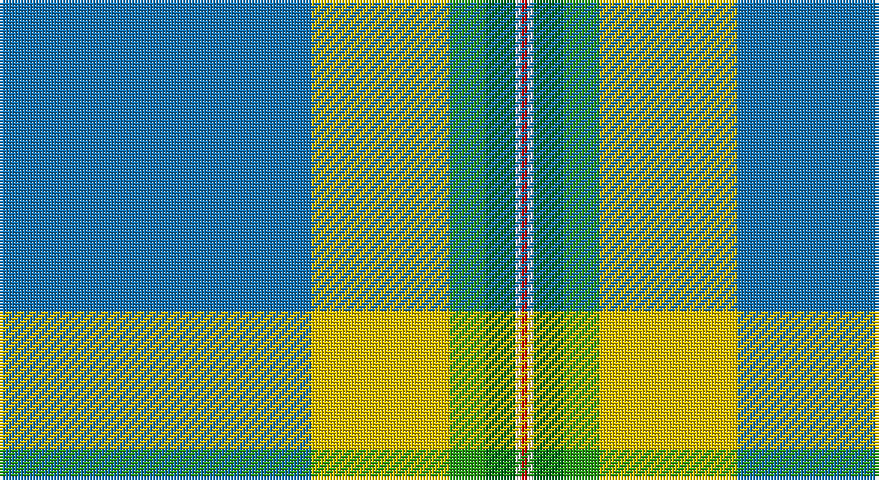

This page is one **sett** — a single exact thread-count. It belongs to the [tartan](/setts/b52ly23g6gi5w1r1/)
(the same proportion at any scale), whose colour order is pattern [BYGGWR](/stripes/byggwr/).

Part of the [College of New Caledonia](/tartans/college-of-new-caledonia/) tartan — the named design grouping this sett with its other cloths.

Sourced from tartans-authority.  It is a [6 stripe tartan](/stripes/stripes6/).

Original link http://www.tartansauthority.com/tartan-ferret/display/10310/

## Register references

External register numbers recorded for this tartan.

- Scottish Register of Tartans: [10310](https://www.tartanregister.gov.uk/tartanDetails?ref=10310)
- Scottish Tartans Authority (ITI): 10310

## Thread count
B/104 Y46 G12 Ga10 LN2 R/2

One full sett is **246 threads**.

## Palette

Palette: <strong>Tartan Register</strong>
<table><thead><tr><th>Colour</th><th>Threads</th><th>Shade</th><th>Base</th><th>OKLCh</th></tr></thead><tbody><tr><td>B/</td><td style="text-align:right;font-variant-numeric:tabular-nums">104</td><td><code style="background-color:#1474B4;">#1474B4</code> <small style="color:#888">#1474B4</small></td><td>B <code style="background-color:#2A418A;">#2A418A</code></td><td><small style="color:#888">oklch(54.0% 0.129 245.1)</small></td></tr><tr><td>Y</td><td style="text-align:right;font-variant-numeric:tabular-nums">46</td><td><code style="background-color:#E8C000;">#E8C000</code> <small style="color:#888">#E8C000</small></td><td>Y <code style="background-color:#F2BF00;">#F2BF00</code></td><td><small style="color:#888">oklch(81.9% 0.168 93.7)</small></td></tr><tr><td>G</td><td style="text-align:right;font-variant-numeric:tabular-nums">12</td><td><code style="background-color:#289C18;">#289C18</code> <small style="color:#888">#289C18</small></td><td>G <code style="background-color:#006100;">#006100</code></td><td><small style="color:#888">oklch(60.6% 0.191 141.6)</small></td></tr><tr><td>Ga</td><td style="text-align:right;font-variant-numeric:tabular-nums">10</td><td><code style="background-color:#006818;">#006818</code> <small style="color:#888">#006818</small></td><td>G <code style="background-color:#006100;">#006100</code></td><td><small style="color:#888">oklch(45.0% 0.142 145.0)</small></td></tr><tr><td>LN</td><td style="text-align:right;font-variant-numeric:tabular-nums">2</td><td><code style="background-color:#E0E0E0;">#E0E0E0</code> <small style="color:#888">#E0E0E0</small></td><td>W <code style="background-color:#F7F7F7;">#F7F7F7</code></td><td><small style="color:#888">oklch(90.7% 0.000 89.9)</small></td></tr><tr><td>R/</td><td style="text-align:right;font-variant-numeric:tabular-nums">2</td><td><code style="background-color:#C80000;">#C80000</code> <small style="color:#888">#C80000</small></td><td>R <code style="background-color:#CC0000;">#CC0000</code></td><td><small style="color:#888">oklch(52.3% 0.215 29.2)</small></td></tr></tbody></table>

# Sample pattern

## Compared to the master

This cloth is one sett of its design; the master sett (the exemplar the design is anchored on) is below for comparison.

<figure style="margin:0"><figcaption style="color:#888;font-size:smaller">this sett</figcaption></figure>
<figure style="margin:0"><figcaption style="color:#888;font-size:smaller"><a href="/setts/db52lo23g6dg5w1r1/">master sett →</a></figcaption></figure>

## Nearest tartans

The nearest existing variants by ΔTartan distance, with this tartan at the top so the swatches line up against it.

ΔTartan

Tartan

Sett

—

<a href="/ttd/edit/#slug=b52ly23g6gi5w1r1~x2">College of New Caledonia (Corporate)</a> <a class="nn-out" href="/variants/s6/b52ly23g6gi5w1r1~x2/" title="open its dictionary page">↗</a>

1.36

<a href="/ttd/edit/#slug=dt50g25ly3lb8r1w1r1~x2&amp;base=b52ly23g6gi5w1r1~x2">Wells (2014)</a> <a class="nn-out" href="/variants/s7/dt50g25ly3lb8r1w1r1~x2/" title="open its dictionary page">↗</a>

1.40

<a href="/ttd/edit/#slug=r8t45w1o4k11g6r4~x2&amp;base=b52ly23g6gi5w1r1~x2">Ascension Island Heritage Trust</a> <a class="nn-out" href="/variants/s7/r8t45w1o4k11g6r4~x2/" title="open its dictionary page">↗</a>

1.45

<a href="/variants/s7/r2w1lb50t24g12ki1k1~x2/">Pincock Name Tartan</a>

1.49

<a href="/ttd/edit/#slug=lo2db4g60p30w1~x2&amp;base=b52ly23g6gi5w1r1~x2">McGuinness, Tam (Personal)</a> <a class="nn-out" href="/variants/s5/lo2db4g60p30w1~x2/" title="open its dictionary page">↗</a>

1.54

<a href="/ttd/edit/#slug=lb54dy4o4g12m4g8w1g8db6~x2&amp;base=b52ly23g6gi5w1r1~x2">Cadenhead (2015)</a> <a class="nn-out" href="/variants/s9/lb54dy4o4g12m4g8w1g8db6~x2/" title="open its dictionary page">↗</a>

1.57

<a href="/ttd/edit/#slug=r2w1lb50t24g12k1ly1~x2&amp;base=b52ly23g6gi5w1r1~x2">Pincock (Name)</a> <a class="nn-out" href="/variants/s7/r2w1lb50t24g12k1ly1~x2/" title="open its dictionary page">↗</a>

1.62

<a href="/ttd/edit/#slug=p4g24dg6lg4dg4lg4dg44lo1w4&amp;base=b52ly23g6gi5w1r1~x2">Macmillan Cancer Support</a> <a class="nn-out" href="/variants/s9/p4g24dg6lg4dg4lg4dg44lo1w4/" title="open its dictionary page">↗</a>

1.71

<a href="/ttd/edit/#slug=o36ly2o1ly2o4dt12w8dy2dg12~x2&amp;base=b52ly23g6gi5w1r1~x2">Nickel Lodge Centennial (Corporate)</a> <a class="nn-out" href="/variants/s9/o36ly2o1ly2o4dt12w8dy2dg12~x2/" title="open its dictionary page">↗</a>

1.72

<a href="/ttd/edit/#slug=k2w1g5ri1t18r2~x2&amp;base=b52ly23g6gi5w1r1~x2">Norris (1998)</a> <a class="nn-out" href="/variants/s6/k2w1g5ri1t18r2~x2/" title="open its dictionary page">↗</a>

1.74

<a href="/ttd/edit/#slug=db52lo23g6dg5w1r1~x2&amp;base=b52ly23g6gi5w1r1~x2">College of New Caledonia</a> <a class="nn-out" href="/variants/s6/db52lo23g6dg5w1r1~x2/" title="open its dictionary page">↗</a>

## Neighbour map

Every grey dot is one of 14360 variants placed by the first two principal components of the ΔTartan feature space (44% of its variance). Red is this tartan; blue dots are its nearest — click one to open its page.

<svg viewBox="0 0 640 380" role="img" style="max-width:100%;height:auto;border:1px solid #e0e0e0;border-radius:4px;display:block" xmlns="http://www.w3.org/2000/svg"><image href="/nn/cloud.v1.png" width="640" height="380"/><a href="/variants/s7/dt50g25ly3lb8r1w1r1~x2/"><circle cx="345.0" cy="91.6" r="4" fill="#3465a4"><title>Wells (2014)</title></circle></a><a href="/variants/s7/r8t45w1o4k11g6r4~x2/"><circle cx="334.8" cy="92.0" r="4" fill="#3465a4"><title>Ascension Island Heritage Trust</title></circle></a><a href="/variants/s7/r2w1lb50t24g12ki1k1~x2/"><circle cx="318.4" cy="71.0" r="4" fill="#3465a4"><title>Pincock Name Tartan</title></circle></a><a href="/variants/s5/lo2db4g60p30w1~x2/"><circle cx="382.3" cy="113.6" r="4" fill="#3465a4"><title>McGuinness, Tam (Personal)</title></circle></a><a href="/variants/s9/lb54dy4o4g12m4g8w1g8db6~x2/"><circle cx="295.0" cy="51.4" r="4" fill="#3465a4"><title>Cadenhead (2015)</title></circle></a><a href="/variants/s7/r2w1lb50t24g12k1ly1~x2/"><circle cx="327.4" cy="75.0" r="4" fill="#3465a4"><title>Pincock (Name)</title></circle></a><a href="/variants/s9/p4g24dg6lg4dg4lg4dg44lo1w4/"><circle cx="331.2" cy="91.2" r="4" fill="#3465a4"><title>Macmillan Cancer Support</title></circle></a><a href="/variants/s9/o36ly2o1ly2o4dt12w8dy2dg12~x2/"><circle cx="290.0" cy="94.5" r="4" fill="#3465a4"><title>Nickel Lodge Centennial (Corporate)</title></circle></a><a href="/variants/s6/k2w1g5ri1t18r2~x2/"><circle cx="339.7" cy="134.4" r="4" fill="#3465a4"><title>Norris (1998)</title></circle></a><a href="/variants/s6/db52lo23g6dg5w1r1~x2/"><circle cx="357.2" cy="90.2" r="4" fill="#3465a4"><title>College of New Caledonia</title></circle></a><circle cx="356.6" cy="96.0" r="5" fill="#c00000"/></svg>

ID: /variants/s6/b52ly23g6gi5w1r1~x2/
