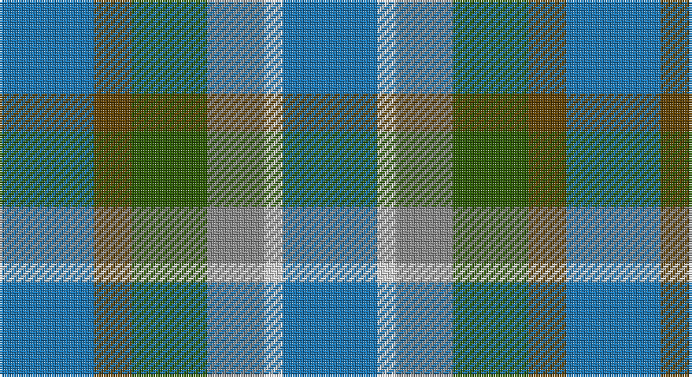

This page is one **sett** — a single exact thread-count. It belongs to the [tartan](/setts/b5dy2dg4o3w1b5/)
(the same proportion at any scale), whose colour order is pattern [BGGRWB](/stripes/bggrwb/).

Sourced from tartans-authority.  It is a [6 stripe tartan](/stripes/stripes6/).

Original link http://www.tartansauthority.com/tartan-ferret/display/10431/

## Register references

External register numbers recorded for this tartan.

- Scottish Register of Tartans: [10431](https://www.tartanregister.gov.uk/tartanDetails?ref=10431)
- Scottish Tartans Authority (ITI): 10431

## Thread count
B/40 T16 G32 N24 LN8 B/40

One full sett is **240 threads**.

## Palette

Palette: <strong>Tartan Register</strong>
<table><thead><tr><th>Colour</th><th>Threads</th><th>Shade</th><th>Base</th><th>OKLCh</th></tr></thead><tbody><tr><td>B/</td><td style="text-align:right;font-variant-numeric:tabular-nums">40</td><td><code style="background-color:#1474B4;">#1474B4</code> <small style="color:#888">#1474B4</small></td><td>B <code style="background-color:#2A418A;">#2A418A</code></td><td><small style="color:#888">oklch(54.0% 0.129 245.1)</small></td></tr><tr><td>T</td><td style="text-align:right;font-variant-numeric:tabular-nums">16</td><td><code style="background-color:#604000;">#604000</code> <small style="color:#888">#604000</small></td><td>G <code style="background-color:#006100;">#006100</code></td><td><small style="color:#888">oklch(39.8% 0.083 76.8)</small></td></tr><tr><td>G</td><td style="text-align:right;font-variant-numeric:tabular-nums">32</td><td><code style="background-color:#285800;">#285800</code> <small style="color:#888">#285800</small></td><td>G <code style="background-color:#006100;">#006100</code></td><td><small style="color:#888">oklch(41.0% 0.122 135.8)</small></td></tr><tr><td>N</td><td style="text-align:right;font-variant-numeric:tabular-nums">24</td><td><code style="background-color:#888888;">#888888</code> <small style="color:#888">#888888</small></td><td>R <code style="background-color:#CC0000;">#CC0000</code></td><td><small style="color:#888">oklch(62.7% 0.000 89.9)</small></td></tr><tr><td>LN</td><td style="text-align:right;font-variant-numeric:tabular-nums">8</td><td><code style="background-color:#E0E0E0;">#E0E0E0</code> <small style="color:#888">#E0E0E0</small></td><td>W <code style="background-color:#F7F7F7;">#F7F7F7</code></td><td><small style="color:#888">oklch(90.7% 0.000 89.9)</small></td></tr><tr><td>B/</td><td style="text-align:right;font-variant-numeric:tabular-nums">40</td><td><code style="background-color:#1474B4;">#1474B4</code> <small style="color:#888">#1474B4</small></td><td>B <code style="background-color:#2A418A;">#2A418A</code></td><td><small style="color:#888">oklch(54.0% 0.129 245.1)</small></td></tr></tbody></table>

# Sample pattern

## Nearest tartans

The nearest existing variants by ΔTartan distance, with this tartan at the top so the swatches line up against it.

ΔTartan

Tartan

Sett

—

<a href="/ttd/edit/#slug=b5dy2dg4o3w1b5~x8">Heriot Bay (District)</a> <a class="nn-out" href="/variants/s6/b5dy2dg4o3w1b5~x8/" title="open its dictionary page">↗</a>

1.58

<a href="/ttd/edit/#slug=r9b6dt13b21o18w4~x2&amp;base=b5dy2dg4o3w1b5~x8">Fox-Eves Wedding (Personal)</a> <a class="nn-out" href="/variants/s6/r9b6dt13b21o18w4~x2/" title="open its dictionary page">↗</a>

1.62

<a href="/ttd/edit/#slug=dp2g13b12w3b10w3b12o13gi2~x2&amp;base=b5dy2dg4o3w1b5~x8">Mounth, The</a> <a class="nn-out" href="/variants/s9/dp2g13b12w3b10w3b12o13gi2~x2/" title="open its dictionary page">↗</a>

1.62

<a href="/ttd/edit/#slug=db3g11t2db11b6g3~x2&amp;base=b5dy2dg4o3w1b5~x8">Unnamed, No 29</a> <a class="nn-out" href="/variants/s6/db3g11t2db11b6g3~x2/" title="open its dictionary page">↗</a>

1.75

<a href="/ttd/edit/#slug=dg3b6db11t2dg11db3~x2&amp;base=b5dy2dg4o3w1b5~x8">Unidentified No 29</a> <a class="nn-out" href="/variants/s6/dg3b6db11t2dg11db3~x2/" title="open its dictionary page">↗</a>

1.81

<a href="/ttd/edit/#slug=n14r4n14t15db13w3~x2&amp;base=b5dy2dg4o3w1b5~x8">Blue</a> <a class="nn-out" href="/variants/s6/n14r4n14t15db13w3~x2/" title="open its dictionary page">↗</a>

1.81

<a href="/ttd/edit/#slug=o16dg29n19g8n19dg29o16r4~x2&amp;base=b5dy2dg4o3w1b5~x8">Styrian</a> <a class="nn-out" href="/variants/s8/o16dg29n19g8n19dg29o16r4~x2/" title="open its dictionary page">↗</a>

1.82

<a href="/ttd/edit/#slug=db16g8b8g8db16r3do3y3~x2&amp;base=b5dy2dg4o3w1b5~x8">Glen Erin</a> <a class="nn-out" href="/variants/s8/db16g8b8g8db16r3do3y3~x2/" title="open its dictionary page">↗</a>

1.84

<a href="/ttd/edit/#slug=b25g25k6dt10r6~x2&amp;base=b5dy2dg4o3w1b5~x8">Breon (Personal)</a> <a class="nn-out" href="/variants/s5/b25g25k6dt10r6~x2/" title="open its dictionary page">↗</a>

1.93

<a href="/ttd/edit/#slug=dy9g9ly2g9dy9b9dy3~x2&amp;base=b5dy2dg4o3w1b5~x8">MacKay - 1800 (Reay Coat) (Artefact)</a> <a class="nn-out" href="/variants/s7/dy9g9ly2g9dy9b9dy3~x2/" title="open its dictionary page">↗</a>

1.96

<a href="/ttd/edit/#slug=r1dy7g7db7g7db7r1~x8&amp;base=b5dy2dg4o3w1b5~x8">Tennant (Yules)</a> <a class="nn-out" href="/variants/s7/r1dy7g7db7g7db7r1~x8/" title="open its dictionary page">↗</a>

## Neighbour map

Every grey dot is one of 14360 variants placed by the first two principal components of the ΔTartan feature space (44% of its variance). Red is this tartan; blue dots are its nearest — click one to open its page.

<svg viewBox="0 0 640 380" role="img" style="max-width:100%;height:auto;border:1px solid #e0e0e0;border-radius:4px;display:block" xmlns="http://www.w3.org/2000/svg"><image href="/nn/cloud.v1.png" width="640" height="380"/><a href="/variants/s6/r9b6dt13b21o18w4~x2/"><circle cx="131.5" cy="258.4" r="4" fill="#3465a4"><title>Fox-Eves Wedding (Personal)</title></circle></a><a href="/variants/s9/dp2g13b12w3b10w3b12o13gi2~x2/"><circle cx="194.1" cy="222.8" r="4" fill="#3465a4"><title>Mounth, The</title></circle></a><a href="/variants/s6/db3g11t2db11b6g3~x2/"><circle cx="198.5" cy="274.3" r="4" fill="#3465a4"><title>Unnamed, No 29</title></circle></a><a href="/variants/s6/dg3b6db11t2dg11db3~x2/"><circle cx="212.8" cy="285.9" r="4" fill="#3465a4"><title>Unidentified No 29</title></circle></a><a href="/variants/s6/n14r4n14t15db13w3~x2/"><circle cx="148.0" cy="263.3" r="4" fill="#3465a4"><title>Blue</title></circle></a><a href="/variants/s8/o16dg29n19g8n19dg29o16r4~x2/"><circle cx="195.1" cy="267.6" r="4" fill="#3465a4"><title>Styrian</title></circle></a><a href="/variants/s8/db16g8b8g8db16r3do3y3~x2/"><circle cx="202.8" cy="240.0" r="4" fill="#3465a4"><title>Glen Erin</title></circle></a><a href="/variants/s5/b25g25k6dt10r6~x2/"><circle cx="137.3" cy="276.7" r="4" fill="#3465a4"><title>Breon (Personal)</title></circle></a><a href="/variants/s7/dy9g9ly2g9dy9b9dy3~x2/"><circle cx="211.2" cy="314.3" r="4" fill="#3465a4"><title>MacKay - 1800 (Reay Coat) (Artefact)</title></circle></a><a href="/variants/s7/r1dy7g7db7g7db7r1~x8/"><circle cx="208.4" cy="281.6" r="4" fill="#3465a4"><title>Tennant (Yules)</title></circle></a><circle cx="199.1" cy="286.3" r="5" fill="#c00000"/></svg>

ID: /variants/s6/b5dy2dg4o3w1b5~x8/
