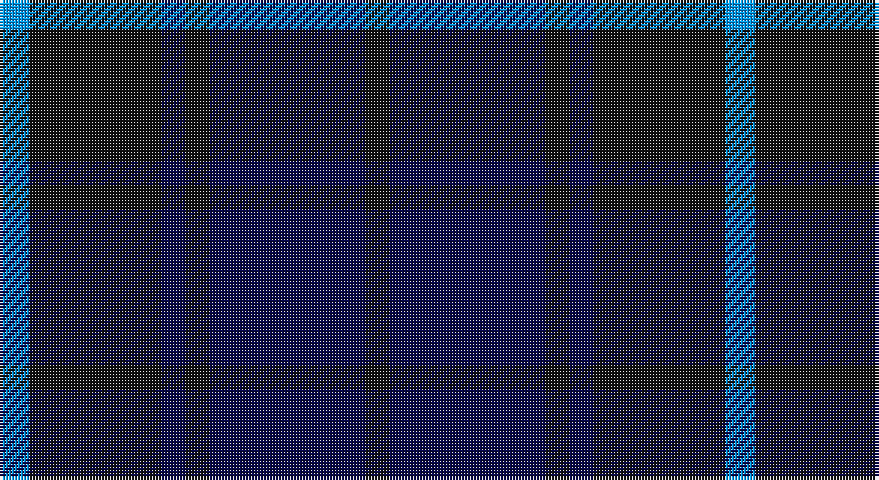

This page is one **sett** — a single exact thread-count. It belongs to the [tartan](/setts/b5k22db4k4db26k4/)
(the same proportion at any scale), whose colour order is pattern [BKBKBK](/stripes/bkbkbk/).

Sourced from register-of-tartans.  It is a [6 stripe tartan](/stripes/stripes6/).

Original link https://www.tartanregister.gov.uk/tartanDetails.aspx?ref=5450

## Register references

External register numbers recorded for this tartan.

- Scottish Register of Tartans: [5450](https://www.tartanregister.gov.uk/tartanDetails.aspx?ref=5450)
- Scottish Tartans World Register: 2832

## Thread count
B/10 K44 DB8 K8 DB52 K/8

One full sett is **242 threads**.

## Palette

Palette: <strong>Tartan Register</strong> <small style="color:#888">(2 of 3 colours)</small>
<table><thead><tr><th>Colour</th><th>Threads</th><th>Shade</th><th>Base</th><th>OKLCh</th></tr></thead><tbody><tr><td>B/</td><td style="text-align:right;font-variant-numeric:tabular-nums">10</td><td><code style="background-color:#0596FA;">#0596FA</code> <small style="color:#888">#0596FA</small></td><td>B <code style="background-color:#2A418A;">#2A418A</code></td><td><small style="color:#888">oklch(66.0% 0.180 248.9)</small></td></tr><tr><td>K</td><td style="text-align:right;font-variant-numeric:tabular-nums">44</td><td><code style="background-color:#101010;">#101010</code> <small style="color:#888">#101010</small></td><td>K <code style="background-color:#000000;">#000000</code></td><td><small style="color:#888">oklch(17.3% 0.000 89.9)</small></td></tr><tr><td>DB</td><td style="text-align:right;font-variant-numeric:tabular-nums">8</td><td><code style="background-color:#080848;">#080848</code> <small style="color:#888">#080848</small></td><td>B <code style="background-color:#2A418A;">#2A418A</code></td><td><small style="color:#888">oklch(20.2% 0.112 270.4)</small></td></tr><tr><td>K</td><td style="text-align:right;font-variant-numeric:tabular-nums">8</td><td><code style="background-color:#101010;">#101010</code> <small style="color:#888">#101010</small></td><td>K <code style="background-color:#000000;">#000000</code></td><td><small style="color:#888">oklch(17.3% 0.000 89.9)</small></td></tr><tr><td>DB</td><td style="text-align:right;font-variant-numeric:tabular-nums">52</td><td><code style="background-color:#080848;">#080848</code> <small style="color:#888">#080848</small></td><td>B <code style="background-color:#2A418A;">#2A418A</code></td><td><small style="color:#888">oklch(20.2% 0.112 270.4)</small></td></tr><tr><td>K/</td><td style="text-align:right;font-variant-numeric:tabular-nums">8</td><td><code style="background-color:#101010;">#101010</code> <small style="color:#888">#101010</small></td><td>K <code style="background-color:#000000;">#000000</code></td><td><small style="color:#888">oklch(17.3% 0.000 89.9)</small></td></tr></tbody></table>

# Sample pattern

## Nearest tartans

The nearest existing variants by ΔTartan distance, with this tartan at the top so the swatches line up against it.

ΔTartan

Tartan

Sett

—

<a href="/ttd/edit/#slug=b5k22db4k4db26k4~x2">Slanj, The</a> <a class="nn-out" href="/variants/s6/b5k22db4k4db26k4~x2/" title="open its dictionary page">↗</a>

1.55

<a href="/ttd/edit/#slug=db37r10dg22db11dg3r3~x2&amp;base=b5k22db4k4db26k4~x2">Perthshire, New /Tourist Board</a> <a class="nn-out" href="/variants/s6/db37r10dg22db11dg3r3~x2/" title="open its dictionary page">↗</a>

1.57

<a href="/ttd/edit/#slug=k1db12k12g1k12db12g1~x4&amp;base=b5k22db4k4db26k4~x2">Marchmont (Personal)</a> <a class="nn-out" href="/variants/s7/k1db12k12g1k12db12g1~x4/" title="open its dictionary page">↗</a>

1.59

<a href="/ttd/edit/#slug=dg8w3dt6db11dt30db5~x2&amp;base=b5k22db4k4db26k4~x2">Craig Devlin (Dundee) (Personal)</a> <a class="nn-out" href="/variants/s6/dg8w3dt6db11dt30db5~x2/" title="open its dictionary page">↗</a>

1.71

<a href="/ttd/edit/#slug=db5k2db14k14db2lr2~x2&amp;base=b5k22db4k4db26k4~x2">Royal Scotsman Train (Corporate)</a> <a class="nn-out" href="/variants/s6/db5k2db14k14db2lr2~x2/" title="open its dictionary page">↗</a>

1.72

<a href="/ttd/edit/#slug=k3db23k17r2~x2&amp;base=b5k22db4k4db26k4~x2">Wellington Variation</a> <a class="nn-out" href="/variants/s4/k3db23k17r2~x2/" title="open its dictionary page">↗</a>

1.73

<a href="/ttd/edit/#slug=db1k3db1k3db8r1~x4&amp;base=b5k22db4k4db26k4~x2">Morgan (MacKay Blue) Clan Tartan</a> <a class="nn-out" href="/variants/s6/db1k3db1k3db8r1~x4/" title="open its dictionary page">↗</a>

1.79

<a href="/ttd/edit/#slug=dg1db3dg1db2dg1k6dg1k6db6dg1db1~x2&amp;base=b5k22db4k4db26k4~x2">Clergy</a> <a class="nn-out" href="/variants/s11/dg1db3dg1db2dg1k6dg1k6db6dg1db1~x2/" title="open its dictionary page">↗</a>

1.80

<a href="/ttd/edit/#slug=db2dg6db6dp5db1dp2~x2&amp;base=b5k22db4k4db26k4~x2">Unidentified no. 54</a> <a class="nn-out" href="/variants/s6/db2dg6db6dp5db1dp2~x2/" title="open its dictionary page">↗</a>

1.83

<a href="/ttd/edit/#slug=db16k2db2k2db2k6dg13ly2dg3~x2&amp;base=b5k22db4k4db26k4~x2">Christian Dewar (Personal)</a> <a class="nn-out" href="/variants/s9/db16k2db2k2db2k6dg13ly2dg3~x2/" title="open its dictionary page">↗</a>

1.84

<a href="/ttd/edit/#slug=dp18dg24k3db6dp2db5dp18~x2&amp;base=b5k22db4k4db26k4~x2">Saorsa</a> <a class="nn-out" href="/variants/s7/dp18dg24k3db6dp2db5dp18~x2/" title="open its dictionary page">↗</a>

## Neighbour map

Every grey dot is one of 14360 variants placed by the first two principal components of the ΔTartan feature space (44% of its variance). Red is this tartan; blue dots are its nearest — click one to open its page.

<svg viewBox="0 0 640 380" role="img" style="max-width:100%;height:auto;border:1px solid #e0e0e0;border-radius:4px;display:block" xmlns="http://www.w3.org/2000/svg"><image href="/nn/cloud.v1.png" width="640" height="380"/><a href="/variants/s6/db37r10dg22db11dg3r3~x2/"><circle cx="387.9" cy="266.5" r="4" fill="#3465a4"><title>Perthshire, New /Tourist Board</title></circle></a><a href="/variants/s7/k1db12k12g1k12db12g1~x4/"><circle cx="366.9" cy="265.4" r="4" fill="#3465a4"><title>Marchmont (Personal)</title></circle></a><a href="/variants/s6/dg8w3dt6db11dt30db5~x2/"><circle cx="372.8" cy="264.6" r="4" fill="#3465a4"><title>Craig Devlin (Dundee) (Personal)</title></circle></a><a href="/variants/s6/db5k2db14k14db2lr2~x2/"><circle cx="353.0" cy="271.7" r="4" fill="#3465a4"><title>Royal Scotsman Train (Corporate)</title></circle></a><a href="/variants/s4/k3db23k17r2~x2/"><circle cx="394.4" cy="286.2" r="4" fill="#3465a4"><title>Wellington Variation</title></circle></a><a href="/variants/s6/db1k3db1k3db8r1~x4/"><circle cx="404.2" cy="272.9" r="4" fill="#3465a4"><title>Morgan (MacKay Blue) Clan Tartan</title></circle></a><a href="/variants/s11/dg1db3dg1db2dg1k6dg1k6db6dg1db1~x2/"><circle cx="287.5" cy="268.0" r="4" fill="#3465a4"><title>Clergy</title></circle></a><a href="/variants/s6/db2dg6db6dp5db1dp2~x2/"><circle cx="290.3" cy="334.0" r="4" fill="#3465a4"><title>Unidentified no. 54</title></circle></a><a href="/variants/s9/db16k2db2k2db2k6dg13ly2dg3~x2/"><circle cx="273.1" cy="233.1" r="4" fill="#3465a4"><title>Christian Dewar (Personal)</title></circle></a><a href="/variants/s7/dp18dg24k3db6dp2db5dp18~x2/"><circle cx="335.2" cy="249.2" r="4" fill="#3465a4"><title>Saorsa</title></circle></a><circle cx="347.6" cy="294.5" r="5" fill="#c00000"/></svg>

ID: /variants/s6/b5k22db4k4db26k4~x2/
