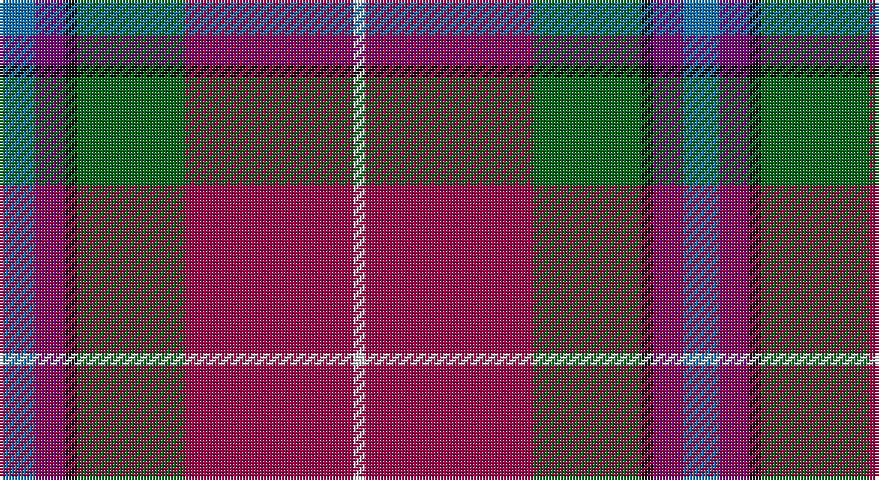

This page is one **sett** — a single exact thread-count. It belongs to the [tartan](/setts/b6dp5k2g18m28w2/)
(the same proportion at any scale), whose colour order is pattern [BBKGRW](/stripes/bbkgrw/).

Sourced from tartans-authority.  It is a [6 stripe tartan](/stripes/stripes6/).

Original link http://www.tartansauthority.com/tartan-ferret/display/10243/

## Register references

External register numbers recorded for this tartan.

- Scottish Register of Tartans: [10243](https://www.tartanregister.gov.uk/tartanDetails?ref=10243)
- Scottish Tartans Authority (ITI): 10243

## Thread count
B/12 P10 K4 G36 R56 LN/4

One full sett is **228 threads**.

## Palette

Palette: <strong>Tartan Register</strong>
<table><thead><tr><th>Colour</th><th>Threads</th><th>Shade</th><th>Base</th><th>OKLCh</th></tr></thead><tbody><tr><td>B/</td><td style="text-align:right;font-variant-numeric:tabular-nums">12</td><td><code style="background-color:#1474B4;">#1474B4</code> <small style="color:#888">#1474B4</small></td><td>B <code style="background-color:#2A418A;">#2A418A</code></td><td><small style="color:#888">oklch(54.0% 0.129 245.1)</small></td></tr><tr><td>P</td><td style="text-align:right;font-variant-numeric:tabular-nums">10</td><td><code style="background-color:#780078;">#780078</code> <small style="color:#888">#780078</small></td><td>B <code style="background-color:#2A418A;">#2A418A</code></td><td><small style="color:#888">oklch(40.2% 0.185 328.4)</small></td></tr><tr><td>K</td><td style="text-align:right;font-variant-numeric:tabular-nums">4</td><td><code style="background-color:#101010;">#101010</code> <small style="color:#888">#101010</small></td><td>K <code style="background-color:#000000;">#000000</code></td><td><small style="color:#888">oklch(17.3% 0.000 89.9)</small></td></tr><tr><td>G</td><td style="text-align:right;font-variant-numeric:tabular-nums">36</td><td><code style="background-color:#006818;">#006818</code> <small style="color:#888">#006818</small></td><td>G <code style="background-color:#006100;">#006100</code></td><td><small style="color:#888">oklch(45.0% 0.142 145.0)</small></td></tr><tr><td>R</td><td style="text-align:right;font-variant-numeric:tabular-nums">56</td><td><code style="background-color:#A00048;">#A00048</code> <small style="color:#888">#A00048</small></td><td>R <code style="background-color:#CC0000;">#CC0000</code></td><td><small style="color:#888">oklch(45.4% 0.182 5.3)</small></td></tr><tr><td>LN/</td><td style="text-align:right;font-variant-numeric:tabular-nums">4</td><td><code style="background-color:#E0E0E0;">#E0E0E0</code> <small style="color:#888">#E0E0E0</small></td><td>W <code style="background-color:#F7F7F7;">#F7F7F7</code></td><td><small style="color:#888">oklch(90.7% 0.000 89.9)</small></td></tr></tbody></table>

# Sample pattern

## Nearest tartans

The nearest existing variants by ΔTartan distance, with this tartan at the top so the swatches line up against it.

ΔTartan

Tartan

Sett

—

<a href="/ttd/edit/#slug=b6dp5k2g18m28w2~x2">Dundhuin Ladies (Personal)</a> <a class="nn-out" href="/variants/s6/b6dp5k2g18m28w2~x2/" title="open its dictionary page">↗</a>

1.01

<a href="/ttd/edit/#slug=w3o4dg2o22dt5oi16ly3~x2&amp;base=b6dp5k2g18m28w2~x2">Pubcrawlers, The</a> <a class="nn-out" href="/variants/s7/w3o4dg2o22dt5oi16ly3~x2/" title="open its dictionary page">↗</a>

1.02

<a href="/ttd/edit/#slug=gi3g3r22k5db22ly2~x2&amp;base=b6dp5k2g18m28w2~x2">MacLeod Society of Scotland</a> <a class="nn-out" href="/variants/s6/gi3g3r22k5db22ly2~x2/" title="open its dictionary page">↗</a>

1.02

<a href="/ttd/edit/#slug=r63w4k4dp18ly4dg50~x2&amp;base=b6dp5k2g18m28w2~x2">Gordon of Abergeldie (Portrait)</a> <a class="nn-out" href="/variants/s6/r63w4k4dp18ly4dg50~x2/" title="open its dictionary page">↗</a>

1.08

<a href="/ttd/edit/#slug=r30db12k3g12ly2g3w2~x2&amp;base=b6dp5k2g18m28w2~x2">Hewitt (Name)</a> <a class="nn-out" href="/variants/s7/r30db12k3g12ly2g3w2~x2/" title="open its dictionary page">↗</a>

1.15

<a href="/ttd/edit/#slug=r16ly2dy7ly2b24k2g2~x2&amp;base=b6dp5k2g18m28w2~x2">Traill Clan/Family Weavers Tartan</a> <a class="nn-out" href="/variants/s7/r16ly2dy7ly2b24k2g2~x2/" title="open its dictionary page">↗</a>

1.16

<a href="/ttd/edit/#slug=r30db12k6dg12ly2dg3w2~x2&amp;base=b6dp5k2g18m28w2~x2">Hewitt</a> <a class="nn-out" href="/variants/s7/r30db12k6dg12ly2dg3w2~x2/" title="open its dictionary page">↗</a>

1.17

<a href="/ttd/edit/#slug=lr6o5k2y18r28w2~x2&amp;base=b6dp5k2g18m28w2~x2">Dundhuin</a> <a class="nn-out" href="/variants/s6/lr6o5k2y18r28w2~x2/" title="open its dictionary page">↗</a>

1.19

<a href="/ttd/edit/#slug=r48t16lo5dg17w8k3~x2&amp;base=b6dp5k2g18m28w2~x2">Scottish American Society of Michigan (Official)</a> <a class="nn-out" href="/variants/s6/r48t16lo5dg17w8k3~x2/" title="open its dictionary page">↗</a>

1.19

<a href="/ttd/edit/#slug=db3t1k1r12ri1g9r1t1db3~x4&amp;base=b6dp5k2g18m28w2~x2">Moray of Abercairney Clan Tartan</a> <a class="nn-out" href="/variants/s9/db3t1k1r12ri1g9r1t1db3~x4/" title="open its dictionary page">↗</a>

1.24

<a href="/ttd/edit/#slug=r16ly2dy7ly2t24k2g2~x2&amp;base=b6dp5k2g18m28w2~x2">Traill (Personal)</a> <a class="nn-out" href="/variants/s7/r16ly2dy7ly2t24k2g2~x2/" title="open its dictionary page">↗</a>

## Neighbour map

Every grey dot is one of 14360 variants placed by the first two principal components of the ΔTartan feature space (44% of its variance). Red is this tartan; blue dots are its nearest — click one to open its page.

<svg viewBox="0 0 640 380" role="img" style="max-width:100%;height:auto;border:1px solid #e0e0e0;border-radius:4px;display:block" xmlns="http://www.w3.org/2000/svg"><image href="/nn/cloud.v1.png" width="640" height="380"/><a href="/variants/s7/w3o4dg2o22dt5oi16ly3~x2/"><circle cx="237.3" cy="165.1" r="4" fill="#3465a4"><title>Pubcrawlers, The</title></circle></a><a href="/variants/s6/gi3g3r22k5db22ly2~x2/"><circle cx="187.6" cy="158.5" r="4" fill="#3465a4"><title>MacLeod Society of Scotland</title></circle></a><a href="/variants/s6/r63w4k4dp18ly4dg50~x2/"><circle cx="241.6" cy="141.5" r="4" fill="#3465a4"><title>Gordon of Abergeldie (Portrait)</title></circle></a><a href="/variants/s7/r30db12k3g12ly2g3w2~x2/"><circle cx="230.1" cy="130.1" r="4" fill="#3465a4"><title>Hewitt (Name)</title></circle></a><a href="/variants/s7/r16ly2dy7ly2b24k2g2~x2/"><circle cx="211.7" cy="152.9" r="4" fill="#3465a4"><title>Traill Clan/Family Weavers Tartan</title></circle></a><a href="/variants/s7/r30db12k6dg12ly2dg3w2~x2/"><circle cx="206.9" cy="131.8" r="4" fill="#3465a4"><title>Hewitt</title></circle></a><a href="/variants/s6/lr6o5k2y18r28w2~x2/"><circle cx="257.2" cy="163.5" r="4" fill="#3465a4"><title>Dundhuin</title></circle></a><a href="/variants/s6/r48t16lo5dg17w8k3~x2/"><circle cx="231.2" cy="135.4" r="4" fill="#3465a4"><title>Scottish American Society of Michigan (Official)</title></circle></a><a href="/variants/s9/db3t1k1r12ri1g9r1t1db3~x4/"><circle cx="200.9" cy="133.5" r="4" fill="#3465a4"><title>Moray of Abercairney Clan Tartan</title></circle></a><a href="/variants/s7/r16ly2dy7ly2t24k2g2~x2/"><circle cx="202.6" cy="141.9" r="4" fill="#3465a4"><title>Traill (Personal)</title></circle></a><circle cx="239.4" cy="158.3" r="5" fill="#c00000"/></svg>

ID: /variants/s6/b6dp5k2g18m28w2~x2/
