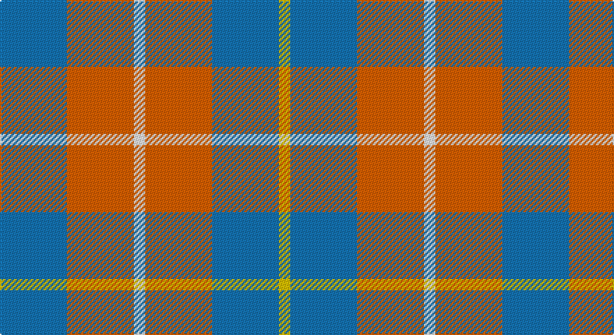

This page is one **sett** — a single exact thread-count. It belongs to the [tartan](/setts/b6o6w1o6b6ly1/)
(the same proportion at any scale), whose colour order is pattern [BRWRBY](/stripes/brwrby/).

Part of the [Unidentified Lindley](/tartans/unidentified-lindley/) tartan — the named design grouping this sett with its other cloths.

Sourced from register-of-tartans.  It is a [6 stripe tartan](/stripes/stripes6/).

Original link https://www.tartanregister.gov.uk/tartanDetails.aspx?ref=4303

## Also known as

This cloth is also recorded under:

- Unidentified Lindley #2
- Unidentified Lindley #3
- Unidentified Lindley #4
- Unidentified Lindley #5
- Unidentified Lindley #6
- Unidentified Lindley #7

## Register references

External register numbers recorded for this tartan.

- Scottish Register of Tartans: [4303](https://www.tartanregister.gov.uk/tartanDetails.aspx?ref=4303)
- Scottish Tartans Authority (ITI): 6345

## Thread count
B/48 O48 W8 O48 B48 Y/8

One full sett is **360 threads**.

## Palette

Palette: <strong>Tartan Register</strong>
<table><thead><tr><th>Colour</th><th>Threads</th><th>Shade</th><th>Base</th><th>OKLCh</th></tr></thead><tbody><tr><td>B/</td><td style="text-align:right;font-variant-numeric:tabular-nums">48</td><td><code style="background-color:#1474B4;">#1474B4</code> <small style="color:#888">#1474B4</small></td><td>B <code style="background-color:#2A418A;">#2A418A</code></td><td><small style="color:#888">oklch(54.0% 0.129 245.1)</small></td></tr><tr><td>O</td><td style="text-align:right;font-variant-numeric:tabular-nums">48</td><td><code style="background-color:#E86000;">#E86000</code> <small style="color:#888">#E86000</small></td><td>R <code style="background-color:#CC0000;">#CC0000</code></td><td><small style="color:#888">oklch(65.3% 0.187 44.9)</small></td></tr><tr><td>W</td><td style="text-align:right;font-variant-numeric:tabular-nums">8</td><td><code style="background-color:#FCFCFC;">#FCFCFC</code> <small style="color:#888">#FCFCFC</small></td><td>W <code style="background-color:#F7F7F7;">#F7F7F7</code></td><td><small style="color:#888">oklch(99.1% 0.000 89.9)</small></td></tr><tr><td>O</td><td style="text-align:right;font-variant-numeric:tabular-nums">48</td><td><code style="background-color:#E86000;">#E86000</code> <small style="color:#888">#E86000</small></td><td>R <code style="background-color:#CC0000;">#CC0000</code></td><td><small style="color:#888">oklch(65.3% 0.187 44.9)</small></td></tr><tr><td>B</td><td style="text-align:right;font-variant-numeric:tabular-nums">48</td><td><code style="background-color:#1474B4;">#1474B4</code> <small style="color:#888">#1474B4</small></td><td>B <code style="background-color:#2A418A;">#2A418A</code></td><td><small style="color:#888">oklch(54.0% 0.129 245.1)</small></td></tr><tr><td>Y/</td><td style="text-align:right;font-variant-numeric:tabular-nums">8</td><td><code style="background-color:#E8C000;">#E8C000</code> <small style="color:#888">#E8C000</small></td><td>Y <code style="background-color:#F2BF00;">#F2BF00</code></td><td><small style="color:#888">oklch(81.9% 0.168 93.7)</small></td></tr></tbody></table>

# Sample pattern

## Compared to the master

This cloth is one sett of its design; the master sett (the exemplar the design is anchored on) is below for comparison.

<figure style="margin:0"><figcaption style="color:#888;font-size:smaller">this sett</figcaption></figure>
<figure style="margin:0"><figcaption style="color:#888;font-size:smaller"><a href="/setts/b3w1b1w1g22w1b1w1b3k11g22r1g1r2g1r1g22k11b16w1b4w1b16w1b4w1b16k11g22r1g1r2/">master sett →</a></figcaption></figure>

## Nearest tartans

The nearest existing variants by ΔTartan distance, with this tartan at the top so the swatches line up against it.

ΔTartan

Tartan

Sett

—

<a href="/ttd/edit/#slug=b6o6w1o6b6ly1~x8">Unidentified Lindley</a> <a class="nn-out" href="/variants/s6/b6o6w1o6b6ly1~x8/" title="open its dictionary page">↗</a>

1.28

<a href="/ttd/edit/#slug=t2lo1r4t4w2~x10&amp;base=b6o6w1o6b6ly1~x8">Doohan (New South Wales), Andrew</a> <a class="nn-out" href="/variants/s5/t2lo1r4t4w2~x10/" title="open its dictionary page">↗</a>

1.32

<a href="/ttd/edit/#slug=r29b12lg15r8lg15b12r29w4~x2&amp;base=b6o6w1o6b6ly1~x8">Snowbird</a> <a class="nn-out" href="/variants/s8/r29b12lg15r8lg15b12r29w4~x2/" title="open its dictionary page">↗</a>

1.39

<a href="/ttd/edit/#slug=r8lg15b12r29w4~x2&amp;base=b6o6w1o6b6ly1~x8">Snowbird (Corporate)</a> <a class="nn-out" href="/variants/s5/r8lg15b12r29w4~x2/" title="open its dictionary page">↗</a>

1.41

<a href="/ttd/edit/#slug=b10w3b12ly14r4~x2&amp;base=b6o6w1o6b6ly1~x8">MacLeod of Argentina</a> <a class="nn-out" href="/variants/s5/b10w3b12ly14r4~x2/" title="open its dictionary page">↗</a>

1.46

<a href="/ttd/edit/#slug=o25k4w8r16~x4&amp;base=b6o6w1o6b6ly1~x8">Buckeye</a> <a class="nn-out" href="/variants/s4/o25k4w8r16~x4/" title="open its dictionary page">↗</a>

1.47

<a href="/ttd/edit/#slug=db10w3db12ly14r4~x2&amp;base=b6o6w1o6b6ly1~x8">MacLeod, of Argentina</a> <a class="nn-out" href="/variants/s5/db10w3db12ly14r4~x2/" title="open its dictionary page">↗</a>

1.54

<a href="/ttd/edit/#slug=y25k4w8r16~x4&amp;base=b6o6w1o6b6ly1~x8">Buckeye</a> <a class="nn-out" href="/variants/s4/y25k4w8r16~x4/" title="open its dictionary page">↗</a>

1.63

<a href="/ttd/edit/#slug=r4lbi30y14lb11y4~x2&amp;base=b6o6w1o6b6ly1~x8">Trinity Bicycles (Corporate)</a> <a class="nn-out" href="/variants/s5/r4lbi30y14lb11y4~x2/" title="open its dictionary page">↗</a>

1.67

<a href="/ttd/edit/#slug=o22ly10w3db8~x2&amp;base=b6o6w1o6b6ly1~x8">Louisburg</a> <a class="nn-out" href="/variants/s4/o22ly10w3db8~x2/" title="open its dictionary page">↗</a>

1.69

<a href="/ttd/edit/#slug=o16oi2o11oi6k4w2k4oi16~x2&amp;base=b6o6w1o6b6ly1~x8">Sydney (Nova Scotia) (District)</a> <a class="nn-out" href="/variants/s8/o16oi2o11oi6k4w2k4oi16~x2/" title="open its dictionary page">↗</a>

## Neighbour map

Every grey dot is one of 14360 variants placed by the first two principal components of the ΔTartan feature space (44% of its variance). Red is this tartan; blue dots are its nearest — click one to open its page.

<svg viewBox="0 0 640 380" role="img" style="max-width:100%;height:auto;border:1px solid #e0e0e0;border-radius:4px;display:block" xmlns="http://www.w3.org/2000/svg"><image href="/nn/cloud.v1.png" width="640" height="380"/><a href="/variants/s5/t2lo1r4t4w2~x10/"><circle cx="175.3" cy="273.9" r="4" fill="#3465a4"><title>Doohan (New South Wales), Andrew</title></circle></a><a href="/variants/s8/r29b12lg15r8lg15b12r29w4~x2/"><circle cx="249.4" cy="228.7" r="4" fill="#3465a4"><title>Snowbird</title></circle></a><a href="/variants/s5/r8lg15b12r29w4~x2/"><circle cx="267.6" cy="236.1" r="4" fill="#3465a4"><title>Snowbird (Corporate)</title></circle></a><a href="/variants/s5/b10w3b12ly14r4~x2/"><circle cx="200.6" cy="266.6" r="4" fill="#3465a4"><title>MacLeod of Argentina</title></circle></a><a href="/variants/s4/o25k4w8r16~x4/"><circle cx="204.4" cy="242.1" r="4" fill="#3465a4"><title>Buckeye</title></circle></a><a href="/variants/s5/db10w3db12ly14r4~x2/"><circle cx="186.2" cy="256.5" r="4" fill="#3465a4"><title>MacLeod, of Argentina</title></circle></a><a href="/variants/s4/y25k4w8r16~x4/"><circle cx="208.4" cy="244.4" r="4" fill="#3465a4"><title>Buckeye</title></circle></a><a href="/variants/s5/r4lbi30y14lb11y4~x2/"><circle cx="233.7" cy="221.6" r="4" fill="#3465a4"><title>Trinity Bicycles (Corporate)</title></circle></a><a href="/variants/s4/o22ly10w3db8~x2/"><circle cx="218.7" cy="236.7" r="4" fill="#3465a4"><title>Louisburg</title></circle></a><a href="/variants/s8/o16oi2o11oi6k4w2k4oi16~x2/"><circle cx="243.6" cy="214.0" r="4" fill="#3465a4"><title>Sydney (Nova Scotia) (District)</title></circle></a><circle cx="231.8" cy="248.3" r="5" fill="#c00000"/></svg>

ID: /variants/s6/b6o6w1o6b6ly1~x8/
