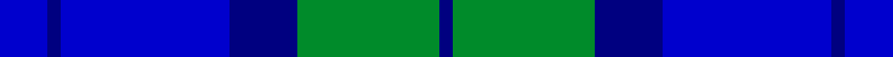

This is one **variant** — a specific cloth: this exact thread count and colourway, with its own
provenance below. It is one weaving of the [sett](/setts/b7db2b25db10g21db2/) (the scale-free proportion — the
same cloth at any scale or shade), whose colour order is pattern [BBBBGB](/stripes/bbbbgb/).

Part of the [Sugiyama](/tartans/s/su/sugiyama/) tartan — the named design grouping this sett with its other cloths.

Sourced from house-of-tartan.  It is a [6 stripe tartan](/stripes/stripes6/).

Original link [http://www.house-of-tartan.scotland.net/house/TartanViewjs.asp?colr=Def&tnam=10639](http://www.house-of-tartan.scotland.net/house/TartanViewjs.asp?colr=Def&tnam=10639)

## Provenance

Earliest known date: 01/04/2012 The tartan design has long been used on the school bags used by middle and high school students at Sugiyama Jogakuen University. The tartan design has been used as the motif on various other items that are used at the school, such as our carrier bag, in order to promote a sense of attachment and affinity when using the items.

Dataset <small>— provenance for this record, inherited from the source manifest</small>

<dl class="dataset-prov">
<dt>source</dt><dd><a href="/sources/house-of-tartan/">House of Tartan</a></dd>
<dt>data captured from</dt><dd><a href="https://github.com/thetartan/tartan-database/blob/master/data/house-of-tartan/data.csv">https://github.com/thetartan/tartan-database/blob/master/data/house-of-tartan/data.csv</a></dd>
<dt>data date</dt><dd>01/04/2012 <small>(this record)</small></dd>
<dt>licence</dt><dd><a href="https://creativecommons.org/licenses/by-nc-nd/4.0/">CC BY-NC-ND 4.0</a></dd>
</dl>

Capture chain <small>— the hands this data passed through, oldest first; each capture carries its own licence</small>

<ol class="capture-chain">
<li><a href="http://www.house-of-tartan.scotland.net/">House of Tartan</a> <small>the weaver/retailer's database — the site is now offline; the URL is kept as the ultimate source's identity</small></li>
<li><a href="https://github.com/thetartan/tartan-database">thetartan/tartan-database</a> <small>2016-2017</small> · <a href="https://creativecommons.org/licenses/by-nc-nd/4.0/">CC BY-NC-ND 4.0</a> <small>Levko Kravets's frozen compilation — the capture we vendored, and where its CC licence text came from</small></li>
<li>this dictionary <small>captured 2026-06-10 · commit 5bf86c7566</small> <small>each re-capture is a git commit to data/sources</small></li>
</ol>

## Thread count
B/14 DB4 B50 DB20 G42 DB/4

One full sett is **250 threads**.

## Palette
<table><thead><tr><th>Colour</th><th>Shade</th><th>OKLCh</th></tr></thead><tbody><tr><td>B</td><td><code style="background-color:#0000CD;">#0000CD</code> <small style="color:#888">#0000CD</small></td><td><small style="color:#888">oklch(38.3% 0.266 264.1)</small></td></tr><tr><td>DB</td><td><code style="background-color:#000080;">#000080</code> <small style="color:#888">#000080</small></td><td><small style="color:#888">oklch(27.1% 0.188 264.1)</small></td></tr><tr><td>G</td><td><code style="background-color:#008B2A;">#008B2A</code> <small style="color:#888">#008B2A</small></td><td><small style="color:#888">oklch(55.4% 0.170 145.9)</small></td></tr></tbody></table>

# Sample pattern

## Nearest tartan variants

The nearest existing variants by ΔTartan distance, with this cloth at the top so the swatches line up against it.

ΔTartan

Threads

Variant

Sett

—

250

<a href="/variants/s6/b7db2b25db10g21db2~x2~b1511266-db1108266/">Sugiyama Corporate Tartan</a>

<a href="/ttd/edit/#slug=db7dt2db25dt10g21dt2~x2~db1406275-dt1204274&amp;base=b7db2b25db10g21db2~x2~b1511266-db1108266" title="compare in the TTD">0.14</a>

250

<a href="/variants/s6/dbi7db2dbi25db10g21db2~x2~dbi1406275-db1204274/">Sugiyama Jogakuen University (Corp)</a>

<a href="/ttd/edit/#slug=dbi7db2dbi25db10g21db2~x2~dbi1605267-db1004274&amp;base=b7db2b25db10g21db2~x2~b1511266-db1108266" title="compare in the TTD">0.15</a>

250

<a href="/variants/s6/dbi7db2dbi25db10g21db2~x2~dbi1605267-db1004274/">Sugiyama</a>

<a href="/ttd/edit/#slug=db2g6db6b5db1b2~x2&amp;base=b7db2b25db10g21db2~x2~b1511266-db1108266" title="compare in the TTD">0.85</a>

80

<a href="/variants/s6/db2g6db6b5db1b2~x2/">Unnamed, No 54</a>

<a href="/ttd/edit/#slug=db1g10db9t10db1t1~x4&amp;base=b7db2b25db10g21db2~x2~b1511266-db1108266" title="compare in the TTD">0.88</a>

248

<a href="/variants/s6/db1g10db9t10db1t1~x4/">Black Watch (Aljean)</a>

<a href="/ttd/edit/#slug=b14db1b1db1b3db6g12r2~x2&amp;base=b7db2b25db10g21db2~x2~b1511266-db1108266" title="compare in the TTD">1.73</a>

128

<a href="/variants/s8/b14db1b1db1b3db6g12r2~x2/">Cranstoun</a>

<a href="/ttd/edit/#slug=g10db2g2db6lb5db1lb2~x2&amp;base=b7db2b25db10g21db2~x2~b1511266-db1108266" title="compare in the TTD">1.81</a>

88

<a href="/variants/s7/g10db2g2db6lb5db1lb2~x2/">Unidentified No 17</a>

<a href="/ttd/edit/#slug=g10db2g2db6t5db1t2~x2~db1406275-t2503227&amp;base=b7db2b25db10g21db2~x2~b1511266-db1108266" title="compare in the TTD">1.81</a>

88

<a href="/variants/s7/g10db2g2db6t5db1t2~x2~db1406275-t2503227/">Norwich No.017</a>

<a href="/ttd/edit/#slug=db3w1db12b12db1b3~x4&amp;base=b7db2b25db10g21db2~x2~b1511266-db1108266" title="compare in the TTD">1.98</a>

232

<a href="/variants/s6/db3w1db12b12db1b3~x4/">Erskine Blue (Fashion)</a>

<a href="/ttd/edit/#slug=lg3db1b16db16b2lb2~x4&amp;base=b7db2b25db10g21db2~x2~b1511266-db1108266" title="compare in the TTD">1.98</a>

300

<a href="/variants/s6/lg3db1b16db16b2lb2~x4/">U.S.S. John Paul Jones #1</a>

<a href="/ttd/edit/#slug=g19w1db12b2db2b2db2b16~x2&amp;base=b7db2b25db10g21db2~x2~b1511266-db1108266" title="compare in the TTD">2.06</a>

154

<a href="/variants/s8/g19w1db12b2db2b2db2b16~x2/">Unnamed, No 52</a>

## Neighbour map

Every grey dot is one of 13656 variants placed by the first two principal components of the ΔTartan feature space (42% of its variance). Red is this tartan; blue dots are its nearest — click one to open its page. The map is a flat projection of a many-dimensional space — [how to read it](/posts/neighbourhood-maps/).

<svg viewBox="0 0 640 380" role="img" style="max-width:100%;height:auto;border:1px solid #e0e0e0;border-radius:4px;display:block" xmlns="http://www.w3.org/2000/svg"><image href="/nn/cloud.v1.png" width="640" height="380"/><a href="/variants/s6/dbi7db2dbi25db10g21db2~x2~dbi1406275-db1204274/"><circle cx="363.2" cy="261.8" r="4" fill="#3465a4"><title>Sugiyama Jogakuen University (Corp)</title></circle></a><a href="/variants/s6/dbi7db2dbi25db10g21db2~x2~dbi1605267-db1004274/"><circle cx="368.7" cy="264.4" r="4" fill="#3465a4"><title>Sugiyama</title></circle></a><a href="/variants/s6/db2g6db6b5db1b2~x2/"><circle cx="272.3" cy="309.5" r="4" fill="#3465a4"><title>Unnamed, No 54</title></circle></a><a href="/variants/s6/db1g10db9t10db1t1~x4/"><circle cx="293.0" cy="272.7" r="4" fill="#3465a4"><title>Black Watch (Aljean)</title></circle></a><a href="/variants/s8/b14db1b1db1b3db6g12r2~x2/"><circle cx="293.2" cy="197.9" r="4" fill="#3465a4"><title>Cranstoun</title></circle></a><a href="/variants/s7/g10db2g2db6lb5db1lb2~x2/"><circle cx="261.4" cy="250.9" r="4" fill="#3465a4"><title>Unidentified No 17</title></circle></a><a href="/variants/s7/g10db2g2db6t5db1t2~x2~db1406275-t2503227/"><circle cx="293.7" cy="250.5" r="4" fill="#3465a4"><title>Norwich No.017</title></circle></a><a href="/variants/s6/db3w1db12b12db1b3~x4/"><circle cx="431.2" cy="265.2" r="4" fill="#3465a4"><title>Erskine Blue (Fashion)</title></circle></a><a href="/variants/s6/lg3db1b16db16b2lb2~x4/"><circle cx="360.2" cy="227.2" r="4" fill="#3465a4"><title>U.S.S. John Paul Jones #1</title></circle></a><a href="/variants/s8/g19w1db12b2db2b2db2b16~x2/"><circle cx="284.2" cy="201.8" r="4" fill="#3465a4"><title>Unnamed, No 52</title></circle></a><circle cx="322.2" cy="251.1" r="5" fill="#c00000"/><text x="320" y="376" text-anchor="middle" font-size="11" fill="#999">ground</text><text x="11" y="190" text-anchor="middle" font-size="11" fill="#999" transform="rotate(-90 11 190)">complexity</text></svg>

ID: /variants/s6/b7db2b25db10g21db2~x2~b1511266-db1108266/
