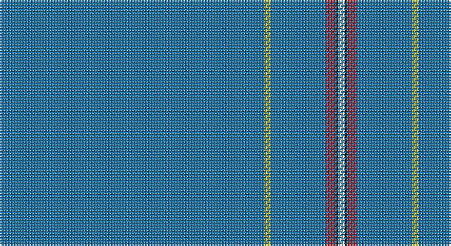

This page is one **sett** — a single exact thread-count. It belongs to the [tartan](/setts/b86ly2b18r3k1w2/)
(the same proportion at any scale), whose colour order is pattern [BYBRKW](/stripes/bybrkw/).

Part of the [Wylie](/tartans/wylie/) tartan — the named design grouping this sett with its other cloths.

Sourced from register-of-tartans.  It is a [6 stripe tartan](/stripes/stripes6/).

Original link https://www.tartanregister.gov.uk/tartanDetails.aspx?ref=4789

## Register references

External register numbers recorded for this tartan.

- Scottish Register of Tartans: [4789](https://www.tartanregister.gov.uk/tartanDetails.aspx?ref=4789)
- Scottish Tartans Authority (ITI): 4035

## Thread count
B/172 Y4 B36 R6 K2 LN/4

One full sett is **272 threads**.

## Palette

Palette: <strong>Tartan Register</strong>
<table><thead><tr><th>Colour</th><th>Threads</th><th>Shade</th><th>Base</th><th>OKLCh</th></tr></thead><tbody><tr><td>B/</td><td style="text-align:right;font-variant-numeric:tabular-nums">172</td><td><code style="background-color:#1870A4;">#1870A4</code> <small style="color:#888">#1870A4</small></td><td>B <code style="background-color:#2A418A;">#2A418A</code></td><td><small style="color:#888">oklch(52.2% 0.113 241.2)</small></td></tr><tr><td>Y</td><td style="text-align:right;font-variant-numeric:tabular-nums">4</td><td><code style="background-color:#E8C000;">#E8C000</code> <small style="color:#888">#E8C000</small></td><td>Y <code style="background-color:#F2BF00;">#F2BF00</code></td><td><small style="color:#888">oklch(81.9% 0.168 93.7)</small></td></tr><tr><td>B</td><td style="text-align:right;font-variant-numeric:tabular-nums">36</td><td><code style="background-color:#1870A4;">#1870A4</code> <small style="color:#888">#1870A4</small></td><td>B <code style="background-color:#2A418A;">#2A418A</code></td><td><small style="color:#888">oklch(52.2% 0.113 241.2)</small></td></tr><tr><td>R</td><td style="text-align:right;font-variant-numeric:tabular-nums">6</td><td><code style="background-color:#C80000;">#C80000</code> <small style="color:#888">#C80000</small></td><td>R <code style="background-color:#CC0000;">#CC0000</code></td><td><small style="color:#888">oklch(52.3% 0.215 29.2)</small></td></tr><tr><td>K</td><td style="text-align:right;font-variant-numeric:tabular-nums">2</td><td><code style="background-color:#101010;">#101010</code> <small style="color:#888">#101010</small></td><td>K <code style="background-color:#000000;">#000000</code></td><td><small style="color:#888">oklch(17.3% 0.000 89.9)</small></td></tr><tr><td>LN/</td><td style="text-align:right;font-variant-numeric:tabular-nums">4</td><td><code style="background-color:#E0E0E0;">#E0E0E0</code> <small style="color:#888">#E0E0E0</small></td><td>W <code style="background-color:#F7F7F7;">#F7F7F7</code></td><td><small style="color:#888">oklch(90.7% 0.000 89.9)</small></td></tr></tbody></table>

# Sample pattern

## Nearest tartans

The nearest existing variants by ΔTartan distance, with this tartan at the top so the swatches line up against it.

ΔTartan

Tartan

Sett

—

<a href="/ttd/edit/#slug=b86ly2b18r3k1w2~x2">Wylie (Ancient)</a> <a class="nn-out" href="/variants/s6/b86ly2b18r3k1w2~x2/" title="open its dictionary page">↗</a>

2.00

<a href="/ttd/edit/#slug=t8lo2t8dg7t57k3lb1~x2&amp;base=b86ly2b18r3k1w2~x2">Cullen (Christian Hill) (Personal)</a> <a class="nn-out" href="/variants/s7/t8lo2t8dg7t57k3lb1~x2/" title="open its dictionary page">↗</a>

2.58

<a href="/ttd/edit/#slug=n45ly3n10o4k1w2~x4&amp;base=b86ly2b18r3k1w2~x2">Wylie (Name)</a> <a class="nn-out" href="/variants/s6/n45ly3n10o4k1w2~x4/" title="open its dictionary page">↗</a>

2.68

<a href="/ttd/edit/#slug=do88o3ly2k2lr1~x2&amp;base=b86ly2b18r3k1w2~x2">Eternity, Dedicated 2 Weddings</a> <a class="nn-out" href="/variants/s5/do88o3ly2k2lr1~x2/" title="open its dictionary page">↗</a>

2.80

<a href="/ttd/edit/#slug=db8lo2db8dg7db57k3t1~x2&amp;base=b86ly2b18r3k1w2~x2">Cullen (Christian Hill)</a> <a class="nn-out" href="/variants/s7/db8lo2db8dg7db57k3t1~x2/" title="open its dictionary page">↗</a>

2.94

<a href="/variants/s6/db33g3r1~x2/">Norwich No.030</a>

2.95

<a href="/ttd/edit/#slug=db3r1db35r1db16t1db2~x4&amp;base=b86ly2b18r3k1w2~x2">Lochaber Old</a> <a class="nn-out" href="/variants/s7/db3r1db35r1db16t1db2~x4/" title="open its dictionary page">↗</a>

2.95

<a href="/variants/s6/n45k3n10o4ki1w2~x4/">Wylie</a>

3.08

<a href="/ttd/edit/#slug=t48w2t7w2t7w2t20db11r2~x2&amp;base=b86ly2b18r3k1w2~x2">RAAF #3</a> <a class="nn-out" href="/variants/s9/t48w2t7w2t7w2t20db11r2~x2/" title="open its dictionary page">↗</a>

3.10

<a href="/ttd/edit/#slug=n70ly4n3ly4n7k2n2r7~x2&amp;base=b86ly2b18r3k1w2~x2">European</a> <a class="nn-out" href="/variants/s8/n70ly4n3ly4n7k2n2r7~x2/" title="open its dictionary page">↗</a>

3.15

<a href="/variants/s5/n88dy3lo2ki2k1~x2/">Eternity Fashion Tartan</a>

## Neighbour map

Every grey dot is one of 14360 variants placed by the first two principal components of the ΔTartan feature space (44% of its variance). Red is this tartan; blue dots are its nearest — click one to open its page.

<svg viewBox="0 0 640 380" role="img" style="max-width:100%;height:auto;border:1px solid #e0e0e0;border-radius:4px;display:block" xmlns="http://www.w3.org/2000/svg"><image href="/nn/cloud.v1.png" width="640" height="380"/><a href="/variants/s7/t8lo2t8dg7t57k3lb1~x2/"><circle cx="626.0" cy="132.5" r="4" fill="#3465a4"><title>Cullen (Christian Hill) (Personal)</title></circle></a><a href="/variants/s6/n45ly3n10o4k1w2~x4/"><circle cx="621.3" cy="133.2" r="4" fill="#3465a4"><title>Wylie (Name)</title></circle></a><a href="/variants/s5/do88o3ly2k2lr1~x2/"><circle cx="626.0" cy="154.9" r="4" fill="#3465a4"><title>Eternity, Dedicated 2 Weddings</title></circle></a><a href="/variants/s7/db8lo2db8dg7db57k3t1~x2/"><circle cx="626.0" cy="151.9" r="4" fill="#3465a4"><title>Cullen (Christian Hill)</title></circle></a><a href="/variants/s6/db33g3r1~x2/"><circle cx="626.0" cy="226.0" r="4" fill="#3465a4"><title>Norwich No.030</title></circle></a><a href="/variants/s7/db3r1db35r1db16t1db2~x4/"><circle cx="626.0" cy="220.8" r="4" fill="#3465a4"><title>Lochaber Old</title></circle></a><a href="/variants/s6/n45k3n10o4ki1w2~x4/"><circle cx="597.6" cy="123.9" r="4" fill="#3465a4"><title>Wylie</title></circle></a><a href="/variants/s9/t48w2t7w2t7w2t20db11r2~x2/"><circle cx="572.9" cy="166.2" r="4" fill="#3465a4"><title>RAAF #3</title></circle></a><a href="/variants/s8/n70ly4n3ly4n7k2n2r7~x2/"><circle cx="626.0" cy="132.6" r="4" fill="#3465a4"><title>European</title></circle></a><a href="/variants/s5/n88dy3lo2ki2k1~x2/"><circle cx="626.0" cy="175.5" r="4" fill="#3465a4"><title>Eternity Fashion Tartan</title></circle></a><circle cx="626.0" cy="146.9" r="5" fill="#c00000"/></svg>

ID: /variants/s6/b86ly2b18r3k1w2~x2/
