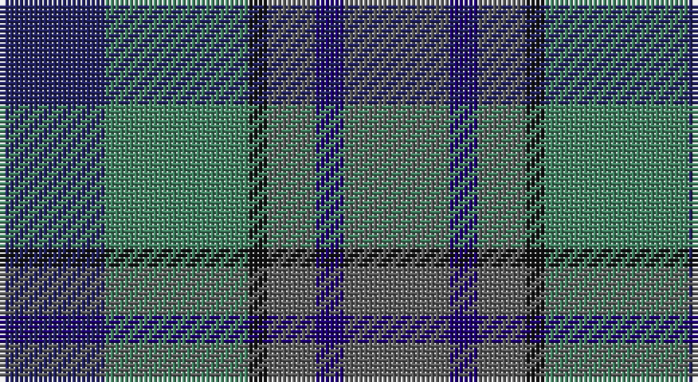

This page is one **sett** — a single exact thread-count. It belongs to the [tartan](/setts/db11g15k2n5dbi3n11/)
(the same proportion at any scale), whose colour order is pattern [BBBKGB](/stripes/bbbkgb/).

Part of the [Saorsa](/tartans/saorsa/) tartan — the named design grouping this sett with its other cloths.

Sourced from tartans-authority.  It is a [6 stripe tartan](/stripes/stripes6/).

Original link http://www.tartansauthority.com/tartan-ferret/display/10739/

## Register references

External register numbers recorded for this tartan.

- Scottish Register of Tartans: [10739](https://www.tartanregister.gov.uk/tartanDetails?ref=10739)
- Scottish Tartans Authority (ITI): 10739

## Thread count
DB/22 G30 K4 N10 DBa6 N/22

One full sett is **144 threads**.

## Palette

Palette: <strong>Tartan Register</strong> <small style="color:#888">(4 of 5 colours)</small>
<table><thead><tr><th>Colour</th><th>Threads</th><th>Shade</th><th>Base</th><th>OKLCh</th></tr></thead><tbody><tr><td>DB/</td><td style="text-align:right;font-variant-numeric:tabular-nums">22</td><td><code style="background-color:#202060;">#202060</code> <small style="color:#888">#202060</small></td><td>B <code style="background-color:#2A418A;">#2A418A</code></td><td><small style="color:#888">oklch(28.9% 0.111 276.9)</small></td></tr><tr><td>G</td><td style="text-align:right;font-variant-numeric:tabular-nums">30</td><td><code style="background-color:#408060;">#408060</code> <small style="color:#888">#408060</small></td><td>G <code style="background-color:#006100;">#006100</code></td><td><small style="color:#888">oklch(54.8% 0.084 160.1)</small></td></tr><tr><td>K</td><td style="text-align:right;font-variant-numeric:tabular-nums">4</td><td><code style="background-color:#101010;">#101010</code> <small style="color:#888">#101010</small></td><td>K <code style="background-color:#000000;">#000000</code></td><td><small style="color:#888">oklch(17.3% 0.000 89.9)</small></td></tr><tr><td>N</td><td style="text-align:right;font-variant-numeric:tabular-nums">10</td><td><code style="background-color:#5C5C5C;">#5C5C5C</code> <small style="color:#888">#5C5C5C</small></td><td>B <code style="background-color:#2A418A;">#2A418A</code></td><td><small style="color:#888">oklch(47.5% 0.000 89.9)</small></td></tr><tr><td>DBa</td><td style="text-align:right;font-variant-numeric:tabular-nums">6</td><td><code style="background-color:#1C0070;">#1C0070</code> <small style="color:#888">#1C0070</small></td><td>B <code style="background-color:#2A418A;">#2A418A</code></td><td><small style="color:#888">oklch(26.3% 0.162 277.1)</small></td></tr><tr><td>N/</td><td style="text-align:right;font-variant-numeric:tabular-nums">22</td><td><code style="background-color:#5C5C5C;">#5C5C5C</code> <small style="color:#888">#5C5C5C</small></td><td>B <code style="background-color:#2A418A;">#2A418A</code></td><td><small style="color:#888">oklch(47.5% 0.000 89.9)</small></td></tr></tbody></table>

# Sample pattern

## Compared to the master

This cloth is one sett of its design; the master sett (the exemplar the design is anchored on) is below for comparison.

<figure style="margin:0"><figcaption style="color:#888;font-size:smaller">this sett</figcaption></figure>
<figure style="margin:0"><figcaption style="color:#888;font-size:smaller"><a href="/setts/dp18dg24k3db6dp2db5dp18/">master sett →</a></figcaption></figure>

## Nearest tartans

The nearest existing variants by ΔTartan distance, with this tartan at the top so the swatches line up against it.

ΔTartan

Tartan

Sett

—

<a href="/ttd/edit/#slug=db11g15k2n5dbi3n11~x2">Saorsa (Corporate)</a> <a class="nn-out" href="/variants/s6/db11g15k2n5dbi3n11~x2/" title="open its dictionary page">↗</a>

1.17

<a href="/ttd/edit/#slug=g8n19dg29o16r4~x2&amp;base=db11g15k2n5dbi3n11~x2">Styrian (Fashion)</a> <a class="nn-out" href="/variants/s5/g8n19dg29o16r4~x2/" title="open its dictionary page">↗</a>

1.22

<a href="/ttd/edit/#slug=t25dg25k6dp10r6~x2&amp;base=db11g15k2n5dbi3n11~x2">Breon (Jersey Shore, Pennsylvania) (Personal)</a> <a class="nn-out" href="/variants/s5/t25dg25k6dp10r6~x2/" title="open its dictionary page">↗</a>

1.27

<a href="/ttd/edit/#slug=r4g11k11g2n11y3~x4&amp;base=db11g15k2n5dbi3n11~x2">Casely</a> <a class="nn-out" href="/variants/s6/r4g11k11g2n11y3~x4/" title="open its dictionary page">↗</a>

1.29

<a href="/ttd/edit/#slug=b32dy16g3lo4dg28~x2&amp;base=db11g15k2n5dbi3n11~x2">Corey (Name)</a> <a class="nn-out" href="/variants/s5/b32dy16g3lo4dg28~x2/" title="open its dictionary page">↗</a>

1.39

<a href="/ttd/edit/#slug=n5t4n22k15y22o4y4~x2&amp;base=db11g15k2n5dbi3n11~x2">Cairngorm #2</a> <a class="nn-out" href="/variants/s7/n5t4n22k15y22o4y4~x2/" title="open its dictionary page">↗</a>

1.40

<a href="/ttd/edit/#slug=r1dy7g7db7g7db7r1~x8&amp;base=db11g15k2n5dbi3n11~x2">Tennant (Yules)</a> <a class="nn-out" href="/variants/s7/r1dy7g7db7g7db7r1~x8/" title="open its dictionary page">↗</a>

1.44

<a href="/ttd/edit/#slug=ly4dg17k10dt3k3dt17r3dt3~x2&amp;base=db11g15k2n5dbi3n11~x2">Royal Highland Society (Corporate)</a> <a class="nn-out" href="/variants/s8/ly4dg17k10dt3k3dt17r3dt3~x2/" title="open its dictionary page">↗</a>

1.44

<a href="/ttd/edit/#slug=dp4n18k17n3g18n4~x2&amp;base=db11g15k2n5dbi3n11~x2">Scottish Airports (Corporate)</a> <a class="nn-out" href="/variants/s6/dp4n18k17n3g18n4~x2/" title="open its dictionary page">↗</a>

1.44

<a href="/ttd/edit/#slug=dp2dg6k2db6k1r2~x4&amp;base=db11g15k2n5dbi3n11~x2">MacCaughan or MacEachain (Personal)</a> <a class="nn-out" href="/variants/s6/dp2dg6k2db6k1r2~x4/" title="open its dictionary page">↗</a>

1.44

<a href="/ttd/edit/#slug=o16dg29n19g8n19dg29o16r4~x2&amp;base=db11g15k2n5dbi3n11~x2">Styrian</a> <a class="nn-out" href="/variants/s8/o16dg29n19g8n19dg29o16r4~x2/" title="open its dictionary page">↗</a>

## Neighbour map

Every grey dot is one of 14360 variants placed by the first two principal components of the ΔTartan feature space (44% of its variance). Red is this tartan; blue dots are its nearest — click one to open its page.

<svg viewBox="0 0 640 380" role="img" style="max-width:100%;height:auto;border:1px solid #e0e0e0;border-radius:4px;display:block" xmlns="http://www.w3.org/2000/svg"><image href="/nn/cloud.v1.png" width="640" height="380"/><a href="/variants/s5/g8n19dg29o16r4~x2/"><circle cx="194.9" cy="274.2" r="4" fill="#3465a4"><title>Styrian (Fashion)</title></circle></a><a href="/variants/s5/t25dg25k6dp10r6~x2/"><circle cx="163.9" cy="282.9" r="4" fill="#3465a4"><title>Breon (Jersey Shore, Pennsylvania) (Personal)</title></circle></a><a href="/variants/s6/r4g11k11g2n11y3~x4/"><circle cx="133.1" cy="264.8" r="4" fill="#3465a4"><title>Casely</title></circle></a><a href="/variants/s5/b32dy16g3lo4dg28~x2/"><circle cx="218.0" cy="238.8" r="4" fill="#3465a4"><title>Corey (Name)</title></circle></a><a href="/variants/s7/n5t4n22k15y22o4y4~x2/"><circle cx="218.8" cy="269.7" r="4" fill="#3465a4"><title>Cairngorm #2</title></circle></a><a href="/variants/s7/r1dy7g7db7g7db7r1~x8/"><circle cx="208.4" cy="281.6" r="4" fill="#3465a4"><title>Tennant (Yules)</title></circle></a><a href="/variants/s8/ly4dg17k10dt3k3dt17r3dt3~x2/"><circle cx="197.7" cy="246.0" r="4" fill="#3465a4"><title>Royal Highland Society (Corporate)</title></circle></a><a href="/variants/s6/dp4n18k17n3g18n4~x2/"><circle cx="223.0" cy="281.8" r="4" fill="#3465a4"><title>Scottish Airports (Corporate)</title></circle></a><a href="/variants/s6/dp2dg6k2db6k1r2~x4/"><circle cx="165.7" cy="265.0" r="4" fill="#3465a4"><title>MacCaughan or MacEachain (Personal)</title></circle></a><a href="/variants/s8/o16dg29n19g8n19dg29o16r4~x2/"><circle cx="195.1" cy="267.6" r="4" fill="#3465a4"><title>Styrian</title></circle></a><circle cx="186.2" cy="262.8" r="5" fill="#c00000"/></svg>

ID: /variants/s6/db11g15k2n5dbi3n11~x2/
