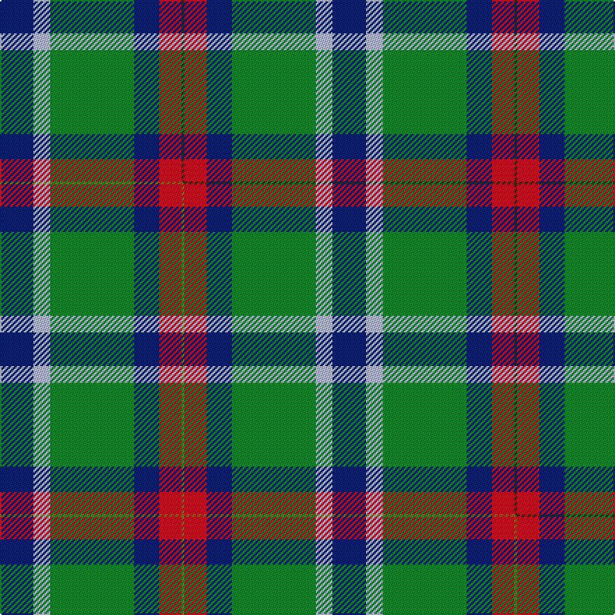

This is one **variant** — a specific cloth: this exact thread count and colourway, with its own
provenance below. It is one weaving of the [sett](/tartans/w/wr/wright-anne/) (the scale-free proportion — the
same cloth at any scale or shade), whose colour order is pattern [BWGBRG](/stripes/bwgbrg/).

Part of the [Wright, Anne](/tartans/w/wr/wright-anne/) tartan — the named design grouping this sett with its other cloths.

Sourced from tartans-authority.  It is a [6 stripe tartan](/stripes/stripes6/).

Original link <code>http://www.tartansauthority.com/tartan-ferret/display/11188/</code> — retired · [Internet Archive copy](https://web.archive.org/web/*/http://www.tartansauthority.com/tartan-ferret/display/11188/*)

Dataset <small>— provenance for this record, inherited from the source manifest</small>

<dl class="dataset-prov">
<dt>source</dt><dd><a href="/sources/tartans-authority/">Scottish Tartans Authority</a></dd>
<dt>data captured from</dt><dd><a href="https://github.com/thetartan/tartan-database/blob/master/data/tartans-authority/data.csv">https://github.com/thetartan/tartan-database/blob/master/data/tartans-authority/data.csv</a></dd>
<dt>data date</dt><dd>2014 <small>(this record)</small></dd>
<dt>licence</dt><dd><a href="https://creativecommons.org/licenses/by-nc-nd/4.0/">CC BY-NC-ND 4.0</a></dd>
</dl>

Capture chain <small>— the hands this data passed through, oldest first; each capture carries its own licence</small>

<ol class="capture-chain">
<li><a href="https://www.tartansauthority.com/">Scottish Tartans Authority</a> <small>the heritage body’s archive — its tartan-ferret record browser is retired; dead record links are shown unlinked, with an Internet Archive copy (ITI numbers are not SRT references)</small></li>
<li><a href="https://github.com/thetartan/tartan-database">thetartan/tartan-database</a> <small>2016-2017</small> · <a href="https://creativecommons.org/licenses/by-nc-nd/4.0/">CC BY-NC-ND 4.0</a> <small>Levko Kravets's frozen compilation — the capture we vendored, and where its CC licence text came from</small></li>
<li>this dictionary <small>captured 2026-06-10 · commit 5bf86c7566</small> <small>each re-capture is a git commit to data/sources</small></li>
</ol>

## Register references

External register numbers recorded for this tartan.

- Scottish Register of Tartans: [11188](https://www.tartanregister.gov.uk/tartanDetails?ref=11188)
- Scottish Tartans Authority (ITI): 11188

## Thread count
DB/24 LB12 G60 DB18 R16 DY/2

One full sett is **238 threads**.

## Palette
<table><thead><tr><th>Colour</th><th>Shade</th><th>OKLCh</th></tr></thead><tbody><tr><td>LB</td><td><code style="background-color:#B5BBDE;">#B5BBDE</code> <small style="color:#888">#B5BBDE</small></td><td><small style="color:#888">oklch(79.9% 0.050 277.6)</small></td></tr><tr><td>DB</td><td><code style="background-color:#082077;">#082077</code> <small style="color:#888">#082077</small></td><td><small style="color:#888">oklch(30.0% 0.149 265.1)</small></td></tr><tr><td>R</td><td><code style="background-color:#D60020;">#D60020</code> <small style="color:#888">#D60020</small></td><td><small style="color:#888">oklch(55.2% 0.224 25.5)</small></td></tr><tr><td>G</td><td><code style="background-color:#008B2A;">#008B2A</code> <small style="color:#888">#008B2A</small></td><td><small style="color:#888">oklch(55.4% 0.170 145.9)</small></td></tr><tr><td>DY</td><td><code style="background-color:#3A2B0D;">#3A2B0D</code> <small style="color:#888">#3A2B0D</small></td><td><small style="color:#888">oklch(30.0% 0.049 82.0)</small></td></tr></tbody></table>

# Sample pattern

[Sample sheet (PDF)](swatch.pdf) — the woven sample, thread count and palette on one printable A4, rendered on demand (the same sheet the TTD print page downloads).

## Compared to the master

This cloth is one sett of its design; the master sett (the exemplar the design is anchored on) is below for comparison.

Its **ΔTartan distance** from the master is **0.01** — the same measure the nearest-tartans table ranks by (0 is identical; a re-scale of the same cloth is near 0, a recolour or a different proportion further).

<figure class="master-compare" style="margin:0">

this sett
master sett ★

<figcaption style="color:#888;font-size:smaller">One weave of this sett against the <a href="/setts/db12lb6g30db9r8y1/">master sett ★</a>, split on the diagonal: a shared proportion runs seamlessly across it with only the shades shifting; a different proportion breaks on it.</figcaption>
</figure>

## Nearest tartan variants

The nearest existing variants by ΔTartan distance, with this cloth at the top so the swatches line up against it.

ΔTartan

Threads

Variant

Sett

—

238

<a href="/variants/s6/db12lb6g30db9r8dy1~x2/">Wright , Anne (Personal)</a>

<a href="/ttd/edit/#slug=db12lb6g30db9r8y1~x2&amp;base=db12lb6g30db9r8dy1~x2" title="compare in the TTD">0.01</a>

238

<a href="/variants/s6/db12lb6g30db9r8y1~x2/">Wright, Anne (Personal)</a>

<a href="/ttd/edit/#slug=db3lb3g30db25dp4r3y2dp1~x2&amp;base=db12lb6g30db9r8dy1~x2" title="compare in the TTD">1.20</a>

276

<a href="/variants/s8/db3lb3g30db25dp4r3y2dp1~x2/">Young (Clan)</a>

<a href="/ttd/edit/#slug=db3lb3g30db25dp4r3y2dp1~x2~dp3717327-r5221021&amp;base=db12lb6g30db9r8dy1~x2" title="compare in the TTD">1.20</a>

276

<a href="/variants/s8/db3lb3g30db25dp4r3y2dp1~x2~dp3717327-r5221021/">Young</a>

<a href="/ttd/edit/#slug=y15db8r25db72dg98w15&amp;base=db12lb6g30db9r8dy1~x2" title="compare in the TTD">1.50</a>

436

<a href="/variants/s6/y15db8r25db72dg98w15/">Afternoon Tea / Darjeeling</a>

<a href="/ttd/edit/#slug=k2dbi2g16db2y1db13w2~x2~dbi3514276-db2911276&amp;base=db12lb6g30db9r8dy1~x2" title="compare in the TTD">1.50</a>

144

<a href="/variants/s7/k2dbi2g16db2y1db13w2~x2~dbi3514276-db2911276/">Wishart Hunting Family Tartan</a>

<a href="/ttd/edit/#slug=db3g13lb1r3lb1db10ly1~x2&amp;base=db12lb6g30db9r8dy1~x2" title="compare in the TTD">1.58</a>

120

<a href="/variants/s7/db3g13lb1r3lb1db10ly1~x2/">Heckenberg Htg (Personal)</a>

<a href="/ttd/edit/#slug=db3g13lb1r3lb1db10y1~x2&amp;base=db12lb6g30db9r8dy1~x2" title="compare in the TTD">1.58</a>

120

<a href="/variants/s7/db3g13lb1r3lb1db10y1~x2/">Graeme Heckenberg Hunting</a>

<a href="/ttd/edit/#slug=r5t3g24db24r4y2~x2~t5912243-db3514276&amp;base=db12lb6g30db9r8dy1~x2" title="compare in the TTD">1.69</a>

234

<a href="/variants/s6/r5t3g24db24r4y2~x2~t5912243-db3514276/">Canine All Dogs</a>

<a href="/ttd/edit/#slug=db23w1r3w1db12y9g40dp3~x2&amp;base=db12lb6g30db9r8dy1~x2" title="compare in the TTD">1.71</a>

316

<a href="/variants/s8/db23w1r3w1db12y9g40dp3~x2/">Pictou County</a>

<a href="/ttd/edit/#slug=g45w2r3k15r3db15r3db15~x2&amp;base=db12lb6g30db9r8dy1~x2" title="compare in the TTD">1.91</a>

284

<a href="/variants/s8/g45w2r3k15r3db15r3db15~x2/">MacNeil 3</a>

## Neighbour map

Every grey dot is one of 13662 variants placed by the first two principal components of the ΔTartan feature space (42% of its variance). Red is this tartan; blue dots are its nearest — click one to open its page. The map is a flat projection of a many-dimensional space — [how to read it](/posts/neighbourhood-maps/).

<svg viewBox="0 0 640 380" role="img" style="max-width:100%;height:auto;border:1px solid #e0e0e0;border-radius:4px;display:block" xmlns="http://www.w3.org/2000/svg"><image href="/nn/cloud.v1.png" width="640" height="380"/><a href="/variants/s6/db12lb6g30db9r8y1~x2/"><circle cx="257.7" cy="165.8" r="4" fill="#3465a4"><title>Wright, Anne (Personal)</title></circle></a><a href="/variants/s8/db3lb3g30db25dp4r3y2dp1~x2/"><circle cx="259.5" cy="117.3" r="4" fill="#3465a4"><title>Young (Clan)</title></circle></a><a href="/variants/s8/db3lb3g30db25dp4r3y2dp1~x2~dp3717327-r5221021/"><circle cx="260.1" cy="117.2" r="4" fill="#3465a4"><title>Young</title></circle></a><a href="/variants/s6/y15db8r25db72dg98w15/"><circle cx="227.3" cy="195.8" r="4" fill="#3465a4"><title>Afternoon Tea / Darjeeling</title></circle></a><a href="/variants/s7/k2dbi2g16db2y1db13w2~x2~dbi3514276-db2911276/"><circle cx="199.0" cy="137.9" r="4" fill="#3465a4"><title>Wishart Hunting Family Tartan</title></circle></a><a href="/variants/s7/db3g13lb1r3lb1db10ly1~x2/"><circle cx="234.7" cy="183.8" r="4" fill="#3465a4"><title>Heckenberg Htg (Personal)</title></circle></a><a href="/variants/s7/db3g13lb1r3lb1db10y1~x2/"><circle cx="240.1" cy="185.5" r="4" fill="#3465a4"><title>Graeme Heckenberg Hunting</title></circle></a><a href="/variants/s6/r5t3g24db24r4y2~x2~t5912243-db3514276/"><circle cx="236.2" cy="196.4" r="4" fill="#3465a4"><title>Canine All Dogs</title></circle></a><a href="/variants/s8/db23w1r3w1db12y9g40dp3~x2/"><circle cx="278.2" cy="121.1" r="4" fill="#3465a4"><title>Pictou County</title></circle></a><a href="/variants/s8/g45w2r3k15r3db15r3db15~x2/"><circle cx="203.1" cy="123.7" r="4" fill="#3465a4"><title>MacNeil 3</title></circle></a><circle cx="257.0" cy="165.5" r="5" fill="#c00000"/><text x="320" y="376" text-anchor="middle" font-size="11" fill="#999">ground</text><text x="11" y="190" text-anchor="middle" font-size="11" fill="#999" transform="rotate(-90 11 190)">complexity</text></svg>

ID: /variants/s6/db12lb6g30db9r8dy1~x2/
