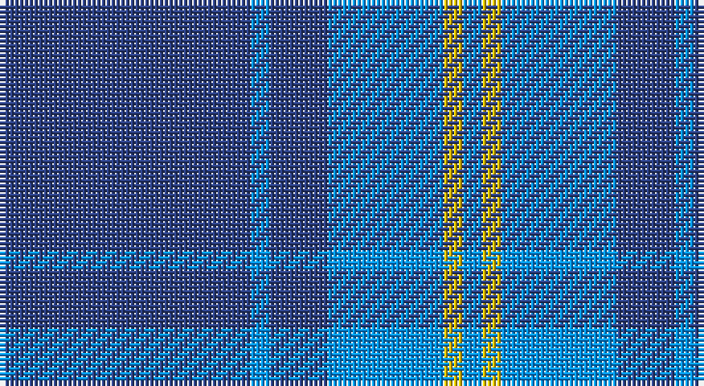

This page is one **sett** — a single exact thread-count. It belongs to the [tartan](/setts/db13b1db3b6ly1b1/)
(the same proportion at any scale), whose colour order is pattern [BBBBYB](/stripes/bbbbyb/).

Part of the [Hepburn](/tartans/hepburn/) tartan — the named design grouping this sett with its other cloths.

Sourced from register-of-tartans.  It is a [6 stripe tartan](/stripes/stripes6/).

Original link https://www.tartanregister.gov.uk/tartanDetails.aspx?ref=1689

## Also known as

This cloth is also recorded under:

- Hepburn #2

2 attestations — the source records this cloth was collapsed from (oldest owns this page)

<ul>
<li>undated — Hepburn #2 (register-of-tartans, <a href="https://www.tartanregister.gov.uk/tartanDetails.aspx?ref=1689">record</a>)</li>
<li>undated — Hepburn (weddslist, <a href="http://www.weddslist.com/cgi-bin/tartans/pg.pl?source=sts">record</a>)</li>
</ul>

## Register references

External register numbers recorded for this tartan.

- Scottish Register of Tartans: [1689](https://www.tartanregister.gov.uk/tartanDetails.aspx?ref=1689)
- Scottish Tartans World Register: 34

## Thread count
Ba/52 B4 Ba12 B24 Y4 B/4

One full sett is **144 threads**.

## Palette

Palette: <strong>Tartan Register</strong>
<table><thead><tr><th>Colour</th><th>Threads</th><th>Shade</th><th>Base</th><th>OKLCh</th></tr></thead><tbody><tr><td>Ba/</td><td style="text-align:right;font-variant-numeric:tabular-nums">52</td><td><code style="background-color:#2C4084;">#2C4084</code> <small style="color:#888">#2C4084</small></td><td>B <code style="background-color:#2A418A;">#2A418A</code></td><td><small style="color:#888">oklch(39.4% 0.117 268.3)</small></td></tr><tr><td>B</td><td style="text-align:right;font-variant-numeric:tabular-nums">4</td><td><code style="background-color:#0596FA;">#0596FA</code> <small style="color:#888">#0596FA</small></td><td>B <code style="background-color:#2A418A;">#2A418A</code></td><td><small style="color:#888">oklch(66.0% 0.180 248.9)</small></td></tr><tr><td>Ba</td><td style="text-align:right;font-variant-numeric:tabular-nums">12</td><td><code style="background-color:#2C4084;">#2C4084</code> <small style="color:#888">#2C4084</small></td><td>B <code style="background-color:#2A418A;">#2A418A</code></td><td><small style="color:#888">oklch(39.4% 0.117 268.3)</small></td></tr><tr><td>B</td><td style="text-align:right;font-variant-numeric:tabular-nums">24</td><td><code style="background-color:#0596FA;">#0596FA</code> <small style="color:#888">#0596FA</small></td><td>B <code style="background-color:#2A418A;">#2A418A</code></td><td><small style="color:#888">oklch(66.0% 0.180 248.9)</small></td></tr><tr><td>Y</td><td style="text-align:right;font-variant-numeric:tabular-nums">4</td><td><code style="background-color:#E8C000;">#E8C000</code> <small style="color:#888">#E8C000</small></td><td>Y <code style="background-color:#F2BF00;">#F2BF00</code></td><td><small style="color:#888">oklch(81.9% 0.168 93.7)</small></td></tr><tr><td>B/</td><td style="text-align:right;font-variant-numeric:tabular-nums">4</td><td><code style="background-color:#0596FA;">#0596FA</code> <small style="color:#888">#0596FA</small></td><td>B <code style="background-color:#2A418A;">#2A418A</code></td><td><small style="color:#888">oklch(66.0% 0.180 248.9)</small></td></tr></tbody></table>

# Sample pattern

## Nearest tartans

The nearest existing variants by ΔTartan distance, with this tartan at the top so the swatches line up against it.

ΔTartan

Tartan

Sett

—

<a href="/ttd/edit/#slug=db13b1db3b6ly1b1~x4">Hepburn #2</a> <a class="nn-out" href="/variants/s6/db13b1db3b6ly1b1~x4/" title="open its dictionary page">↗</a>

1.14

<a href="/ttd/edit/#slug=db12ly1t16db1t1db14t3db14ly1~x4&amp;base=db13b1db3b6ly1b1~x4">Orlando Police Department (Corporate</a> <a class="nn-out" href="/variants/s9/db12ly1t16db1t1db14t3db14ly1~x4/" title="open its dictionary page">↗</a>

1.40

<a href="/ttd/edit/#slug=b50db15w3db4w2~x2&amp;base=db13b1db3b6ly1b1~x4">Scottish Tourist Board (1990) (Corp)</a> <a class="nn-out" href="/variants/s5/b50db15w3db4w2~x2/" title="open its dictionary page">↗</a>

1.42

<a href="/ttd/edit/#slug=db72t6db12t17w6~x2&amp;base=db13b1db3b6ly1b1~x4">Gulfmark (Corporate)</a> <a class="nn-out" href="/variants/s5/db72t6db12t17w6~x2/" title="open its dictionary page">↗</a>

1.46

<a href="/ttd/edit/#slug=t52db28w3db2w2db10~x2&amp;base=db13b1db3b6ly1b1~x4">St Andrews Earl of Royal family Tartan</a> <a class="nn-out" href="/variants/s6/t52db28w3db2w2db10~x2/" title="open its dictionary page">↗</a>

1.54

<a href="/ttd/edit/#slug=lg6r1lg17db3lg3db8lg1~x2&amp;base=db13b1db3b6ly1b1~x4">Dominion (Fashion)</a> <a class="nn-out" href="/variants/s7/lg6r1lg17db3lg3db8lg1~x2/" title="open its dictionary page">↗</a>

1.55

<a href="/ttd/edit/#slug=db4w3b6db40b8db12g3~x2&amp;base=db13b1db3b6ly1b1~x4">JetBlue (Corporate)</a> <a class="nn-out" href="/variants/s7/db4w3b6db40b8db12g3~x2/" title="open its dictionary page">↗</a>

1.56

<a href="/ttd/edit/#slug=db24t13db4t4w2~x2&amp;base=db13b1db3b6ly1b1~x4">Gallaecia (Unofficial) (District)</a> <a class="nn-out" href="/variants/s5/db24t13db4t4w2~x2/" title="open its dictionary page">↗</a>

1.60

<a href="/ttd/edit/#slug=b11lo2r1lo2r1~x4&amp;base=db13b1db3b6ly1b1~x4">Carlisle Ancient</a> <a class="nn-out" href="/variants/s5/b11lo2r1lo2r1~x4/" title="open its dictionary page">↗</a>

1.62

<a href="/ttd/edit/#slug=db5t1db15t25db1t5~x4&amp;base=db13b1db3b6ly1b1~x4">Dram! (Corporate)</a> <a class="nn-out" href="/variants/s6/db5t1db15t25db1t5~x4/" title="open its dictionary page">↗</a>

1.62

<a href="/ttd/edit/#slug=db40g7ly3g7db15r5~x2&amp;base=db13b1db3b6ly1b1~x4">Wheadon (Name)</a> <a class="nn-out" href="/variants/s6/db40g7ly3g7db15r5~x2/" title="open its dictionary page">↗</a>

## Neighbour map

Every grey dot is one of 14360 variants placed by the first two principal components of the ΔTartan feature space (44% of its variance). Red is this tartan; blue dots are its nearest — click one to open its page.

<svg viewBox="0 0 640 380" role="img" style="max-width:100%;height:auto;border:1px solid #e0e0e0;border-radius:4px;display:block" xmlns="http://www.w3.org/2000/svg"><image href="/nn/cloud.v1.png" width="640" height="380"/><a href="/variants/s9/db12ly1t16db1t1db14t3db14ly1~x4/"><circle cx="433.5" cy="216.4" r="4" fill="#3465a4"><title>Orlando Police Department (Corporate</title></circle></a><a href="/variants/s5/b50db15w3db4w2~x2/"><circle cx="495.7" cy="208.0" r="4" fill="#3465a4"><title>Scottish Tourist Board (1990) (Corp)</title></circle></a><a href="/variants/s5/db72t6db12t17w6~x2/"><circle cx="496.0" cy="233.7" r="4" fill="#3465a4"><title>Gulfmark (Corporate)</title></circle></a><a href="/variants/s6/t52db28w3db2w2db10~x2/"><circle cx="401.3" cy="192.0" r="4" fill="#3465a4"><title>St Andrews Earl of Royal family Tartan</title></circle></a><a href="/variants/s7/lg6r1lg17db3lg3db8lg1~x2/"><circle cx="452.9" cy="208.3" r="4" fill="#3465a4"><title>Dominion (Fashion)</title></circle></a><a href="/variants/s7/db4w3b6db40b8db12g3~x2/"><circle cx="470.9" cy="201.2" r="4" fill="#3465a4"><title>JetBlue (Corporate)</title></circle></a><a href="/variants/s5/db24t13db4t4w2~x2/"><circle cx="365.3" cy="235.6" r="4" fill="#3465a4"><title>Gallaecia (Unofficial) (District)</title></circle></a><a href="/variants/s5/b11lo2r1lo2r1~x4/"><circle cx="395.7" cy="210.1" r="4" fill="#3465a4"><title>Carlisle Ancient</title></circle></a><a href="/variants/s6/db5t1db15t25db1t5~x4/"><circle cx="467.1" cy="225.4" r="4" fill="#3465a4"><title>Dram! (Corporate)</title></circle></a><a href="/variants/s6/db40g7ly3g7db15r5~x2/"><circle cx="427.3" cy="202.5" r="4" fill="#3465a4"><title>Wheadon (Name)</title></circle></a><circle cx="424.0" cy="225.2" r="5" fill="#c00000"/></svg>

ID: /variants/s6/db13b1db3b6ly1b1~x4/
