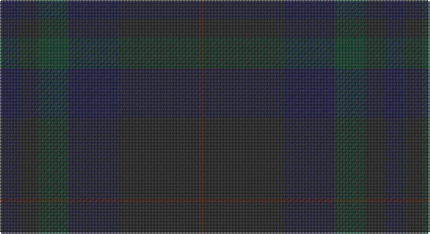

This page is one **sett** — a single exact thread-count. It belongs to the [tartan](/setts/db13dt13dg21db34dt55do3/)
(the same proportion at any scale), whose colour order is pattern [BBBGBB](/stripes/bbbgbb/).

Part of the [Bouncing Blackie](/tartans/bouncing-blackie/) tartan — the named design grouping this sett with its other cloths.

Sourced from register-of-tartans.  It is a [6 stripe tartan](/stripes/stripes6/).

Original link https://www.tartanregister.gov.uk/tartanDetails.aspx?ref=5805

## Register references

External register numbers recorded for this tartan.

- Scottish Register of Tartans: [5805](https://www.tartanregister.gov.uk/tartanDetails.aspx?ref=5805)
- Scottish Tartans Authority (ITI): 7854

## Thread count
DB/13 K13 DG21 DB34 K55 DR/3

One full sett is **262 threads**.

## Palette

Palette: <strong>Tartan Register</strong> <small style="color:#888">(4 of 5 colours)</small>
<table><thead><tr><th>Colour</th><th>Threads</th><th>Shade</th><th>Base</th><th>OKLCh</th></tr></thead><tbody><tr><td>DB/</td><td style="text-align:right;font-variant-numeric:tabular-nums">13</td><td><code style="background-color:#14143C;">#14143C</code> <small style="color:#888">#14143C</small></td><td>B <code style="background-color:#2A418A;">#2A418A</code></td><td><small style="color:#888">oklch(21.9% 0.075 278.3)</small></td></tr><tr><td>K</td><td style="text-align:right;font-variant-numeric:tabular-nums">13</td><td><code style="background-color:#1C1C1C;">#1C1C1C</code> <small style="color:#888">#1C1C1C</small></td><td>B <code style="background-color:#2A418A;">#2A418A</code></td><td><small style="color:#888">oklch(22.6% 0.000 89.9)</small></td></tr><tr><td>DG</td><td style="text-align:right;font-variant-numeric:tabular-nums">21</td><td><code style="background-color:#003820;">#003820</code> <small style="color:#888">#003820</small></td><td>G <code style="background-color:#006100;">#006100</code></td><td><small style="color:#888">oklch(30.0% 0.070 158.3)</small></td></tr><tr><td>DB</td><td style="text-align:right;font-variant-numeric:tabular-nums">34</td><td><code style="background-color:#14143C;">#14143C</code> <small style="color:#888">#14143C</small></td><td>B <code style="background-color:#2A418A;">#2A418A</code></td><td><small style="color:#888">oklch(21.9% 0.075 278.3)</small></td></tr><tr><td>K</td><td style="text-align:right;font-variant-numeric:tabular-nums">55</td><td><code style="background-color:#1C1C1C;">#1C1C1C</code> <small style="color:#888">#1C1C1C</small></td><td>B <code style="background-color:#2A418A;">#2A418A</code></td><td><small style="color:#888">oklch(22.6% 0.000 89.9)</small></td></tr><tr><td>DR/</td><td style="text-align:right;font-variant-numeric:tabular-nums">3</td><td><code style="background-color:#441800;">#441800</code> <small style="color:#888">#441800</small></td><td>B <code style="background-color:#2A418A;">#2A418A</code></td><td><small style="color:#888">oklch(27.3% 0.076 46.3)</small></td></tr></tbody></table>

# Sample pattern

## Nearest tartans

The nearest existing variants by ΔTartan distance, with this tartan at the top so the swatches line up against it.

ΔTartan

Tartan

Sett

—

<a href="/ttd/edit/#slug=db13dt13dg21db34dt55do3">Bouncing Blackie (Personal)</a> <a class="nn-out" href="/variants/s6/db13dt13dg21db34dt55do3/" title="open its dictionary page">↗</a>

2.35

<a href="/ttd/edit/#slug=k2dg20k30dg2k4dg2k30dg3k30dg35dg2&amp;base=db13dt13dg21db34dt55do3">Phillips (Welsh Name)</a> <a class="nn-out" href="/variants/s11/k2dg20k30dg2k4dg2k30dg3k30dg35dg2/" title="open its dictionary page">↗</a>

2.63

<a href="/ttd/edit/#slug=dti1dt4k11dt1k1dt1k1dti1k11dtii4dg1dtii8k8dt8dtii1~x4&amp;base=db13dt13dg21db34dt55do3">ShadowHalls</a> <a class="nn-out" href="/variants/s15/dti1dt4k11dt1k1dt1k1dti1k11dtii4dg1dtii8k8dt8dtii1~x4/" title="open its dictionary page">↗</a>

2.89

<a href="/ttd/edit/#slug=dy2n4y12n3dy6t2n24dy2n2y2~x2&amp;base=db13dt13dg21db34dt55do3">Wicklow Irish County Tartan</a> <a class="nn-out" href="/variants/s10/dy2n4y12n3dy6t2n24dy2n2y2~x2/" title="open its dictionary page">↗</a>

2.93

<a href="/variants/s5/dt4k43ki20dt7y2~x2/">Deighan (Edinburgh)</a>

3.03

<a href="/variants/s7/k17ki4k13ki4k3ki45k3~x2/">Black Spirit Fashion Tartan</a>

3.10

<a href="/ttd/edit/#slug=dy6dg2dy29dg29dy2dg6~x2&amp;base=db13dt13dg21db34dt55do3">Harmony 11 #2</a> <a class="nn-out" href="/variants/s6/dy6dg2dy29dg29dy2dg6~x2/" title="open its dictionary page">↗</a>

3.21

<a href="/ttd/edit/#slug=dg8dt27dg11do2dg11dt27dg8r2~x2&amp;base=db13dt13dg21db34dt55do3">Hector, James</a> <a class="nn-out" href="/variants/s8/dg8dt27dg11do2dg11dt27dg8r2~x2/" title="open its dictionary page">↗</a>

3.30

<a href="/ttd/edit/#slug=lo5n2y8n1y8n4y4n6y18lr1lo5~x2&amp;base=db13dt13dg21db34dt55do3">Bute Heather, Ancient Wth'd (Fashion</a> <a class="nn-out" href="/variants/s11/lo5n2y8n1y8n4y4n6y18lr1lo5~x2/" title="open its dictionary page">↗</a>

3.31

<a href="/variants/s10/ki21k2ki2k2ki3k15k29k2k2k4~x2/">City of Armadale Australian District Tartan</a>

3.33

<a href="/ttd/edit/#slug=k44dg12dt1o6~x2&amp;base=db13dt13dg21db34dt55do3">Heslop, William D Name Tartan</a> <a class="nn-out" href="/variants/s4/k44dg12dt1o6~x2/" title="open its dictionary page">↗</a>

## Neighbour map

Every grey dot is one of 14360 variants placed by the first two principal components of the ΔTartan feature space (44% of its variance). Red is this tartan; blue dots are its nearest — click one to open its page.

<svg viewBox="0 0 640 380" role="img" style="max-width:100%;height:auto;border:1px solid #e0e0e0;border-radius:4px;display:block" xmlns="http://www.w3.org/2000/svg"><image href="/nn/cloud.v1.png" width="640" height="380"/><a href="/variants/s11/k2dg20k30dg2k4dg2k30dg3k30dg35dg2/"><circle cx="437.1" cy="279.3" r="4" fill="#3465a4"><title>Phillips (Welsh Name)</title></circle></a><a href="/variants/s15/dti1dt4k11dt1k1dt1k1dti1k11dtii4dg1dtii8k8dt8dtii1~x4/"><circle cx="518.4" cy="315.6" r="4" fill="#3465a4"><title>ShadowHalls</title></circle></a><a href="/variants/s10/dy2n4y12n3dy6t2n24dy2n2y2~x2/"><circle cx="552.4" cy="298.8" r="4" fill="#3465a4"><title>Wicklow Irish County Tartan</title></circle></a><a href="/variants/s5/dt4k43ki20dt7y2~x2/"><circle cx="533.9" cy="302.9" r="4" fill="#3465a4"><title>Deighan (Edinburgh)</title></circle></a><a href="/variants/s7/k17ki4k13ki4k3ki45k3~x2/"><circle cx="626.0" cy="352.5" r="4" fill="#3465a4"><title>Black Spirit Fashion Tartan</title></circle></a><a href="/variants/s6/dy6dg2dy29dg29dy2dg6~x2/"><circle cx="622.7" cy="366.0" r="4" fill="#3465a4"><title>Harmony 11 #2</title></circle></a><a href="/variants/s8/dg8dt27dg11do2dg11dt27dg8r2~x2/"><circle cx="509.6" cy="316.0" r="4" fill="#3465a4"><title>Hector, James</title></circle></a><a href="/variants/s11/lo5n2y8n1y8n4y4n6y18lr1lo5~x2/"><circle cx="560.0" cy="292.2" r="4" fill="#3465a4"><title>Bute Heather, Ancient Wth'd (Fashion</title></circle></a><a href="/variants/s10/ki21k2ki2k2ki3k15k29k2k2k4~x2/"><circle cx="459.2" cy="303.1" r="4" fill="#3465a4"><title>City of Armadale Australian District Tartan</title></circle></a><a href="/variants/s4/k44dg12dt1o6~x2/"><circle cx="626.0" cy="296.9" r="4" fill="#3465a4"><title>Heslop, William D Name Tartan</title></circle></a><circle cx="530.0" cy="352.9" r="5" fill="#c00000"/></svg>

ID: /variants/s6/db13dt13dg21db34dt55do3/
