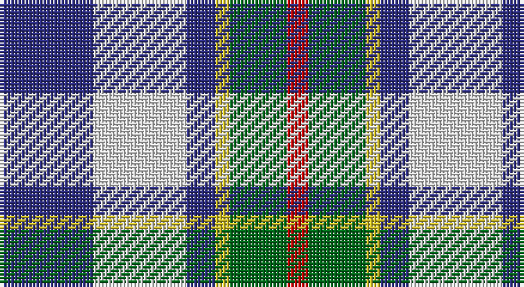

This page is one **sett** — a single exact thread-count. It belongs to the [tartan](/setts/db13w13db4ly2g8r3/)
(the same proportion at any scale), whose colour order is pattern [BWBYGR](/stripes/bwbygr/).

Part of the [Unidentified](/tartans/unidentified/) tartan — the named design grouping this sett with its other cloths.

Sourced from tartans-authority.  It is a [6 stripe tartan](/stripes/stripes6/).

Original link http://www.tartansauthority.com/tartan-ferret/display/7929/

## Also known as

This cloth is also recorded under:

- Unidentified #10
- Unidentified #12
- Unidentified #14
- Unidentified #15
- Unidentified #16
- Unidentified #18
- Unidentified #2
- Unidentified #21
- Unidentified #22
- Unidentified #24
- Unidentified #25
- Unidentified #28
- Unidentified #29
- Unidentified #30
- Unidentified #31
- Unidentified #32
- Unidentified #36
- Unidentified #37
- Unidentified #38
- Unidentified #40
- Unidentified #43
- Unidentified #44
- Unidentified #45
- Unidentified #46
- Unidentified #47
- Unidentified #48
- Unidentified #49
- Unidentified #5
- Unidentified #50
- Unidentified #51
- Unidentified #52
- Unidentified #53
- Unidentified #54
- Unidentified #55
- Unidentified #56
- Unidentified #57
- Unidentified #58
- Unidentified #59
- Unidentified #60
- Unidentified #61
- Unidentified #62
- Unidentified #63
- Unidentified #64
- Unidentified #65
- Unidentified #66
- Unidentified #7
- Unidentified #8
- Unidentified #9
- Unidentified 16
- Unidentified Artifact
- Unidentified Plaid
- Unidentified Plaid #11
- Unidentified Plaid #13
- Unidentified Plaid #2
- Unidentified Plaid #3
- Unidentified Plaid #7
- Unidentified Plaid #8
- Unidentified Plaid #9
- Unidentified Portrait

## Register references

External register numbers recorded for this tartan.

- Scottish Register of Tartans: [7929](https://www.tartanregister.gov.uk/tartanDetails?ref=7929)
- Scottish Tartans Authority (ITI): 7929

## Thread count
DB/26 LN26 DB8 Y4 G16 R/6

One full sett is **140 threads**.

## Palette

Palette: <strong>Tartan Register</strong> <small style="color:#888">(4 of 5 colours)</small>
<table><thead><tr><th>Colour</th><th>Threads</th><th>Shade</th><th>Base</th><th>OKLCh</th></tr></thead><tbody><tr><td>DB/</td><td style="text-align:right;font-variant-numeric:tabular-nums">26</td><td><code style="background-color:#2C2C80;">#2C2C80</code> <small style="color:#888">#2C2C80</small></td><td>B <code style="background-color:#2A418A;">#2A418A</code></td><td><small style="color:#888">oklch(35.0% 0.138 276.6)</small></td></tr><tr><td>LN</td><td style="text-align:right;font-variant-numeric:tabular-nums">26</td><td><code style="background-color:#E0E0E0;">#E0E0E0</code> <small style="color:#888">#E0E0E0</small></td><td>W <code style="background-color:#F7F7F7;">#F7F7F7</code></td><td><small style="color:#888">oklch(90.7% 0.000 89.9)</small></td></tr><tr><td>DB</td><td style="text-align:right;font-variant-numeric:tabular-nums">8</td><td><code style="background-color:#2C2C80;">#2C2C80</code> <small style="color:#888">#2C2C80</small></td><td>B <code style="background-color:#2A418A;">#2A418A</code></td><td><small style="color:#888">oklch(35.0% 0.138 276.6)</small></td></tr><tr><td>Y</td><td style="text-align:right;font-variant-numeric:tabular-nums">4</td><td><code style="background-color:#D4C028;">#D4C028</code> <small style="color:#888">#D4C028</small></td><td>Y <code style="background-color:#F2BF00;">#F2BF00</code></td><td><small style="color:#888">oklch(80.1% 0.158 101.2)</small></td></tr><tr><td>G</td><td style="text-align:right;font-variant-numeric:tabular-nums">16</td><td><code style="background-color:#006818;">#006818</code> <small style="color:#888">#006818</small></td><td>G <code style="background-color:#006100;">#006100</code></td><td><small style="color:#888">oklch(45.0% 0.142 145.0)</small></td></tr><tr><td>R/</td><td style="text-align:right;font-variant-numeric:tabular-nums">6</td><td><code style="background-color:#C80000;">#C80000</code> <small style="color:#888">#C80000</small></td><td>R <code style="background-color:#CC0000;">#CC0000</code></td><td><small style="color:#888">oklch(52.3% 0.215 29.2)</small></td></tr></tbody></table>

# Sample pattern

## Compared to the master

This cloth is one sett of its design; the master sett (the exemplar the design is anchored on) is below for comparison.

<figure style="margin:0"><figcaption style="color:#888;font-size:smaller">this sett</figcaption></figure>
<figure style="margin:0"><figcaption style="color:#888;font-size:smaller"><a href="/setts/dp4r3dp26r26dg26r4/">master sett →</a></figcaption></figure>

## Nearest tartans

The nearest existing variants by ΔTartan distance, with this tartan at the top so the swatches line up against it.

ΔTartan

Tartan

Sett

—

<a href="/ttd/edit/#slug=db13w13db4ly2g8r3~x2">Unidentified (Winterbottom)</a> <a class="nn-out" href="/variants/s6/db13w13db4ly2g8r3~x2/" title="open its dictionary page">↗</a>

0.89

<a href="/ttd/edit/#slug=k4db9ly6db22g4w20g6w4&amp;base=db13w13db4ly2g8r3~x2">Ship Hector</a> <a class="nn-out" href="/variants/s8/k4db9ly6db22g4w20g6w4/" title="open its dictionary page">↗</a>

0.89

<a href="/ttd/edit/#slug=k3db10ly5db16g3w16g5w3~x2&amp;base=db13w13db4ly2g8r3~x2">Ship Hector, The (Commemorative)</a> <a class="nn-out" href="/variants/s8/k3db10ly5db16g3w16g5w3~x2/" title="open its dictionary page">↗</a>

1.04

<a href="/ttd/edit/#slug=r4t28k6lb12k12lo3~x2&amp;base=db13w13db4ly2g8r3~x2">MacTavish Dress</a> <a class="nn-out" href="/variants/s6/r4t28k6lb12k12lo3~x2/" title="open its dictionary page">↗</a>

1.05

<a href="/ttd/edit/#slug=r4o25k6w12k11ly3~x2&amp;base=db13w13db4ly2g8r3~x2">Thomson Dress (Grey) (Fashion)</a> <a class="nn-out" href="/variants/s6/r4o25k6w12k11ly3~x2/" title="open its dictionary page">↗</a>

1.08

<a href="/ttd/edit/#slug=lb12k3lbi3k3lb13t6k17r3~x2&amp;base=db13w13db4ly2g8r3~x2">Mitsukoshi (Corporate)</a> <a class="nn-out" href="/variants/s8/lb12k3lbi3k3lb13t6k17r3~x2/" title="open its dictionary page">↗</a>

1.10

<a href="/ttd/edit/#slug=k2t10r5w2db2w2r2~x6&amp;base=db13w13db4ly2g8r3~x2">U.S. Postal Service (Corporate)</a> <a class="nn-out" href="/variants/s7/k2t10r5w2db2w2r2~x6/" title="open its dictionary page">↗</a>

1.12

<a href="/ttd/edit/#slug=r4db18ri4dg19w25r10w4~x2&amp;base=db13w13db4ly2g8r3~x2">Fraser Red Dress</a> <a class="nn-out" href="/variants/s7/r4db18ri4dg19w25r10w4~x2/" title="open its dictionary page">↗</a>

1.14

<a href="/ttd/edit/#slug=w20db14dt14w4dbi2b2dt7~x2&amp;base=db13w13db4ly2g8r3~x2">Earl of St. Andrews Dress</a> <a class="nn-out" href="/variants/s7/w20db14dt14w4dbi2b2dt7~x2/" title="open its dictionary page">↗</a>

1.15

<a href="/ttd/edit/#slug=db12r2db2r2db2g10w12o3~x2&amp;base=db13w13db4ly2g8r3~x2">Idaho, Centennial</a> <a class="nn-out" href="/variants/s8/db12r2db2r2db2g10w12o3~x2/" title="open its dictionary page">↗</a>

1.18

<a href="/ttd/edit/#slug=r4t28k6w12k12ly3~x2&amp;base=db13w13db4ly2g8r3~x2">MacTavish / Thom(p)son, dress</a> <a class="nn-out" href="/variants/s6/r4t28k6w12k12ly3~x2/" title="open its dictionary page">↗</a>

## Neighbour map

Every grey dot is one of 14360 variants placed by the first two principal components of the ΔTartan feature space (44% of its variance). Red is this tartan; blue dots are its nearest — click one to open its page.

<svg viewBox="0 0 640 380" role="img" style="max-width:100%;height:auto;border:1px solid #e0e0e0;border-radius:4px;display:block" xmlns="http://www.w3.org/2000/svg"><image href="/nn/cloud.v1.png" width="640" height="380"/><a href="/variants/s8/k4db9ly6db22g4w20g6w4/"><circle cx="114.7" cy="189.3" r="4" fill="#3465a4"><title>Ship Hector</title></circle></a><a href="/variants/s8/k3db10ly5db16g3w16g5w3~x2/"><circle cx="109.3" cy="190.4" r="4" fill="#3465a4"><title>Ship Hector, The (Commemorative)</title></circle></a><a href="/variants/s6/r4t28k6lb12k12lo3~x2/"><circle cx="167.8" cy="188.3" r="4" fill="#3465a4"><title>MacTavish Dress</title></circle></a><a href="/variants/s6/r4o25k6w12k11ly3~x2/"><circle cx="140.5" cy="186.0" r="4" fill="#3465a4"><title>Thomson Dress (Grey) (Fashion)</title></circle></a><a href="/variants/s8/lb12k3lbi3k3lb13t6k17r3~x2/"><circle cx="130.8" cy="191.1" r="4" fill="#3465a4"><title>Mitsukoshi (Corporate)</title></circle></a><a href="/variants/s7/k2t10r5w2db2w2r2~x6/"><circle cx="118.4" cy="190.6" r="4" fill="#3465a4"><title>U.S. Postal Service (Corporate)</title></circle></a><a href="/variants/s7/r4db18ri4dg19w25r10w4~x2/"><circle cx="85.3" cy="192.2" r="4" fill="#3465a4"><title>Fraser Red Dress</title></circle></a><a href="/variants/s7/w20db14dt14w4dbi2b2dt7~x2/"><circle cx="128.5" cy="172.8" r="4" fill="#3465a4"><title>Earl of St. Andrews Dress</title></circle></a><a href="/variants/s8/db12r2db2r2db2g10w12o3~x2/"><circle cx="105.7" cy="186.6" r="4" fill="#3465a4"><title>Idaho, Centennial</title></circle></a><a href="/variants/s6/r4t28k6w12k12ly3~x2/"><circle cx="147.7" cy="179.0" r="4" fill="#3465a4"><title>MacTavish / Thom(p)son, dress</title></circle></a><circle cx="113.0" cy="207.2" r="5" fill="#c00000"/></svg>

ID: /variants/s6/db13w13db4ly2g8r3~x2/
