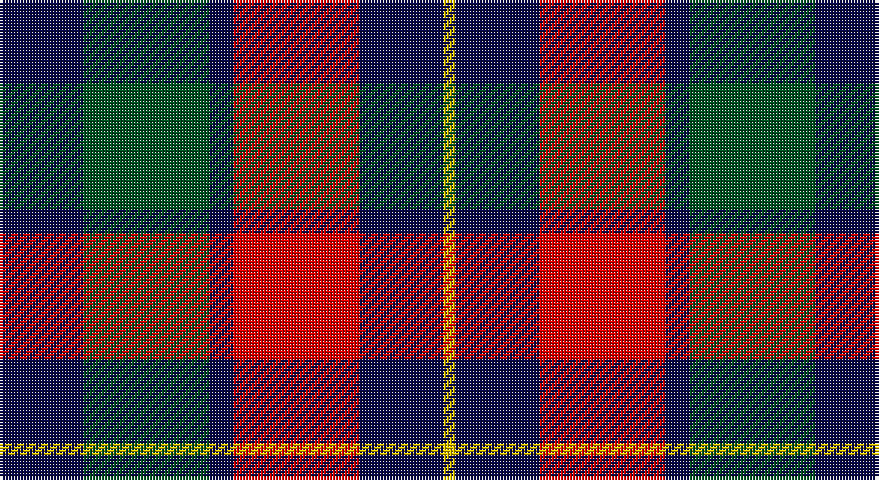

This page is one **sett** — a single exact thread-count. It belongs to the [tartan](/setts/db14dg21db4r21db14ly2/)
(the same proportion at any scale), whose colour order is pattern [BGBRBY](/stripes/bgbrby/).

Part of the [Kilgour](/tartans/kilgour/) tartan — the named design grouping this sett with its other cloths.

Sourced from register-of-tartans.  It is a [6 stripe tartan](/stripes/stripes6/).

Original link https://www.tartanregister.gov.uk/tartanDetails.aspx?ref=1967

## Register references

External register numbers recorded for this tartan.

- Scottish Register of Tartans: [1967](https://www.tartanregister.gov.uk/tartanDetails.aspx?ref=1967)
- Scottish Tartans World Register: 1922

## Thread count
DB/28 G42 DB8 R42 DB28 Y/4

One full sett is **272 threads**.

## Palette

Palette: <strong>Tartan Register</strong> <small style="color:#888">(3 of 4 colours)</small>
<table><thead><tr><th>Colour</th><th>Threads</th><th>Shade</th><th>Base</th><th>OKLCh</th></tr></thead><tbody><tr><td>DB/</td><td style="text-align:right;font-variant-numeric:tabular-nums">28</td><td><code style="background-color:#080848;">#080848</code> <small style="color:#888">#080848</small></td><td>B <code style="background-color:#2A418A;">#2A418A</code></td><td><small style="color:#888">oklch(20.2% 0.112 270.4)</small></td></tr><tr><td>G</td><td style="text-align:right;font-variant-numeric:tabular-nums">42</td><td><code style="background-color:#005020;">#005020</code> <small style="color:#888">#005020</small></td><td>G <code style="background-color:#006100;">#006100</code></td><td><small style="color:#888">oklch(37.7% 0.105 149.6)</small></td></tr><tr><td>DB</td><td style="text-align:right;font-variant-numeric:tabular-nums">8</td><td><code style="background-color:#080848;">#080848</code> <small style="color:#888">#080848</small></td><td>B <code style="background-color:#2A418A;">#2A418A</code></td><td><small style="color:#888">oklch(20.2% 0.112 270.4)</small></td></tr><tr><td>R</td><td style="text-align:right;font-variant-numeric:tabular-nums">42</td><td><code style="background-color:#DC0000;">#DC0000</code> <small style="color:#888">#DC0000</small></td><td>R <code style="background-color:#CC0000;">#CC0000</code></td><td><small style="color:#888">oklch(56.2% 0.230 29.2)</small></td></tr><tr><td>DB</td><td style="text-align:right;font-variant-numeric:tabular-nums">28</td><td><code style="background-color:#080848;">#080848</code> <small style="color:#888">#080848</small></td><td>B <code style="background-color:#2A418A;">#2A418A</code></td><td><small style="color:#888">oklch(20.2% 0.112 270.4)</small></td></tr><tr><td>Y/</td><td style="text-align:right;font-variant-numeric:tabular-nums">4</td><td><code style="background-color:#E8C000;">#E8C000</code> <small style="color:#888">#E8C000</small></td><td>Y <code style="background-color:#F2BF00;">#F2BF00</code></td><td><small style="color:#888">oklch(81.9% 0.168 93.7)</small></td></tr></tbody></table>

# Sample pattern

## Nearest tartans

The nearest existing variants by ΔTartan distance, with this tartan at the top so the swatches line up against it.

ΔTartan

Tartan

Sett

—

<a href="/ttd/edit/#slug=db14dg21db4r21db14ly2~x2">Kilgour</a> <a class="nn-out" href="/variants/s6/db14dg21db4r21db14ly2~x2/" title="open its dictionary page">↗</a>

0.64

<a href="/ttd/edit/#slug=db14g21db4r21db14ly2~x2&amp;base=db14dg21db4r21db14ly2~x2">Kilgour</a> <a class="nn-out" href="/variants/s6/db14g21db4r21db14ly2~x2/" title="open its dictionary page">↗</a>

0.84

<a href="/ttd/edit/#slug=r20k14w2k14g9r3g11~x2&amp;base=db14dg21db4r21db14ly2~x2">Brough</a> <a class="nn-out" href="/variants/s7/r20k14w2k14g9r3g11~x2/" title="open its dictionary page">↗</a>

0.92

<a href="/ttd/edit/#slug=ly5g22dp15dpi11dp5g2~x2&amp;base=db14dg21db4r21db14ly2~x2">Scottish Ballet</a> <a class="nn-out" href="/variants/s6/ly5g22dp15dpi11dp5g2~x2/" title="open its dictionary page">↗</a>

1.07

<a href="/ttd/edit/#slug=g3k15r8g2o8k2~x4&amp;base=db14dg21db4r21db14ly2~x2">Thompson Black (Fashion)</a> <a class="nn-out" href="/variants/s6/g3k15r8g2o8k2~x4/" title="open its dictionary page">↗</a>

1.08

<a href="/ttd/edit/#slug=db13k13db13r29ly4~x2&amp;base=db14dg21db4r21db14ly2~x2">Highland Pub Company</a> <a class="nn-out" href="/variants/s5/db13k13db13r29ly4~x2/" title="open its dictionary page">↗</a>

1.10

<a href="/ttd/edit/#slug=w2r3dg9r3db2r3db3w1~x6&amp;base=db14dg21db4r21db14ly2~x2">Utah (US State)</a> <a class="nn-out" href="/variants/s8/w2r3dg9r3db2r3db3w1~x6/" title="open its dictionary page">↗</a>

1.12

<a href="/ttd/edit/#slug=b2r12db2b6k6b1~x2&amp;base=db14dg21db4r21db14ly2~x2">MacTavish</a> <a class="nn-out" href="/variants/s6/b2r12db2b6k6b1~x2/" title="open its dictionary page">↗</a>

1.12

<a href="/ttd/edit/#slug=b2r12db2b6k6b1&amp;base=db14dg21db4r21db14ly2~x2">MacTavish</a> <a class="nn-out" href="/variants/s6/b2r12db2b6k6b1/" title="open its dictionary page">↗</a>

1.13

<a href="/ttd/edit/#slug=r8k18r6k18b27k2w3~x2&amp;base=db14dg21db4r21db14ly2~x2">MacKean (Personal)</a> <a class="nn-out" href="/variants/s7/r8k18r6k18b27k2w3~x2/" title="open its dictionary page">↗</a>

1.13

<a href="/ttd/edit/#slug=r25g10db30w4db30g10r25w2~x2&amp;base=db14dg21db4r21db14ly2~x2">Highland Spring Dress (2004)</a> <a class="nn-out" href="/variants/s8/r25g10db30w4db30g10r25w2~x2/" title="open its dictionary page">↗</a>

## Neighbour map

Every grey dot is one of 14360 variants placed by the first two principal components of the ΔTartan feature space (44% of its variance). Red is this tartan; blue dots are its nearest — click one to open its page.

<svg viewBox="0 0 640 380" role="img" style="max-width:100%;height:auto;border:1px solid #e0e0e0;border-radius:4px;display:block" xmlns="http://www.w3.org/2000/svg"><image href="/nn/cloud.v1.png" width="640" height="380"/><a href="/variants/s6/db14g21db4r21db14ly2~x2/"><circle cx="185.2" cy="225.7" r="4" fill="#3465a4"><title>Kilgour</title></circle></a><a href="/variants/s7/r20k14w2k14g9r3g11~x2/"><circle cx="160.8" cy="219.2" r="4" fill="#3465a4"><title>Brough</title></circle></a><a href="/variants/s6/ly5g22dp15dpi11dp5g2~x2/"><circle cx="194.5" cy="214.0" r="4" fill="#3465a4"><title>Scottish Ballet</title></circle></a><a href="/variants/s6/g3k15r8g2o8k2~x4/"><circle cx="200.8" cy="224.2" r="4" fill="#3465a4"><title>Thompson Black (Fashion)</title></circle></a><a href="/variants/s5/db13k13db13r29ly4~x2/"><circle cx="184.1" cy="249.7" r="4" fill="#3465a4"><title>Highland Pub Company</title></circle></a><a href="/variants/s8/w2r3dg9r3db2r3db3w1~x6/"><circle cx="158.4" cy="207.5" r="4" fill="#3465a4"><title>Utah (US State)</title></circle></a><a href="/variants/s6/b2r12db2b6k6b1~x2/"><circle cx="209.9" cy="196.7" r="4" fill="#3465a4"><title>MacTavish</title></circle></a><a href="/variants/s6/b2r12db2b6k6b1/"><circle cx="209.9" cy="196.7" r="4" fill="#3465a4"><title>MacTavish</title></circle></a><a href="/variants/s7/r8k18r6k18b27k2w3~x2/"><circle cx="229.8" cy="195.6" r="4" fill="#3465a4"><title>MacKean (Personal)</title></circle></a><a href="/variants/s8/r25g10db30w4db30g10r25w2~x2/"><circle cx="231.0" cy="198.0" r="4" fill="#3465a4"><title>Highland Spring Dress (2004)</title></circle></a><circle cx="197.4" cy="228.2" r="5" fill="#c00000"/></svg>

ID: /variants/s6/db14dg21db4r21db14ly2~x2/
