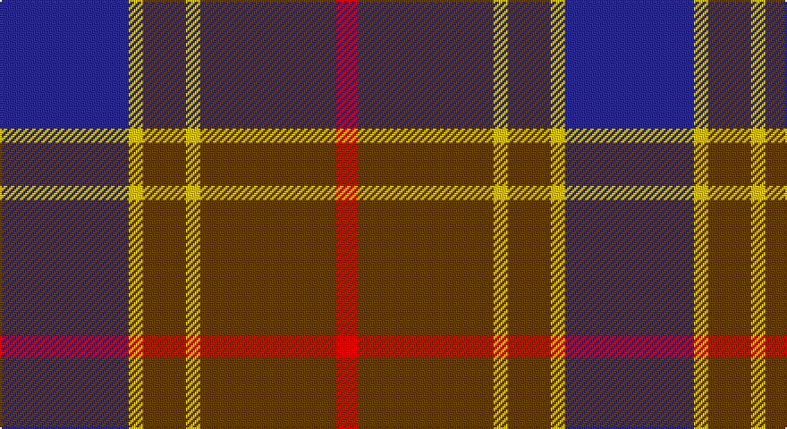

This page is one **sett** — a single exact thread-count. It belongs to the [tartan](/setts/db18ly2dy6ly2dy19r3/)
(the same proportion at any scale), whose colour order is pattern [BYGYGR](/stripes/bygygr/).

Part of the [Balfour Hunting](/tartans/balfour-hunting/) tartan — the named design grouping this sett with its other cloths.

Sourced from tartans-authority.  It is a [6 stripe tartan](/stripes/stripes6/).

Original link http://www.tartansauthority.com/tartan-ferret/display/684/

## Also known as

This cloth is also recorded under:

- Balfour
- Balfour #2
- Balfour blue & brown

## Register references

External register numbers recorded for this tartan.

- Scottish Tartans Authority (ITI): 684

## Thread count
DB/72 Y8 T24 Y8 T76 R/12

One full sett is **316 threads**.

## Palette

Palette: <strong>Tartan Register</strong>
<table><thead><tr><th>Colour</th><th>Threads</th><th>Shade</th><th>Base</th><th>OKLCh</th></tr></thead><tbody><tr><td>DB/</td><td style="text-align:right;font-variant-numeric:tabular-nums">72</td><td><code style="background-color:#2C2C80;">#2C2C80</code> <small style="color:#888">#2C2C80</small></td><td>B <code style="background-color:#2A418A;">#2A418A</code></td><td><small style="color:#888">oklch(35.0% 0.138 276.6)</small></td></tr><tr><td>Y</td><td style="text-align:right;font-variant-numeric:tabular-nums">8</td><td><code style="background-color:#E8C000;">#E8C000</code> <small style="color:#888">#E8C000</small></td><td>Y <code style="background-color:#F2BF00;">#F2BF00</code></td><td><small style="color:#888">oklch(81.9% 0.168 93.7)</small></td></tr><tr><td>T</td><td style="text-align:right;font-variant-numeric:tabular-nums">24</td><td><code style="background-color:#604000;">#604000</code> <small style="color:#888">#604000</small></td><td>G <code style="background-color:#006100;">#006100</code></td><td><small style="color:#888">oklch(39.8% 0.083 76.8)</small></td></tr><tr><td>Y</td><td style="text-align:right;font-variant-numeric:tabular-nums">8</td><td><code style="background-color:#E8C000;">#E8C000</code> <small style="color:#888">#E8C000</small></td><td>Y <code style="background-color:#F2BF00;">#F2BF00</code></td><td><small style="color:#888">oklch(81.9% 0.168 93.7)</small></td></tr><tr><td>T</td><td style="text-align:right;font-variant-numeric:tabular-nums">76</td><td><code style="background-color:#604000;">#604000</code> <small style="color:#888">#604000</small></td><td>G <code style="background-color:#006100;">#006100</code></td><td><small style="color:#888">oklch(39.8% 0.083 76.8)</small></td></tr><tr><td>R/</td><td style="text-align:right;font-variant-numeric:tabular-nums">12</td><td><code style="background-color:#C80000;">#C80000</code> <small style="color:#888">#C80000</small></td><td>R <code style="background-color:#CC0000;">#CC0000</code></td><td><small style="color:#888">oklch(52.3% 0.215 29.2)</small></td></tr></tbody></table>

# Sample pattern

## Nearest tartans

The nearest existing variants by ΔTartan distance, with this tartan at the top so the swatches line up against it.

ΔTartan

Tartan

Sett

—

<a href="/ttd/edit/#slug=db18ly2dy6ly2dy19r3~x4">Balfour (Clan)</a> <a class="nn-out" href="/variants/s6/db18ly2dy6ly2dy19r3~x4/" title="open its dictionary page">↗</a>

0.00

<a href="/ttd/edit/#slug=db18ly2dy6ly2dy19r3~x2&amp;base=db18ly2dy6ly2dy19r3~x4">Balfour #2</a> <a class="nn-out" href="/variants/s6/db18ly2dy6ly2dy19r3~x2/" title="open its dictionary page">↗</a>

0.84

<a href="/ttd/edit/#slug=dr2dg14lb3dr13ly1dr2~x4&amp;base=db18ly2dy6ly2dy19r3~x4">Swedish Para Whisky Club (Corporate</a> <a class="nn-out" href="/variants/s6/dr2dg14lb3dr13ly1dr2~x4/" title="open its dictionary page">↗</a>

0.85

<a href="/ttd/edit/#slug=lb2dr12g6dr1n6dr1~x4&amp;base=db18ly2dy6ly2dy19r3~x4">Fraser Green</a> <a class="nn-out" href="/variants/s6/lb2dr12g6dr1n6dr1~x4/" title="open its dictionary page">↗</a>

0.87

<a href="/ttd/edit/#slug=o5t13dr4r4dr27t3dr4o5&amp;base=db18ly2dy6ly2dy19r3~x4">Daks, Blue Loden</a> <a class="nn-out" href="/variants/s8/o5t13dr4r4dr27t3dr4o5/" title="open its dictionary page">↗</a>

0.95

<a href="/ttd/edit/#slug=lo3t7do2m2do14t2do2lo3~x2&amp;base=db18ly2dy6ly2dy19r3~x4">Daks (Blue Loden)</a> <a class="nn-out" href="/variants/s8/lo3t7do2m2do14t2do2lo3~x2/" title="open its dictionary page">↗</a>

1.02

<a href="/ttd/edit/#slug=r2b13dr3b3dr16lb2~x4&amp;base=db18ly2dy6ly2dy19r3~x4">MacArthur-Fox Blue (Personal)</a> <a class="nn-out" href="/variants/s6/r2b13dr3b3dr16lb2~x4/" title="open its dictionary page">↗</a>

1.07

<a href="/ttd/edit/#slug=dy15r5dy30db32dy4ly3~x2&amp;base=db18ly2dy6ly2dy19r3~x4">Cameron Hunting Brown Clan Tartan</a> <a class="nn-out" href="/variants/s6/dy15r5dy30db32dy4ly3~x2/" title="open its dictionary page">↗</a>

1.09

<a href="/ttd/edit/#slug=m10dy60dt13lo24dt24dy8&amp;base=db18ly2dy6ly2dy19r3~x4">Bronte House Check</a> <a class="nn-out" href="/variants/s6/m10dy60dt13lo24dt24dy8/" title="open its dictionary page">↗</a>

1.09

<a href="/ttd/edit/#slug=db18ly2o6ly2o19r3~x2&amp;base=db18ly2dy6ly2dy19r3~x4">Balfour blue &amp; brown</a> <a class="nn-out" href="/variants/s6/db18ly2o6ly2o19r3~x2/" title="open its dictionary page">↗</a>

1.10

<a href="/ttd/edit/#slug=db3g21db3o21db35w3~x2&amp;base=db18ly2dy6ly2dy19r3~x4">Donnolly</a> <a class="nn-out" href="/variants/s6/db3g21db3o21db35w3~x2/" title="open its dictionary page">↗</a>

## Neighbour map

Every grey dot is one of 14360 variants placed by the first two principal components of the ΔTartan feature space (44% of its variance). Red is this tartan; blue dots are its nearest — click one to open its page.

<svg viewBox="0 0 640 380" role="img" style="max-width:100%;height:auto;border:1px solid #e0e0e0;border-radius:4px;display:block" xmlns="http://www.w3.org/2000/svg"><image href="/nn/cloud.v1.png" width="640" height="380"/><a href="/variants/s6/db18ly2dy6ly2dy19r3~x2/"><circle cx="297.0" cy="219.3" r="4" fill="#3465a4"><title>Balfour #2</title></circle></a><a href="/variants/s6/dr2dg14lb3dr13ly1dr2~x4/"><circle cx="312.2" cy="199.8" r="4" fill="#3465a4"><title>Swedish Para Whisky Club (Corporate</title></circle></a><a href="/variants/s6/lb2dr12g6dr1n6dr1~x4/"><circle cx="287.9" cy="212.9" r="4" fill="#3465a4"><title>Fraser Green</title></circle></a><a href="/variants/s8/o5t13dr4r4dr27t3dr4o5/"><circle cx="307.1" cy="203.0" r="4" fill="#3465a4"><title>Daks, Blue Loden</title></circle></a><a href="/variants/s8/lo3t7do2m2do14t2do2lo3~x2/"><circle cx="266.5" cy="207.2" r="4" fill="#3465a4"><title>Daks (Blue Loden)</title></circle></a><a href="/variants/s6/r2b13dr3b3dr16lb2~x4/"><circle cx="278.6" cy="217.5" r="4" fill="#3465a4"><title>MacArthur-Fox Blue (Personal)</title></circle></a><a href="/variants/s6/dy15r5dy30db32dy4ly3~x2/"><circle cx="355.4" cy="235.9" r="4" fill="#3465a4"><title>Cameron Hunting Brown Clan Tartan</title></circle></a><a href="/variants/s6/m10dy60dt13lo24dt24dy8/"><circle cx="248.2" cy="223.4" r="4" fill="#3465a4"><title>Bronte House Check</title></circle></a><a href="/variants/s6/db18ly2o6ly2o19r3~x2/"><circle cx="316.8" cy="227.3" r="4" fill="#3465a4"><title>Balfour blue &amp; brown</title></circle></a><a href="/variants/s6/db3g21db3o21db35w3~x2/"><circle cx="264.6" cy="208.1" r="4" fill="#3465a4"><title>Donnolly</title></circle></a><circle cx="297.0" cy="219.3" r="5" fill="#c00000"/></svg>

ID: /variants/s6/db18ly2dy6ly2dy19r3~x4/
