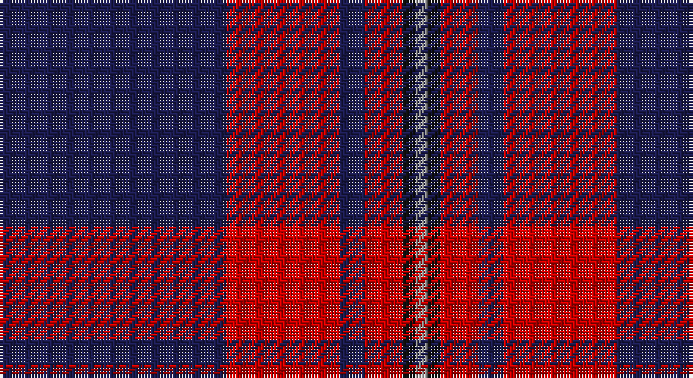

This page is one **sett** — a single exact thread-count. It belongs to the [tartan](/setts/db18r9db2r3k1o1/)
(the same proportion at any scale), whose colour order is pattern [BRBRKR](/stripes/brbrkr/).

Part of the [MacGregor](/tartans/macgregor/) tartan — the named design grouping this sett with its other cloths.

Sourced from register-of-tartans.  It is a [6 stripe tartan](/stripes/stripes6/).

Original link https://www.tartanregister.gov.uk/tartanDetails.aspx?ref=5690

## Also known as

This cloth is also recorded under:

- MacGregor #2
- MacGregor #3
- MacGregor #4
- MacGregor of Glengyle
- MacGregor, Black
- MacGregor, Modern

2 attestations — the source records this cloth was collapsed from (oldest owns this page)

<ul>
<li>undated — MacGregor, Modern (register-of-tartans, <a href="https://www.tartanregister.gov.uk/tartanDetails.aspx?ref=5690">record</a>)</li>
<li>c2004 — MacGregor - 2004 (Pipe Band) (tartans-authority, <a href="http://www.tartansauthority.com/tartan-ferret/display/7691/">record</a>)</li>
</ul>

## Register references

External register numbers recorded for this tartan.

- Scottish Register of Tartans: [5690](https://www.tartanregister.gov.uk/tartanDetails.aspx?ref=5690)
- Scottish Tartans Authority (ITI): 7691

## Thread count
DB/72 R36 DB8 R12 K4 N/4

One full sett is **196 threads**.

## Palette

Palette: <strong>Tartan Register</strong>
<table><thead><tr><th>Colour</th><th>Threads</th><th>Shade</th><th>Base</th><th>OKLCh</th></tr></thead><tbody><tr><td>DB/</td><td style="text-align:right;font-variant-numeric:tabular-nums">72</td><td><code style="background-color:#1C1C50;">#1C1C50</code> <small style="color:#888">#1C1C50</small></td><td>B <code style="background-color:#2A418A;">#2A418A</code></td><td><small style="color:#888">oklch(26.2% 0.093 277.9)</small></td></tr><tr><td>R</td><td style="text-align:right;font-variant-numeric:tabular-nums">36</td><td><code style="background-color:#C80000;">#C80000</code> <small style="color:#888">#C80000</small></td><td>R <code style="background-color:#CC0000;">#CC0000</code></td><td><small style="color:#888">oklch(52.3% 0.215 29.2)</small></td></tr><tr><td>DB</td><td style="text-align:right;font-variant-numeric:tabular-nums">8</td><td><code style="background-color:#1C1C50;">#1C1C50</code> <small style="color:#888">#1C1C50</small></td><td>B <code style="background-color:#2A418A;">#2A418A</code></td><td><small style="color:#888">oklch(26.2% 0.093 277.9)</small></td></tr><tr><td>R</td><td style="text-align:right;font-variant-numeric:tabular-nums">12</td><td><code style="background-color:#C80000;">#C80000</code> <small style="color:#888">#C80000</small></td><td>R <code style="background-color:#CC0000;">#CC0000</code></td><td><small style="color:#888">oklch(52.3% 0.215 29.2)</small></td></tr><tr><td>K</td><td style="text-align:right;font-variant-numeric:tabular-nums">4</td><td><code style="background-color:#101010;">#101010</code> <small style="color:#888">#101010</small></td><td>K <code style="background-color:#000000;">#000000</code></td><td><small style="color:#888">oklch(17.3% 0.000 89.9)</small></td></tr><tr><td>N/</td><td style="text-align:right;font-variant-numeric:tabular-nums">4</td><td><code style="background-color:#888888;">#888888</code> <small style="color:#888">#888888</small></td><td>R <code style="background-color:#CC0000;">#CC0000</code></td><td><small style="color:#888">oklch(62.7% 0.000 89.9)</small></td></tr></tbody></table>

# Sample pattern

## Compared to the master

This cloth is one sett of its design; the master sett (the exemplar the design is anchored on) is below for comparison.

<figure style="margin:0"><figcaption style="color:#888;font-size:smaller">this sett</figcaption></figure>
<figure style="margin:0"><figcaption style="color:#888;font-size:smaller"><a href="/setts/r39dg6r2dg3w1/">master sett →</a></figcaption></figure>

## Nearest tartans

The nearest existing variants by ΔTartan distance, with this tartan at the top so the swatches line up against it.

ΔTartan

Tartan

Sett

—

<a href="/ttd/edit/#slug=db18r9db2r3k1o1~x4">MacGregor, Modern</a> <a class="nn-out" href="/variants/s6/db18r9db2r3k1o1~x4/" title="open its dictionary page">↗</a>

0.94

<a href="/ttd/edit/#slug=db25r8db3r4k1w3~x2&amp;base=db18r9db2r3k1o1~x4">Clan Gregor Tartan</a> <a class="nn-out" href="/variants/s6/db25r8db3r4k1w3~x2/" title="open its dictionary page">↗</a>

1.13

<a href="/ttd/edit/#slug=k1r7k1r7db16g1~x4&amp;base=db18r9db2r3k1o1~x4">Robinson Dress (Pendleton) #1</a> <a class="nn-out" href="/variants/s6/k1r7k1r7db16g1~x4/" title="open its dictionary page">↗</a>

1.15

<a href="/ttd/edit/#slug=k1r7k1r7db16g1~x2&amp;base=db18r9db2r3k1o1~x4">Robinson, dress</a> <a class="nn-out" href="/variants/s6/k1r7k1r7db16g1~x2/" title="open its dictionary page">↗</a>

1.22

<a href="/ttd/edit/#slug=r10db4r6db30k10db5w2~x2&amp;base=db18r9db2r3k1o1~x4">Heritage of Wales (Fashion)</a> <a class="nn-out" href="/variants/s7/r10db4r6db30k10db5w2~x2/" title="open its dictionary page">↗</a>

1.29

<a href="/ttd/edit/#slug=dp46k6g9lo9r4&amp;base=db18r9db2r3k1o1~x4">Ayllu Thuban (Corporate)</a> <a class="nn-out" href="/variants/s5/dp46k6g9lo9r4/" title="open its dictionary page">↗</a>

1.32

<a href="/ttd/edit/#slug=r10db15g2db2w1db1w1~x4&amp;base=db18r9db2r3k1o1~x4">Ikelman #4 (Personal)</a> <a class="nn-out" href="/variants/s7/r10db15g2db2w1db1w1~x4/" title="open its dictionary page">↗</a>

1.35

<a href="/ttd/edit/#slug=r14lr6db38k3g2~x2&amp;base=db18r9db2r3k1o1~x4">Doten (2013)</a> <a class="nn-out" href="/variants/s5/r14lr6db38k3g2~x2/" title="open its dictionary page">↗</a>

1.40

<a href="/ttd/edit/#slug=w2db15r3g3r3db1~x8&amp;base=db18r9db2r3k1o1~x4">Lothian Buses (Corporate?)</a> <a class="nn-out" href="/variants/s6/w2db15r3g3r3db1~x8/" title="open its dictionary page">↗</a>

1.41

<a href="/ttd/edit/#slug=g1r1db16r16db1w1~x2&amp;base=db18r9db2r3k1o1~x4">Galloway, dress</a> <a class="nn-out" href="/variants/s6/g1r1db16r16db1w1~x2/" title="open its dictionary page">↗</a>

1.42

<a href="/ttd/edit/#slug=y4k48y16r12b3~x2&amp;base=db18r9db2r3k1o1~x4">Calgary Firefighters</a> <a class="nn-out" href="/variants/s5/y4k48y16r12b3~x2/" title="open its dictionary page">↗</a>

## Neighbour map

Every grey dot is one of 14360 variants placed by the first two principal components of the ΔTartan feature space (44% of its variance). Red is this tartan; blue dots are its nearest — click one to open its page.

<svg viewBox="0 0 640 380" role="img" style="max-width:100%;height:auto;border:1px solid #e0e0e0;border-radius:4px;display:block" xmlns="http://www.w3.org/2000/svg"><image href="/nn/cloud.v1.png" width="640" height="380"/><a href="/variants/s6/db25r8db3r4k1w3~x2/"><circle cx="415.5" cy="158.3" r="4" fill="#3465a4"><title>Clan Gregor Tartan</title></circle></a><a href="/variants/s6/k1r7k1r7db16g1~x4/"><circle cx="328.3" cy="182.9" r="4" fill="#3465a4"><title>Robinson Dress (Pendleton) #1</title></circle></a><a href="/variants/s6/k1r7k1r7db16g1~x2/"><circle cx="324.1" cy="182.0" r="4" fill="#3465a4"><title>Robinson, dress</title></circle></a><a href="/variants/s7/r10db4r6db30k10db5w2~x2/"><circle cx="339.5" cy="188.0" r="4" fill="#3465a4"><title>Heritage of Wales (Fashion)</title></circle></a><a href="/variants/s5/dp46k6g9lo9r4/"><circle cx="345.9" cy="182.9" r="4" fill="#3465a4"><title>Ayllu Thuban (Corporate)</title></circle></a><a href="/variants/s7/r10db15g2db2w1db1w1~x4/"><circle cx="339.6" cy="170.6" r="4" fill="#3465a4"><title>Ikelman #4 (Personal)</title></circle></a><a href="/variants/s5/r14lr6db38k3g2~x2/"><circle cx="347.5" cy="163.9" r="4" fill="#3465a4"><title>Doten (2013)</title></circle></a><a href="/variants/s6/w2db15r3g3r3db1~x8/"><circle cx="341.2" cy="177.4" r="4" fill="#3465a4"><title>Lothian Buses (Corporate?)</title></circle></a><a href="/variants/s6/g1r1db16r16db1w1~x2/"><circle cx="352.7" cy="171.0" r="4" fill="#3465a4"><title>Galloway, dress</title></circle></a><a href="/variants/s5/y4k48y16r12b3~x2/"><circle cx="341.8" cy="193.6" r="4" fill="#3465a4"><title>Calgary Firefighters</title></circle></a><circle cx="389.7" cy="176.1" r="5" fill="#c00000"/></svg>

ID: /variants/s6/db18r9db2r3k1o1~x4/
