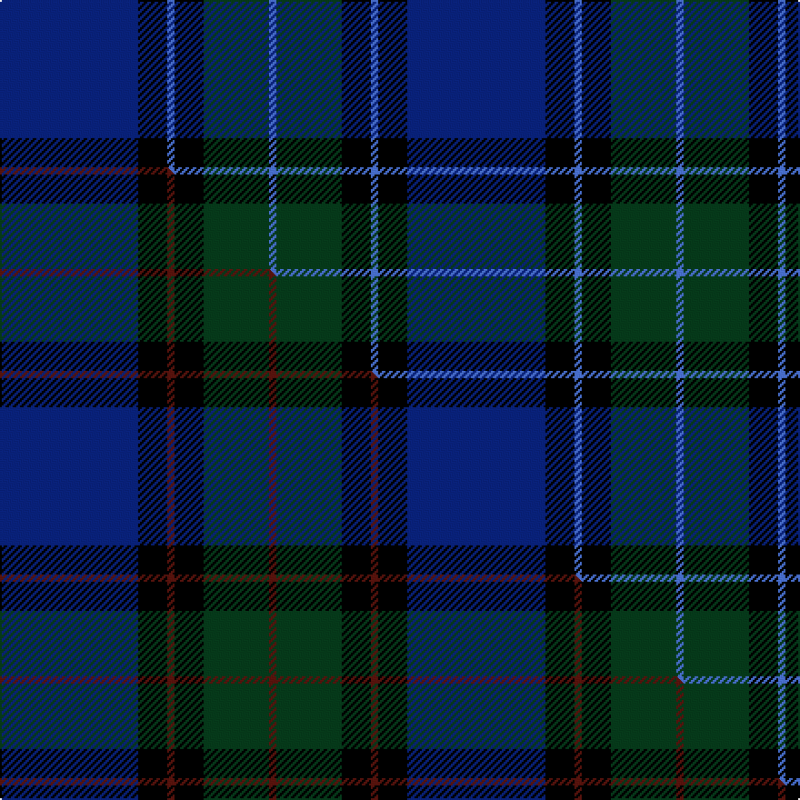

This page is one **sett** — a single exact thread-count. It belongs to the [tartan](/setts/db19k4b1k4dg9b1/)
(the same proportion at any scale), whose colour order is pattern [BGKBKB](/stripes/bgkbkb/).

Part of the [Monarchs](/tartans/monarchs/) tartan — the named design grouping this sett with its other cloths.

Sourced from weddslist.  It is a [6 stripe tartan](/stripes/stripes6/).

Original link [http://www.weddslist.com/cgi-bin/tartans/pg.pl?source=sts](http://www.weddslist.com/cgi-bin/tartans/pg.pl?source=sts)

Dataset <small>— provenance for this record, inherited from the source manifest</small>

<dl class="dataset-prov">
<dt>source</dt><dd><a href="/sources/weddslist/">Weddslist</a></dd>
<dt>data captured from</dt><dd><a href="https://github.com/thetartan/tartan-database/blob/master/data/weddslist/data.csv">https://github.com/thetartan/tartan-database/blob/master/data/weddslist/data.csv</a></dd>
<dt>data date</dt><dd>2016-11-17 <small>(dataset default)</small></dd>
<dt>licence</dt><dd><a href="https://creativecommons.org/licenses/by-nc-nd/4.0/">CC BY-NC-ND 4.0</a></dd>
</dl>

Capture chain <small>— the hands this data passed through, oldest first; each capture carries its own licence</small>

<ol class="capture-chain">
<li><a href="https://www.weddslist.com/tartans/">Weddslist</a> <small>the living privately compiled reference</small></li>
<li><a href="https://github.com/thetartan/tartan-database">thetartan/tartan-database</a> <small>2016-2017</small> · <a href="https://creativecommons.org/licenses/by-nc-nd/4.0/">CC BY-NC-ND 4.0</a> <small>Levko Kravets's frozen compilation — the capture we vendored, and where its CC licence text came from</small></li>
<li>this dictionary <small>captured 2026-06-10 · commit 5bf86c7566</small> <small>each re-capture is a git commit to data/sources</small></li>
</ol>

## Thread count
DB/76 K16 B4 K16 DG36 B/4

One full sett is **224 threads**.

## Palette
<table><thead><tr><th>Colour</th><th>Shade</th><th>OKLCh</th></tr></thead><tbody><tr><td>DB</td><td><code style="background-color:#082077;">#082077</code> <small style="color:#888">#082077</small></td><td><small style="color:#888">oklch(30.0% 0.149 265.1)</small></td></tr><tr><td>B</td><td><code style="background-color:#466CC8;">#466CC8</code> <small style="color:#888">#466CC8</small></td><td><small style="color:#888">oklch(55.1% 0.149 265.0)</small></td></tr><tr><td>DG</td><td><code style="background-color:#053819;">#053819</code> <small style="color:#888">#053819</small></td><td><small style="color:#888">oklch(30.0% 0.075 151.3)</small></td></tr><tr><td>K</td><td><code style="background-color:#000000;">#000000</code> <small style="color:#888">#000000</small></td><td><small style="color:#888">oklch(0.0% 0.000 0.0)</small></td></tr></tbody></table>

# Sample pattern

## Compared to the master

This cloth is one sett of its design; the master sett (the exemplar the design is anchored on) is below for comparison.

Its **ΔTartan distance** from the master is **0.60** — the same measure the nearest-tartans table ranks by (0 is identical; a re-scale of the same cloth is near 0, a recolour or a different proportion further).

<figure class="master-compare" style="margin:0">

this sett
master sett ★

<figcaption style="color:#888;font-size:smaller">One weave of this sett against the <a href="/setts/db19k4dr1k4dg9dr1/">master sett ★</a>, split on the diagonal: a shared proportion runs seamlessly across it with only the shades shifting; a different proportion breaks on it.</figcaption>
</figure>

## Nearest tartan variants

The nearest existing variants by ΔTartan distance, with this cloth at the top so the swatches line up against it.

ΔTartan

Threads

Variant

Sett

—

224

<a href="/variants/s6/db19k4b1k4dg9b1~x4/">Monarchs</a>

<a href="/ttd/edit/#slug=db19k4dr1k4dg9dr1~x4&amp;base=db19k4b1k4dg9b1~x4" title="compare in the TTD">0.60</a>

224

<a href="/variants/s6/db19k4dr1k4dg9dr1~x4/">Monarchs</a>

<a href="/ttd/edit/#slug=db19k4dr1k4dg9k1~x4&amp;base=db19k4b1k4dg9b1~x4" title="compare in the TTD">0.60</a>

224

<a href="/variants/s6/db19k4dr1k4dg9k1~x4/">Monarchs Corporate Sport Tartan</a>

<a href="/ttd/edit/#slug=k20db50dg50r3k3~x2&amp;base=db19k4b1k4dg9b1~x4" title="compare in the TTD">1.67</a>

458

<a href="/variants/s5/k20db50dg50r3k3~x2/">Louisville Spaulding (Personal)</a>

<a href="/ttd/edit/#slug=dt6n4dt2db25k30g2k2~x2&amp;base=db19k4b1k4dg9b1~x4" title="compare in the TTD">1.73</a>

268

<a href="/variants/s7/dt6n4dt2db25k30g2k2~x2/">Passion of Scotland (Fashion)</a>

<a href="/ttd/edit/#slug=k8dr4k36db48dr6dg3lo2~x2&amp;base=db19k4b1k4dg9b1~x4" title="compare in the TTD">1.80</a>

408

<a href="/variants/s7/k8dr4k36db48dr6dg3lo2~x2/">Royal Marines Condor (Military)</a>

<a href="/ttd/edit/#slug=k10lo4dg34db34k1y3~x2&amp;base=db19k4b1k4dg9b1~x4" title="compare in the TTD">1.81</a>

318

<a href="/variants/s6/k10lo4dg34db34k1y3~x2/">Singh, Gopal (Personal)</a>

<a href="/ttd/edit/#slug=db72k21g16lb3g17lb3~x2&amp;base=db19k4b1k4dg9b1~x4" title="compare in the TTD">1.95</a>

378

<a href="/variants/s6/db72k21g16lb3g17lb3~x2/">MacRobart</a>

<a href="/ttd/edit/#slug=k4y1k18db18lb1db4~x4&amp;base=db19k4b1k4dg9b1~x4" title="compare in the TTD">2.35</a>

336

<a href="/variants/s6/k4y1k18db18lb1db4~x4/">Lyndon Prep (School)</a>

<a href="/ttd/edit/#slug=dt4db43k20dt7y2~x2~dt0900000-y2100000&amp;base=db19k4b1k4dg9b1~x4" title="compare in the TTD">2.56</a>

292

<a href="/variants/s5/dt4db43k20dt7y2~x2~dt0900000-y2100000/">Deighan (Edinburgh)</a>

<a href="/ttd/edit/#slug=db22k16y4k11dp2n1~x4&amp;base=db19k4b1k4dg9b1~x4" title="compare in the TTD">2.64</a>

356

<a href="/variants/s6/db22k16y4k11dp2n1~x4/">Martinez, Clément (Personal)</a>

## Neighbour map

Every grey dot is one of 13621 variants placed by the first two principal components of the ΔTartan feature space (42% of its variance). Red is this tartan; blue dots are its nearest — click one to open its page.

<svg viewBox="0 0 640 380" role="img" style="max-width:100%;height:auto;border:1px solid #e0e0e0;border-radius:4px;display:block" xmlns="http://www.w3.org/2000/svg"><image href="/nn/cloud.v1.png" width="640" height="380"/><a href="/variants/s6/db19k4dr1k4dg9dr1~x4/"><circle cx="340.2" cy="187.3" r="4" fill="#3465a4"><title>Monarchs</title></circle></a><a href="/variants/s6/db19k4dr1k4dg9k1~x4/"><circle cx="318.3" cy="171.9" r="4" fill="#3465a4"><title>Monarchs Corporate Sport Tartan</title></circle></a><a href="/variants/s5/k20db50dg50r3k3~x2/"><circle cx="284.1" cy="207.2" r="4" fill="#3465a4"><title>Louisville Spaulding (Personal)</title></circle></a><a href="/variants/s7/dt6n4dt2db25k30g2k2~x2/"><circle cx="255.3" cy="152.8" r="4" fill="#3465a4"><title>Passion of Scotland (Fashion)</title></circle></a><a href="/variants/s7/k8dr4k36db48dr6dg3lo2~x2/"><circle cx="288.5" cy="134.3" r="4" fill="#3465a4"><title>Royal Marines Condor (Military)</title></circle></a><a href="/variants/s6/k10lo4dg34db34k1y3~x2/"><circle cx="265.1" cy="143.5" r="4" fill="#3465a4"><title>Singh, Gopal (Personal)</title></circle></a><a href="/variants/s6/db72k21g16lb3g17lb3~x2/"><circle cx="299.2" cy="150.1" r="4" fill="#3465a4"><title>MacRobart</title></circle></a><a href="/variants/s6/k4y1k18db18lb1db4~x4/"><circle cx="311.8" cy="169.6" r="4" fill="#3465a4"><title>Lyndon Prep (School)</title></circle></a><a href="/variants/s5/dt4db43k20dt7y2~x2~dt0900000-y2100000/"><circle cx="387.1" cy="185.9" r="4" fill="#3465a4"><title>Deighan (Edinburgh)</title></circle></a><a href="/variants/s6/db22k16y4k11dp2n1~x4/"><circle cx="271.4" cy="159.2" r="4" fill="#3465a4"><title>Martinez, Clément (Personal)</title></circle></a><circle cx="324.0" cy="182.6" r="5" fill="#c00000"/><text x="320" y="376" text-anchor="middle" font-size="11" fill="#999">ground</text><text x="11" y="190" text-anchor="middle" font-size="11" fill="#999" transform="rotate(-90 11 190)">complexity</text></svg>

ID: /variants/s6/db19k4b1k4dg9b1~x4/
