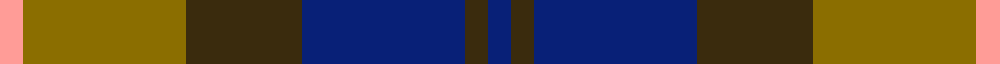

This page is one **sett** — a single exact thread-count. It belongs to the [tartan](/setts/db1dy1db7dy5y7lr1/)
(the same proportion at any scale), whose colour order is pattern [BGBGGY](/stripes/bgbggy/).

Sourced from register-of-tartans.  It is a [6 stripe tartan](/stripes/stripes6/).

Original link https://www.tartanregister.gov.uk/tartanDetails.aspx?ref=925

2 attestations — the source records this cloth was collapsed from (oldest owns this page)

<ul>
<li>01/01/1979 — Dewar (WCWM) (register-of-tartans, <a href="https://www.tartanregister.gov.uk/tartanDetails.aspx?ref=925">record</a>)  <em>Sample in Scottish Tartans Authority's Johnston Collection.</em></li>
<li>pre 1979 — Dewar (Fashion) (tartans-authority, <a href="https://www.tartanregister.gov.uk/tartanDetails.aspx?ref=4675">record</a>)  <em>A WCWM Fashion tartan. Sample in STA's Johnston Collection. Possibly pre 1969 according to an article of that year by Kathleeen Sinclair of Winnipeg on some Canadian tartans - published ij the Tartans Society Proceedings. (EBW Dec. 2014) See also tjhe more attractive Aljean version at 3400. Aljean - women's clothes retailer in Vancouver Canada traded under Aljean name from 1950-2012.</em></li>
</ul>

Dataset <small>— provenance for this record, inherited from the source manifest</small>

<dl class="dataset-prov">
<dt>source</dt><dd><a href="/sources/register-of-tartans/">Scottish Register of Tartans</a></dd>
<dt>data captured from</dt><dd><a href="https://github.com/thetartan/tartan-database/blob/master/data/register-of-tartans/data.csv">https://github.com/thetartan/tartan-database/blob/master/data/register-of-tartans/data.csv</a></dd>
<dt>data date</dt><dd>1979 <small>(this record)</small></dd>
<dt>licence</dt><dd><a href="https://www.tartanregister.gov.uk/copyright">Crown copyright</a></dd>
</dl>

Capture chain <small>— the hands this data passed through, oldest first; each capture carries its own licence</small>

<ol class="capture-chain">
<li><a href="https://www.tartanregister.gov.uk/">Scottish Register of Tartans</a> · <a href="https://www.tartanregister.gov.uk/copyright">Crown copyright</a> <small>the living register — still published by National Records of Scotland</small></li>
<li><a href="https://github.com/thetartan/tartan-database">thetartan/tartan-database</a> <small>2016-2017</small> · <a href="https://creativecommons.org/licenses/by-nc-nd/4.0/">CC BY-NC-ND 4.0</a> <small>Levko Kravets's frozen compilation — the capture we vendored, and where its CC licence text came from</small></li>
<li>this dictionary <small>captured 2026-06-10 · commit 5bf86c7566</small> <small>each re-capture is a git commit to data/sources</small></li>
</ol>

## Register references

External register numbers recorded for this tartan.

- Scottish Register of Tartans: [925](https://www.tartanregister.gov.uk/tartanDetails.aspx?ref=925)
- Scottish Tartans Authority (ITI): 4675

## Thread count
LR/4 Y28 DY20 DB28 DY4 DB/4

One full sett is **168 threads**.

## Palette
<table><thead><tr><th>Colour</th><th>Shade</th><th>OKLCh</th></tr></thead><tbody><tr><td>DB</td><td><code style="background-color:#082077;">#082077</code> <small style="color:#888">#082077</small></td><td><small style="color:#888">oklch(30.0% 0.149 265.1)</small></td></tr><tr><td>Y</td><td><code style="background-color:#8B6E00;">#8B6E00</code> <small style="color:#888">#8B6E00</small></td><td><small style="color:#888">oklch(55.1% 0.113 90.4)</small></td></tr><tr><td>LR</td><td><code style="background-color:#FF9C97;">#FF9C97</code> <small style="color:#888">#FF9C97</small></td><td><small style="color:#888">oklch(79.3% 0.119 23.2)</small></td></tr><tr><td>DY</td><td><code style="background-color:#3A2B0D;">#3A2B0D</code> <small style="color:#888">#3A2B0D</small></td><td><small style="color:#888">oklch(30.0% 0.049 82.0)</small></td></tr></tbody></table>

# Sample pattern

## Nearest tartan variants

The nearest existing variants by ΔTartan distance, with this cloth at the top so the swatches line up against it.

ΔTartan

Threads

Variant

Sett

—

168

<a href="/variants/s6/db1dy1db7dy5y7lr1~x4/">Dewar (WCWM)</a>

<a href="/ttd/edit/#slug=dy5g22dp15dpi11dp5g2~x2~dp1105325-dpi1607327&amp;base=db1dy1db7dy5y7lr1~x4" title="compare in the TTD">1.84</a>

226

<a href="/variants/s6/dy5g22dp15dpi11dp5g2~x2~dp1105325-dpi1607327/">Scottish Ballet</a>

<a href="/ttd/edit/#slug=w2dr3dg9dr3db2dr3db3w1~x6~w3600000&amp;base=db1dy1db7dy5y7lr1~x4" title="compare in the TTD">2.16</a>

294

<a href="/variants/s8/w2dr3dg9dr3db2dr3db3w1~x6~w3600000/">Utah</a>

<a href="/ttd/edit/#slug=dp11dy2dp2dy2dp2dy11g14w2~x2&amp;base=db1dy1db7dy5y7lr1~x4" title="compare in the TTD">2.20</a>

158

<a href="/variants/s8/dp11dy2dp2dy2dp2dy11g14w2~x2/">Lamont #2</a>

<a href="/ttd/edit/#slug=w2dr3dg9dr3db2dr3db3w1~x6&amp;base=db1dy1db7dy5y7lr1~x4" title="compare in the TTD">2.64</a>

294

<a href="/variants/s8/w2dr3dg9dr3db2dr3db3w1~x6/">Utah (US State)</a>

<a href="/ttd/edit/#slug=db3dr19db13dr5g21dr8db3~x2&amp;base=db1dy1db7dy5y7lr1~x4" title="compare in the TTD">2.73</a>

276

<a href="/variants/s7/db3dr19db13dr5g21dr8db3~x2/">MacBean of Tomatin (Clan)</a>

<a href="/ttd/edit/#slug=g32dy7g7dy16db32y3dy8~x2~db1406275&amp;base=db1dy1db7dy5y7lr1~x4" title="compare in the TTD">2.83</a>

340

<a href="/variants/s7/g32dy7g7dy16db32y3dy8~x2~db1406275/">Strange of Balcaskie Family Tartan</a>

<a href="/ttd/edit/#slug=dr17db2dr2db13dr2db2g17db2~x2&amp;base=db1dy1db7dy5y7lr1~x4" title="compare in the TTD">2.87</a>

190

<a href="/variants/s8/dr17db2dr2db13dr2db2g17db2~x2/">Remony (Red)</a>

<a href="/ttd/edit/#slug=g32dy7g7dy16db32y3dy8~x2&amp;base=db1dy1db7dy5y7lr1~x4" title="compare in the TTD">2.94</a>

340

<a href="/variants/s7/g32dy7g7dy16db32y3dy8~x2/">Strange of Balcaskie (Clan)</a>

<a href="/ttd/edit/#slug=dr3db14g14db2dr14db2dr14db2g14db2lo3~x2&amp;base=db1dy1db7dy5y7lr1~x4" title="compare in the TTD">3.03</a>

324

<a href="/variants/s11/dr3db14g14db2dr14db2dr14db2g14db2lo3~x2/">Clare Irish County Tartan</a>

<a href="/ttd/edit/#slug=db3g11db3dr11db18ly3~x2&amp;base=db1dy1db7dy5y7lr1~x4" title="compare in the TTD">3.03</a>

184

<a href="/variants/s6/db3g11db3dr11db18ly3~x2/">Harbour Town Hilton Head, The</a>

## Neighbour map

Every grey dot is one of 13620 variants placed by the first two principal components of the ΔTartan feature space (42% of its variance). Red is this tartan; blue dots are its nearest — click one to open its page.

<svg viewBox="0 0 640 380" role="img" style="max-width:100%;height:auto;border:1px solid #e0e0e0;border-radius:4px;display:block" xmlns="http://www.w3.org/2000/svg"><image href="/nn/cloud.v1.png" width="640" height="380"/><a href="/variants/s6/dy5g22dp15dpi11dp5g2~x2~dp1105325-dpi1607327/"><circle cx="254.0" cy="245.1" r="4" fill="#3465a4"><title>Scottish Ballet</title></circle></a><a href="/variants/s8/w2dr3dg9dr3db2dr3db3w1~x6~w3600000/"><circle cx="215.3" cy="242.4" r="4" fill="#3465a4"><title>Utah</title></circle></a><a href="/variants/s8/dp11dy2dp2dy2dp2dy11g14w2~x2/"><circle cx="216.8" cy="237.2" r="4" fill="#3465a4"><title>Lamont #2</title></circle></a><a href="/variants/s8/w2dr3dg9dr3db2dr3db3w1~x6/"><circle cx="201.8" cy="237.9" r="4" fill="#3465a4"><title>Utah (US State)</title></circle></a><a href="/variants/s7/db3dr19db13dr5g21dr8db3~x2/"><circle cx="295.9" cy="277.3" r="4" fill="#3465a4"><title>MacBean of Tomatin (Clan)</title></circle></a><a href="/variants/s7/g32dy7g7dy16db32y3dy8~x2~db1406275/"><circle cx="272.1" cy="248.8" r="4" fill="#3465a4"><title>Strange of Balcaskie Family Tartan</title></circle></a><a href="/variants/s8/dr17db2dr2db13dr2db2g17db2~x2/"><circle cx="286.6" cy="243.3" r="4" fill="#3465a4"><title>Remony (Red)</title></circle></a><a href="/variants/s7/g32dy7g7dy16db32y3dy8~x2/"><circle cx="262.0" cy="246.3" r="4" fill="#3465a4"><title>Strange of Balcaskie (Clan)</title></circle></a><a href="/variants/s11/dr3db14g14db2dr14db2dr14db2g14db2lo3~x2/"><circle cx="223.9" cy="235.4" r="4" fill="#3465a4"><title>Clare Irish County Tartan</title></circle></a><a href="/variants/s6/db3g11db3dr11db18ly3~x2/"><circle cx="267.3" cy="266.5" r="4" fill="#3465a4"><title>Harbour Town Hilton Head, The</title></circle></a><circle cx="245.3" cy="261.4" r="5" fill="#c00000"/><text x="320" y="376" text-anchor="middle" font-size="11" fill="#999">ground</text><text x="11" y="190" text-anchor="middle" font-size="11" fill="#999" transform="rotate(-90 11 190)">complexity</text></svg>

ID: /variants/s6/db1dy1db7dy5y7lr1~x4/
