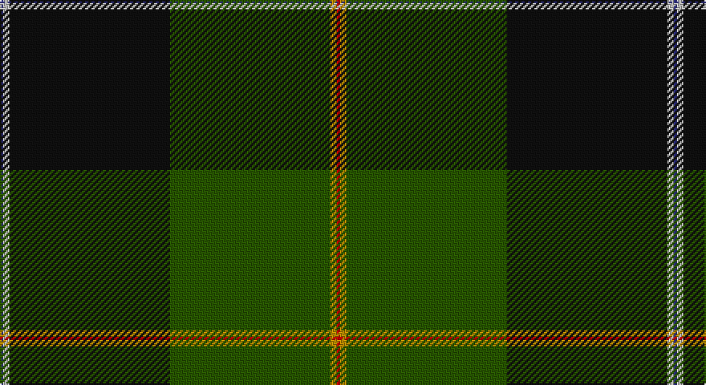

This page is one **sett** — a single exact thread-count. It belongs to the [tartan](/setts/db1lb2k50dg50lo2r1/)
(the same proportion at any scale), whose colour order is pattern [BWKGYR](/stripes/bwkgyr/).

Sourced from tartans-authority.  It is a [6 stripe tartan](/stripes/stripes6/).

Original link http://www.tartansauthority.com/tartan-ferret/display/10427/

## Register references

External register numbers recorded for this tartan.

- Scottish Register of Tartans: [10427](https://www.tartanregister.gov.uk/tartanDetails?ref=10427)
- Scottish Tartans Authority (ITI): 10427

## Thread count
DB/2 N4 K100 G100 DY4 R/2

One full sett is **420 threads**.

## Palette

Palette: <strong>Tartan Register</strong>
<table><thead><tr><th>Colour</th><th>Threads</th><th>Shade</th><th>Base</th><th>OKLCh</th></tr></thead><tbody><tr><td>DB/</td><td style="text-align:right;font-variant-numeric:tabular-nums">2</td><td><code style="background-color:#2C2C80;">#2C2C80</code> <small style="color:#888">#2C2C80</small></td><td>B <code style="background-color:#2A418A;">#2A418A</code></td><td><small style="color:#888">oklch(35.0% 0.138 276.6)</small></td></tr><tr><td>N</td><td style="text-align:right;font-variant-numeric:tabular-nums">4</td><td><code style="background-color:#C0C0C0;">#C0C0C0</code> <small style="color:#888">#C0C0C0</small></td><td>W <code style="background-color:#F7F7F7;">#F7F7F7</code></td><td><small style="color:#888">oklch(80.8% 0.000 89.9)</small></td></tr><tr><td>K</td><td style="text-align:right;font-variant-numeric:tabular-nums">100</td><td><code style="background-color:#101010;">#101010</code> <small style="color:#888">#101010</small></td><td>K <code style="background-color:#000000;">#000000</code></td><td><small style="color:#888">oklch(17.3% 0.000 89.9)</small></td></tr><tr><td>G</td><td style="text-align:right;font-variant-numeric:tabular-nums">100</td><td><code style="background-color:#285800;">#285800</code> <small style="color:#888">#285800</small></td><td>G <code style="background-color:#006100;">#006100</code></td><td><small style="color:#888">oklch(41.0% 0.122 135.8)</small></td></tr><tr><td>DY</td><td style="text-align:right;font-variant-numeric:tabular-nums">4</td><td><code style="background-color:#BC8C00;">#BC8C00</code> <small style="color:#888">#BC8C00</small></td><td>Y <code style="background-color:#F2BF00;">#F2BF00</code></td><td><small style="color:#888">oklch(66.8% 0.137 84.1)</small></td></tr><tr><td>R/</td><td style="text-align:right;font-variant-numeric:tabular-nums">2</td><td><code style="background-color:#C80000;">#C80000</code> <small style="color:#888">#C80000</small></td><td>R <code style="background-color:#CC0000;">#CC0000</code></td><td><small style="color:#888">oklch(52.3% 0.215 29.2)</small></td></tr></tbody></table>

# Sample pattern

## Nearest tartans

The nearest existing variants by ΔTartan distance, with this tartan at the top so the swatches line up against it.

ΔTartan

Tartan

Sett

—

<a href="/ttd/edit/#slug=db1lb2k50dg50lo2r1~x2">Josse (Personal)</a> <a class="nn-out" href="/variants/s6/db1lb2k50dg50lo2r1~x2/" title="open its dictionary page">↗</a>

0.72

<a href="/ttd/edit/#slug=db1t2k50g50ly2r1~x2&amp;base=db1lb2k50dg50lo2r1~x2">Josse (Bro Sant Malo), Gilbert (Personal)</a> <a class="nn-out" href="/variants/s6/db1t2k50g50ly2r1~x2/" title="open its dictionary page">↗</a>

1.57

<a href="/ttd/edit/#slug=db50dg25lo3o8r1w1r1~x2&amp;base=db1lb2k50dg50lo2r1~x2">Wells (2014)</a> <a class="nn-out" href="/variants/s7/db50dg25lo3o8r1w1r1~x2/" title="open its dictionary page">↗</a>

1.65

<a href="/ttd/edit/#slug=do8g19dg42lo3o1~x2&amp;base=db1lb2k50dg50lo2r1~x2">Nolan Family, John J (Personal)</a> <a class="nn-out" href="/variants/s5/do8g19dg42lo3o1~x2/" title="open its dictionary page">↗</a>

1.71

<a href="/ttd/edit/#slug=db9g5w1g15k2g1k44r1~x2&amp;base=db1lb2k50dg50lo2r1~x2">Ataç, H.M. &amp; I.C. (Personal)</a> <a class="nn-out" href="/variants/s8/db9g5w1g15k2g1k44r1~x2/" title="open its dictionary page">↗</a>

1.71

<a href="/ttd/edit/#slug=dy2dg44k10r1db16r1~x2&amp;base=db1lb2k50dg50lo2r1~x2">MacWilliam Hunting</a> <a class="nn-out" href="/variants/s6/dy2dg44k10r1db16r1~x2/" title="open its dictionary page">↗</a>

1.75

<a href="/ttd/edit/#slug=g55k17r9k11ly2db4~x2&amp;base=db1lb2k50dg50lo2r1~x2">Moran Family Tartan</a> <a class="nn-out" href="/variants/s6/g55k17r9k11ly2db4~x2/" title="open its dictionary page">↗</a>

1.75

<a href="/ttd/edit/#slug=g8dg60w1k33g9ly4g4~x2&amp;base=db1lb2k50dg50lo2r1~x2">Duffy</a> <a class="nn-out" href="/variants/s7/g8dg60w1k33g9ly4g4~x2/" title="open its dictionary page">↗</a>

1.76

<a href="/variants/s10/ki28r3lo2r3ki13dg28k1dg3k1dg16~x2/">Bomb Disposal</a>

1.77

<a href="/ttd/edit/#slug=ly3dt1k2dg26dt28w1dt1r2~x2&amp;base=db1lb2k50dg50lo2r1~x2">Johnston, Diana Hunting (Personal)</a> <a class="nn-out" href="/variants/s8/ly3dt1k2dg26dt28w1dt1r2~x2/" title="open its dictionary page">↗</a>

1.78

<a href="/ttd/edit/#slug=g92ly3k28n18r12db18w2g12&amp;base=db1lb2k50dg50lo2r1~x2">Mull Millennium</a> <a class="nn-out" href="/variants/s8/g92ly3k28n18r12db18w2g12/" title="open its dictionary page">↗</a>

## Neighbour map

Every grey dot is one of 14360 variants placed by the first two principal components of the ΔTartan feature space (44% of its variance). Red is this tartan; blue dots are its nearest — click one to open its page.

<svg viewBox="0 0 640 380" role="img" style="max-width:100%;height:auto;border:1px solid #e0e0e0;border-radius:4px;display:block" xmlns="http://www.w3.org/2000/svg"><image href="/nn/cloud.v1.png" width="640" height="380"/><a href="/variants/s6/db1t2k50g50ly2r1~x2/"><circle cx="347.2" cy="114.0" r="4" fill="#3465a4"><title>Josse (Bro Sant Malo), Gilbert (Personal)</title></circle></a><a href="/variants/s7/db50dg25lo3o8r1w1r1~x2/"><circle cx="371.3" cy="104.0" r="4" fill="#3465a4"><title>Wells (2014)</title></circle></a><a href="/variants/s5/do8g19dg42lo3o1~x2/"><circle cx="377.6" cy="157.2" r="4" fill="#3465a4"><title>Nolan Family, John J (Personal)</title></circle></a><a href="/variants/s8/db9g5w1g15k2g1k44r1~x2/"><circle cx="401.9" cy="120.3" r="4" fill="#3465a4"><title>Ataç, H.M. &amp; I.C. (Personal)</title></circle></a><a href="/variants/s6/dy2dg44k10r1db16r1~x2/"><circle cx="427.6" cy="155.3" r="4" fill="#3465a4"><title>MacWilliam Hunting</title></circle></a><a href="/variants/s6/g55k17r9k11ly2db4~x2/"><circle cx="344.8" cy="156.2" r="4" fill="#3465a4"><title>Moran Family Tartan</title></circle></a><a href="/variants/s7/g8dg60w1k33g9ly4g4~x2/"><circle cx="322.1" cy="124.2" r="4" fill="#3465a4"><title>Duffy</title></circle></a><a href="/variants/s10/ki28r3lo2r3ki13dg28k1dg3k1dg16~x2/"><circle cx="334.6" cy="153.7" r="4" fill="#3465a4"><title>Bomb Disposal</title></circle></a><a href="/variants/s8/ly3dt1k2dg26dt28w1dt1r2~x2/"><circle cx="318.8" cy="125.9" r="4" fill="#3465a4"><title>Johnston, Diana Hunting (Personal)</title></circle></a><a href="/variants/s8/g92ly3k28n18r12db18w2g12/"><circle cx="320.9" cy="94.2" r="4" fill="#3465a4"><title>Mull Millennium</title></circle></a><circle cx="367.8" cy="122.5" r="5" fill="#c00000"/></svg>

ID: /variants/s6/db1lb2k50dg50lo2r1~x2/
