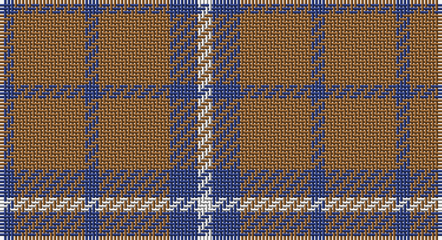

This page is one **sett** — a single exact thread-count. It belongs to the [tartan](/setts/db1o5db1o5db2w1/)
(the same proportion at any scale), whose colour order is pattern [BRBRBW](/stripes/brbrbw/).

Sourced from weddslist.  It is a [6 stripe tartan](/stripes/stripes6/).

Original link http://www.weddslist.com/cgi-bin/tartans/pg.pl?source=sts

## Thread count
B/4 LT20 B4 LT20 B8 LN/4

One full sett is **112 threads**.

## Palette

Palette: <strong>Tartan Dictionary</strong> <small style="color:#888">(1 of 3 colours)</small>
<table><thead><tr><th>Colour</th><th>Threads</th><th>Shade</th><th>Base</th><th>OKLCh</th></tr></thead><tbody><tr><td>B/</td><td style="text-align:right;font-variant-numeric:tabular-nums">4</td><td><code style="background-color:#304080;">#304080</code> <small style="color:#888">#304080</small></td><td>B <code style="background-color:#2A418A;">#2A418A</code></td><td><small style="color:#888">oklch(39.4% 0.109 270.2)</small></td></tr><tr><td>LT</td><td style="text-align:right;font-variant-numeric:tabular-nums">20</td><td><code style="background-color:#906030;">#906030</code> <small style="color:#888">#906030</small></td><td>R <code style="background-color:#CC0000;">#CC0000</code></td><td><small style="color:#888">oklch(53.1% 0.089 63.7)</small></td></tr><tr><td>B</td><td style="text-align:right;font-variant-numeric:tabular-nums">4</td><td><code style="background-color:#304080;">#304080</code> <small style="color:#888">#304080</small></td><td>B <code style="background-color:#2A418A;">#2A418A</code></td><td><small style="color:#888">oklch(39.4% 0.109 270.2)</small></td></tr><tr><td>LT</td><td style="text-align:right;font-variant-numeric:tabular-nums">20</td><td><code style="background-color:#906030;">#906030</code> <small style="color:#888">#906030</small></td><td>R <code style="background-color:#CC0000;">#CC0000</code></td><td><small style="color:#888">oklch(53.1% 0.089 63.7)</small></td></tr><tr><td>B</td><td style="text-align:right;font-variant-numeric:tabular-nums">8</td><td><code style="background-color:#304080;">#304080</code> <small style="color:#888">#304080</small></td><td>B <code style="background-color:#2A418A;">#2A418A</code></td><td><small style="color:#888">oklch(39.4% 0.109 270.2)</small></td></tr><tr><td>LN/</td><td style="text-align:right;font-variant-numeric:tabular-nums">4</td><td><code style="background-color:#E0E0E0;">#E0E0E0</code> <small style="color:#888">#E0E0E0</small></td><td>W <code style="background-color:#F7F7F7;">#F7F7F7</code></td><td><small style="color:#888">oklch(90.7% 0.000 89.9)</small></td></tr></tbody></table>

# Sample pattern

## Nearest tartans

The nearest existing variants by ΔTartan distance, with this tartan at the top so the swatches line up against it.

ΔTartan

Tartan

Sett

—

<a href="/ttd/edit/#slug=db1o5db1o5db2w1~x4">Tokharian</a> <a class="nn-out" href="/variants/s6/db1o5db1o5db2w1~x4/" title="open its dictionary page">↗</a>

1.21

<a href="/ttd/edit/#slug=db1lo5db1lo5db2w1~x4&amp;base=db1o5db1o5db2w1~x4">Tokharion</a> <a class="nn-out" href="/variants/s6/db1lo5db1lo5db2w1~x4/" title="open its dictionary page">↗</a>

1.63

<a href="/ttd/edit/#slug=g9m2g2m2g2m8g11w2~x4&amp;base=db1o5db1o5db2w1~x4">Leeds University Corporate Tartan</a> <a class="nn-out" href="/variants/s8/g9m2g2m2g2m8g11w2~x4/" title="open its dictionary page">↗</a>

1.80

<a href="/ttd/edit/#slug=dy8o29dy8ly3dy8o8ly3~x2&amp;base=db1o5db1o5db2w1~x4">Lister (Name)</a> <a class="nn-out" href="/variants/s7/dy8o29dy8ly3dy8o8ly3~x2/" title="open its dictionary page">↗</a>

1.80

<a href="/ttd/edit/#slug=n11k4r4lo4n11~x4&amp;base=db1o5db1o5db2w1~x4">Ikelman #3a (Personal)</a> <a class="nn-out" href="/variants/s5/n11k4r4lo4n11~x4/" title="open its dictionary page">↗</a>

1.82

<a href="/ttd/edit/#slug=n27lr3n14k3n13k3ly23~x2&amp;base=db1o5db1o5db2w1~x4">Grange School</a> <a class="nn-out" href="/variants/s7/n27lr3n14k3n13k3ly23~x2/" title="open its dictionary page">↗</a>

1.90

<a href="/ttd/edit/#slug=r1dg4r1lr1r4dg1r1~x4&amp;base=db1o5db1o5db2w1~x4">Unidentified #59</a> <a class="nn-out" href="/variants/s7/r1dg4r1lr1r4dg1r1~x4/" title="open its dictionary page">↗</a>

1.91

<a href="/ttd/edit/#slug=r2g9r2t2~x4&amp;base=db1o5db1o5db2w1~x4">Wilson's No.212</a> <a class="nn-out" href="/variants/s4/r2g9r2t2~x4/" title="open its dictionary page">↗</a>

1.94

<a href="/ttd/edit/#slug=r1o6k1o1k2o1k1o6lo1~x8&amp;base=db1o5db1o5db2w1~x4">Mowdowny (Fashion)</a> <a class="nn-out" href="/variants/s9/r1o6k1o1k2o1k1o6lo1~x8/" title="open its dictionary page">↗</a>

1.97

<a href="/ttd/edit/#slug=ly5n1ly1n12r1~x8&amp;base=db1o5db1o5db2w1~x4">Ceredigion (Personal)</a> <a class="nn-out" href="/variants/s5/ly5n1ly1n12r1~x8/" title="open its dictionary page">↗</a>

2.01

<a href="/variants/s4/g28dp10g3~x2/">Elphinstone Clan Tartan</a>

## Neighbour map

Every grey dot is one of 14360 variants placed by the first two principal components of the ΔTartan feature space (44% of its variance). Red is this tartan; blue dots are its nearest — click one to open its page.

<svg viewBox="0 0 640 380" role="img" style="max-width:100%;height:auto;border:1px solid #e0e0e0;border-radius:4px;display:block" xmlns="http://www.w3.org/2000/svg"><image href="/nn/cloud.v1.png" width="640" height="380"/><a href="/variants/s6/db1lo5db1lo5db2w1~x4/"><circle cx="359.6" cy="260.5" r="4" fill="#3465a4"><title>Tokharion</title></circle></a><a href="/variants/s8/g9m2g2m2g2m8g11w2~x4/"><circle cx="349.6" cy="250.8" r="4" fill="#3465a4"><title>Leeds University Corporate Tartan</title></circle></a><a href="/variants/s7/dy8o29dy8ly3dy8o8ly3~x2/"><circle cx="361.3" cy="234.3" r="4" fill="#3465a4"><title>Lister (Name)</title></circle></a><a href="/variants/s5/n11k4r4lo4n11~x4/"><circle cx="307.3" cy="316.5" r="4" fill="#3465a4"><title>Ikelman #3a (Personal)</title></circle></a><a href="/variants/s7/n27lr3n14k3n13k3ly23~x2/"><circle cx="333.5" cy="217.0" r="4" fill="#3465a4"><title>Grange School</title></circle></a><a href="/variants/s7/r1dg4r1lr1r4dg1r1~x4/"><circle cx="315.7" cy="275.7" r="4" fill="#3465a4"><title>Unidentified #59</title></circle></a><a href="/variants/s4/r2g9r2t2~x4/"><circle cx="343.1" cy="289.1" r="4" fill="#3465a4"><title>Wilson's No.212</title></circle></a><a href="/variants/s9/r1o6k1o1k2o1k1o6lo1~x8/"><circle cx="368.9" cy="204.9" r="4" fill="#3465a4"><title>Mowdowny (Fashion)</title></circle></a><a href="/variants/s5/ly5n1ly1n12r1~x8/"><circle cx="432.6" cy="219.4" r="4" fill="#3465a4"><title>Ceredigion (Personal)</title></circle></a><a href="/variants/s4/g28dp10g3~x2/"><circle cx="407.7" cy="288.6" r="4" fill="#3465a4"><title>Elphinstone Clan Tartan</title></circle></a><circle cx="393.5" cy="276.7" r="5" fill="#c00000"/></svg>

ID: /variants/s6/db1o5db1o5db2w1~x4/
