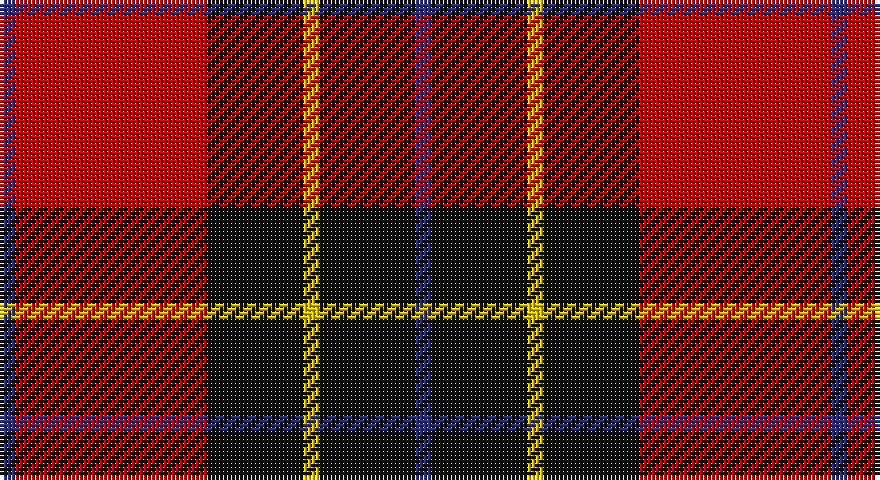

This page is one **sett** — a single exact thread-count. It belongs to the [tartan](/setts/db1r12k6ly1k6db1/)
(the same proportion at any scale), whose colour order is pattern [BKYKRB](/stripes/bkykrb/).

Part of the [Cetoloni](/tartans/cetoloni/) tartan — the named design grouping this sett with its other cloths.

Sourced from register-of-tartans.  It is a [6 stripe tartan](/stripes/stripes6/).

Original link https://www.tartanregister.gov.uk/tartanDetails.aspx?ref=612

## Register references

External register numbers recorded for this tartan.

- Scottish Register of Tartans: [612](https://www.tartanregister.gov.uk/tartanDetails.aspx?ref=612)
- Scottish Tartans Authority (ITI): 2049
- Scottish Tartans World Register: 2049

## Thread count
DB/4 R48 K24 Y4 K24 DB/4

One full sett is **208 threads**.

## Palette

Palette: <strong>Tartan Register</strong>
<table><thead><tr><th>Colour</th><th>Threads</th><th>Shade</th><th>Base</th><th>OKLCh</th></tr></thead><tbody><tr><td>DB/</td><td style="text-align:right;font-variant-numeric:tabular-nums">4</td><td><code style="background-color:#2C2C80;">#2C2C80</code> <small style="color:#888">#2C2C80</small></td><td>B <code style="background-color:#2A418A;">#2A418A</code></td><td><small style="color:#888">oklch(35.0% 0.138 276.6)</small></td></tr><tr><td>R</td><td style="text-align:right;font-variant-numeric:tabular-nums">48</td><td><code style="background-color:#C80000;">#C80000</code> <small style="color:#888">#C80000</small></td><td>R <code style="background-color:#CC0000;">#CC0000</code></td><td><small style="color:#888">oklch(52.3% 0.215 29.2)</small></td></tr><tr><td>K</td><td style="text-align:right;font-variant-numeric:tabular-nums">24</td><td><code style="background-color:#101010;">#101010</code> <small style="color:#888">#101010</small></td><td>K <code style="background-color:#000000;">#000000</code></td><td><small style="color:#888">oklch(17.3% 0.000 89.9)</small></td></tr><tr><td>Y</td><td style="text-align:right;font-variant-numeric:tabular-nums">4</td><td><code style="background-color:#E8C000;">#E8C000</code> <small style="color:#888">#E8C000</small></td><td>Y <code style="background-color:#F2BF00;">#F2BF00</code></td><td><small style="color:#888">oklch(81.9% 0.168 93.7)</small></td></tr><tr><td>K</td><td style="text-align:right;font-variant-numeric:tabular-nums">24</td><td><code style="background-color:#101010;">#101010</code> <small style="color:#888">#101010</small></td><td>K <code style="background-color:#000000;">#000000</code></td><td><small style="color:#888">oklch(17.3% 0.000 89.9)</small></td></tr><tr><td>DB/</td><td style="text-align:right;font-variant-numeric:tabular-nums">4</td><td><code style="background-color:#2C2C80;">#2C2C80</code> <small style="color:#888">#2C2C80</small></td><td>B <code style="background-color:#2A418A;">#2A418A</code></td><td><small style="color:#888">oklch(35.0% 0.138 276.6)</small></td></tr></tbody></table>

# Sample pattern

## Nearest tartans

The nearest existing variants by ΔTartan distance, with this tartan at the top so the swatches line up against it.

ΔTartan

Tartan

Sett

—

<a href="/ttd/edit/#slug=db1r12k6ly1k6db1~x4">Cetoloni (Personal)</a> <a class="nn-out" href="/variants/s6/db1r12k6ly1k6db1~x4/" title="open its dictionary page">↗</a>

0.85

<a href="/ttd/edit/#slug=r5m2r30k28w2k4~x2&amp;base=db1r12k6ly1k6db1~x4">Ramsay Red Clan Tartan</a> <a class="nn-out" href="/variants/s6/r5m2r30k28w2k4~x2/" title="open its dictionary page">↗</a>

0.92

<a href="/ttd/edit/#slug=r1db6r1dg6r12lb1&amp;base=db1r12k6ly1k6db1~x4">Fraser VS</a> <a class="nn-out" href="/variants/s6/r1db6r1dg6r12lb1/" title="open its dictionary page">↗</a>

0.94

<a href="/ttd/edit/#slug=r6k3r29k23w4k7ly3~x2&amp;base=db1r12k6ly1k6db1~x4">MacPherson Red Cluny</a> <a class="nn-out" href="/variants/s7/r6k3r29k23w4k7ly3~x2/" title="open its dictionary page">↗</a>

1.00

<a href="/ttd/edit/#slug=r1db6r1dg6r12w1~x2&amp;base=db1r12k6ly1k6db1~x4">Fraser Red Clan Tartan</a> <a class="nn-out" href="/variants/s6/r1db6r1dg6r12w1~x2/" title="open its dictionary page">↗</a>

1.05

<a href="/ttd/edit/#slug=r1db6r1dg6r12lr1~x2&amp;base=db1r12k6ly1k6db1~x4">Fraser VS</a> <a class="nn-out" href="/variants/s6/r1db6r1dg6r12lr1~x2/" title="open its dictionary page">↗</a>

1.06

<a href="/ttd/edit/#slug=r36lb3r5k21db24k3~x2&amp;base=db1r12k6ly1k6db1~x4">Graham of Menteith (Red)</a> <a class="nn-out" href="/variants/s6/r36lb3r5k21db24k3~x2/" title="open its dictionary page">↗</a>

1.08

<a href="/ttd/edit/#slug=db4lo4r33k30w2~x2&amp;base=db1r12k6ly1k6db1~x4">Wormeck (2013) Germany</a> <a class="nn-out" href="/variants/s5/db4lo4r33k30w2~x2/" title="open its dictionary page">↗</a>

1.09

<a href="/ttd/edit/#slug=k4r26k4w2k13ly4~x2&amp;base=db1r12k6ly1k6db1~x4">Dunbar #2</a> <a class="nn-out" href="/variants/s6/k4r26k4w2k13ly4~x2/" title="open its dictionary page">↗</a>

1.09

<a href="/ttd/edit/#slug=db3k32r27w2~x2&amp;base=db1r12k6ly1k6db1~x4">Templar Grand Priory USA</a> <a class="nn-out" href="/variants/s4/db3k32r27w2~x2/" title="open its dictionary page">↗</a>

1.09

<a href="/ttd/edit/#slug=db2r2db28k11r27w2r2~x2&amp;base=db1r12k6ly1k6db1~x4">Americana - 1978 #2 (Fashion)</a> <a class="nn-out" href="/variants/s7/db2r2db28k11r27w2r2~x2/" title="open its dictionary page">↗</a>

## Neighbour map

Every grey dot is one of 14360 variants placed by the first two principal components of the ΔTartan feature space (44% of its variance). Red is this tartan; blue dots are its nearest — click one to open its page.

<svg viewBox="0 0 640 380" role="img" style="max-width:100%;height:auto;border:1px solid #e0e0e0;border-radius:4px;display:block" xmlns="http://www.w3.org/2000/svg"><image href="/nn/cloud.v1.png" width="640" height="380"/><a href="/variants/s6/r5m2r30k28w2k4~x2/"><circle cx="324.6" cy="169.5" r="4" fill="#3465a4"><title>Ramsay Red Clan Tartan</title></circle></a><a href="/variants/s6/r1db6r1dg6r12lb1/"><circle cx="280.6" cy="185.4" r="4" fill="#3465a4"><title>Fraser VS</title></circle></a><a href="/variants/s7/r6k3r29k23w4k7ly3~x2/"><circle cx="260.4" cy="175.4" r="4" fill="#3465a4"><title>MacPherson Red Cluny</title></circle></a><a href="/variants/s6/r1db6r1dg6r12w1~x2/"><circle cx="292.6" cy="189.0" r="4" fill="#3465a4"><title>Fraser Red Clan Tartan</title></circle></a><a href="/variants/s6/r1db6r1dg6r12lr1~x2/"><circle cx="298.2" cy="197.8" r="4" fill="#3465a4"><title>Fraser VS</title></circle></a><a href="/variants/s6/r36lb3r5k21db24k3~x2/"><circle cx="248.5" cy="195.7" r="4" fill="#3465a4"><title>Graham of Menteith (Red)</title></circle></a><a href="/variants/s5/db4lo4r33k30w2~x2/"><circle cx="267.0" cy="164.4" r="4" fill="#3465a4"><title>Wormeck (2013) Germany</title></circle></a><a href="/variants/s6/k4r26k4w2k13ly4~x2/"><circle cx="280.3" cy="166.4" r="4" fill="#3465a4"><title>Dunbar #2</title></circle></a><a href="/variants/s4/db3k32r27w2~x2/"><circle cx="314.7" cy="200.5" r="4" fill="#3465a4"><title>Templar Grand Priory USA</title></circle></a><a href="/variants/s7/db2r2db28k11r27w2r2~x2/"><circle cx="269.8" cy="168.9" r="4" fill="#3465a4"><title>Americana - 1978 #2 (Fashion)</title></circle></a><circle cx="272.6" cy="188.5" r="5" fill="#c00000"/></svg>

ID: /variants/s6/db1r12k6ly1k6db1~x4/
