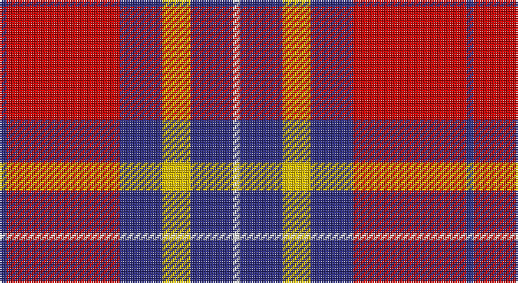

This page is one **sett** — a single exact thread-count. It belongs to the [tartan](/setts/db1r16db6ly4db6w1/)
(the same proportion at any scale), whose colour order is pattern [BRBYBW](/stripes/brbybw/).

Part of the [Superfast Ferries](/tartans/superfast-ferries/) tartan — the named design grouping this sett with its other cloths.

Sourced from tartans-authority.  It is a [6 stripe tartan](/stripes/stripes6/).

Original link http://www.tartansauthority.com/tartan-ferret/display/3187/

## Register references

External register numbers recorded for this tartan.

- Scottish Tartans Authority (ITI): 3187

## Thread count
DB/4 R64 DB24 Y16 DB24 LN/4

One full sett is **264 threads**.

## Palette

Palette: <strong>Tartan Register</strong>
<table><thead><tr><th>Colour</th><th>Threads</th><th>Shade</th><th>Base</th><th>OKLCh</th></tr></thead><tbody><tr><td>DB/</td><td style="text-align:right;font-variant-numeric:tabular-nums">4</td><td><code style="background-color:#2C2C80;">#2C2C80</code> <small style="color:#888">#2C2C80</small></td><td>B <code style="background-color:#2A418A;">#2A418A</code></td><td><small style="color:#888">oklch(35.0% 0.138 276.6)</small></td></tr><tr><td>R</td><td style="text-align:right;font-variant-numeric:tabular-nums">64</td><td><code style="background-color:#C80000;">#C80000</code> <small style="color:#888">#C80000</small></td><td>R <code style="background-color:#CC0000;">#CC0000</code></td><td><small style="color:#888">oklch(52.3% 0.215 29.2)</small></td></tr><tr><td>DB</td><td style="text-align:right;font-variant-numeric:tabular-nums">24</td><td><code style="background-color:#2C2C80;">#2C2C80</code> <small style="color:#888">#2C2C80</small></td><td>B <code style="background-color:#2A418A;">#2A418A</code></td><td><small style="color:#888">oklch(35.0% 0.138 276.6)</small></td></tr><tr><td>Y</td><td style="text-align:right;font-variant-numeric:tabular-nums">16</td><td><code style="background-color:#E8C000;">#E8C000</code> <small style="color:#888">#E8C000</small></td><td>Y <code style="background-color:#F2BF00;">#F2BF00</code></td><td><small style="color:#888">oklch(81.9% 0.168 93.7)</small></td></tr><tr><td>DB</td><td style="text-align:right;font-variant-numeric:tabular-nums">24</td><td><code style="background-color:#2C2C80;">#2C2C80</code> <small style="color:#888">#2C2C80</small></td><td>B <code style="background-color:#2A418A;">#2A418A</code></td><td><small style="color:#888">oklch(35.0% 0.138 276.6)</small></td></tr><tr><td>LN/</td><td style="text-align:right;font-variant-numeric:tabular-nums">4</td><td><code style="background-color:#E0E0E0;">#E0E0E0</code> <small style="color:#888">#E0E0E0</small></td><td>W <code style="background-color:#F7F7F7;">#F7F7F7</code></td><td><small style="color:#888">oklch(90.7% 0.000 89.9)</small></td></tr></tbody></table>

# Sample pattern

## Compared to the master

This cloth is one sett of its design; the master sett (the exemplar the design is anchored on) is below for comparison.

<figure style="margin:0"><figcaption style="color:#888;font-size:smaller">this sett</figcaption></figure>
<figure style="margin:0"><figcaption style="color:#888;font-size:smaller"><a href="/setts/r16db6ly4db6w1db6ly4db6r16db1/">master sett →</a></figcaption></figure>

## Nearest tartans

The nearest existing variants by ΔTartan distance, with this tartan at the top so the swatches line up against it.

ΔTartan

Tartan

Sett

—

<a href="/ttd/edit/#slug=db1r16db6ly4db6w1~x4">Superfast Ferries (Corporate)</a> <a class="nn-out" href="/variants/s6/db1r16db6ly4db6w1~x4/" title="open its dictionary page">↗</a>

0.72

<a href="/ttd/edit/#slug=k3r11db3w1db3w1~x4&amp;base=db1r16db6ly4db6w1~x4">Suntan (Masai Shuka) (District?)</a> <a class="nn-out" href="/variants/s6/k3r11db3w1db3w1~x4/" title="open its dictionary page">↗</a>

0.84

<a href="/ttd/edit/#slug=m3w1m20k8w8g2~x4&amp;base=db1r16db6ly4db6w1~x4">Nisbet Dress Rose (Dance)</a> <a class="nn-out" href="/variants/s6/m3w1m20k8w8g2~x4/" title="open its dictionary page">↗</a>

0.86

<a href="/ttd/edit/#slug=w2db3r24db15w6db3ly2~x2&amp;base=db1r16db6ly4db6w1~x4">Fazzolettone (Fashion?)</a> <a class="nn-out" href="/variants/s7/w2db3r24db15w6db3ly2~x2/" title="open its dictionary page">↗</a>

0.95

<a href="/ttd/edit/#slug=dg2r1db16r16db1ly2~x2&amp;base=db1r16db6ly4db6w1~x4">Galloway Dress (Yellow Line)</a> <a class="nn-out" href="/variants/s6/dg2r1db16r16db1ly2~x2/" title="open its dictionary page">↗</a>

0.99

<a href="/ttd/edit/#slug=g3r2db22r22db2w3~x2&amp;base=db1r16db6ly4db6w1~x4">Galloway Red</a> <a class="nn-out" href="/variants/s6/g3r2db22r22db2w3~x2/" title="open its dictionary page">↗</a>

1.01

<a href="/ttd/edit/#slug=r1db6r1dg6r12w1~x2&amp;base=db1r16db6ly4db6w1~x4">Fraser Red Clan Tartan</a> <a class="nn-out" href="/variants/s6/r1db6r1dg6r12w1~x2/" title="open its dictionary page">↗</a>

1.03

<a href="/ttd/edit/#slug=r1db6r1dg6r12lb1&amp;base=db1r16db6ly4db6w1~x4">Fraser VS</a> <a class="nn-out" href="/variants/s6/r1db6r1dg6r12lb1/" title="open its dictionary page">↗</a>

1.06

<a href="/ttd/edit/#slug=w6g15db18r30g2r4~x2&amp;base=db1r16db6ly4db6w1~x4">Ruthven (V.S.)</a> <a class="nn-out" href="/variants/s6/w6g15db18r30g2r4~x2/" title="open its dictionary page">↗</a>

1.08

<a href="/ttd/edit/#slug=r6lb3r37k16lb16g4~x2&amp;base=db1r16db6ly4db6w1~x4">Nesbit, Rose</a> <a class="nn-out" href="/variants/s6/r6lb3r37k16lb16g4~x2/" title="open its dictionary page">↗</a>

1.13

<a href="/ttd/edit/#slug=g2r1db16r16db1ly2~x2&amp;base=db1r16db6ly4db6w1~x4">Galloway dress</a> <a class="nn-out" href="/variants/s6/g2r1db16r16db1ly2~x2/" title="open its dictionary page">↗</a>

## Neighbour map

Every grey dot is one of 14360 variants placed by the first two principal components of the ΔTartan feature space (44% of its variance). Red is this tartan; blue dots are its nearest — click one to open its page.

<svg viewBox="0 0 640 380" role="img" style="max-width:100%;height:auto;border:1px solid #e0e0e0;border-radius:4px;display:block" xmlns="http://www.w3.org/2000/svg"><image href="/nn/cloud.v1.png" width="640" height="380"/><a href="/variants/s6/k3r11db3w1db3w1~x4/"><circle cx="264.9" cy="178.8" r="4" fill="#3465a4"><title>Suntan (Masai Shuka) (District?)</title></circle></a><a href="/variants/s6/m3w1m20k8w8g2~x4/"><circle cx="300.2" cy="152.8" r="4" fill="#3465a4"><title>Nisbet Dress Rose (Dance)</title></circle></a><a href="/variants/s7/w2db3r24db15w6db3ly2~x2/"><circle cx="239.4" cy="159.2" r="4" fill="#3465a4"><title>Fazzolettone (Fashion?)</title></circle></a><a href="/variants/s6/dg2r1db16r16db1ly2~x2/"><circle cx="307.5" cy="167.7" r="4" fill="#3465a4"><title>Galloway Dress (Yellow Line)</title></circle></a><a href="/variants/s6/g3r2db22r22db2w3~x2/"><circle cx="276.5" cy="179.6" r="4" fill="#3465a4"><title>Galloway Red</title></circle></a><a href="/variants/s6/r1db6r1dg6r12w1~x2/"><circle cx="292.6" cy="189.0" r="4" fill="#3465a4"><title>Fraser Red Clan Tartan</title></circle></a><a href="/variants/s6/r1db6r1dg6r12lb1/"><circle cx="280.6" cy="185.4" r="4" fill="#3465a4"><title>Fraser VS</title></circle></a><a href="/variants/s6/w6g15db18r30g2r4~x2/"><circle cx="241.1" cy="185.6" r="4" fill="#3465a4"><title>Ruthven (V.S.)</title></circle></a><a href="/variants/s6/r6lb3r37k16lb16g4~x2/"><circle cx="265.6" cy="172.9" r="4" fill="#3465a4"><title>Nesbit, Rose</title></circle></a><a href="/variants/s6/g2r1db16r16db1ly2~x2/"><circle cx="315.8" cy="172.7" r="4" fill="#3465a4"><title>Galloway dress</title></circle></a><circle cx="278.6" cy="169.1" r="5" fill="#c00000"/></svg>

ID: /variants/s6/db1r16db6ly4db6w1~x4/
