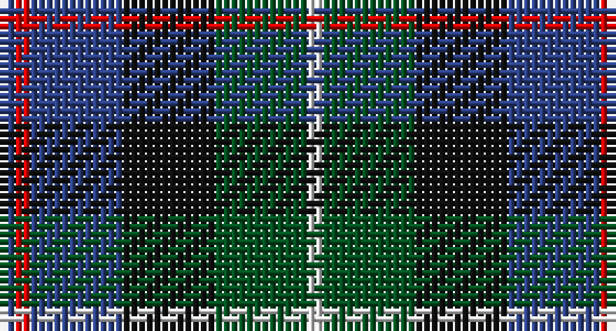

This page is one **sett** — a single exact thread-count. It belongs to the [tartan](/setts/db1r1db6k6dg6w1/)
(the same proportion at any scale), whose colour order is pattern [BRBKGW](/stripes/brbkgw/).

Part of the [Wellington](/tartans/wellington/) tartan — the named design grouping this sett with its other cloths.

Sourced from register-of-tartans.  It is a [6 stripe tartan](/stripes/stripes6/).

Original link https://www.tartanregister.gov.uk/tartanDetails.aspx?ref=4586

## Also known as

This cloth is also recorded under:

- Wellington #2

## Register references

External register numbers recorded for this tartan.

- Scottish Register of Tartans: [4586](https://www.tartanregister.gov.uk/tartanDetails.aspx?ref=4586)
- Scottish Tartans World Register: 470

## Thread count
B/2 R2 B12 K12 G12 LN/2

One full sett is **80 threads**.

## Palette

Palette: <strong>Tartan Register</strong>
<table><thead><tr><th>Colour</th><th>Threads</th><th>Shade</th><th>Base</th><th>OKLCh</th></tr></thead><tbody><tr><td>B/</td><td style="text-align:right;font-variant-numeric:tabular-nums">2</td><td><code style="background-color:#2C4084;">#2C4084</code> <small style="color:#888">#2C4084</small></td><td>B <code style="background-color:#2A418A;">#2A418A</code></td><td><small style="color:#888">oklch(39.4% 0.117 268.3)</small></td></tr><tr><td>R</td><td style="text-align:right;font-variant-numeric:tabular-nums">2</td><td><code style="background-color:#DC0000;">#DC0000</code> <small style="color:#888">#DC0000</small></td><td>R <code style="background-color:#CC0000;">#CC0000</code></td><td><small style="color:#888">oklch(56.2% 0.230 29.2)</small></td></tr><tr><td>B</td><td style="text-align:right;font-variant-numeric:tabular-nums">12</td><td><code style="background-color:#2C4084;">#2C4084</code> <small style="color:#888">#2C4084</small></td><td>B <code style="background-color:#2A418A;">#2A418A</code></td><td><small style="color:#888">oklch(39.4% 0.117 268.3)</small></td></tr><tr><td>K</td><td style="text-align:right;font-variant-numeric:tabular-nums">12</td><td><code style="background-color:#101010;">#101010</code> <small style="color:#888">#101010</small></td><td>K <code style="background-color:#000000;">#000000</code></td><td><small style="color:#888">oklch(17.3% 0.000 89.9)</small></td></tr><tr><td>G</td><td style="text-align:right;font-variant-numeric:tabular-nums">12</td><td><code style="background-color:#005020;">#005020</code> <small style="color:#888">#005020</small></td><td>G <code style="background-color:#006100;">#006100</code></td><td><small style="color:#888">oklch(37.7% 0.105 149.6)</small></td></tr><tr><td>LN/</td><td style="text-align:right;font-variant-numeric:tabular-nums">2</td><td><code style="background-color:#E0E0E0;">#E0E0E0</code> <small style="color:#888">#E0E0E0</small></td><td>W <code style="background-color:#F7F7F7;">#F7F7F7</code></td><td><small style="color:#888">oklch(90.7% 0.000 89.9)</small></td></tr></tbody></table>

# Sample pattern

## Nearest tartans

The nearest existing variants by ΔTartan distance, with this tartan at the top so the swatches line up against it.

ΔTartan

Tartan

Sett

—

<a href="/ttd/edit/#slug=db1r1db6k6dg6w1~x2">Wellington</a> <a class="nn-out" href="/variants/s6/db1r1db6k6dg6w1~x2/" title="open its dictionary page">↗</a>

0.52

<a href="/ttd/edit/#slug=t4g14ly2k14db14k2db3~x2&amp;base=db1r1db6k6dg6w1~x2">Hogarth of Firhill (Clan)</a> <a class="nn-out" href="/variants/s7/t4g14ly2k14db14k2db3~x2/" title="open its dictionary page">↗</a>

0.53

<a href="/ttd/edit/#slug=r2k1db6k2g6m2~x4&amp;base=db1r1db6k6dg6w1~x2">MacEachain (Clan)</a> <a class="nn-out" href="/variants/s6/r2k1db6k2g6m2~x4/" title="open its dictionary page">↗</a>

0.54

<a href="/ttd/edit/#slug=r1db6k3dg6w1~x4&amp;base=db1r1db6k6dg6w1~x2">Davidson of Tulloch #2</a> <a class="nn-out" href="/variants/s5/r1db6k3dg6w1~x4/" title="open its dictionary page">↗</a>

0.56

<a href="/ttd/edit/#slug=b2dg6ly1k6db6k1db1~x2&amp;base=db1r1db6k6dg6w1~x2">Hogarth of Firhill #2</a> <a class="nn-out" href="/variants/s7/b2dg6ly1k6db6k1db1~x2/" title="open its dictionary page">↗</a>

0.56

<a href="/ttd/edit/#slug=t2g6ly1k6db6k1db1~x2&amp;base=db1r1db6k6dg6w1~x2">Hogarth of Firhill</a> <a class="nn-out" href="/variants/s7/t2g6ly1k6db6k1db1~x2/" title="open its dictionary page">↗</a>

0.60

<a href="/ttd/edit/#slug=k2ly1dg6k6db6w1~x4&amp;base=db1r1db6k6dg6w1~x2">Dyce #3</a> <a class="nn-out" href="/variants/s6/k2ly1dg6k6db6w1~x4/" title="open its dictionary page">↗</a>

0.63

<a href="/ttd/edit/#slug=r2k1db8k8g8k1t2~x2&amp;base=db1r1db6k6dg6w1~x2">Argyll</a> <a class="nn-out" href="/variants/s7/r2k1db8k8g8k1t2~x2/" title="open its dictionary page">↗</a>

0.63

<a href="/ttd/edit/#slug=r2k1db8k8g8k1t2~x4&amp;base=db1r1db6k6dg6w1~x2">Campbell of Cawdor</a> <a class="nn-out" href="/variants/s7/r2k1db8k8g8k1t2~x4/" title="open its dictionary page">↗</a>

0.65

<a href="/ttd/edit/#slug=r2k1db8k8g8k1y2~x2&amp;base=db1r1db6k6dg6w1~x2">Campbell of Cawdor Clan Tartan</a> <a class="nn-out" href="/variants/s7/r2k1db8k8g8k1y2~x2/" title="open its dictionary page">↗</a>

0.65

<a href="/ttd/edit/#slug=k1g8w1k8db8r1~x4&amp;base=db1r1db6k6dg6w1~x2">Leslie Hunting</a> <a class="nn-out" href="/variants/s6/k1g8w1k8db8r1~x4/" title="open its dictionary page">↗</a>

## Neighbour map

Every grey dot is one of 14360 variants placed by the first two principal components of the ΔTartan feature space (44% of its variance). Red is this tartan; blue dots are its nearest — click one to open its page.

<svg viewBox="0 0 640 380" role="img" style="max-width:100%;height:auto;border:1px solid #e0e0e0;border-radius:4px;display:block" xmlns="http://www.w3.org/2000/svg"><image href="/nn/cloud.v1.png" width="640" height="380"/><a href="/variants/s7/t4g14ly2k14db14k2db3~x2/"><circle cx="134.9" cy="222.1" r="4" fill="#3465a4"><title>Hogarth of Firhill (Clan)</title></circle></a><a href="/variants/s6/r2k1db6k2g6m2~x4/"><circle cx="118.6" cy="242.0" r="4" fill="#3465a4"><title>MacEachain (Clan)</title></circle></a><a href="/variants/s5/r1db6k3dg6w1~x4/"><circle cx="146.7" cy="248.4" r="4" fill="#3465a4"><title>Davidson of Tulloch #2</title></circle></a><a href="/variants/s7/b2dg6ly1k6db6k1db1~x2/"><circle cx="120.1" cy="230.3" r="4" fill="#3465a4"><title>Hogarth of Firhill #2</title></circle></a><a href="/variants/s7/t2g6ly1k6db6k1db1~x2/"><circle cx="116.2" cy="227.0" r="4" fill="#3465a4"><title>Hogarth of Firhill</title></circle></a><a href="/variants/s6/k2ly1dg6k6db6w1~x4/"><circle cx="135.4" cy="240.4" r="4" fill="#3465a4"><title>Dyce #3</title></circle></a><a href="/variants/s7/r2k1db8k8g8k1t2~x2/"><circle cx="151.0" cy="217.9" r="4" fill="#3465a4"><title>Argyll</title></circle></a><a href="/variants/s7/r2k1db8k8g8k1t2~x4/"><circle cx="151.0" cy="217.9" r="4" fill="#3465a4"><title>Campbell of Cawdor</title></circle></a><a href="/variants/s7/r2k1db8k8g8k1y2~x2/"><circle cx="149.5" cy="216.9" r="4" fill="#3465a4"><title>Campbell of Cawdor Clan Tartan</title></circle></a><a href="/variants/s6/k1g8w1k8db8r1~x4/"><circle cx="160.6" cy="222.5" r="4" fill="#3465a4"><title>Leslie Hunting</title></circle></a><circle cx="142.2" cy="237.6" r="5" fill="#c00000"/></svg>

ID: /variants/s6/db1r1db6k6dg6w1~x2/
