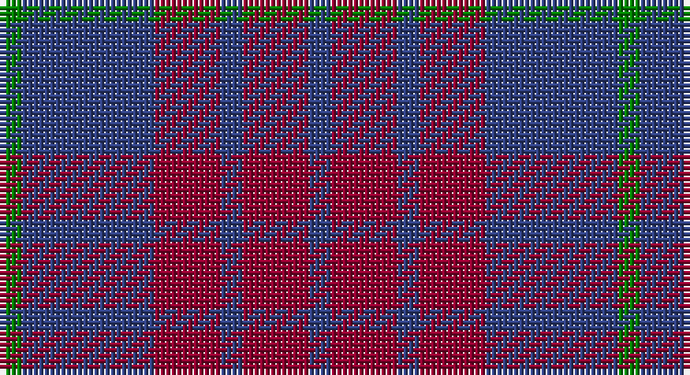

This page is one **sett** — a single exact thread-count. It belongs to the [tartan](/setts/db1r3db1r3db6g1/)
(the same proportion at any scale), whose colour order is pattern [BRBRBG](/stripes/brbrbg/).

Sourced from weddslist.  It is a [6 stripe tartan](/stripes/stripes6/).

Original link http://www.weddslist.com/cgi-bin/tartans/pg.pl?source=sts

## Thread count
G/4 B24 DR12 B4 DR12 B/4

One full sett is **112 threads**.

## Palette

Palette: <strong>custom</strong>
<table><thead><tr><th>Colour</th><th>Threads</th><th>Shade</th><th>Base</th><th>OKLCh</th></tr></thead><tbody><tr><td>G/</td><td style="text-align:right;font-variant-numeric:tabular-nums">4</td><td><code style="background-color:#008000;">#008000</code> <small style="color:#888">#008000</small></td><td>G <code style="background-color:#006100;">#006100</code></td><td><small style="color:#888">oklch(52.0% 0.177 142.5)</small></td></tr><tr><td>B</td><td style="text-align:right;font-variant-numeric:tabular-nums">24</td><td><code style="background-color:#304080;">#304080</code> <small style="color:#888">#304080</small></td><td>B <code style="background-color:#2A418A;">#2A418A</code></td><td><small style="color:#888">oklch(39.4% 0.109 270.2)</small></td></tr><tr><td>DR</td><td style="text-align:right;font-variant-numeric:tabular-nums">12</td><td><code style="background-color:#900030;">#900030</code> <small style="color:#888">#900030</small></td><td>R <code style="background-color:#CC0000;">#CC0000</code></td><td><small style="color:#888">oklch(41.6% 0.166 13.6)</small></td></tr><tr><td>B</td><td style="text-align:right;font-variant-numeric:tabular-nums">4</td><td><code style="background-color:#304080;">#304080</code> <small style="color:#888">#304080</small></td><td>B <code style="background-color:#2A418A;">#2A418A</code></td><td><small style="color:#888">oklch(39.4% 0.109 270.2)</small></td></tr><tr><td>DR</td><td style="text-align:right;font-variant-numeric:tabular-nums">12</td><td><code style="background-color:#900030;">#900030</code> <small style="color:#888">#900030</small></td><td>R <code style="background-color:#CC0000;">#CC0000</code></td><td><small style="color:#888">oklch(41.6% 0.166 13.6)</small></td></tr><tr><td>B/</td><td style="text-align:right;font-variant-numeric:tabular-nums">4</td><td><code style="background-color:#304080;">#304080</code> <small style="color:#888">#304080</small></td><td>B <code style="background-color:#2A418A;">#2A418A</code></td><td><small style="color:#888">oklch(39.4% 0.109 270.2)</small></td></tr></tbody></table>

# Sample pattern

## Nearest tartans

The nearest existing variants by ΔTartan distance, with this tartan at the top so the swatches line up against it.

ΔTartan

Tartan

Sett

—

<a href="/ttd/edit/#slug=db1r3db1r3db6g1~x4">Robbins</a> <a class="nn-out" href="/variants/s6/db1r3db1r3db6g1~x4/" title="open its dictionary page">↗</a>

0.79

<a href="/ttd/edit/#slug=db1m3db1m3db6g1~x4&amp;base=db1r3db1r3db6g1~x4">Robbins Family Tartan</a> <a class="nn-out" href="/variants/s6/db1m3db1m3db6g1~x4/" title="open its dictionary page">↗</a>

1.30

<a href="/ttd/edit/#slug=db13n6r51db51n5~x2&amp;base=db1r3db1r3db6g1~x4">Hillsdale (Corporate?)</a> <a class="nn-out" href="/variants/s5/db13n6r51db51n5~x2/" title="open its dictionary page">↗</a>

1.42

<a href="/ttd/edit/#slug=r2db13ri3db3ri16t2~x4&amp;base=db1r3db1r3db6g1~x4">MacArthur-Fox, dress</a> <a class="nn-out" href="/variants/s6/r2db13ri3db3ri16t2~x4/" title="open its dictionary page">↗</a>

1.46

<a href="/ttd/edit/#slug=db16dy2db16dy19r4~x3&amp;base=db1r3db1r3db6g1~x4">Unidentified #24</a> <a class="nn-out" href="/variants/s5/db16dy2db16dy19r4~x3/" title="open its dictionary page">↗</a>

1.52

<a href="/ttd/edit/#slug=db1r3db1r3db6g1~x8&amp;base=db1r3db1r3db6g1~x4">Robbins</a> <a class="nn-out" href="/variants/s6/db1r3db1r3db6g1~x8/" title="open its dictionary page">↗</a>

1.52

<a href="/ttd/edit/#slug=dr30db10dr3db30m3~x2&amp;base=db1r3db1r3db6g1~x4">Feniston (Personal)</a> <a class="nn-out" href="/variants/s5/dr30db10dr3db30m3~x2/" title="open its dictionary page">↗</a>

1.58

<a href="/ttd/edit/#slug=db16o2db16o19r4~x3&amp;base=db1r3db1r3db6g1~x4">Unidentified 17</a> <a class="nn-out" href="/variants/s5/db16o2db16o19r4~x3/" title="open its dictionary page">↗</a>

1.67

<a href="/ttd/edit/#slug=o15r5o30db32o4ly3~x2&amp;base=db1r3db1r3db6g1~x4">Cameron, hunting</a> <a class="nn-out" href="/variants/s6/o15r5o30db32o4ly3~x2/" title="open its dictionary page">↗</a>

1.69

<a href="/ttd/edit/#slug=dy34db27r3db27dy34w3~x2&amp;base=db1r3db1r3db6g1~x4">London Regiment</a> <a class="nn-out" href="/variants/s6/dy34db27r3db27dy34w3~x2/" title="open its dictionary page">↗</a>

1.71

<a href="/ttd/edit/#slug=r10db4r4db4r23n19db19n4~x2&amp;base=db1r3db1r3db6g1~x4">Chindecella Ruadh (Personal)</a> <a class="nn-out" href="/variants/s8/r10db4r4db4r23n19db19n4~x2/" title="open its dictionary page">↗</a>

## Neighbour map

Every grey dot is one of 14360 variants placed by the first two principal components of the ΔTartan feature space (44% of its variance). Red is this tartan; blue dots are its nearest — click one to open its page.

<svg viewBox="0 0 640 380" role="img" style="max-width:100%;height:auto;border:1px solid #e0e0e0;border-radius:4px;display:block" xmlns="http://www.w3.org/2000/svg"><image href="/nn/cloud.v1.png" width="640" height="380"/><a href="/variants/s6/db1m3db1m3db6g1~x4/"><circle cx="355.1" cy="281.2" r="4" fill="#3465a4"><title>Robbins Family Tartan</title></circle></a><a href="/variants/s5/db13n6r51db51n5~x2/"><circle cx="386.6" cy="268.1" r="4" fill="#3465a4"><title>Hillsdale (Corporate?)</title></circle></a><a href="/variants/s6/r2db13ri3db3ri16t2~x4/"><circle cx="347.6" cy="245.6" r="4" fill="#3465a4"><title>MacArthur-Fox, dress</title></circle></a><a href="/variants/s5/db16dy2db16dy19r4~x3/"><circle cx="399.2" cy="307.0" r="4" fill="#3465a4"><title>Unidentified #24</title></circle></a><a href="/variants/s6/db1r3db1r3db6g1~x8/"><circle cx="332.0" cy="274.0" r="4" fill="#3465a4"><title>Robbins</title></circle></a><a href="/variants/s5/dr30db10dr3db30m3~x2/"><circle cx="424.9" cy="285.5" r="4" fill="#3465a4"><title>Feniston (Personal)</title></circle></a><a href="/variants/s5/db16o2db16o19r4~x3/"><circle cx="408.0" cy="307.9" r="4" fill="#3465a4"><title>Unidentified 17</title></circle></a><a href="/variants/s6/o15r5o30db32o4ly3~x2/"><circle cx="378.5" cy="245.6" r="4" fill="#3465a4"><title>Cameron, hunting</title></circle></a><a href="/variants/s6/dy34db27r3db27dy34w3~x2/"><circle cx="343.2" cy="255.2" r="4" fill="#3465a4"><title>London Regiment</title></circle></a><a href="/variants/s8/r10db4r4db4r23n19db19n4~x2/"><circle cx="290.5" cy="278.6" r="4" fill="#3465a4"><title>Chindecella Ruadh (Personal)</title></circle></a><circle cx="364.5" cy="288.0" r="5" fill="#c00000"/></svg>

ID: /variants/s6/db1r3db1r3db6g1~x4/
