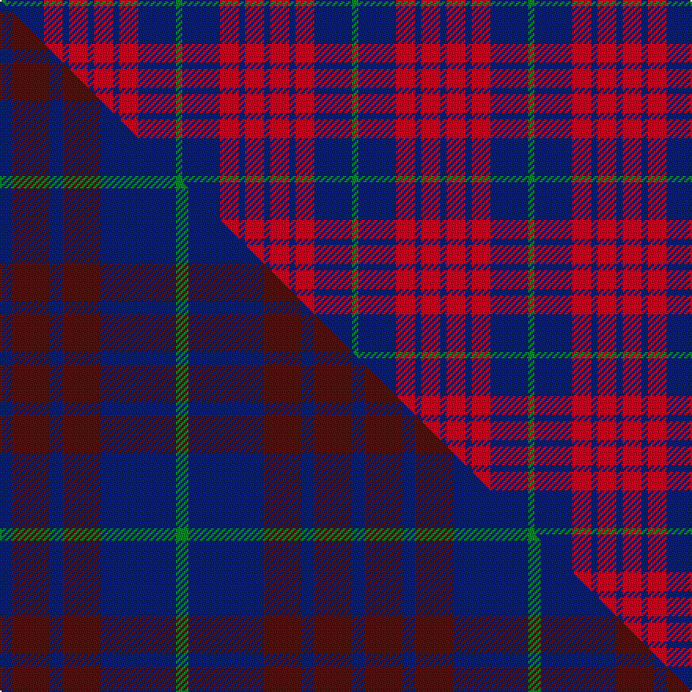

This is one **variant** — a specific cloth: this exact thread count and colourway, with its own
provenance below. It is one weaving of the [sett](/setts/db1r3db1r3db6g1/) (the scale-free proportion — the
same cloth at any scale or shade), whose colour order is pattern [BRBRBG](/stripes/brbrbg/).

Part of the [Robbins](/tartans/r/ro/robbins/) tartan — the named design grouping this sett with its other cloths.

Sourced from house-of-tartan.  It is a [6 stripe tartan](/stripes/stripes6/).

Original link [http://www.house-of-tartan.scotland.net/house/TartanViewjs.asp?colr=Def&tnam=412](http://www.house-of-tartan.scotland.net/house/TartanViewjs.asp?colr=Def&tnam=412)

## Provenance

Earliest known date: 1985

2 attestations — the source records this cloth was collapsed from (oldest owns this page)

<ul>
<li>1985 — Robbins Family Tartan (house-of-tartan, <a href="http://www.house-of-tartan.scotland.net/house/TartanViewjs.asp?colr=Def&tnam=412">record</a>) </li>
<li>undated — Robbins (weddslist, <a href="http://www.weddslist.com/cgi-bin/tartans/pg.pl?source=sts">record</a>) </li>
</ul>

Dataset <small>— provenance for this record, inherited from the source manifest</small>

<dl class="dataset-prov">
<dt>source</dt><dd><a href="/sources/house-of-tartan/">House of Tartan</a></dd>
<dt>data captured from</dt><dd><a href="https://github.com/thetartan/tartan-database/blob/master/data/house-of-tartan/data.csv">https://github.com/thetartan/tartan-database/blob/master/data/house-of-tartan/data.csv</a></dd>
<dt>data date</dt><dd>1985 <small>(this record)</small></dd>
<dt>licence</dt><dd><a href="https://creativecommons.org/licenses/by-nc-nd/4.0/">CC BY-NC-ND 4.0</a></dd>
</dl>

Capture chain <small>— the hands this data passed through, oldest first; each capture carries its own licence</small>

<ol class="capture-chain">
<li><a href="http://www.house-of-tartan.scotland.net/">House of Tartan</a> <small>the weaver/retailer's database — the site is now offline; the URL is kept as the ultimate source's identity</small></li>
<li><a href="https://github.com/thetartan/tartan-database">thetartan/tartan-database</a> <small>2016-2017</small> · <a href="https://creativecommons.org/licenses/by-nc-nd/4.0/">CC BY-NC-ND 4.0</a> <small>Levko Kravets's frozen compilation — the capture we vendored, and where its CC licence text came from</small></li>
<li>this dictionary <small>captured 2026-06-10 · commit 5bf86c7566</small> <small>each re-capture is a git commit to data/sources</small></li>
</ol>

## Thread count
DB/4 R12 DB4 R12 DB24 G/4

One full sett is **112 threads**.

## Palette
<table><thead><tr><th>Colour</th><th>Shade</th><th>OKLCh</th></tr></thead><tbody><tr><td>DB</td><td><code style="background-color:#082077;">#082077</code> <small style="color:#888">#082077</small></td><td><small style="color:#888">oklch(30.0% 0.149 265.1)</small></td></tr><tr><td>G</td><td><code style="background-color:#008B2A;">#008B2A</code> <small style="color:#888">#008B2A</small></td><td><small style="color:#888">oklch(55.4% 0.170 145.9)</small></td></tr><tr><td>R</td><td><code style="background-color:#D60020;">#D60020</code> <small style="color:#888">#D60020</small></td><td><small style="color:#888">oklch(55.2% 0.224 25.5)</small></td></tr></tbody></table>

# Sample pattern

## Compared to the master

This cloth is one sett of its design; the master sett (the exemplar the design is anchored on) is below for comparison.

Its **ΔTartan distance** from the master is **0.17** — the same measure the nearest-tartans table ranks by (0 is identical; a re-scale of the same cloth is near 0, a recolour or a different proportion further).

<figure class="master-compare" style="margin:0">

this sett
master sett ★

<figcaption style="color:#888;font-size:smaller">One weave of this sett against the <a href="/setts/db1dr3db1dr3db6g1/">master sett ★</a>, split on the diagonal: a shared proportion runs seamlessly across it with only the shades shifting; a different proportion breaks on it.</figcaption>
</figure>

## Nearest tartan variants

The nearest existing variants by ΔTartan distance, with this cloth at the top so the swatches line up against it.

ΔTartan

Threads

Variant

Sett

—

112

<a href="/variants/s6/db1r3db1r3db6g1~x4/">Robbins Family Tartan</a>

<a href="/ttd/edit/#slug=db3r24db3r3db25w3~x2&amp;base=db1r3db1r3db6g1~x4" title="compare in the TTD">0.84</a>

232

<a href="/variants/s6/db3r24db3r3db25w3~x2/">Matthews (Personal)</a>

<a href="/ttd/edit/#slug=db2r7db2r7db22y2~x2&amp;base=db1r3db1r3db6g1~x4" title="compare in the TTD">1.03</a>

160

<a href="/variants/s6/db2r7db2r7db22y2~x2/">MacQueen variant</a>

<a href="/ttd/edit/#slug=db7w1r7db4r2db4w2~x2&amp;base=db1r3db1r3db6g1~x4" title="compare in the TTD">1.24</a>

90

<a href="/variants/s7/db7w1r7db4r2db4w2~x2/">Coronation Commemorative Tartan</a>

<a href="/ttd/edit/#slug=db11w1r12db6r1db6w1~x4&amp;base=db1r3db1r3db6g1~x4" title="compare in the TTD">1.30</a>

256

<a href="/variants/s7/db11w1r12db6r1db6w1~x4/">Coronation (1936) #2</a>

<a href="/ttd/edit/#slug=db11w1r12db6r1db6w1~x2&amp;base=db1r3db1r3db6g1~x4" title="compare in the TTD">1.30</a>

128

<a href="/variants/s7/db11w1r12db6r1db6w1~x2/">Coronation</a>

<a href="/ttd/edit/#slug=db1r1db7r7db1r1~x4&amp;base=db1r3db1r3db6g1~x4" title="compare in the TTD">1.64</a>

136

<a href="/variants/s6/db1r1db7r7db1r1~x4/">MacGregor of Glengyle</a>

<a href="/ttd/edit/#slug=db3r2g5r8db12w3~x2&amp;base=db1r3db1r3db6g1~x4" title="compare in the TTD">1.66</a>

120

<a href="/variants/s6/db3r2g5r8db12w3~x2/">Edinburgh Bus Company (Corporate)</a>

<a href="/ttd/edit/#slug=db2r2db15r15db2r2~x2&amp;base=db1r3db1r3db6g1~x4" title="compare in the TTD">1.72</a>

144

<a href="/variants/s6/db2r2db15r15db2r2~x2/">Hebrides #7</a>

<a href="/ttd/edit/#slug=r3db1r1db11g10r2db2~x4&amp;base=db1r3db1r3db6g1~x4" title="compare in the TTD">1.87</a>

220

<a href="/variants/s7/r3db1r1db11g10r2db2~x4/">Robertson of Struan 1816</a>

<a href="/ttd/edit/#slug=db6r1db6r9w1~x2&amp;base=db1r3db1r3db6g1~x4" title="compare in the TTD">1.93</a>

78

<a href="/variants/s5/db6r1db6r9w1~x2/">Hamilton</a>

## Neighbour map

Every grey dot is one of 13621 variants placed by the first two principal components of the ΔTartan feature space (42% of its variance). Red is this tartan; blue dots are its nearest — click one to open its page.

<svg viewBox="0 0 640 380" role="img" style="max-width:100%;height:auto;border:1px solid #e0e0e0;border-radius:4px;display:block" xmlns="http://www.w3.org/2000/svg"><image href="/nn/cloud.v1.png" width="640" height="380"/><a href="/variants/s6/db3r24db3r3db25w3~x2/"><circle cx="322.8" cy="211.0" r="4" fill="#3465a4"><title>Matthews (Personal)</title></circle></a><a href="/variants/s6/db2r7db2r7db22y2~x2/"><circle cx="397.6" cy="205.4" r="4" fill="#3465a4"><title>MacQueen variant</title></circle></a><a href="/variants/s7/db7w1r7db4r2db4w2~x2/"><circle cx="274.8" cy="247.4" r="4" fill="#3465a4"><title>Coronation Commemorative Tartan</title></circle></a><a href="/variants/s7/db11w1r12db6r1db6w1~x4/"><circle cx="355.3" cy="206.6" r="4" fill="#3465a4"><title>Coronation (1936) #2</title></circle></a><a href="/variants/s7/db11w1r12db6r1db6w1~x2/"><circle cx="355.3" cy="206.6" r="4" fill="#3465a4"><title>Coronation</title></circle></a><a href="/variants/s6/db1r1db7r7db1r1~x4/"><circle cx="360.1" cy="238.7" r="4" fill="#3465a4"><title>MacGregor of Glengyle</title></circle></a><a href="/variants/s6/db3r2g5r8db12w3~x2/"><circle cx="193.9" cy="242.5" r="4" fill="#3465a4"><title>Edinburgh Bus Company (Corporate)</title></circle></a><a href="/variants/s6/db2r2db15r15db2r2~x2/"><circle cx="346.4" cy="221.0" r="4" fill="#3465a4"><title>Hebrides #7</title></circle></a><a href="/variants/s7/r3db1r1db11g10r2db2~x4/"><circle cx="283.8" cy="212.2" r="4" fill="#3465a4"><title>Robertson of Struan 1816</title></circle></a><a href="/variants/s5/db6r1db6r9w1~x2/"><circle cx="315.6" cy="242.8" r="4" fill="#3465a4"><title>Hamilton</title></circle></a><circle cx="311.3" cy="251.5" r="5" fill="#c00000"/><text x="320" y="376" text-anchor="middle" font-size="11" fill="#999">ground</text><text x="11" y="190" text-anchor="middle" font-size="11" fill="#999" transform="rotate(-90 11 190)">complexity</text></svg>

ID: /variants/s6/db1r3db1r3db6g1~x4/
